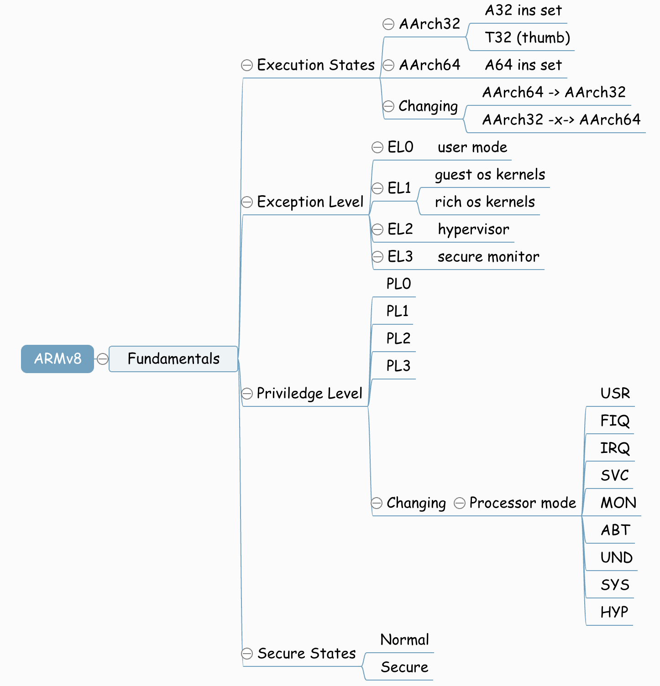
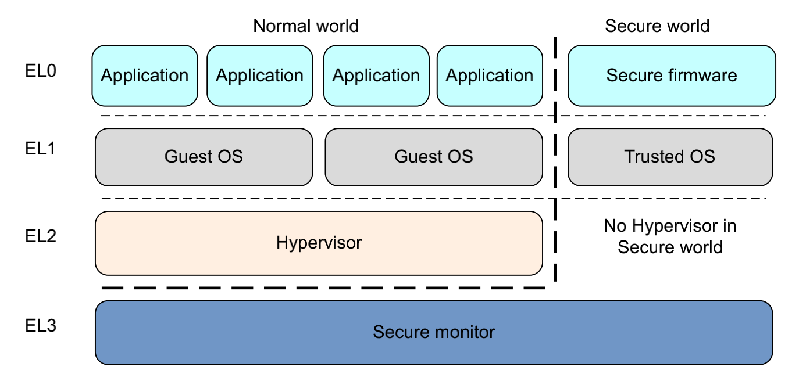

入口与返回、栈选择、异常向量表
===================================

基础知识
--------------

异常等级
^^^^^^^^

armv8内部包含4个异常等级

- EL0: 普通用户等级

- EL1: 典型的操作系统内核，这个等级被称为特权等级

- EL2: hypervisor

- EL3: Low-level固件，例如安全监视器Secure monitor,最高权限

armv8提供了两个状态(secure states),一个叫普通世界(normal world),一个叫安全世界(secure world).这两个世界并行的运行在同个硬件设备上面，
安全世界的工作重心是抵抗软件和硬件的攻击。在EL3的secure  monitor,游走于secure world和normal world

在normal world的hypervisor(VMM)代码运行在系统上并且管理着多个guest os,所以每一个操作系统都运行在VMM上面，每个操作系统在同一时间都不知道
有其他操作系统在运行

- Guest OS kernel: 这部分分为两类

    - 一般性的操作系统，如linux/windows

    - 在运行hypervisor的情况下，还有一个Rich OS kernel也作为guest os,比如OPTEE-OS

- Hypervisor: 总是在normal world， 主要给rich os kernel提供服务

- secure firmware: 这段程序必须运行在Boot时间，用于初始化trust os

- turst os: 在EL1和Guest Os并行运行，提供一个runtime环境执行安全应用

执行状态
^^^^^^^^^^

armv8定义了两种执行状态，aarch64和aarch32。这两个执行状态和异常等级没有概念上的交织，也就是aarch64和aarch32都有相应的异常等级和特权模式。
在aarch64执行状态时，使用A64指令，在aarch32执行状态时，使用A32或者thumb指令集

异常处理
-----------

异常类型
^^^^^^^^^^

**interrupt**

在aarch64体系架构中有两种类型的中断，IRQ和FIQ. FIQ的优先级高于IRQ

- 中断线(request line): 这个是对处理器而言的，是中断控制器的输入

- 中断向量表(vector table): 中断名单，操作系统实现，内部包含中断线对应的IRQ号

对于触发中断，在CPU上有专门的术语，assert一个中断，take一个异常。

**aborts**

同样包含两种aborts，取指失败(instruction aborts)或者数据访问失败(data aborts)。在内存上，发生这种异常的场景包含两种，在访问内存时，外部存储器
返回一个错误，或者指定访问的地址没有关联到真实的内存中(MMU产生该错误，一个操作系统可以使用MMU abort动态的分配内存给应用程序)

**rest**

rest异常有者最高的异常等级，当该异常发生的时候arm处理器就会跳转到指令所在的位置。
