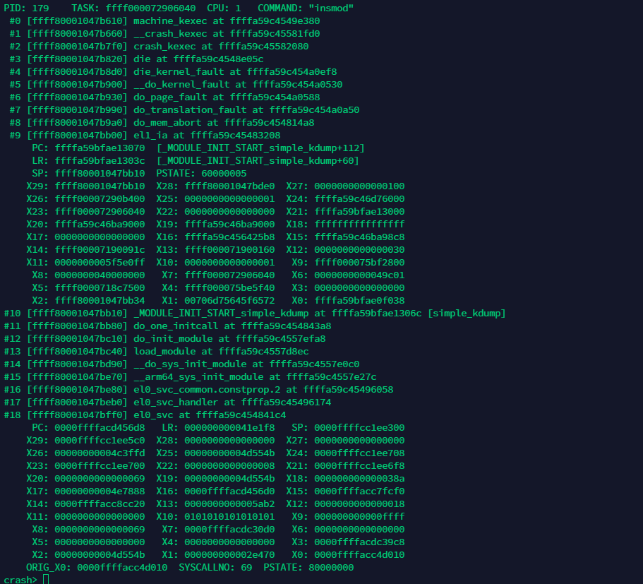

arm64栈布局及函数调用栈恢复方法
====================================

栈布局
----------

在ARM64架构中，栈从高地址向低地址生长，栈的起始地址称为栈底，栈从高地址往低地址延伸到某个地址，这个地址称为栈顶。

栈在函数调用过程中起到非常重要的作用，包括存储函数使用的局部变量、传递参数等。在函数调用过程中，栈是逐步生成的。为单个函数分配的栈空间，
称为栈帧(stack frame).

假设函数调用关系是main()---->func_1()---->func_2(). 则栈布局如下所示

.. imag::
    res/arm64_stack_struct.png

ARM64架构的函数栈布局关键点如下

- 所有的函数调用栈都会组成一个单链表

- 每个栈由两个地址来构成这个链表，这两个地址都是64位宽的，并且他们都位于栈的底部

   - 低地址存放: 指向上一个栈帧(父函数的栈帧)的栈基地址FP,类似于链表的prev指针

   - 高地址存放: 当前函数的返回地址，也就是进入该函数时LR的值

- 处理器的FP和SP寄存器相同，在函数执行时FP和SP寄存器会指向该函数栈空间的FP处，即栈底

- 函数返回时，ARM64处理器先把栈中的P_LR的值载入当前LR寄存器，然后再执行ret指令

.. note::
    arm64中LR保存的是函数返回地址，也就是函数返回后执行的下一条指令地址

恢复函数调用栈
--------------------

根据子函数栈的FP可以找到父函数栈的FP(栈基地址),也就是找到父函数的栈帧。这样可以通过FP层层回溯，找到所有函数的调用路径

::

    FP_f = *(FP_c)

- FP_f: 指的是父函数栈空间的FP

- FP_c: 指的是子函数栈空间的FP

根据本函数栈帧里保存的LR可以间接获取父函数调用子函数时的PC值，从而根据符号表得到具体的函数名。在调用子函数时，LR就指向子函数返回的
下一条指令，通过LR指向的地址再减去4字节偏移量就得到了本函数的入口地址。

::

    PC_f = *LR_c - 4 = *(FP_c + 8) - 4

**实例**

下图是一个内核奔溃时的寄存器现场

- 第一步：求解函数栈空间的FP

从发生系统奔溃的现场和寄存器x29可知，发生崩溃时函数栈空间的FP为ffff80001047bb10，更具公式一可以得到上一级函数栈空间的FP

::

    crash> rd ffff80001047bb10
    ffff80001047bb10:  ffff80001047bb80                    ..G.....

重复操作可以得到上一级的FP

::

    crash> rd ffff80001047bb80
    ffff80001047bb80:  ffff80001047bc10                    ..G.....

- 第二步: 需要找到每个函数的名称

首先通过寄存器现场来反推出它的父函数名称，发生crash时函数栈空间的FP存放在ffff80001047bb10地址处，那么LR在其高8字节的地址上。
因此LR存放在ffff80001047bb18地址上。由于LR存放了返回的下一条指令，因此再减去4字节，就是父函数调用该函数时PC值

::

    crash> rd ffff80001047bb18
    ffff80001047bb18:  ffffa59c454843ac                    .CHE....
    crash> dis ffffa59c454843a8
    0xffffa59c454843a8 <do_one_initcall+88>:        blr     x21

因此就到了父函数的名称: do_one_initcall, 它在0xffffa59c454843a8地址处使用blr指令来调用_MODULE_INIT_START_simple_kdump函数

do_one_initcall的函数栈FP存储在ffff80001047bc10处，因此LR存放在ffff80001047bc18处

::

    crash> rd ffff80001047bc18
    ffff80001047bc18:  ffffa59c4557d8f0                    ..WE....
    crash> dis ffffa59c4557d8ec
    0xffffa59c4557d8ec <load_module+7204>:  bl      0xffffa59c4557ef58

所以do_one_initcall的父函数就是load_module

