USB2.0概述及协议基础
=====================

USB是通用串行总线(Universal Serial Bus)的缩写。在USB1.0和USB1.1的版本中，支持1.5M/s的低速(low-speed)模式和12Mb/s的(full-speed)模式。在USB2.0中加入了480Mb/s的高速模式

USB总线接口
--------------

- USB接口标准: A型，B型，Mini 型

USB总线信号
^^^^^^^^^^^^^

USB2.0采用四线制，分别是Vbus电源线，GND地线，差分数据线D+和D-. 所以USB2.0的四线制是半双工通信

::

    差分信号1: D+>2.8V, D-<0.3V
    差分信号0: D->2.8V, D+<0.3V

USB接口设计如下,电源线和地线较长，这样设计可以使USB设备接入时，USB电源先于数据信号连接，避免电源不稳定对信号造成的影响

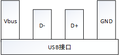

由于USB2.0采用的是四线制，其中没有时钟线。所以USB设备与主机设备在进行数据传输时由于没有时钟同步而导致发送端在发出的数据在接收端采样信号时，可能会因为时钟误差而导致
数据不正确的问题。

针对这个问题，USB采用时钟同步域来解决这个问题。即在数据发送时，先发送一个同步头(8`b 01010101).接收端通过这个同步头计算出发送端的频率。这样接收端使用同样的频率采样，从而
达到数据可以正确接收

- J状态和K状态:

  - 低速下: D+为"0",D-为"1"为J状态，K状态相反

  - 全速下: D+为"1",D-为"0"为J状态，K状态相反。

  - 高速下: 同全速

- SE0状态: D+为"0",D-为"0"

- IDLE状态: 低速下IDLE状态为K状态，全速下空闲状态为J状态，高速下空闲状态为SE0状态

针对全速模式，有以下几个重要信号

- Reset信号: 主机在要和设备通信之前会发送Reset信号来吧设备配置到默认的未配置状态。即SE0状态保持10ms

- Resume信号:20ms的K状态+低速EOP

- Suspend信号: 3ms以上的J状态

- SOP信号: 从IDLE状态切换为K状态

- EOP信号: 持续2位时间的SE0信号，后跟随1位时间的J状态

- SYNC信号: 3个重复的K,J状态切换。后跟随2位时间的K状态

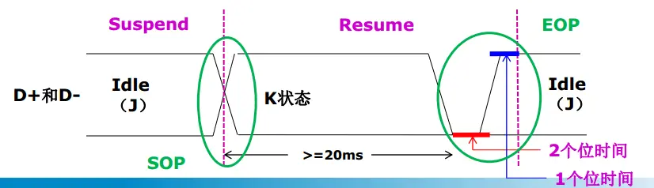

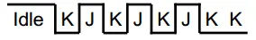

USB数据编解码和位填充
^^^^^^^^^^^^^^^^^^^^^^

USB采用NRZI(非归零编码)对发送的数据包进行编码，即: 输入数据0，编码为电平翻转，输入数据1，编码为电平不变

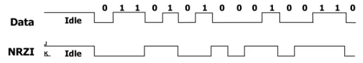

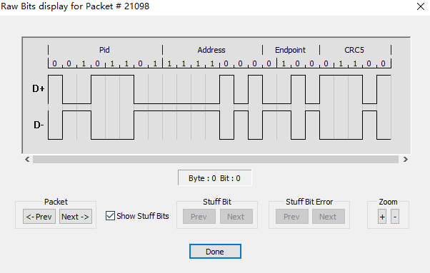

位填充是为了保证发送的数据序列中有足够多的电平变化，填充的对象是输入数据，即先填充后编码。数据流中每6个连续的1就要插入一个0. 接收方解码NRZI码流，然后识别填充位，并丢弃它们

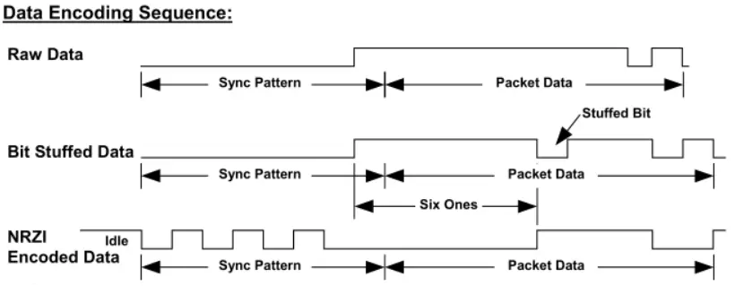

USB拓扑结构
^^^^^^^^^^^^^^

USB是一种主从结构的系统，主机叫做Host，从机叫做Device. Device包括USB function和USB HUB

USB总线基于分层的星状拓扑结构，以HUB为中心，连接周围设备。总线上最多可连接127个设备。HUB串联数量最多5个

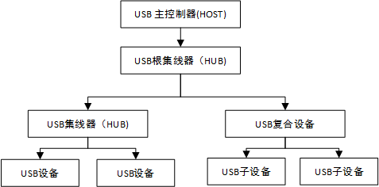

USB设备
----------

USB设备供电方式
^^^^^^^^^^^^^^^^^ 

USB设备有两种供电方式:

- 自供电: 设备从外部电源获取工作电压

- 总线供电: 设备从VBUS(5v)取电, USB1.0/1.1/2.0每个端口可提供500ma电流，USB3.0/3.1/3.2每个端口可提供900ma电流 

对于总线供电设备，区分低功耗和高功耗设备。低功耗设备最大功耗不超过100ma,高功耗设备枚举时最大功耗不超过100ma,枚举完成配置后功耗不超过500ma

设备在枚举过程中，通过配置描述符来向主机报告它的供电方式和功耗要求。

USB设备插入检测机制
^^^^^^^^^^^^^^^^^^^^^

没有设备连接主机时，主机的D+和D-都在低电平(SE0状态)，当SE0状态持续一段时间了，就被主机认为是断开状态。

当设备连接主机时，主机检测到某一数据线拉高并持续一段时间，就认为有设备连上来了。主机必须在复位设备之前，立即采样总线状态来判断设备的速度

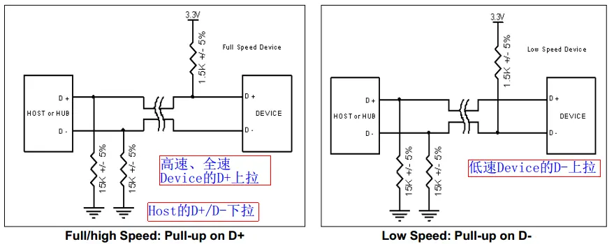

USB设备状态
^^^^^^^^^^^^

USB设备有 ``插入`` , ``供电`` , ``初始化`` , ``分配地址`` , ``配置`` , ``挂起`` 六种状态，其状态迁移图如下

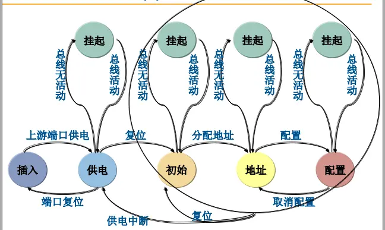

USB设备枚举过程
^^^^^^^^^^^^^^^^

对应USB设备的状态，host对USB设备有以下活动

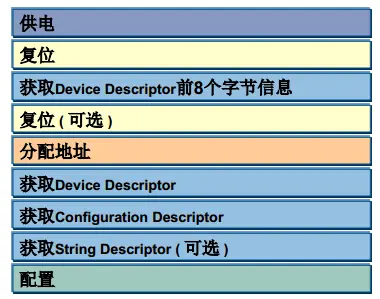

USB枚举过程中，都是使用控制传输

- 复位阶段: USB主机检测到USB设备插入后，就会对设备复位。USB设备在总线复位后其地址为0，这样主机就可以通过地址0和那些刚插入的设备通信。USB主机往地址为0的设备的断点0发送
  获取设备描述符的标准请求。设备会将设备描述符返回给主机，主机在成功获取到数据包后，就会返回一个确认数据包给设备，从而进入接下来的分配地址阶段

- 分配地址阶段: 主机对设备又一次复位，就进入到分配地址阶段。主机向地址为0的设备的端点0发送一个设备地址的请求，新的设备地址就包含在建立过程的数据包中。具体的地址由主机进行管理，
  主机会分配一个唯一的地址给刚接入的设备。设备在接收到这个建立过程后，就会进入到状态过程。设备等待主机请求状态返回，收到状态请求后，设备就返回0长度的状态数据包。如果主机确认该
  状态包已经正确收到，就会发送应答包ACK给设备，设备在收到这个ACK后，就要启用新的设备地址了。这样设备就分配到了一个唯一的设备地址

- 获取描述符阶段: 形象化描述如下

  ::

    Host: 你是什么设备
    Device: 12 01 0100 ... Device Descriptor
    Host: 你有几种功能
    Device: 09 02 09 ... Configuration Descriptor
    Host: 每个功能有几个接口
    Device: 09 04 00 ... Interface Descriptor
    Host: 每个接口使用哪几个端点
    Device: 06 05 82 ... Endpoint Descriptor
    Host: 好了，我知道你是谁了，开始传输设备吧
    Device: Ok, Read Go

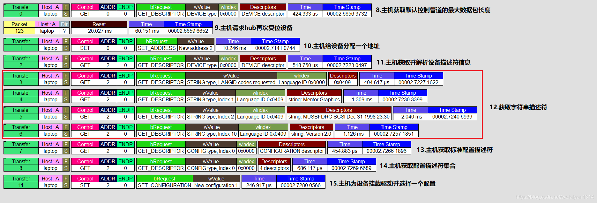

USB描述符
^^^^^^^^^^^^^^^

USB描述符有以下11类

================================ ================
 描述符类型                         值
-------------------------------- ----------------
 DEVICE                             1
 CONFIGURATION                      2
 STRING                             3
 INTERFACE                          4
 ENDPOINT                           5
 DEVICE_QUALIFIER                   6
 OTHER_SPEED_CONFIGURATION          7
 INTERFACE_POWER1                   8
 HID_HID_DESCRIPTION_TYPE           0x21
 HID_REPORT_DESCRIPTION_TYPE        0x22
 HID_PHYSICAL_DESCRIPTOR_TYPE       0x23
================================ ================

- Device Descriptor

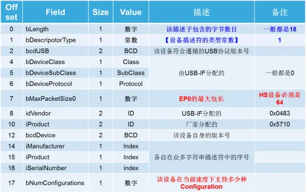

- Configuration Descriptor

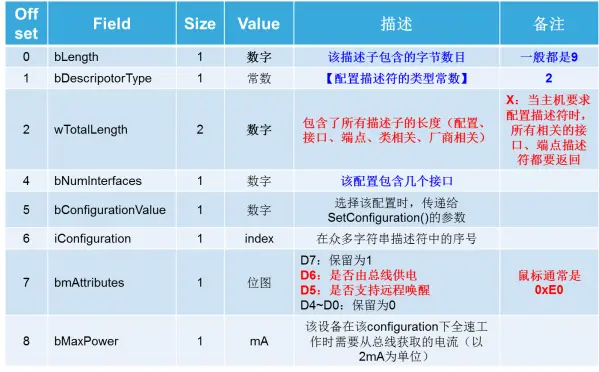

- Interface Descriptor

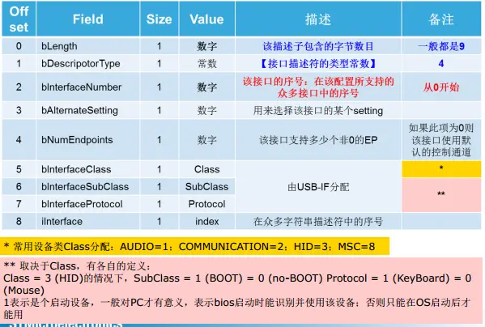

- Endpoint Descriptor

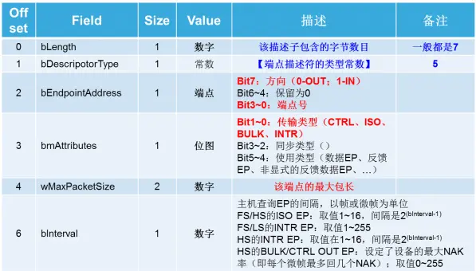

- String Descriptor

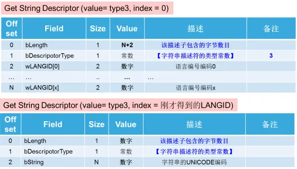

USB传输
----------

USB总线上传输数据是以包(packet)为基本单位的，必须把不同的包组织成事务(transaction)才能传输数据。

USB协议定义了四种传输(transfer)类型: ``批量传输`` , ``同步传输`` , ``中断传输`` , ``控制传输`` .其中，批量传输、同步传输、中断传输每传输一次数据都是一个事务。

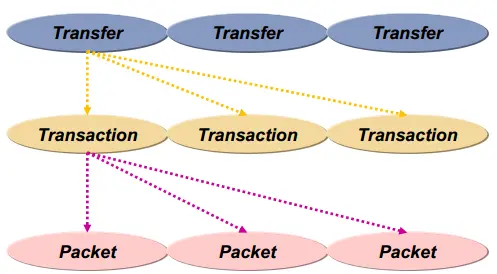

包packet
^^^^^^^^^^^

一个包被分为不同域，根据不同类型的包，所含的域也是不一样的。但都要以同步域SYNC开始，紧跟一个包标识符PID,最终以包结束符EOP来结束这个包

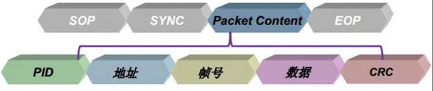

- PID域: PID用来标识一个包的类型，它共有8位，只使用低四位，高四位取反，用来校验PID

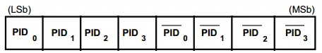

PID规定了四类包: ``令牌包`` 、 ``数据包`` 、 ``握手包`` 、 ``特殊包`` . 同类的包又各分为具体的四种包

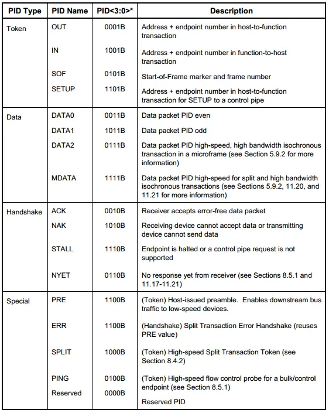

- 地址域: 地址共占11位，其中低7位是设备地址，高4位是端点地址

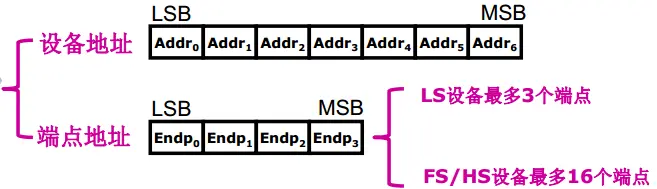

- 帧号域: 帧号占11位，主机每发一帧，帧号都会自动加1，当帧号达到0x7FF时，将归零重新开始计数

- 数据域: 根据传输类型的不同，数据域的数据长度从0到1024字节不等。

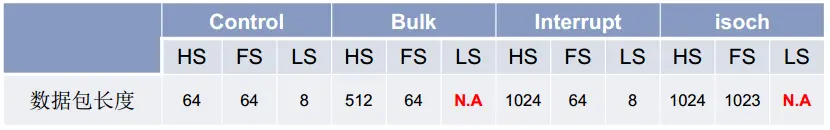

- CRC域: 计算地址域和帧号域的CRC,或数据域数据的CRC

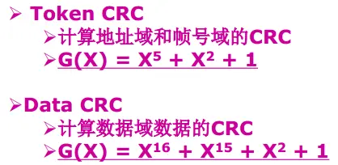

**令牌包**

令牌包有四种:

- OUT: 通知设备将要输出一个数据包

- IN: 通知设备返回一个数据包

- SETUP: 只用在控制传输中，也是通知设备将要输出一个数据包，域OUT令牌的区别是:只使用DATA0数据包，且只能发到device的控制端点

- SOF: 在每帧开始时以广播的形式发送，针对USB全速设备，主机每1ms产生一个帧，USB主机会对当前帧号进行统计，每次帧开始时通过SOF包发送帧号

OUT/IN/SETUP令牌包没有帧号域和数据域

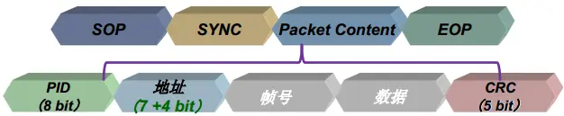

SOF令牌包没有地址域和数据域

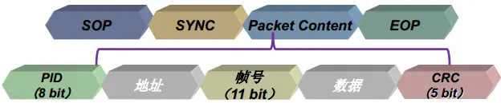

**数据包**

数据包没有地址域和帧号域，根据transfer的类型不同，数据包最大长度有所不同

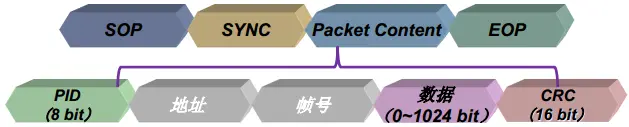

**握手包**

握手包又四种:

- ACK: 传输正确完成

- NAK: 设备暂时没有准备好接收数据，或没有准备好发送数据

- STALL: 设备不能用于传输

- NYET/ERR: 仅用于高速传输，设备没有准备好或出错

握手包仅有PID域

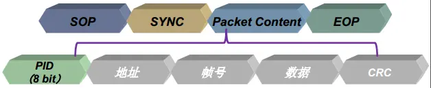

事务transaction
^^^^^^^^^^^^^^^^^^

事务可以分为三类:

- setup事务: 主机用来向设备发送控制命令

- 数据输入事务: 主机用来从设备读取数据

- 数据输出事务: 主机用来向设备发送数据

.. note::
    事务组成: Token packet + Data packet + 可选的Handshake packet

传输transfer
^^^^^^^^^^^^^^^

USB协议定义了四种传输类型: ``控制传输(control transfer)`` 、 ``批量传输(bulk transfer)`` 、 ``同步传输(isochronous transfer)`` 、 ``中断传输(interrupt transfer)``

===================== ============================= ==================================================================
 传输类型                   特点                        应用场景
--------------------- ----------------------------- ------------------------------------------------------------------
 控制传输               非周期性，突发性                命令和状态的传输
 批量传输               非周期性，突发                  数据可以占用任意带宽，容忍延迟
 同步传输               周期性                          持续性传输，传输与时效相关的信息，并在数据中保存时间戳
 中断传输               周期性，低频率                  允许有延迟的通信
===================== ============================= ==================================================================

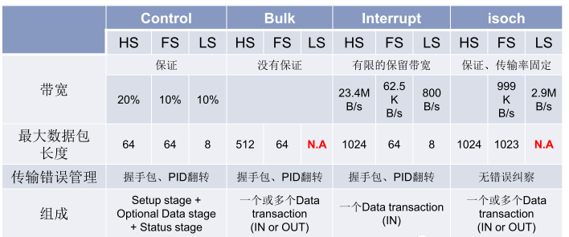

**批量传输**

批量传输使用批量传输事务(IN传输/OUT传输)，一次批量传输事务分为三个阶段: 令牌包阶段、数据包阶段、握手包阶段

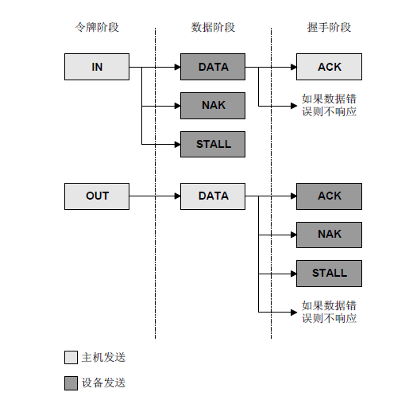

对于批量传输，如果启动批量传输，如果USB总线有多余的总线带宽，传输会被立即执行。当带宽紧张时，批量传输会把带宽让给其他传输类型

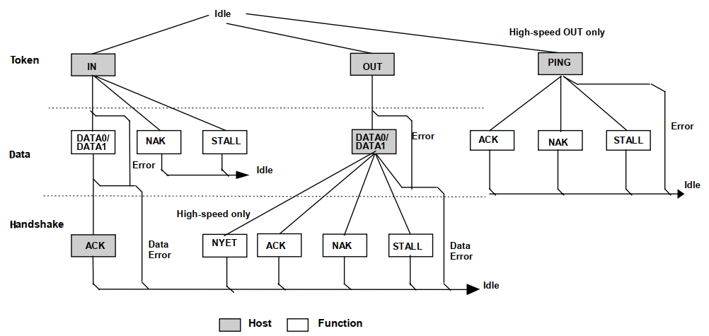

- 令牌阶段: 主机发送BULK令牌包，令牌包中包含设备地址、端点号、数据方向

- 数据包阶段: 

  - 从机如果接收令牌包出错，无响应，让主机等待超时

  - 从机端点不存在，回送STALL

  - 从机端点数据未准备好，回送NAK

  - 从机数据准备好，回送数据包

- 握手包阶段

  - 数据包正确，并有足够的空间保留数据，设备返回ACK握手包活NYET握手包(只有高速模式才有NYET握手包，表示本次数据接收成功，但没有能力接收下一次传输)

  - 数据包正确，但没有足够的空间保存数据，设备返回NAK握手包。主机收到NAK后，延时一段时间后，再重新进行批量输出事务

  - 数据包正确，但端点处于挂起状态；设备返回一个STALL握手包

  - 数据包错误，设备不返回任何握手包，让主机等待超时

  - CRC错误或位填充错误: 设备不返回任何握手包，让主机等待超时

USB批量读抓包

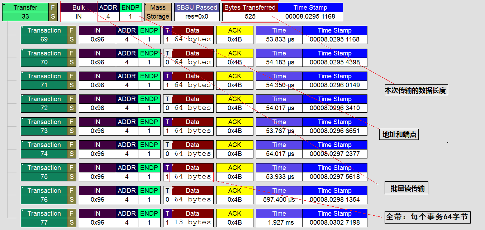

USB批量写抓包

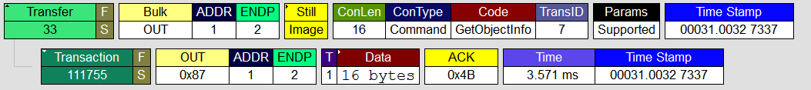

**中断传输**

中断传输一般用于小批量的和非连续的数据传输，但实时性高的场合，主要应用于人机交互设备(HID)的鼠标和键盘

USB中断传输和我们传统意义上的中断不一样，他不是由设备主动发起的一次中断请求，而是由主机保证在不大于某个时间间隔内安排的一次传输，所以是实时查询操作

.. note::
    中断传输在流程上除了不支持PING之外，其他的跟批量传输是一样的。他们之前的区别仅在于事务传输发生的端点不一样、支持的最大包长度不一样，优先级不一样

**同步传输**

同步传输是不可靠的传输，只关心数据的实时性，不关心数据的正确性，它没有握手包，也不支持PID翻转。主机在排定事务传输时，同步传输有最高优先级.

应用在数据量大，对实时性要求较高的场合，如视频设备，音频设备

同步传输包含两个阶段: 令牌阶段、数据阶段

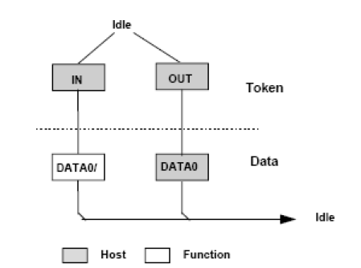

同步读抓包

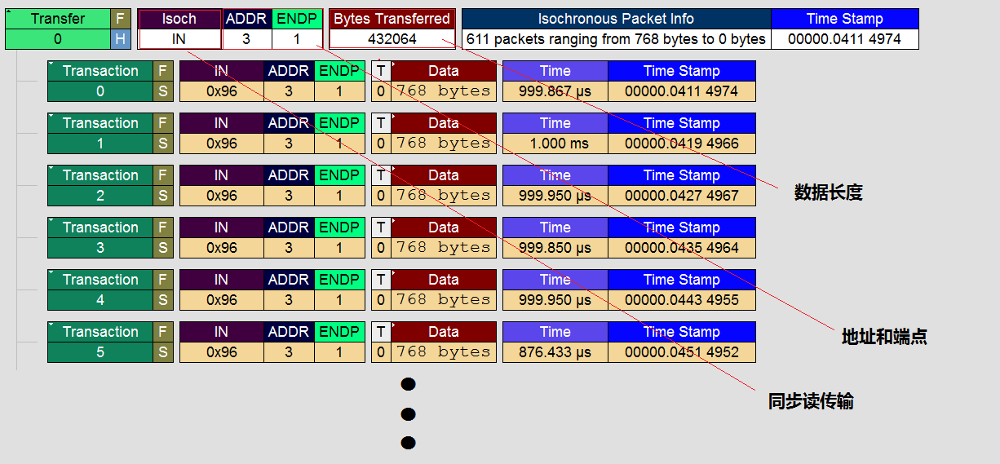

**控制传输**

控制传输是一种特殊的传输方式。当USB设备初次连接主机时，用控制传输传送控制命令等对设备进行配置。同时设备接入主机时，需要通过控制传输去获取USB设备的描述符以及
对设备进行识别，在设备的枚举过程中都是使用控制传输进行数据交换

控制传输分为三个过程:

- 建立过程:

  - 主机发送令牌包: SETUP

  - 主机发送数据包: DATA0

  - 设备返回握手包: ACK或不应答

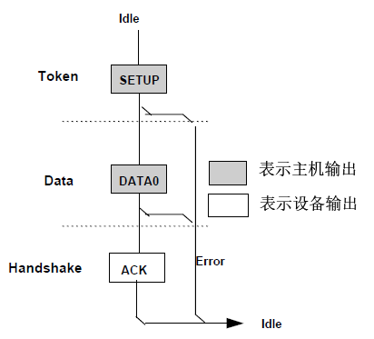

- 数据过程(可选): 一个数据过程可以不包含或包含多个数据事务，但所有数据事务必须是同一方向的。若数据方向发生了改变则认为进入了状态过程. 数据过程中的第一个数据包必须是DATA1，然后
  每次正确传输一个数据包后就在DATA0和DATA1之间交替

- 状态过程: 状态过程只使用DATA1包，并且传输方向与数据方向相反。

USB控制读

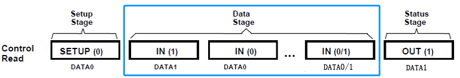

抓包分析

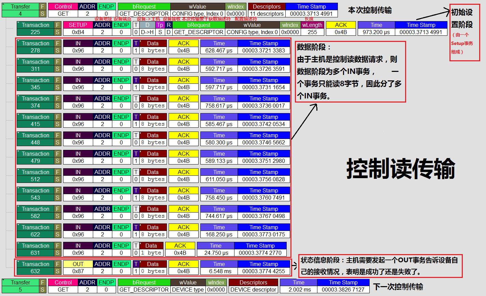

USB控制写

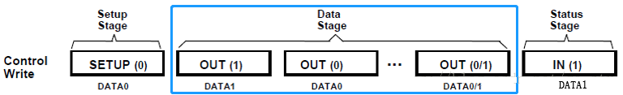

抓包分析

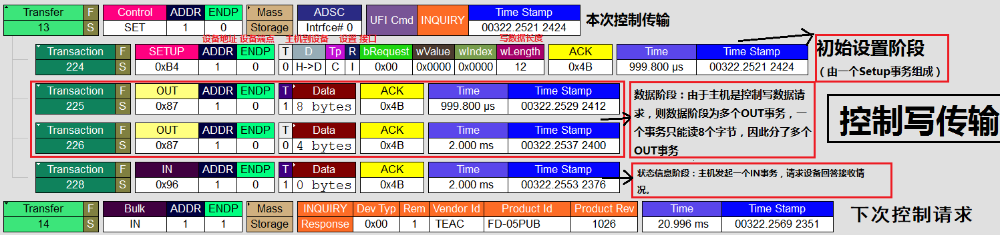

