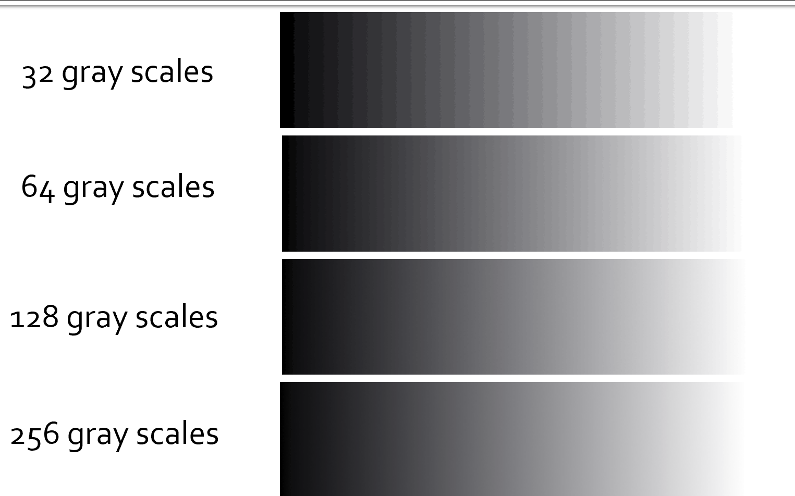

直方图操作
===============

灰度直方图描述了一幅图像的灰度级统计信息，主要应用于图像分隔、图像增强及图像灰度变换等处理过程。

从数学上讲，图像直方图描述的是图像各个灰度级的统计特性，他是用图像灰度值的一个函数来统计一幅图像中各个灰度级出现的次数或者概率，

.. note::
    可以理解为一个二维坐标系，横坐标为灰度级，纵坐标为该灰度级出现的个数

灰度级感知: 32灰度级，64灰度级，128灰度级，256灰度级
