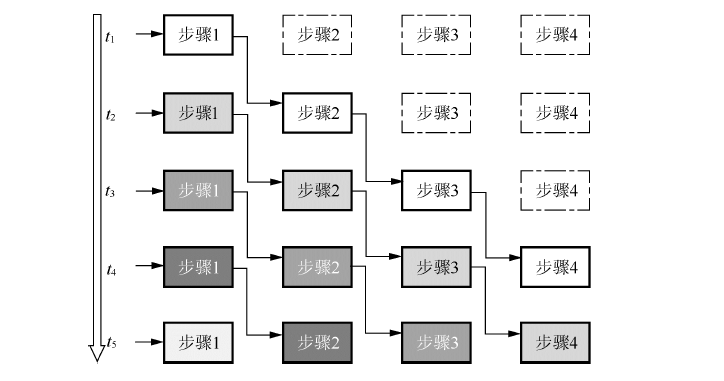
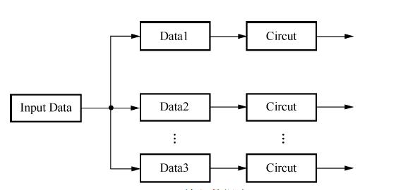

映射技术
=============

将图像处理的算法转换为FPGA系统设计的过程称为算法映射。

系统结构
-----------

映射过程的首要目标便是确定系统设计的结构，图像处理中常用的两种系统结构为: ``流水线结构`` 和 ``并行阵列结构``

- 流水线结构: 其基本结构是将适当划分的n个操作步骤但流向串联起来，最大的特点是各个步骤的处理从时间上看是连续的。流水线处理采用的是面积换速度的思想，可以
  大幅提高工作效率。

    

- 并行阵列结构：在并行阵列型电路中，多组并行排列的子电路同时接收整体数据的多个部分进行并行计算

