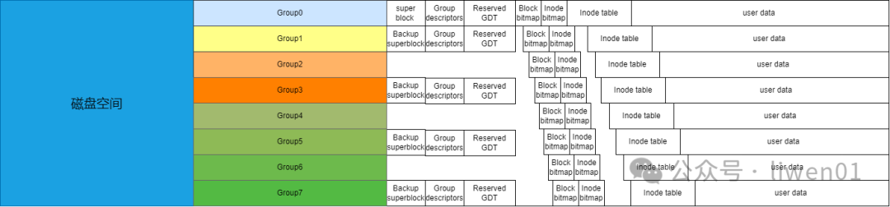
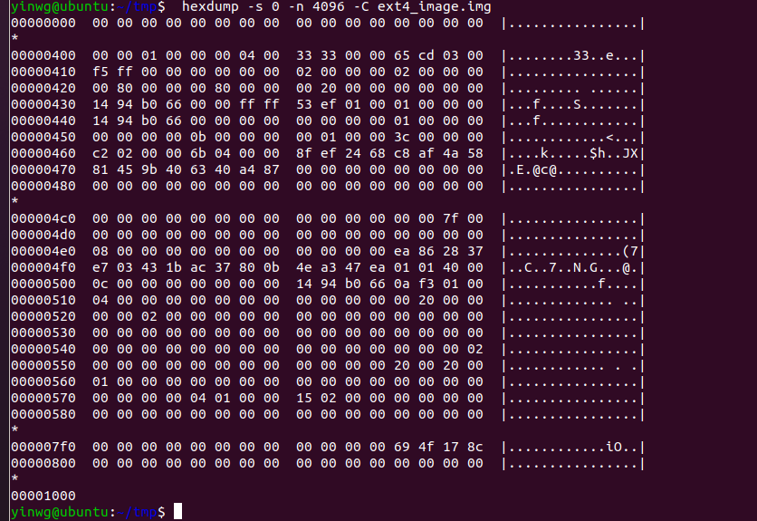
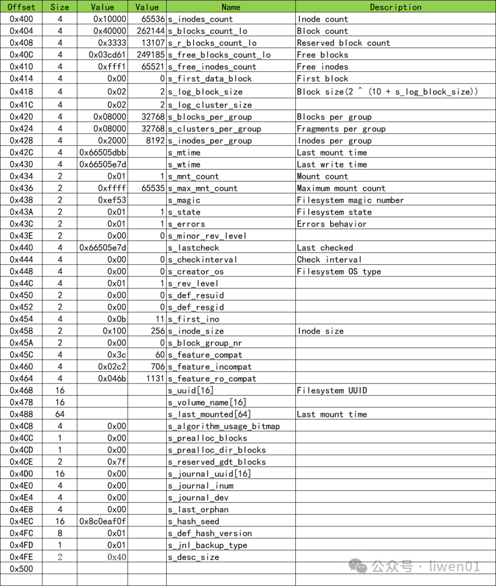
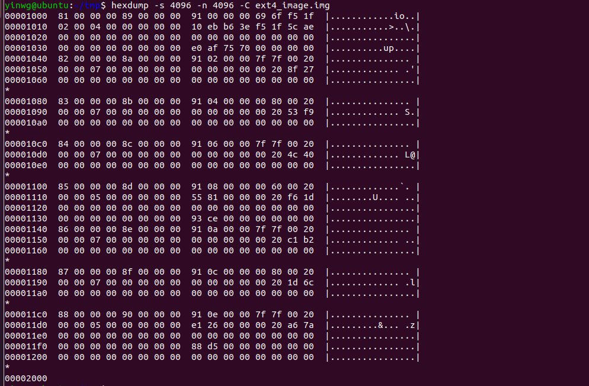
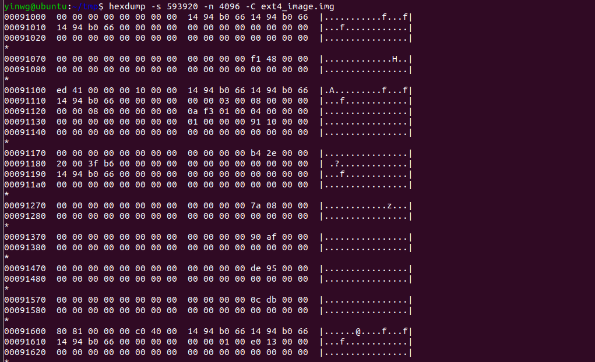
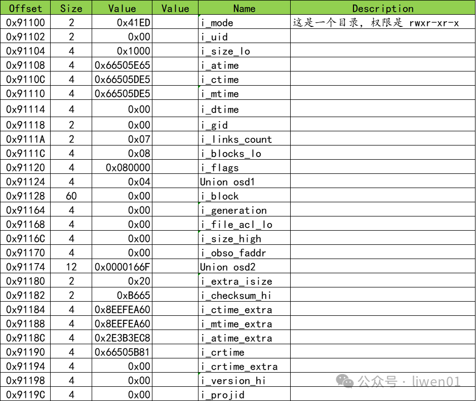
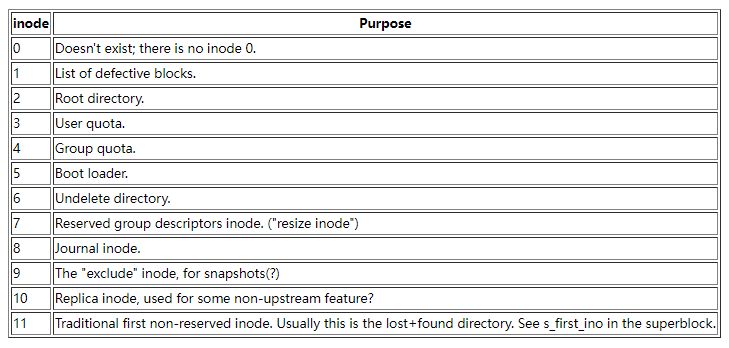
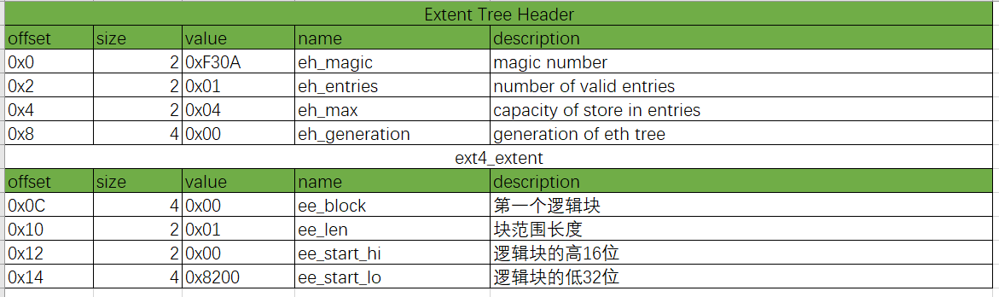
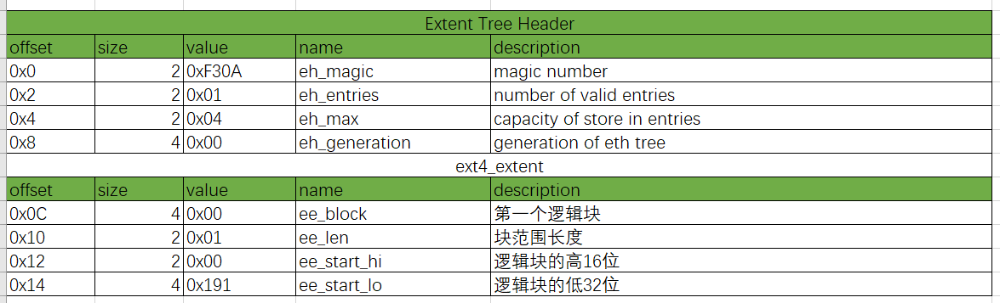
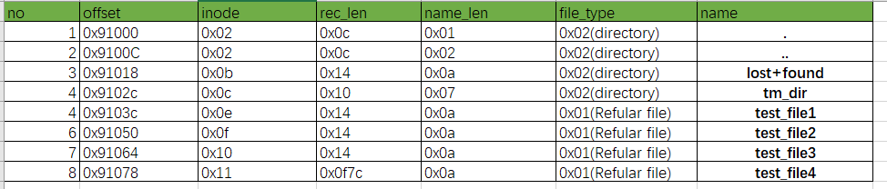

ext4文件系统结构
===================

- ext4文件系统官方参考文档 https://ext4.wiki.kernel.org/index.php/Ext4_Disk_Layout

ext4突出的特点是:数据分段管理、多块分配、延迟分配、持久预分配、日志校验、支持更大的文件系统和文件大小

- ext4文件系统信息表

::
	
	yinwg@ubuntu:~/tmp$ dumpe2fs ext4_image.img 
	dumpe2fs 1.45.5 (07-Jan-2020)
	Filesystem volume name:   <none>
	Last mounted on:          <not available>
	Filesystem UUID:          8fef2468-c8af-4a58-8145-9b406340a487
	Filesystem magic number:  0xEF53
	Filesystem revision #:    1 (dynamic)
	Filesystem features:      has_journal ext_attr resize_inode dir_index filetype extent 64bit flex_bg sparse_super large_file huge_file dir_nlink extra_isize metadata_csum
	Filesystem flags:         signed_directory_hash 
	Default mount options:    user_xattr acl
	Filesystem state:         clean
	Errors behavior:          Continue
	Filesystem OS type:       Linux
	Inode count:              65536
	Block count:              262144
	Reserved block count:     13107
	Free blocks:              249189
	Free inodes:              65525
	First block:              0
	Block size:               4096
	Fragment size:            4096
	Group descriptor size:    64
	Reserved GDT blocks:      127
	Blocks per group:         32768
	Fragments per group:      32768
	Inodes per group:         8192
	Inode blocks per group:   512
	Flex block group size:    16
	Filesystem created:       Mon Aug  5 16:57:56 2024
	Last mount time:          n/a
	Last write time:          Mon Aug  5 16:57:56 2024
	Mount count:              0
	Maximum mount count:      -1
	Last checked:             Mon Aug  5 16:57:56 2024
	Check interval:           0 (<none>)
	Lifetime writes:          533 kB
	Reserved blocks uid:      0 (user root)
	Reserved blocks gid:      0 (group root)
	First inode:              11
	Inode size:	          256
	Required extra isize:     32
	Desired extra isize:      32
	Journal inode:            8
	Default directory hash:   half_md4
	Directory Hash Seed:      ea862837-e703-431b-ac37-800b4ea347ea
	Journal backup:           inode blocks
	Checksum type:            crc32c
	Checksum:                 0x8c174f69
	Journal features:         (none)
	Journal size:             32M
	Journal length:           8192
	Journal sequence:         0x00000001
	Journal start:            0

	组 0：(块 0-32767) 校验和 0xae5c [ITABLE_ZEROED]
	  主 超级块位于 0，组描述符位于 1-1
	  保留的 GDT 块位于 2-128
	  块位图位于 129 (+129)，校验和 0xafe0eb10
	  Inode 位图位于 137 (+137)，校验和 0x70753eb6
	  Inode 表位于 145-656 (+145)
	  28521 个可用块，8181 个可用 inode，2 个目录 ，8181 个未使用的inodes
	  可用块数： 4247-32767
	  可用inode数： 12-8192
	组 1：(块 32768-65535) 校验和 0x278f [INODE_UNINIT, BLOCK_UNINIT, ITABLE_ZEROED]
	  备份 超级块位于 32768，组描述符位于 32769-32769
	  保留的 GDT 块位于 32770-32896
	  块位图位于 130 (bg #0 + 130)，校验和 0x00000000
	  Inode 位图位于 138 (bg #0 + 138)，校验和 0x00000000
	  Inode 表位于 657-1168 (bg #0 + 657)
	  32639 个可用块，8192 个可用 inode，0 个目录 ，8192 个未使用的inodes
	  可用块数： 32897-65535
	  可用inode数： 8193-16384
	组 2：(块 65536-98303) 校验和 0xf953 [INODE_UNINIT, BLOCK_UNINIT, ITABLE_ZEROED]
	  块位图位于 131 (bg #0 + 131)，校验和 0x00000000
	  Inode 位图位于 139 (bg #0 + 139)，校验和 0x00000000
	  Inode 表位于 1169-1680 (bg #0 + 1169)
	  32768 个可用块，8192 个可用 inode，0 个目录 ，8192 个未使用的inodes
	  可用块数： 65536-98303
	  可用inode数： 16385-24576
	组 3：(块 98304-131071) 校验和 0x404c [INODE_UNINIT, BLOCK_UNINIT, ITABLE_ZEROED]
	  备份 超级块位于 98304，组描述符位于 98305-98305
	  保留的 GDT 块位于 98306-98432
	  块位图位于 132 (bg #0 + 132)，校验和 0x00000000
	  Inode 位图位于 140 (bg #0 + 140)，校验和 0x00000000
	  Inode 表位于 1681-2192 (bg #0 + 1681)
	  32639 个可用块，8192 个可用 inode，0 个目录 ，8192 个未使用的inodes
	  可用块数： 98433-131071
	131071¨inode数： 24577-32768
	组 4：(块 131072-163839) 校验和 0x1df6 [INODE_UNINIT, ITABLE_ZEROED]
	  块位图位于 133 (bg #0 + 133)，校验和 0xce938155
	  Inode 位图位于 141 (bg #0 + 141)，校验和 0x00000000
	  Inode 表位于 2193-2704 (bg #0 + 2193)
	  24576 个可用块，8192 个可用 inode，0 个目录 ，8192 个未使用的inodes
	  可用块数： 139264-163839
	  可用inode数： 32769-40960
	组 5：(块 163840-196607) 校验和 0xb2c1 [INODE_UNINIT, BLOCK_UNINIT, ITABLE_ZEROED]
	  备份 超级块位于 163840，组描述符位于 163841-163841
	  保留的 GDT 块位于 163842-163968
	  块位图位于 134 (bg #0 + 134)，校验和 0x00000000
	  Inode 位图位于 142 (bg #0 + 142)，校验和 0x00000000
	  Inode 表位于 2705-3216 (bg #0 + 2705)
	  32639 个可用块，8192 个可用 inode，0 个目录 ，8192 个未使用的inodes
	  可用块数： 163969-196607
	  可用inode数： 40961-49152
	组 6：(块 196608-229375) 校验和 0x6c1d [INODE_UNINIT, BLOCK_UNINIT, ITABLE_ZEROED]
	  块位图位于 135 (bg #0 + 135)，校验和 0x00000000
	  Inode 位图位于 143 (bg #0 + 143)，校验和 0x00000000
	  Inode 表位于 3217-3728 (bg #0 + 3217)
	  32768 个可用块，8192 个可用 inode，0 个目录 ，8192 个未使用的inodes
	  可用块数： 196608-229375
	  可用inode数： 49153-57344
	组 7：(块 229376-262143) 校验和 0x7aa6 [INODE_UNINIT, ITABLE_ZEROED]
	  备份 超级块位于 229376，组描述符位于 229377-229377
	  保留的 GDT 块位于 229378-229504
	  块位图位于 136 (bg #0 + 136)，校验和 0xd58826e1
	  Inode 位图位于 144 (bg #0 + 144)，校验和 0x00000000
	  Inode 表位于 3729-4240 (bg #0 + 3729)
	  32639 个可用块，8192 个可用 inode，0 个目录 ，8192 个未使用的inodes
	  可用块数： 229505-262143
	  可用inode数： 57345-65536

ext4磁盘布局
---------------

从文首的文件系统信息表可以看出，1G大小的空间，ext4文件系统将其分割为8个Group

从文首的文件系统信息表可以看出，主超级块的信息在0号group，每个block大小为4096byte

对超级块的部分数据进行解析

.. note::
	超级块中的主要内容有：文件系统信息、块大小和块组信息、inode信息、文件系统大小和使用情况、日志相关信息、挂载信息、校验和备份信息。其他Group中存在
	超级块的备份信息，如果主超级块损坏，可以从备份区恢复

Group descriptors组描述
------------------------

在ext4文件系统中，Group Descriptor(块组描述符)是一个关键的结构，用于描述和管理文件系统的块组(Block Group).每个块组包含文件系统中的一部分数据块和inode，并拥有自己的
元数据来管理这些资源。Group Descriptor在超级块之后，是文件系统的组织和管理的核心部分

对Group Descriptor数据进行解析，可以看到详细的group信息

Block bitmap块位图
---------------------

Block bitmap块位图用于管理块组中的数据块，Block bitmap记录了块组中每个块的使用状态，标识哪些块是已使用的，哪些是空闲的，里面的数据是按位标记，1表示该块已使用

Inode bitmap索引节点位图
-------------------------

与Block bitmap工作原理类似，Inode bitmap用于管理块组(Block Group)中的inode. Inode bitmap记录了块组中每个inode的使用状态，标识哪些已使用哪些空闲

.. note::
	res/ext4_inode_bitmap_info.png

Inode table索引节点表
------------------------

索引节点表是一个相对比较复杂的一个元文件，从文首的文件系统信息表可以看出

::

	Inode size:	          256
	Inode 表位于 145-656 (+145)

- 一个索引节点的大小为256Byte

- 从Group 0信息中可以看出Group 0的索引表的位置在145-656块的位置

对第2个索引节点参数进行解析

在ext4文件系统中，0~11号索引是特殊定义的索引节点

inode是一个数据结构，代表文件系统中的每个文件和目录。每个inode包含了有关文件的元数据，例如文件大小、权限、所有者信息等。 ``inode.i_block`` 是inode结构中用于
指向文件数据块的字段，是文件系统如何找到并访问文件内容的核心部分

通过inode定位到block
^^^^^^^^^^^^^^^^^^^^^^^

::

	yinwg@ubuntu:~/tmp/tmp/tmp_dir$ tree
	.
	└── test_file

如果要找到test_file对应的block，可以使用stat找到test_file的inode节点.

::

	yinwg@ubuntu:~/tmp/tmp/tmp_dir$ stat test_file 
	  文件：test_file
	  大小：43        	块：8          IO 块：4096   普通文件
	设备：71ah/1818d	Inode：13          硬链接：1
	权限：(0777/-rwxrwxrwx)  Uid：(    0/    root)   Gid：(    0/    root)
	最近访问：2024-08-05 18:06:54.652904399 +0800
	最近更改：2024-08-05 18:06:51.988886744 +0800
	最近改动：2024-08-05 18:06:51.988886744 +0800
	创建时间：-

定位到inode所在的位置

::

	145 * 4096 + (13 - 1) * 256 = 593920 + 3072 = 596992 =  0x91C00

inode索引节点数据

::

	yinwg@ubuntu:~/tmp$ hexdump -s 596992 -C -n 4096 ext4_image.img 
	00091c00  ff 81 00 00 2b 00 00 00  3e a4 b0 66 3b a4 b0 66  |....+...>..f;..f|
	00091c10  3b a4 b0 66 00 00 00 00  00 00 01 00 08 00 00 00  |;..f............|
	00091c20  00 00 08 00 01 00 00 00  0a f3 01 00 04 00 00 00  |................|
	00091c30  00 00 00 00 00 00 00 00  01 00 00 00 00 82 00 00  |................|
	00091c40  00 00 00 00 00 00 00 00  00 00 00 00 00 00 00 00  |................|
	*
	00091c60  00 00 00 00 e3 c8 2d 4f  00 00 00 00 00 00 00 00  |......-O........|
	00091c70  00 00 00 00 00 00 00 00  00 00 00 00 0e e7 00 00  |................|
	00091c80  20 00 47 ba 60 db c4 eb  60 db c4 eb 3c 1f aa 9b  | .G.`...`...<...|
	00091c90  00 a4 b0 66 00 50 05 a7  00 00 00 00 00 00 00 00  |...f.P..........|
	00091ca0  00 00 00 00 00 00 00 00  00 00 00 00 00 00 00 00  |................|

i_block 的偏移量是0x28,对i_block的数据进行解析：

查看文件系统0x8200 block数据

::

	yinwg@ubuntu:~/tmp$ hexdump -s 136314880 -C -n 4096 ext4_image.img 
	08200000  74 65 73 74 20 73 74 72  69 6e 67 20 2e 2e 2e 2e  |test string ....|
	08200010  2e 2e 20 66 6f 72 20 65  78 74 34 20 66 69 6c 65  |.. for ext4 file|
	08200020  20 6f 70 65 72 61 74 69  6f 6e 0a 00 00 00 00 00  | operation......|
	08200030  00 00 00 00 00 00 00 00  00 00 00 00 00 00 00 00  |................|
	*
	08201000

文件test_file数据内容

::

	yinwg@ubuntu:~/tmp/tmp/tmp_dir$ hexdump -C test_file 
	00000000  74 65 73 74 20 73 74 72  69 6e 67 20 2e 2e 2e 2e  |test string ....|
	00000010  2e 2e 20 66 6f 72 20 65  78 74 34 20 66 69 6c 65  |.. for ext4 file|
	00000020  20 6f 70 65 72 61 74 69  6f 6e 0a                 | operation.|
	0000002b

两种方法查看到的数据是一致的

Directory Entries目录项
^^^^^^^^^^^^^^^^^^^^^^^^^^

由上文可知，根目录对应的inode是2，查看根目录索引节点位置

::

	145 * 4096 + (2 - 1) * 256 = 593920 + 256 = 594176 = 0x91100

查看inode数据

::

	yinwg@ubuntu:~/tmp$ hexdump -s 594176 -C -n 4096 ext4_image.img 
	00091100  ed 41 00 00 00 10 00 00  ef a3 b0 66 ee a3 b0 66  |.A.........f...f|
	00091110  ee a3 b0 66 00 00 00 00  00 00 04 00 08 00 00 00  |...f............|
	00091120  00 00 08 00 01 00 00 00  0a f3 01 00 04 00 00 00  |................|
	00091130  00 00 00 00 00 00 00 00  01 00 00 00 91 10 00 00  |................|
	00091140  00 00 00 00 00 00 00 00  00 00 00 00 00 00 00 00  |................|

解析inode数据

查看root inode对应的数据

::

	yinwg@ubuntu:~/tmp$ hexdump -s 17371136 -n 4096 -C ext4_image.img
	01091000  02 00 00 00 0c 00 01 02  2e 00 00 00 02 00 00 00  |................|
	01091010  0c 00 02 02 2e 2e 00 00  0b 00 00 00 14 00 0a 02  |................|
	01091020  6c 6f 73 74 2b 66 6f 75  6e 64 00 00 0c 00 00 00  |lost+found......|
	01091030  10 00 07 02 74 6d 70 5f  64 69 72 00 0e 00 00 00  |....tmp_dir.....|
	01091040  14 00 0a 01 74 65 73 74  5f 66 69 6c 65 31 00 00  |....test_file1..|
	01091050  0f 00 00 00 14 00 0a 01  74 65 73 74 5f 66 69 6c  |........test_fil|
	01091060  65 32 00 00 10 00 00 00  14 00 0a 01 74 65 73 74  |e2..........test|
	01091070  5f 66 69 6c 65 33 00 00  11 00 00 00 7c 0f 0a 01  |_file3......|...|
	01091080  74 65 73 74 5f 66 69 6c  65 34 00 00 00 00 00 00  |test_file4......|
	01091090  00 00 00 00 00 00 00 00  00 00 00 00 00 00 00 00  |................|

