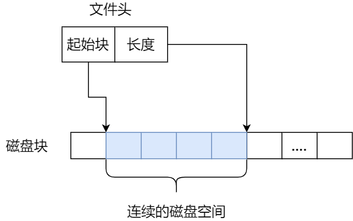
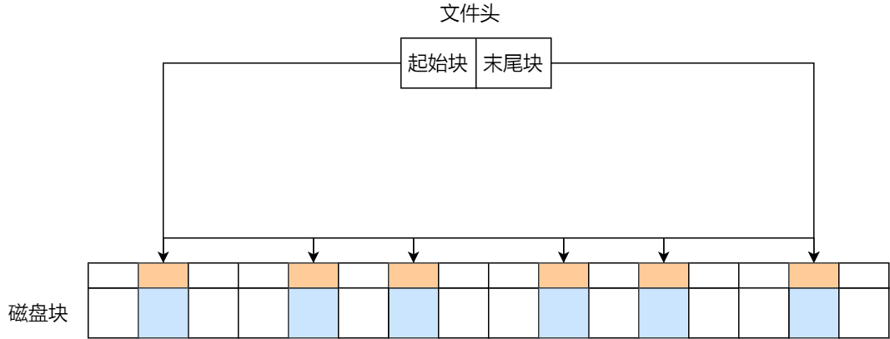
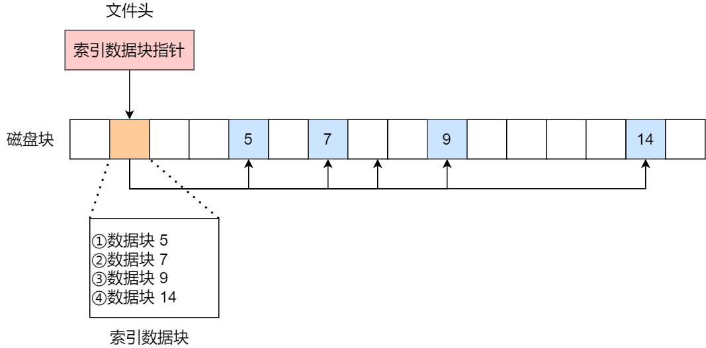
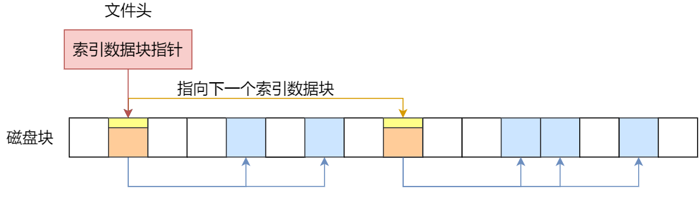
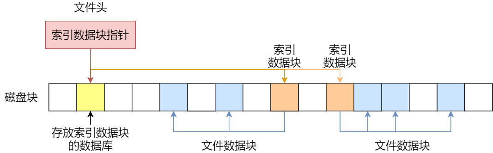
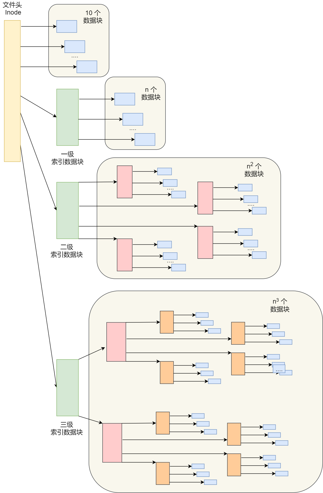
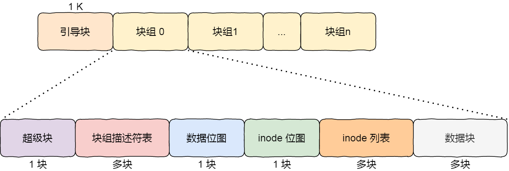
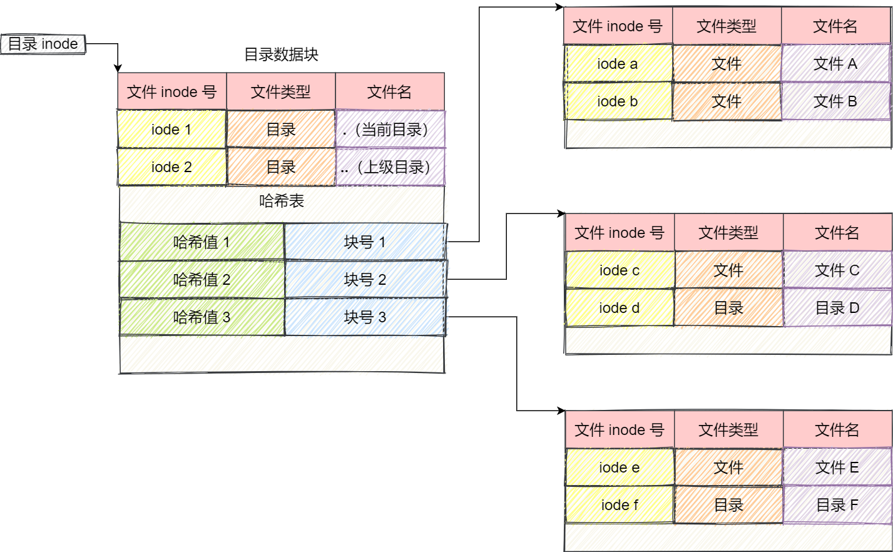
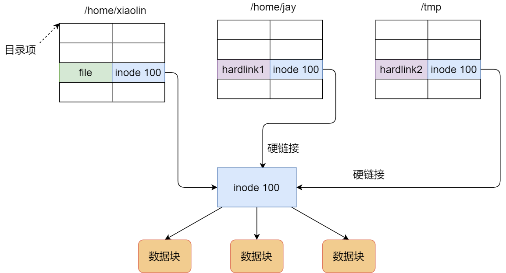
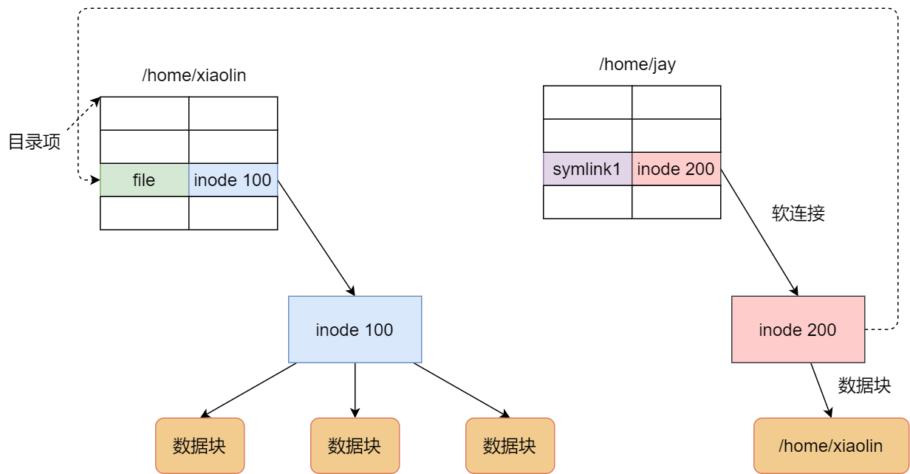

文件的存储
==================

文件的数据是要存储在硬盘上面的，数据在磁盘上的存放方式，就像程序在内存中存放的方式那样，有以下两种：

- 连续空间存放方式

- 非连续空间存放方式

其中，非连续空间存放方式又可以分为 ``链表方式`` 和 ``索引方式`` 

连续空间存放方式
-------------------

顾名思义，文件是存放在磁盘连续的物理空间中，这种存放方式读写效率比较高. inode会描述文件起始块的位置和长度

.. note::
    连续空间存放方式虽然读写效率高，但是有 ``磁盘空间碎片`` 和 ``文件长度不易扩展`` 的缺陷

非连续空间存放方式
-------------------

非连续空间存放方式又可以分为 ``链表方式`` 和 ``索引方式`` 

**链表方式**

链表的方式存放是离散的、不连续的，于是可以消除磁盘碎片，提供磁盘空间利用率，同时文件内的长度可以动态扩展。链表可以分为 ``隐式链表`` 和 ``显示链表``

文件要以「隐式链表」的方式存放的话，实现的方式是文件头要包含「第一块」和「最后一块」的位置，并且每个数据块里面留出一个指针空间，用来存放下一个数据块的位置，
这样一个数据块连着一个数据块，从链头开是就可以顺着指针找到所有的数据块，所以存放的方式可以是不连续的。

隐式链表的存放方式的缺点在于无法直接访问数据块，只能通过指针顺序访问文件，以及数据块指针消耗了一定的存储空间。隐式链接分配的稳定性较差，
系统在运行过程中由于软件或者硬件错误导致链表中的指针丢失或损坏，会导致文件数据的丢失。

如果取出每个磁盘块的指针，把它放在内存的一个表中，就可以解决上述隐式链表的两个不足。那么，这种实现方式是「显式链接」，它指把用于链接文件各数据块的指针，
显式地存放在内存的一张链接表中，该表在整个磁盘仅设置一张，每个表项中存放链接指针，指向下一个数据块号。

**索引方式**

索引的实现是为每个文件创建一个「索引数据块」，里面存放的是指向文件数据块的指针列表，说白了就像书的目录一样，要找哪个章节的内容，看目录查就可以。

另外，文件头需要包含指向「索引数据块」的指针，这样就可以通过文件头知道索引数据块的位置，再通过索引数据块里的索引信息找到对应的数据块。

由于索引数据也是存放在磁盘块的，如果文件很小，明明只需一块就可以存放的下，但还是需要额外分配一块来存放索引数据，所以缺陷之一就是存储索引带来的开销。

如果文件很大，大到一个索引数据块放不下索引信息，这时又要如何处理大文件的存放呢？我们可以通过组合的方式，来处理大文件的存。

先来看看链表 + 索引的组合，这种组合称为「链式索引块」，它的实现方式是在索引数据块留出一个存放下一个索引数据块的指针，于是当一个索引数据块的索引信息用完了，
就可以通过指针的方式，找到下一个索引数据块的信息。那这种方式也会出现前面提到的链表方式的问题，万一某个指针损坏了，后面的数据也就会无法读取了。

还有另外一种组合方式是索引 + 索引的方式，这种组合称为「多级索引块」，实现方式是通过一个索引块来存放多个索引数据块，一层套一层索引，像极了俄罗斯套娃是吧。

那早期 Unix 文件系统是组合了前面的文件存放方式的优点，如下图：

::

    struct ext2_inode {
        ... ...
        /**
         * 指向数据块的指针。
         * 前12个块是直接数据块。
         * 第13块是一级间接块号。
         * 14->二级间接块。
         * 15->三级间接块。
         */
        __le32  i_block[EXT2_N_BLOCKS];/* Pointers to blocks */   
        ... ...
    }

空闲空间管理
-------------

前面说到的文件的存储是针对已经被占用的数据块组织和管理，接下来的问题是，如果我要保存一个数据块，
我应该放在硬盘上的哪个位置呢？难道需要将所有的块扫描一遍，找个空的地方随便放吗？

在 Linux 文件系统就采用了位图的方式来管理空闲空间，不仅用于数据空闲块的管理，还用于 inode 空闲块的管理，因为 inode 也是存储在磁盘的，自然也要有对其管理。

位图是利用二进制的一位来表示磁盘中一个盘块的使用情况，磁盘上所有的盘块都有一个二进制位与之对应。

当值为 0 时，表示对应的盘块空闲，值为 1 时，表示对应的盘块已分配。

Linux Ext2 整个文件系统的结构和块组的内容，文件系统都由大量块组组成，在硬盘上相继排布：

目录的存储
-------------

和普通文件不同的是，普通文件的块里面保存的是文件数据，而目录文件的块里面保存的是目录里面一项一项的文件信息。

在目录文件的块中，最简单的保存格式就是列表，就是一项一项地将目录下的文件信息（如文件名、文件 inode、文件类型等）列在表里。

列表中每一项就代表该目录下的文件的文件名和对应的 inode，通过这个 inode，就可以找到真正的文件。

软链接和硬链接
-----------------

硬链接是多个目录项中的「索引节点」指向一个文件，也就是指向同一个 inode，但是 inode 是不可能跨越文件系统的，
每个文件系统都有各自的 inode 数据结构和列表，所以硬链接是不可用于跨文件系统的。由于多个目录项都是指向一个 inode，
那么只有删除文件的所有硬链接以及源文件时，系统才会彻底删除该文件。

软链接相当于重新创建一个文件，这个文件有独立的 inode，但是这个文件的内容是另外一个文件的路径，所以访问软链接的时候，实际上相当于访问到了另外一个文件，
所以软链接是可以跨文件系统的，甚至目标文件被删除了，链接文件还是在的，只不过指向的文件找不到了而已。

