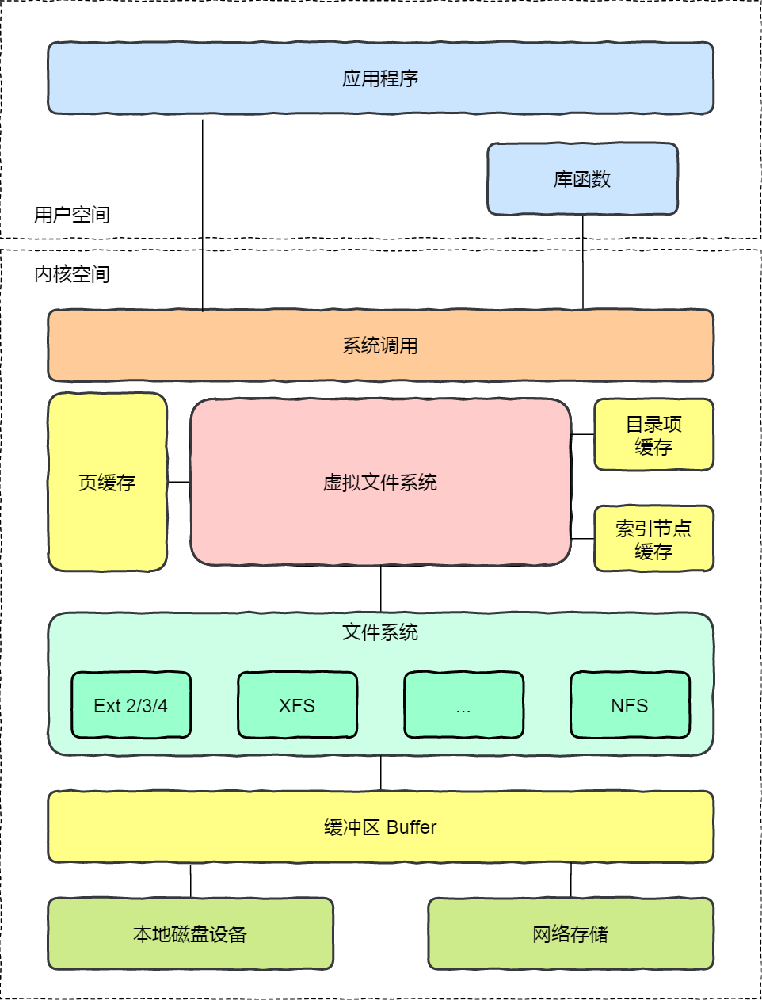
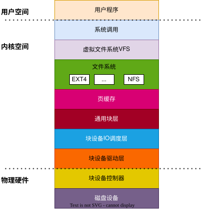
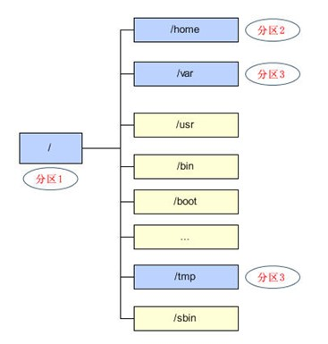

虚拟文件系统概述
==================

存储系统 I/O 软件分层

可以把存储系统的I/O由上到下分为三个层次，分别是文件系统层、通用块层、设备层。

- 文件系统层，包括虚拟文件系统和具体的文件系统实现，他向上为应用程序提供标准的文件访问接口，向下会通过通用块层来存储和管理磁盘数据 

- 通用块层，包括块设备的I/O队列和I/O调度器，它会对文件系统的I/O请求进行排队 ，再通过I/O调度器选择一个I/O发给下一层的设备层

- 设备层, 包括硬件设备、设备控制器和驱动程序，负责最终物理设备的I/O操作

.. note::
    - 为了提高文件访问的效率，会使用页缓存、索引节点缓存、目录项缓存等多种缓存机制，目的是为了减少对块设备的直接调用

    - 为了提高块设备的访问效率，会使用缓存区，来缓存块设备的数据 

文件系统
--------------

文件系统是一种存储和组织计算机数据的方法，它使得对其访问和查找变得容易，文件系统使用文件和树形目录的抽象逻辑概念代替了硬盘等物理设备使用的数据块的概念。
用户使用文件系统来保存数据不必关系数据实际保存在硬盘上的地址，只需要关心文件所属的目录和文件名

linux中允许众多不用的文件系统共存，如ext4,vfat,nfs等。通过使用同一套文件I/O系统调用即可对linux中的任意文件进行操作而无需考虑其所在的具体文件系统格式。更进一步，
对文件的操作可以跨文件系统而执行.比如可以使用cp命令从vfat文件系统中将文件拷贝到ext4文件系统中

一切皆文件时unix/Linux的基本哲学之一。不仅普通的文件，目录，字符设备，块设备，套接字等都是以文件的形式被对待的

磁盘分区和目录
----------------

所有磁盘分区都必须被挂载到目录上才能被使用。所谓的挂载就是利用一个目录当成进入点，将磁盘分区的数据放置在改目录下,也就是进入该目录尽可以读取该分区的意思。linux中根目录
必须挂载到一个分区

虚拟文件系统的作用
-------------------

虚拟文件系统(Virual File System, 简称VFS)，是linux内核中的一个软件层，用于给用户空间的程序提供文件系统接口。同时，它也提供了内核中的一个抽象功能。系统中的所有文件系统
不但依赖VFS共存，而且也依靠VFS协同工作

为了能够支持各种实际文件系统，VFS定义了所有文件系统都支持的基本的、概念上的接口和数据结构。同时实际文件系统也提供VFS所期望的抽象接口和数据结构。将自身的诸如文件、目录等
概念在形式上与VFS的定义保持一致。换句话说，一个实际的文件系统想要被linux支持，就必须提供一个符合VFS标准的接口，才能与VFS协同工作。实际文件系统在统一的接口和数据结构下隐藏
具体的实现细节，所以在VFS层和内核的其他部分来看，所有文件系统都是相同的

