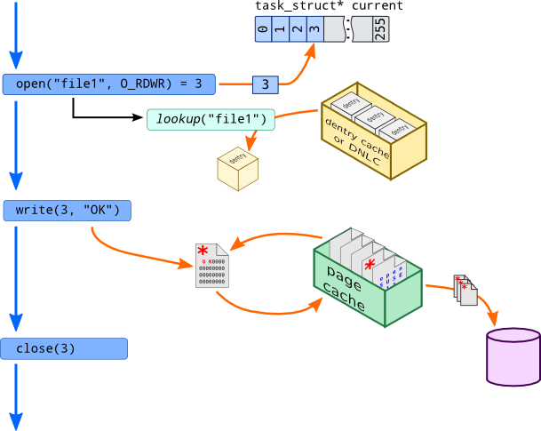
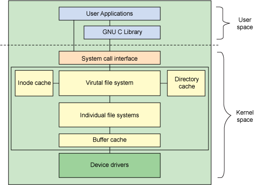
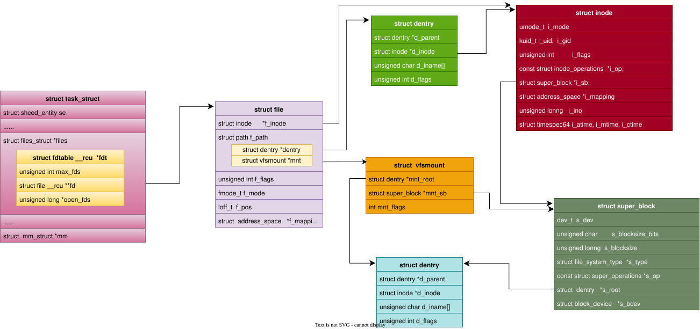
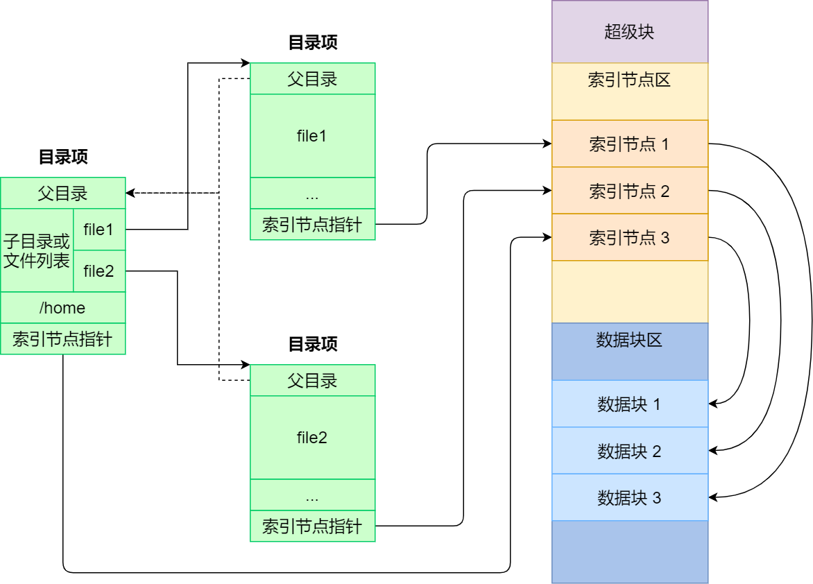
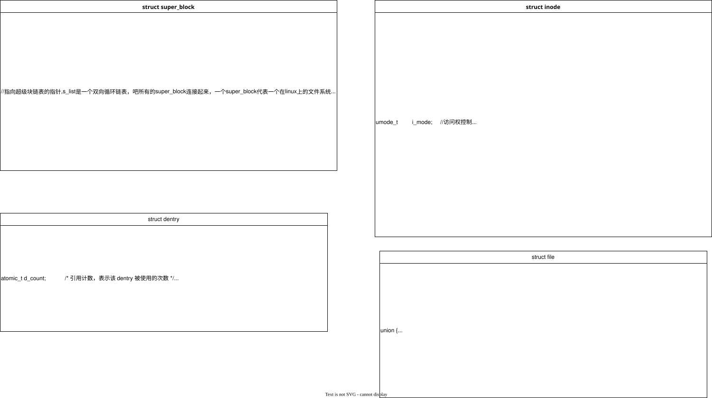
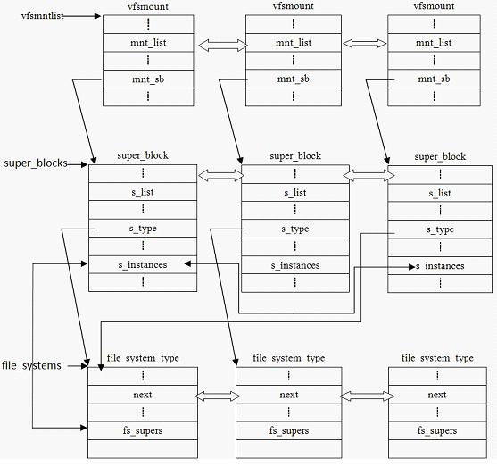
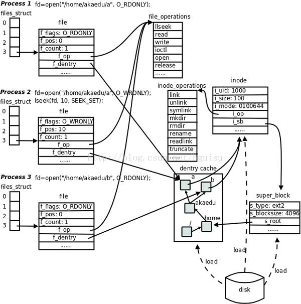

vfs数据结构
===========

- linux文件系统组件的体系结构

该图反应的Linux的文件系统的体系结构用户空间包含一些应用程序（例如，文件系统的使用者）和 GNU C 库（glibc），它们为文件系统调用（打开、读取、写和关闭）提供用户接口。
VFS 是底层文件系统的主要接口。这个组件导出一组接口，然后将它们抽象到各个文件系统，各个文件系统的行为可能差异很大。同时有两个针对文件系统对象的缓存（inode 和 dentry）。
它们缓存最近使用过的文件系统对象。

概念
--------

文件: 一组在逻辑上具有完整意义的信息项的系列。在Linux中除了普通文件，其他诸如目录、设备、套接字等以文件被对待

目录: 目录好比一个文件夹，用来容纳相关文件。因为目录可以包含子目录，所以目录是可以层层嵌套，形成文件路径，Linux中目录被作为一种特殊文件对待

目录项: 在一个文件路径中，路径中的每一个部分被称为目录项。如/home/source/test.c 目录/, home, source, test.c 都是一个目录项

索引节点: 用于存储文件的元数据的一个数据结构。文件的元数据，也就是文件的相关信息，和文件本身是两个不同的概念。它包含的是诸如文件的大小，拥有者，创建时间，磁盘位置等和文件相关的概念

超级块: 用于存储文件系统的控制信息的数据结构。描述文件系统的状态，文件系统类型，大小，区块数，索引节点数等,存放于磁盘的特定扇区中

.. note::
    Linux 文件系统会为每个文件分配两个数据结构：索引节点（index node）和目录项（directory entry），它们主要用来记录文件的元信息和目录层次结构

**关于文件系统的三个易混淆的概念**

创建: 以某种方式格式化磁盘的过程就是在其之上建立一个文件系统的过程，创建文件系统时，会在磁盘的特定位置写入关于该文件系统的控制信息(通常我们说的格式化为某个文件系统格式)

注册: 向内核报道，申明自己能被内核支持，一般在编译内核的时候注册，也可以加载内核模块的方式注册.注册过程实际上是将表示各实际文件系统的数据结构struct file_system_type实例化

安装: 也就我们熟悉的mount操作，将文件x系统加入到linux的根文件系统的目录树结构上，这样文件系统才能被访问(也就是我们常说的挂载)

vfs数据结构
------------

vfs依靠四个主要的数据结构和一些辅助的数据结构来描述其结构信息，这些数据结构表现的就像是对象。每个主要对象都包含由操作函数表构成的操作对象，这些操作对象描述了内核针对这几个
主要的对象可以进行的操作

- 超级块: struct super_block, 代表一个具体的已挂载的文件系统,对应 ``struct super_operations`` 操作方法 

- 索引节点: struct inode，代表一个具体的文件, 对应 ``struct inode_operations``

- 目录项: struct dentry，是路径的一个组成部分。路径中的目录条目统称为目录项，对应 ``struct dentry_operations``

- 文件对象: struct file, 代表一个打开的文件, 对应 ``file_operation``

**vfs关键数据结构汇总**

**vfs关键数据结构对应的operation汇总**

自举块
^^^^^^^^

磁盘分区的第一个块，记录文件系统分区的一些信息，引导加载当前分区的程序和数据被保存在这个块中，也被称为引导块或MBR(主引导记录)

超级块
^^^^^^^^^

存储一个已安装的文件系统的控制信息，代表一个已安装的文件系统。每次一个实际的文件系统被安装时，内核会从磁盘的特定位置读取一些控制信息来填充内存中的超级快对象。一个安装实例
和一个超级块对象一一对应。超级块通过其结构中的一个域s_type记录它所属的文件系统类型

它记录的信息主要有:block与inode的总量，使用量，剩余量，文件系统的挂载时间，最近一次写入数据的时间等。可以说，没有超级块，就没有这个文件系统。inode是用来记录文件属性的，比如说
文件的权限、所有者与组、文件的大小、修改时间等。一个文件占用一个inode，系统读取文件时，首先需要找到inode，并分析inode所记录的权限与用户是否符合，若符合才能够开始实际读取block
的内容。其处于文件系统开始位置的1k处，所占大小为1k。

索引节点
^^^^^^^^^^

索引节点对象存储了文件的相关信息，代表了存储设备上的一个实际的物理文件。当一个文件首次被访问时，内核会在内存中组装响应的索引节点对象，以便向内核提供对一个文件进行操作时
所必须的全部信息，保存的其实是实际的数据的一些信息，这些信息称为元数据。例如文件大下，设备标识符，用户标识符，文件模式，扩展属性，文件读取或修改的时间戳，链接数量，指向存储该
内容的磁盘区块的指针，文件分类等等。这些信息一部分是存储在磁盘特定位置，另外一部分是加载时动态填充的

文件:元数据+数据本身

.. note::
    inode有两种，一种是vfs的inode，一种是具体文件系统的inode，前者在内存中，后者在磁盘中。所以每次其实是将磁盘中的inode填充内存中的inode，这样才算是使用了磁盘文件inode

- inode怎样生成的

每个inode节点的大小，一般是128字节或256字节，inode节点的总数，在格式化时就给定，一般每2KB就设置一个inode，一般情况下inode是用不完的

- inode号

inode号是唯一的，表示不同的文件。其实在linux内部的时候，访问文件都是通过inode号来进行的，所谓文件名仅仅是给用户容易使用的。当我们打开一个文件的时候，首先，系统
会找到这个文件名对应的inode号，然后通过inode号得到inode信息，最后通过inode找到文件数据所在的block

- inode和文件的关系

当创建一个文件的时候就给文件分配了一个inode。一个inode只对应一个实际文件，一个文件也只有一个inode。inodes最大数量就是文件的最大数量

目录项
^^^^^^^^

所谓文件，就是按照一定的形式存储在介质上的信息，所以一个文件其实包含了两方面的信息，一个是存储的数据本身，另一个是有关该文件的组织和管理的信息。
在内存中，每个文件都有一个dentry(目录项)和inode(索引节点)结构，dentry记录着文件名，上级目录等信息，正是它形成了我们所看到的树状结构。而有关该文件的组织
和管理的信息主要存在inode里面，它记录者文件在存储介质上的位置与分布. 同时dentry->d_inode指向相应的inode结构，dentry与inode是多对一的关系，因为有可能一个
文件有好几个文件名。所有的dentry用d_parent和d_child连接起来,就形成了我们熟悉的树状结构.

.. note::
    不管是文件夹还是最终的文件，都是属于目录项. 目录也是一种文件，所以也存在对应的inode

.. note::
    dentry对象没有对应的磁盘数据结构，VFS根据字符串形式的路径名现场创建它。由于dentry对象并非保存在磁盘上，所以dentry结构体没有
    是否被修改的标志(脏状态)

文件对象
^^^^^^^^^

注意文件对象描述的是进程已经打开的文件，因为一个文件可以被多个进程打开，所以一个文件可以存在多个文件对象。但是由于文件是唯一的，那么inode就是唯一的，目录项也是定的。

进程其实是通过文件描述符来操作文件的，注意每个文件都有一个32位的数字来表示下一个读写的位置，这个数字叫做文件位置。一般情况下打开文件后，打开位置都是从0开始。linux用
file结构体来保存打开的文件的位置，所以file称为打开的文件描述

.. note::
	文件对象实际上没有对应的磁盘数据，所以在结构体中没有代表其对象是否为脏，是否需要写回磁盘的标志。文件对象通过f_path.dentry指针指向相关的目录项对象，
	目录项会指向相关的索引节点，索引节点会记录文件是否是脏的

文件系统相关
^^^^^^^^^^^^^

根据文件系统所在的物理介质和数据在物理介质上的组织方式来区分不同的文件系统类型的。file_system_type结构用于描述具体的文件系统的类型信息。被linux支持的文件系统，
都有且仅有一个file_system_type结构而不管它有零个或多个实例被安装到系统中

文件系统相关
^^^^^^^^^^^^^

根据文件系统所在的物理介质和数据在物理介质上的组织方式来区分不同的文件系统类型的。file_system_type结构用于描述具体的文件系统的类型信息。被linux支持的文件系统，
都有且仅有一个file_system_type结构而不管它有零个或多个实例被安装到系统中. 而与此对应的是每当一个文件系统被实际安装时，酒有一个vfsmount结构体被创建，这个结构体
对应一个安装点

::

	struct file_system_type {
		const char *name;                        /*文件系统的名字*/
		int fs_flags;                            /*文件系统类型标志*/
	#define FS_REQUIRES_DEV		1 
	#define FS_BINARY_MOUNTDATA	2
	#define FS_HAS_SUBTYPE		4
	#define FS_USERNS_MOUNT		8	/* Can be mounted by userns root */
	#define FS_USERNS_DEV_MOUNT	16 /* A userns mount does not imply MNT_NODEV */
	#define FS_USERNS_VISIBLE	32	/* FS must already be visible */
	#define FS_NOEXEC		64	/* Ignore executables on this fs */
	#define FS_RENAME_DOES_D_MOVE	32768	/* FS will handle d_move() during rename() internally. */
		struct dentry *(*mount) (struct file_system_type *, int,
				   const char *, void *);
		void (*kill_sb) (struct super_block *);        /* 终止访问超级块*/    
		struct module *owner;                          /* 文件系统模块*/
		struct file_system_type * next;                /*链表中的下一个文件系统类型*/
		struct hlist_head fs_supers;                   /*具有同一种文件系统类型的超级块对象链表*/
	 
		struct lock_class_key s_lock_key;
		struct lock_class_key s_umount_key;
		struct lock_class_key s_vfs_rename_key;
		struct lock_class_key s_writers_key[SB_FREEZE_LEVELS];
	 
		struct lock_class_key i_lock_key;
		struct lock_class_key i_mutex_key;
		struct lock_class_key i_mutex_dir_key;
	};

::

	struct vfsmount {
		struct dentry *mnt_root;	/* root of the mounted tree 该文件系统的根目录项对象  */
		struct super_block *mnt_sb;	/* pointer to superblock 该文件系统的超级块 */
		int mnt_flags;                  /*安装标志*/
	};

进程相关
^^^^^^^^^^

::

	struct task_struct {
		......
	/* CPU-specific state of this task */
		struct thread_struct thread;        /* 进程相关 */
	/* filesystem information */
		struct fs_struct *fs;               /* 建立进程与文件系统的关系 */
	/* open file information */
		struct files_struct *files;         /* 打开的文件集 */
		......
	}

	//建立进程与文件系统的关系
	struct fs_struct {
		int users;                 
		spinlock_t lock;            /*保护该结构体的锁*/
		seqcount_t seq;
		int umask;                /*默认的文件访问权限*/
		int in_exec;
		struct path root, pwd;     /*根目录的目录项对象, 当前工作目录的目录项对象*/
	};
	 
	struct path {
		struct vfsmount *mnt;
		struct dentry *dentry;
	};

	/* 进程打开的文件集 */
	struct files_struct {
	  /*
	   * read mostly part
	   */
		atomic_t count;                           /* 结构的使用计数,表明当前被多少进程打开 */
		struct fdtable __rcu *fdt;
		struct fdtable fdtab;                     /* 默认使用这个,标记下面数组的,如果打开的文件超过NR_OPEN_DEFAULT,就需要动态申请空间了,申请的由上面这个标记 */
	  /*
	   * written part on a separate cache line in SMP
	   */
		spinlock_t file_lock ____cacheline_aligned_in_smp;
		int next_fd;                              /* 下一个文件描述符,方便申请文件描述符 */
		unsigned long close_on_exec_init[1];      /* exec()关闭的文件描述符 */
		unsigned long open_fds_init[1];           /* 文件描述符的初始集合 */
		struct file __rcu * fd_array[NR_OPEN_DEFAULT];        /* 默认的文件对象数组 */
	};
	 
	 
	struct fdtable {
		unsigned int max_fds;        /* 当前fd_array里,最大可以打开的文件数量 */
		struct file __rcu **fd;      /* current fd array 默认是files_struct 里面的fd_array,如果超出,就需要动态申请,这个就会指向动态申请的 */
		unsigned long *close_on_exec;
		unsigned long *open_fds;     /* 存放进程已经打开的文件描述符 */
		struct rcu_head rcu;         /* 动态申请的和之前的通过链表链接 */
	};

一般在open函数的时候，进程会通过Pathname(包括path和name，即entry)，找到inode，进而找到它里面的file_operation方法，把这个方法填充到file_struct中的fd_array数组未使用
的最小对应项中，返回该项下标，即我们应用程序所谓的文件描述符. 之后的read write等都是通过文件描述符，直接找到file_struct中的对应数组项，直接操作对应的驱动函数

- 超级块、安装点和具体的文件系统的关系

.. note::
    file，dentry，inode，super_block以及超级块的位置约定都属于vfs层，inode中的i_fop和file中f_op一样的，虽然每个文件都有目录项和索引节点在磁盘上，但是只有在需要时才会在内存中
    为之建立相应的dentry和inode数据结构，特殊文件在内存中也有inode数据结构和dentry数据结构，但是不一定在存储介质上有索引节点和目录项. 特殊文件一般与外部设备无关，所涉及的信息
    通常是内存和CPU本身

示例
---------

在linux系统中,目录结构通过 ``dentry`` 来表示，它与 ``inode`` 一起提供文件系统中文件和目录的快速访问

dentry是一个复杂的目录结构，包含以下几个重要字段

- d_name: 目录项的名称

- d_parent: 指向父目录的dentry

- d_inode: 指向目录项对应的inode

- d_subdirs: 子目录项的列表

- d_flags: 标志，描述目录项的状态

.. note::
    dentry结构通过双向链表和散列表来表示文件系统的目录结构．它允许文件系统快速查找和管理目录及文件

假设文件系统中有以下目录结构

::

    /
    ├── home/
    │   ├── user/
    │   │   └── file.txt
    └── etc/
        └── config.cfg

对应的dentry结构表示如下

- 根目录 '/' 对应一个dentry, 它的'd_name'是空字符串，'d_parent'指向自身

- '/home' 对应一个dentry, 它的 d_name 是 "home"，d_parent 指向根目录的 dentry。

- '/home/user' 对应一个 dentry，它的 d_name 是 "user"，d_parent 指向 /home 的 dentry。

- '/home/user/file.txt' 对应一个 dentry，它的 d_name 是 "file.txt"，d_parent 指向 /home/user 的 dentry。

- '/etc'  对应一个 dentry，它的 d_name 是 "etc"，d_parent 指向根目录的 dentry。

- '/etc/config.cfg` 对应一个 dentry，它的 d_name 是 "config.cfg"，d_parent 指向 /etc 的 dentry。

