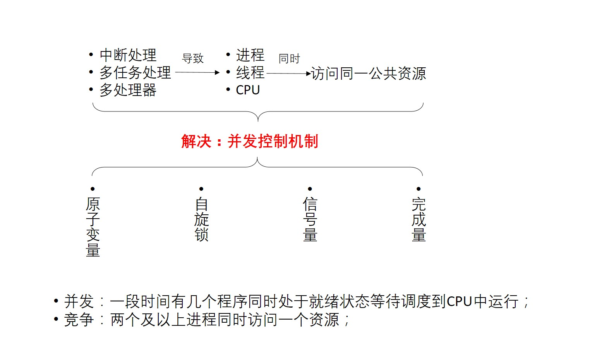
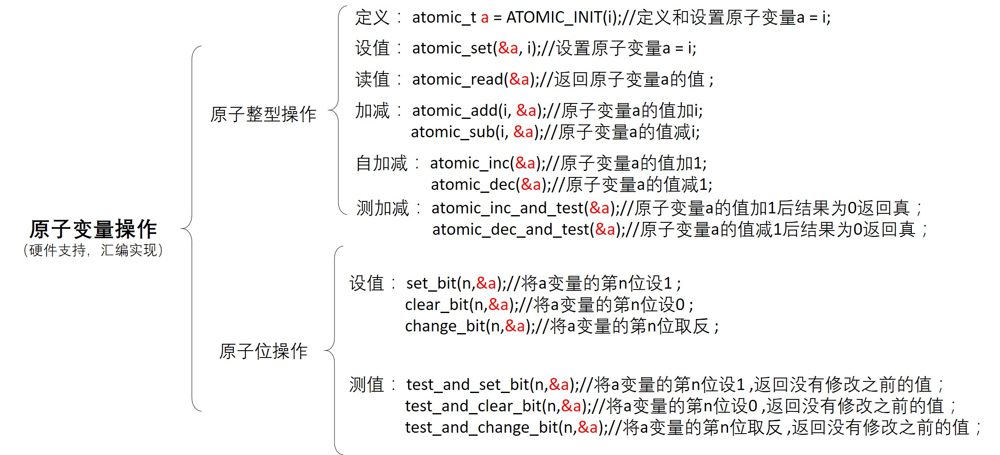
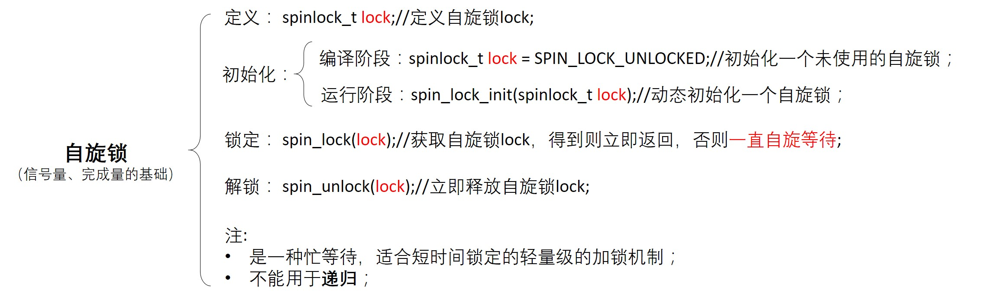
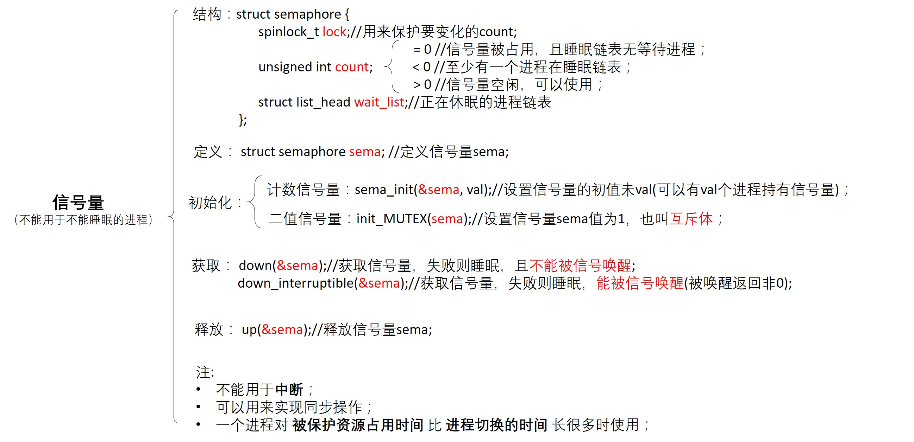

linux并发与同步
=====================

在内核中产生并发访问的并发源主要有以下四种

- 中断和异常: 中断发生后，中断处理程序和被中断的进程之间可能产生并发访问

- 软中断和tasklet: 软中断和tasklet随时可能会被调度、执行，从而打断当前正在执行的进程上下文

- 内核抢占: 调度器支持可抢占特性，会导致进程和进程之间的并发访问

- 多处理器并发执行: 多处理器可以同时执行多个进程

原子变量操作
----------------

原子操作是指保证指令以原子的方式执行，执行过程中不会被打断。

atomic_t类型的原子操作函数可以保证一个操作的原子性和完整性。在内核看来，原子操作函数就像一条汇编语句，保证了操作时不会被打断(原子性的完成"读-改-写"机制)。此类
操作依赖不同的架构实现，如ARM64中处理器提供 ``cas`` 指令

- 测试代码

::

    #include <linux/module.h>
    #include <linux/init.h>

    #include <asm/automic.h>    //原子变量操作的头文件
    #include <asm/bitops.h>     //原子位操作的头文件

    atomic_t al = ATOMIC_INIT(1);   //定义和设置原子量
    unsigned long int a2; 

    static int test_drv_init(void)
    {
        //测试原子量操作
        printk("test a1\nKERN_INFO:aotmic_read(): a1 = %d\n", a1);

        atomic_add(4, &a1);
        printk("KERN_INFO:atomic_add(): a1 = %d\n", a1);

        atomic_dec(&a1);
        printk("KERN_INFO:atomic_dec(): a1 = %d\n", a1);

        printk("KERN_INFO:atomic_dec_and_test(): judge_a1 = %d, new_a1 = %d\n", atomic_dec_and_test(&a1), atomic_read(&a1));

        //测试原子位操作
        set_bit(0, &a2);
        printk("test a2\nKERN_INFO:set_bit(): a2 = %ld\n", a2);

        printk("KERN_INFO:test_and_clear_bit(): return_a2 = %d, new_a2 = %ld\n", \
            test_and_clear_bit(0, &a2), a2);

        printk("KERN_INFO:test_and_set_bit(): return_a2 = %d, new_a2 = %ld\n", test_and_set_bit(0, &a2), a2);
    }

    static void test_drv_exit(void)
    {
    
    }

    module_init(test_drv_init);
    module_exit(test_drv_exit);

    MODULE_LICENSE("GPL");
    MODULE_AUTHOR("hkdywg");
    MODULE_DESCRIPTION("Learn for atomic");

自旋锁
--------

经典自旋锁
^^^^^^^^^^^

如果临界区只有一个变量，那么原子变量可以解决问题，但是大多数情况下临界区有一个数据操作的集合。这个过程使用原子变量不合适，需要使用锁机制来完成，
自旋锁(spinlock)是linux内核中最常见的锁机制。

自旋锁在同一时刻只能被一个内核代码路径持有，如果另外一个内核代码路径尝试获取一个已经被持有的自旋锁，那么该内核代码路径需要一直忙等待，直到自旋锁持有者
释放该锁。操作系统中锁机制分为两种一种是忙等待，另外一种是睡眠等待。自旋锁为忙等待。自旋锁可以在中段上下文使用。

- spinlock的实现

::

    //include/linux/spinlock_types.h
    typedef struct spinlock {
        struct raw_spinlock rlock;
    } spinlock_t;

    typedef struct raw_spinlock {
        arch_spinlock_t raw_lock;
    } raw_spinlock_t;

    //include/linux/spinlock.h
    static inline void spin_lock(spinlock_t *lock)
    {
        raw_spin_lock(&lock->rlock);
    }

    static inline void __raw_spin_lock(raw_spinlock_t *lock)
    {
        preempt_disable();  //关闭内核抢占
        //如果系统没有打开CONFIG_LOCKDEP和CONFIG_LOCK_STAT选项，spin_acquire是一个空函数
        spin_acquire(&lock->dep_map, 0, 0, _RET_IP_);   
        LOCK_CONTENDED(lock, do_raw_spin_trylock, do_raw_spin_lock);
    }

    static inline void do_raw_spin_lock(raw_spinlock_t *lock)
    {
        arch_spin_lock(&lock->raw_lock);
    }

linux 2.6.25内核以后，自旋锁实现了"基于排队的FIFO"算法的自旋锁机制。以下为Linux 4.0中的spinlock实现

::

    <linux4.0/arch/arm64/include/asm/spinlock.h>
    static inline void arch_spin_lock(arch_spinlock_t *lock)
    {
        unsigned int tmp;
        arch_spinlock_t lockval, newval;
        
        asm volatile(
        /* 自动实现下一次排队 */
        "prfm pstl1strm, %3\n"
        "1: ldaxr %w0, %3\n"
         "add %w1, %w0, %w5\n"
         "stxr %w2, %w1, %3\n"
         "cbnz %w2, 1b\n"
         /* 是否获得了锁 */
         "eor %w1, %w0, %w0, ror #16\n"
         "cbz %w1, 3f\n"
         /*
         * 若没有获得锁，自旋,
         * 发送本地事件，以避免在独占加载前忘记解锁
         */
         "sevl\n"
         "2: wfe\n"
         "ldaxrh %w2, %4\n"
         "eor %w1, %w2, %w0, lsr #16\n"
         "cbnz %w1, 2b\n"
         /* 获得锁，临界区从这里开始 */
         "3:"
         : "=&r" (lockval), "=&r" (newval), "=&r" (tmp), "+Q" (*lock)
         : "Q" (lock->owner), "I" (1 << TICKET_SHIFT)
         : "memory"
    }

- 测试代码

::

    #include <linux/module.h>
    #include <linux/init.h>
    #include <linux/kernel.h>
    #include <linux/fs.h>
    #include <asm/unaccess.h>
    #include <linux/of.h>
    #include <linux/of_device.h>
    #include <linux/spinlock.h>

    static struct class *testdrv_class;
    static struct class_device *testdrv_class_dev;

    int count = 0;
    spinlock_t lock;

    static int test_drv_open(struct inode *inode, struct file *file)
    {
        spin_lock(&lock);
        if(count) {
            spin_unlock(&lock);
            pirntk("kernel: open fail! count = %d\n", count);
            return -EBUSY;
        }
        count++;
        spin_unlock(&lock);
        printk("kernel: open ok! count = %d\n", count);

        return 0;
    }

    static int test_drv_release(struct inode *inode, struct file *file)
    {
        spin_lock(&lock);
        count--;
        spin_unlock(&lock);
        printk("kernel: release ok! count  = %d\n", count);

        return 0;
    }

    static struct file_operations test_drv_fops = {
        .owner = THIS_MODULE,
        .open = test_drv_open,
        .release = test_drv_release,
    };

    int major;
    static int test_drv_init(void)
    {
        major = register_chrdev(0, "test_drv", &test_drv_fops);

        testdrv_class = class_create(THIS_MODULE, "testdrv");

        testdrv_class_dev = devcie_create(testdrv_class, NULL, MKDEV(major, 0), NULL, "locktest");

        spin_lock_init(&lock);

        printk("kernel: init ok!\n");

        return 0;
    }

    static void test_drv_exit(void)
    {
        unregister_chrdev(major, "test_drv");

        device_destroy(testdrv_class, MKDEV(major, 0));

        class_destroy(testdrv_class);

        printk("kernel: exit ok!\n");
    }

    module_init(test_drv_init);
    module_exit(test_drv_exit);

    MODULE_LICENSE("GPL");
    MODULE_AUTHOR("hkdywg");
    MPDULE_DESCRIPTION("Learn for spin lock");

::

    #include <sys/types.h>
    #include <sys/stat.h>
    #include <fcntl.h>
    #include <stdio.h>

    int main(int argc, char **argv)
    {
        int fd;
        fd = open("/dev/locktest", O_RDWR);

        if(fd < 0) {
            printf("app: can't open!\n");
        } else {
            printf("app: open ok!\n");
        }

        return 0;
    }

排队自旋锁
^^^^^^^^^^^

排队自旋锁是对经典自旋锁的优化，排队自旋锁机制比经典自旋锁的排队机制在性能方面有进一步的提升

::

    //include/asm-generic/qspinlock_types.h

    typedef struct qspinlock {
        union {
            atomic_t val;
            struct {
                u8 locked;  
                u8 pending; 
            };
            struct {
                u16 locked_pending;
                u16 tail;
            };
        };
    } arch_spinlock_t;

原来的spinlock数据结构中的val字段被分隔成 ``locked`` 、 ``pending`` 、 ``tail_idx`` 、 ``tail_cpu`` 4个域。linux内核使用一个{x, y, z}三元组
来表示锁的状态，其中x表示tail_cpu和tail_idx域， y表示pending域， z表示lock域

.. image::
    res/spinlock_xyz.png

信号量
-------

- 测试代码

::

    #include <linux/module.h>
    #include <linux/init.h>
    #include <linux/kernel.h>
    #include <linux/fs.h>
    #include <linux/of.h>
    #include <asm/uaccess.h>
    #include <linux/of_device.h>
    #inlcude <linux/semaphore.h>

    static struct class *testdrv_class;
    static struct class_device *testdrv_class_dev;

    struct semaphore sem;

    static int test_drv_open(struct inode *inode, struct file *file)
    {
        printk("kernel:down befor sem.count = %d\n", sem.count);

        down(&sem);

        printk("kernel:down after sem.count = %d\n", sem.count);

        return 0;
    }

    static int test_drv_release(struct inode *inode, struct file *file)
    {
        printk("kernel:up befor sem.count = %d\n", sem.count);

        up(&sem);

        printk("kernel:up after sem.count = %d\n", sem.count);

        return 0;
    }

    static struct file_operations test_drv_fops = {
        .owner = THIS_MODULE,
        .open = test_drv_open,
        .release = test_drv_release,
    };

    int major;
    static int test_drv_init(void)
    {
        major = register_chrdev(0, "test_drv", &test_drv_fops);

        testdrv_class = class_create(THIS_MODULE, "testdrv");

        testdrv_class_dev = device_create(testdrv_class, NULL, MKDEV(major, 0), NULL, "semaphoretest");

        sema_init(&sem, 2); //允许同时2个进程访问临界资源

        printk("kernel: init ok!\n");

        return 0;
    }

    static void test_drv_exit(void)
    {
        unregister_chrdev(major, "test_drv");

        device_destroy(testdrv_class, MKDEV(major, 0));

        class_destroy(testdrv_class);

        printk("kernel: exit ok!\n");
    }

    module_init(test_drv_init);
    module_exit(test_drv_exit);

    MODULE_LICENSE("GPL");
    MODULE_AUTHOR("hkdywg");
    MODULE_DESCRIPTION("Learn for semaphore");

::

    #include <sys/types.h>
    #include <sys/stat.h>
    #include <fcntl.h>
    #include <stdio.h>

    int main(int argc, char **argv)
    {
        int fd;

        fd = open("/dev/semaphoretest", O_RDWR);

        if(fd < 0)
            printf("app: can't open!\n");
        else
            printf("app: open ok!\n");

        return 0;
    }

    

