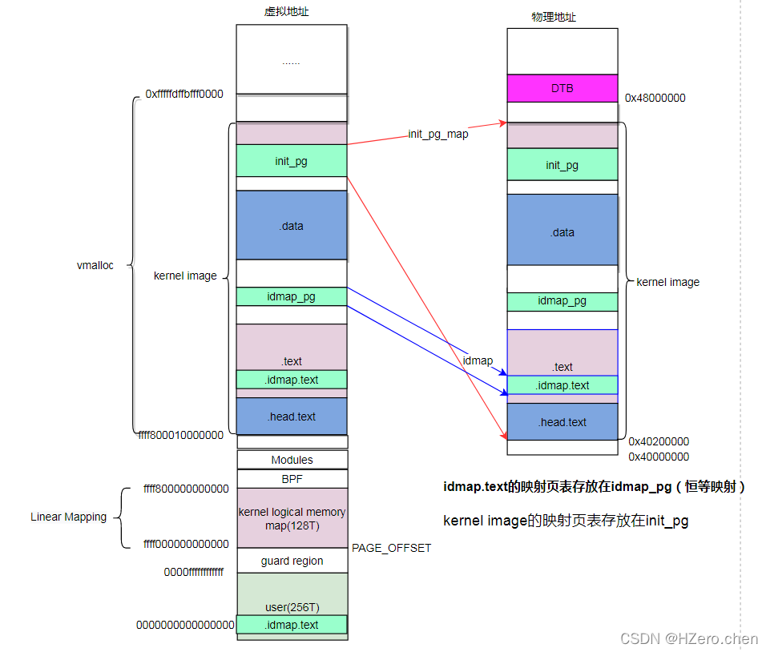
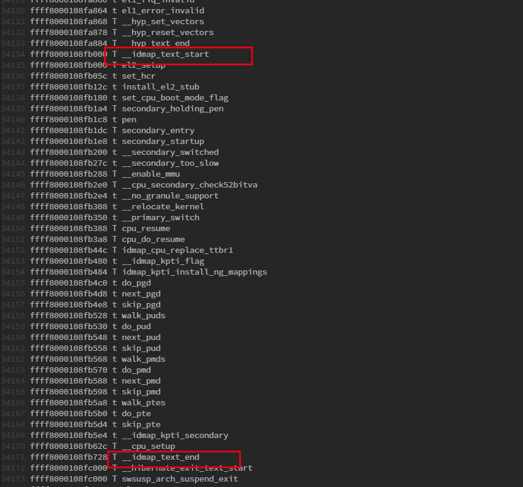

__create_page_tables
==========================

create_pag_tables主要完成以下工作

- 无效init_pg区域的cacheline

- 清零init_pg内存区域

- 在idmap_pg区域为kernel创建恒等映射(物理地址与虚拟地址一致)，由于只在开始MMU时使用，因此只会为部分代码创建映射

- 在init_pg区域为kernel创建映射

- 再次无效init_pg和idmap_pg区域对应的cacheline

.. note::

    在ARM64架构中，汇编代码初始化阶段会创建两次地址映射。第一次是为了打开MMU操作的准备，因为在打开MMU之前当前代码运行在物理地址之上，而打开
    MMU之后代码与逆行在虚拟地址之上。为了从物理地址转换到虚拟地址的平滑过渡，ARM推荐VA和PA相等的一段映射(例如虚拟地址0xffff8000通过页表查询映射的物理地址也是0xffff8000)
    这段映射在Linux中称为identity mapping, 第二次是kernel Image映射

执行完create_page_tables，将得到如下的地址空间布局

当kernel image加载到物理内存后，为.idmap.text段创建了idmap映射，其中.idmap.text属于.text段的一部分。idmap_pg页表空间位于.data段和.text段之间.为整个kernel iamge创建了Init映射，
其中init_pg页表位于.data段

.. note::
   为idmap.text创建恒等映射，实际就是创建idmap页表，通过填充pgd, pud, pmd页表项完成。其中pgd, pud为页表描述符，指向下级页表，pmd为块描述符，pmd指向idmap_text区域 

=============================== =================================================================================================================
  主要宏                                    说明
------------------------------- -----------------------------------------------------------------------------------------------------------------
 KIMAGE_VADDR                       kernel起始虚拟地址，_text地址
 PAGE_OFFSET                        Linear Mapping起始虚拟地址
 PAGE_END                           Linear Mapping结束虚拟地址
 __PHYS_OFFSET                      kernel起始虚拟地址，_text地址
 KERNEL_START                       kernel起始虚拟地址，_text地址
=============================== =================================================================================================================

建立页初始化的过程

::

    __create_page_tables:
        mov	x28, lr                 //保存LR,通过ret返回

        /*
         * Invalidate the init page tables to avoid potential dirty cache lines
         * being evicted. Other page tables are allocated in rodata as part of
         * the kernel image, and thus are clean to the PoC per the boot
         * protocol.
         */
        adrp	x0, init_pg_dir     //
        adrp	x1, init_pg_end     //
        sub	x1, x1, x0              //
        bl	__inval_dcache_area     //将init_pg_end和init_pg_dir之间的区域对应的cacheline设定为无效

关于 ``init_pg_dir`` 和 ``init_pg_end`` 相关定义如下, 计算出kernel映射需要多少个page

::

    //arch/arm64/kernel/vmlinnux.lds.S
    . = ALIGN(PAGE_SIZE);                                                 
    init_pg_dir = .;                                                      
    . += INIT_DIR_SIZE;                                                   
    init_pg_end = .;

    #define INIT_DIR_SIZE (PAGE_SIZE * EARLY_PAGES(KIMAGE_VADDR, _end))
    #define EARLY_PAGES(vstart, vend) ( 1                   /* PGDIR page */                                \
                            + EARLY_PGDS((vstart), (vend))  /* each PGDIR needs a next level page table */  \
                            + EARLY_PUDS((vstart), (vend))  /* each PUD needs a next level page table */    \
                            + EARLY_PMDS((vstart), (vend))) /* each PMD needs a next level page table */

    #define EARLY_PGDS(vstart, vend) (EARLY_ENTRIES(vstart, vend, PGDIR_SHIFT))
    #define EARLY_PUDS(vstart, vend) (0)
    #define EARLY_PMDS(vstart, vend) (EARLY_ENTRIES(vstart, vend, SWAPPER_TABLE_SHIFT))

    #define EARLY_ENTRIES(vstart, vend, shift) (((vend) >> (shift)) \
                                            - ((vstart) >> (shift)) + 1 + EARLY_KASLR)
                                            -
    #define PAGE_SIZE               (_AC(1, UL) << PAGE_SHIFT)
    #define PGDIR_SHIFT             ARM64_HW_PGTABLE_LEVEL_SHIFT(4 - CONFIG_PGTABLE_LEVELS)
    #define ARM64_HW_PGTABLE_LEVEL_SHIFT(n) ((PAGE_SHIFT - 3) * (4 - (n)) + 3)

    #define SWAPPER_PGTABLE_LEVELS  (CONFIG_PGTABLE_LEVELS - 1)
    #define IDMAP_PGTABLE_LEVELS    (ARM64_HW_PGTABLE_LEVELS(PHYS_MASK_SHIFT) - 1)

    #define PAGE_SHIFT              CONFIG_ARM64_PAGE_SHIFT
    #define CONFIG_ARM64_PAGE_SHIFT 12

清除init page table

::

        /*
         * Clear the init page tables.
         */
        adrp	x0, init_pg_dir
        adrp	x1, init_pg_end
        sub	x1, x1, x0
    1:	stp	xzr, xzr, [x0], #16     //将初始化页表地址清零
        stp	xzr, xzr, [x0], #16
        stp	xzr, xzr, [x0], #16
        stp	xzr, xzr, [x0], #16
        subs	x1, x1, #64
        b.ne	1b

        mov	x7, SWAPPER_MM_MMUFLAGS

x7中保存了SWAPPER_MM_MMUFLAGS，相关定义如下

::

    #define SWAPPER_MM_MMUFLAGS     (PMD_ATTRINDX(MT_NORMAL) | SWAPPER_PMD_FLAGS)

    /*                                                                                                                                                                                   
     * AttrIndx[2:0] encoding (mapping attributes defined in the MAIR* registers).                                                                                                       
     */                                                                                                                                                                                  
    #define PMD_ATTRINDX(t)         (_AT(pmdval_t, (t)) << 2)                                                                                                                            

    /*                                                                                                                                                                                   
     * Initial memory map attributes.                                                                                                                                                    
     */                                                                                                                                                                                                                                                                                                
    #define SWAPPER_PMD_FLAGS       (PMD_TYPE_SECT | PMD_SECT_AF | PMD_SECT_S) 
    /*最低位为01，根据页表描述符为块描述符*/
    #define PMD_TYPE_SECT           (_AT(pmdval_t, 1) << 0)

创建identity映射

::

        /*
         * Create the identity mapping.
         */
        adrp	x0, idmap_pg_dir            //x0保存了id_map区域页表存放的起始地址idmap_pg_dir
        adrp	x3, __idmap_text_start		//x3保存了idmap_test_start的物理地址，它就是需要创建恒等映射的起始地

``idmap_pg_dir`` 定义如下

::

    #arch/arm64/kernel/vmlinux.lds.S
    idmap_pg_dir = .;                                                                                                                                                            
     . += IDMAP_DIR_SIZE;                                                                                                                                                         
    idmap_pg_end = .; 

    #define IDMAP_DIR_SIZE          (IDMAP_PGTABLE_LEVELS * PAGE_SIZE)
    #define IDMAP_PGTABLE_LEVELS    (ARM64_HW_PGTABLE_LEVELS(PHYS_MASK_SHIFT) - 1)

::

        mov	x5, #VA_BITS_MIN                //获取总线位宽
        adr_l	x6, vabits_actual           //获取vabit_actual变量地址
        str	x5, [x6]                        //将总线位宽写入到vabits_actual中
        dmb	sy                              // 内存屏障指令，等待上述指令完成
        dc	ivac, x6		                //将x6指定的虚拟地址的数据缓存清除

        /*
         * VA_BITS may be too small to allow for an ID mapping to be created
         * that covers system RAM if that is located sufficiently high in the
         * physical address space. So for the ID map, use an extended virtual
         * range in that case, and configure an additional translation level
         * if needed.
         *
         * Calculate the maximum allowed value for TCR_EL1.T0SZ so that the
         * entire ID map region can be mapped. As T0SZ == (64 - #bits used),
         * this number conveniently equals the number of leading zeroes in
         * the physical address of __idmap_text_end.
         */
        adrp	x5, __idmap_text_end        //获取内核代码终止地址
        clz	x5, x5                          //地址前导0个数，并赋值给x5
        cmp	x5, TCR_T0SZ(VA_BITS)	        //虚拟地址的最大值前导0个数和最高物理地址比较
                                            //如果物理地址的前导0多，说明地址够用，不用扩展
        b.ge	1f			// .. then skip VA range extension

        adr_l	x6, idmap_t0sz              //获取idmap_t0sz变量地址
        str	x5, [x6]                        //
        dmb	sy
        dc	ivac, x6		// Invalidate potentially stale cache line

        /*
         * If VA_BITS == 48, we don't have to configure an additional
         * translation level, but the top-level table has more entries.
         */
        mov	x4, #1 << (PHYS_MASK_SHIFT - PGDIR_SHIFT)
        str_l	x4, idmap_ptrs_per_pgd, x5
    1:
        ldr_l	x4, idmap_ptrs_per_pgd  //获取idmap_ptrs_per_pgd地址
        mov	x5, x3				        //x3中保存着内核代码起始地址，赋值为x5
        adr_l	x6, __idmap_text_end    //获取内核代码终止地址

        //map_memory是一个宏, x0页表位置，x1下一级页表项位置, x3需要映射的开始地址，x6需要映射的结束地址
        //x7 映射最后一级页表项的flag, x3映射的物理地址 x4: pgd项个数
        //此处为idmap test创建恒等映射, idmap.text段在head.S中申明
        map_memory x0, x1, x3, x6, x7, x3, x4, x10, x11, x12, x13, x14

.. note::
    通过查看System.map可以知道idmap_text段包含以下内容

::

        /*
         * Map the kernel image (starting with PHYS_OFFSET).
         */
        adrp	x0, init_pg_dir                 //x0存放页表的起始地址
        mov_q	x5, KIMAGE_VADDR + TEXT_OFFSET	//x5存放kernel开始映射的虚拟地址
        add	x5, x5, x23			// add KASLR displacement
        mov	x4, PTRS_PER_PGD                    //pgd页表项个数
        adrp	x6, _end			            //x6保存kernel结束映射的物理地址
        adrp	x3, _text			            //x3保存kernel的物理地址
        sub	x6, x6, x3			                // _end - _text
        add	x6, x6, x5			                //计算得到kernel结束映射的虚拟地址并保存在x6中

        //为kernel image创建页表
        map_memory x0, x1, x5, x6, x7, x3, x4, x10, x11, x12, x13, x14

        /*
         * Since the page tables have been populated with non-cacheable
         * accesses (MMU disabled), invalidate the idmap and swapper page
         * tables again to remove any speculatively loaded cache lines.
         */
        adrp	x0, idmap_pg_dir
        adrp	x1, init_pg_end
        sub	x1, x1, x0
        dmb	sy
        bl	__inval_dcache_area     //将init_pg和idmap_pg区域对应的cacheline

        ret	x28
    ENDPROC(__create_page_tables)

