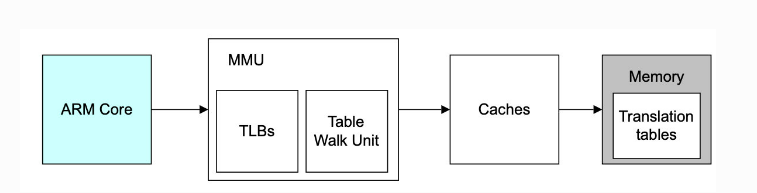
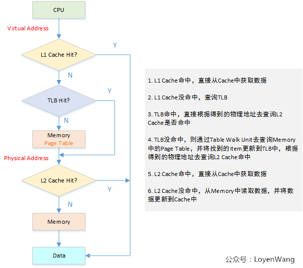
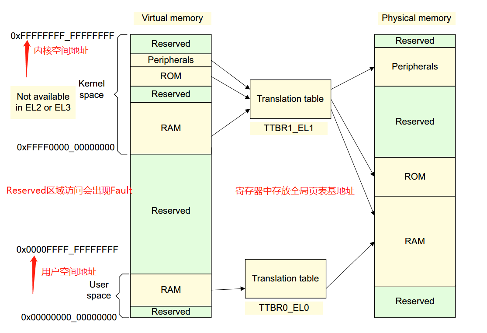
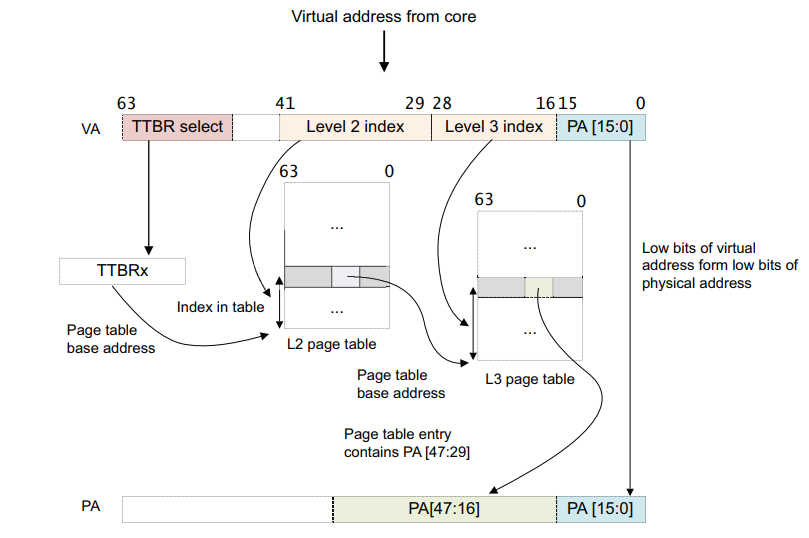

arm64 MMU
==============

- 内存访问中cache与TLB参与过程

虚拟地址到物理地址的转换
----------------------------

虚拟地址到物理地址的映射通过查表的机制来实现，在armv8中，kernel space的页表基地址存放在 ``TTBR1_EL1`` 寄存器中，user space页表基地址存放在 ``TTBR0_EL0`` 寄存器中，
其中内核地址空间的高位全为1，用户地址空间的高位全为0

- 0xFFFF0000_00000000 ~ 0xFFFFFFFF_FFFFFFFF

- 0x00000000_00000000 ~ 0x0000FFFF_FFFFFFFF

ARMv8中:

- 虚拟地址支持：64位虚拟地址中，并不是所有位都用上，除了高16位用于区分内核空间和用户空间外，有效位的配置可以是 ``36, 39, 42, 47`` 。这决定了linux内核中地址空间的大小。比如内核中有效位
  配置为 ``CONFIG_ARM64_VA_BITS=39`` .用户空间地址范围 ``0x00000000_00000000 ~ 0x0000007F_FFFFFFFF`` ,大小为512G, 内核地址空间范围为 ``0xFFFFFF80_00000000 ~ 0xFFFFFFFF_FFFFFFFF`` ,大小为512G

- 支持3种页面大小: ``4K, 16k, 64k``

- 支持多级页表: ``level0 ~ level3``

结合有效虚拟地址位，页面大小，页表的级数，可以组合成不同的页表映射方式。

上图为页面大小为64k，42位的虚拟地址到物理地址的转换过程 

- 如果VA[63:42] = 1, 则使用TTBR1用于第一页表的及地址, 如果VA[63:42] = 0, 则使用TTBR0用于第一页表的及地址

- 页表包含8192(2^(41-29+1))个64位页面表条目，并通过VA[41:29]进行检索。MMU检查页表条目的有效性以及是允许请求的内存访问。假设有效，则允许内存访问

- 二级页表条目是指向三级页表的地址(它是一个表描述符), VA[28:16]用于索引3级页表条目

- 将三级页表条目中的地址+VA[15:0]然后便得到VA对应的PA了
