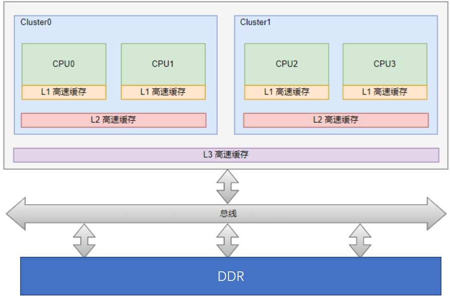
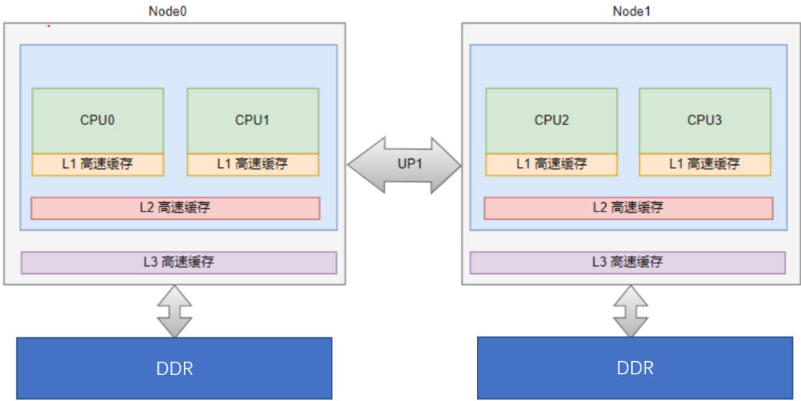
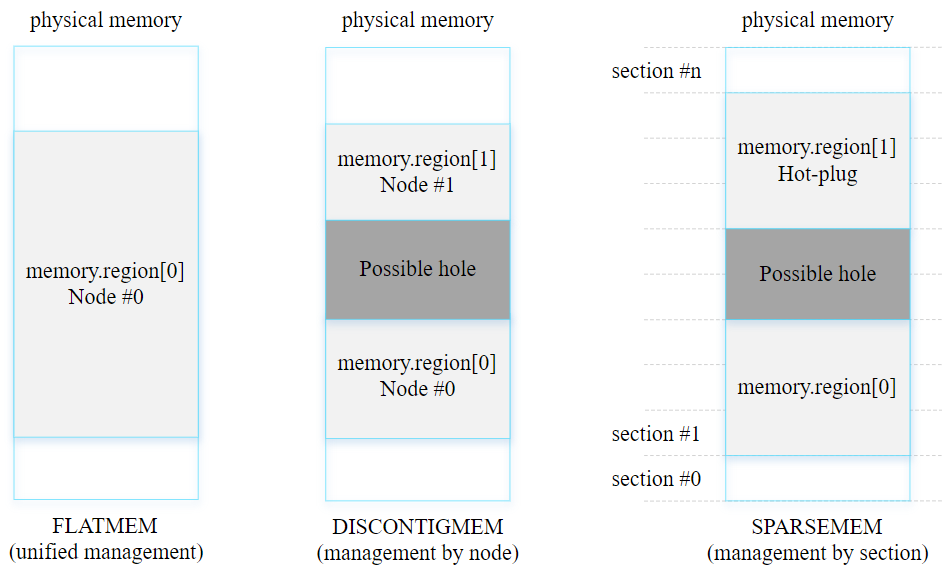
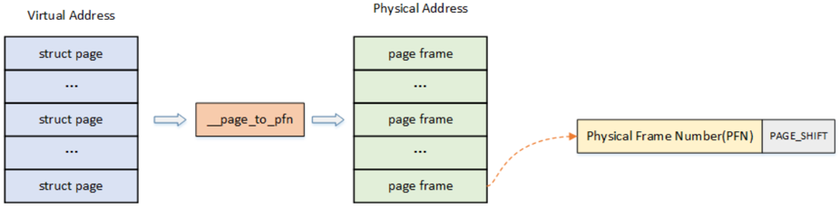
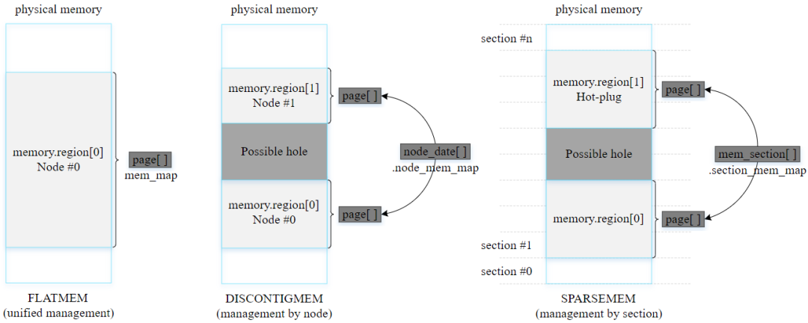
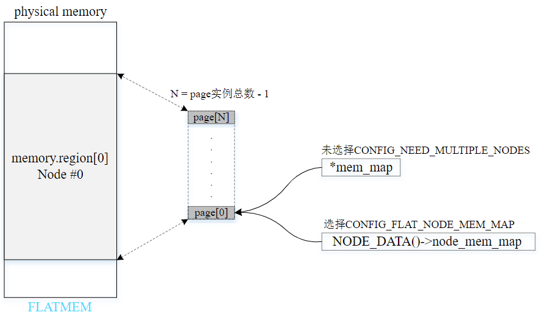
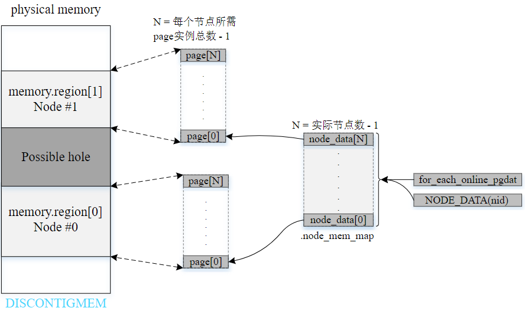
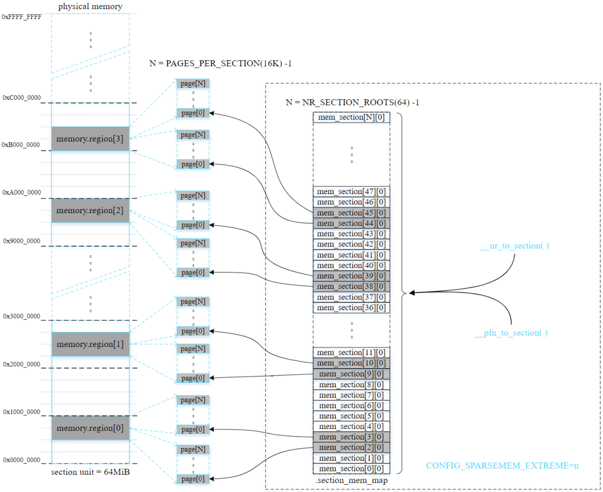
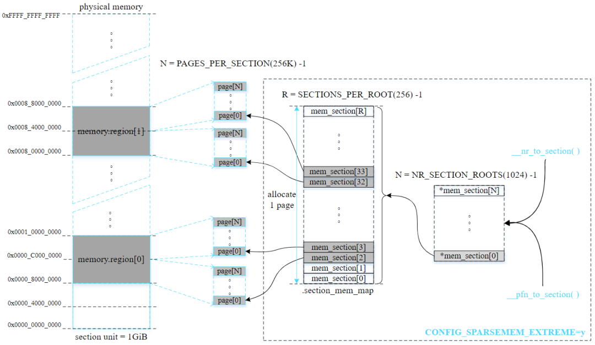

内存架构和linux物理内存模型
===========================

内存架构
------------

现行的内存架构主要是以下两种:

- UMA: Uniform Memory Access,所有处理器对内存的访问都是一致的

- NUMA: Non Uniform Memory Access,非一致性内存访问

linux内存模型
----------------

内核是以页为单位进行内存管理的，使用struct page结构体来进行管理，其封装了每页内存块的状态信息，比如使用信息、统计信息以及与其他
结构的关联映射信息等。

为了快速索引到具体的物理页，内核为每个物理页定义了一个索引编号(PFN)， PFN与struct page是一一对应关系。内核提供了两个宏来完成这两者的互相转换，
``page_to_pfn`` 和 ``pfn_to_page`` .

内核中如何组织管理这些物理内存页struct page的方式，我们称之为 ``物理内存模型`` ,不同的物理内存模型，应对的场景以及page_to_pfn与pfn_to_page的计算逻辑是不一样的

::

    /*
     * supports 3 memory models.
     */
    #if defined(CONFIG_FLATMEM)

    #define __pfn_to_page(pfn)  (mem_map + ((pfn) - ARCH_PFN_OFFSET))
    #define __page_to_pfn(page) ((unsigned long)((page) - mem_map) + \
                     ARCH_PFN_OFFSET)
    #elif defined(CONFIG_DISCONTIGMEM)

    #define __pfn_to_page(pfn)          \
    ({  unsigned long __pfn = (pfn);        \
        unsigned long __nid = arch_pfn_to_nid(__pfn);  \
        NODE_DATA(__nid)->node_mem_map + arch_local_page_offset(__pfn, __nid);\
    })

    #define __page_to_pfn(pg)                       \
    ({  const struct page *__pg = (pg);                 \
        struct pglist_data *__pgdat = NODE_DATA(page_to_nid(__pg)); \
        (unsigned long)(__pg - __pgdat->node_mem_map) +         \
         __pgdat->node_start_pfn;                   \
    })

    #elif defined(CONFIG_SPARSEMEM_VMEMMAP)

    /* memmap is virtually contiguous.  */
    #define __pfn_to_page(pfn)  (vmemmap + (pfn))
    #define __page_to_pfn(page) (unsigned long)((page) - vmemmap)

    #elif defined(CONFIG_SPARSEMEM)
    /*
     * Note: section's mem_map is encoded to reflect its start_pfn.
     * section[i].section_mem_map == mem_map's address - start_pfn;
     */
    #define __page_to_pfn(pg)                   \
    ({  const struct page *__pg = (pg);             \
        int __sec = page_to_section(__pg);          \
        (unsigned long)(__pg - __section_mem_map_addr(__nr_to_section(__sec))); \
    })

    #define __pfn_to_page(pfn)              \
    ({  unsigned long __pfn = (pfn);            \
        struct mem_section *__sec = __pfn_to_section(__pfn);    \
        __section_mem_map_addr(__sec) + __pfn;      \
    })
    #endif /* CONFIG_FLATMEM/DISCONTIGMEM/SPARSEMEM */

linux目前支持三种内存模型(include/asm-generic/memory_model.h): ``PLATMEM`` , ``DISCONTIGMEM`` , ``SPARSEMEM`` .某些体系架构支持
多种内存模型，但在内核编译构建时只能选择使用一种内存模型

下面分别讨论每种内存模型的特点：

- PLATMEM(平坦内存模型)

  - 内存连续且不存在空隙

  - 在大多数情况下，应用于UMA系统

- DISCONTIGMEM(不连续内存模型)

  - 多个内存节点不连续且存在空隙(hole)

  - 适用于UMA系统和NUMA系统

  - ARM在2010年已移除对DISCONTIGMEM内存模型的支持

- SPARSEMEM(稀疏内存模型)

  - 多个内存区域不连续且存在空隙

  - 支持内存热插拔[hot-plug memory]，但性能略逊于DISCONTIGMEM

  - 在x86或ARM64内核采用了最近实现的SPARSEMEM_VMEMMAP变种，其性能比DISCONTIGMEM更优并且与PLATMEM相当

  - 对于ARM64内核，默认选择SPARSEMEM内存模型

  - 以section为单位管理online和hot-plug内存

linux内存映射
---------------

系统中对内存的管理是以页为单位的:

- page: 线性地址被分成以固定长度为单位的组，称为页，页内部连续的线性地址被映射到连续的物理地址中

- page frame: 内存被分成固定长度的存储区域，称为页框，也叫物理页．每一个页框会包含一个页，页框的长度和一个页的长度是一致的，在内核中使用struct page来关联物理页

管理内存映射的方式取决于选用的内存模型

平坦内存模型(flat memory model)的内存映射管理
^^^^^^^^^^^^^^^^^^^^^^^^^^^^^^^^^^^^^^^^^^^^^^^

在平坦内存模型中，毗邻连续的排列所有页帧描述符，全局指针变量mem_map指向首个页帧描述符．同时结构体变量config_page_data的node_mem_map成员
也指向第一个页帧描述符

不连续内存模型(discontiguous memory model)的内存映射管理
^^^^^^^^^^^^^^^^^^^^^^^^^^^^^^^^^^^^^^^^^^^^^^^^^^^^^^^^^^^^

非连续内存模型由多个内存节点组成，每个节点的页帧数决定了页帧描述符的数量．通过node_data数据获取指定节点的实例，然后使用节点实例
的node_mem_map成员来管理每个节点的页帧描述符

稀疏内存模型(sparse memory model)的内存映射管理
^^^^^^^^^^^^^^^^^^^^^^^^^^^^^^^^^^^^^^^^^^^^^^^^^

稀疏内存模型以固定大小的单元统一管理分散的内存，易于内存管理．这个固定大小的单元被称为内存段(select). 通过这种方式划分整个物理地址空间
以及当前存在的内存．结构体struct mem_section管理一个section，并通过section_mem_map成员指向一个页帧描述符数组(page 数组)，数组元素数量
为PAGES_PER_SECTION．在稀疏内存模型中，section是最小的单元，其大小从几十MB到几GB不等，用于管理online/offline(热插拔)内存.　目前存在两种方法
用于管理不同数量的section

- CONFIG_SPARSEMEM_STATIC: 大多数32位系统和section数量不多的情况会利用这种方法管理内存．在编译时就能确定section数量

- CONFIG_SPARSEMEM_EXTREME(ARM64默认启用): 大多数64位系统和section数量较多的情况下会利用这种方法管理内存．如果内存中存在较大的空隙，使用两级
  section管理数组能减少内存的浪费．在初始化时创建第一级管理数组

CONFIG_SPARSEMEM_STATIC配置选项例子

CONFIG_SPARSEMEM_EXTREME配置选项例子

