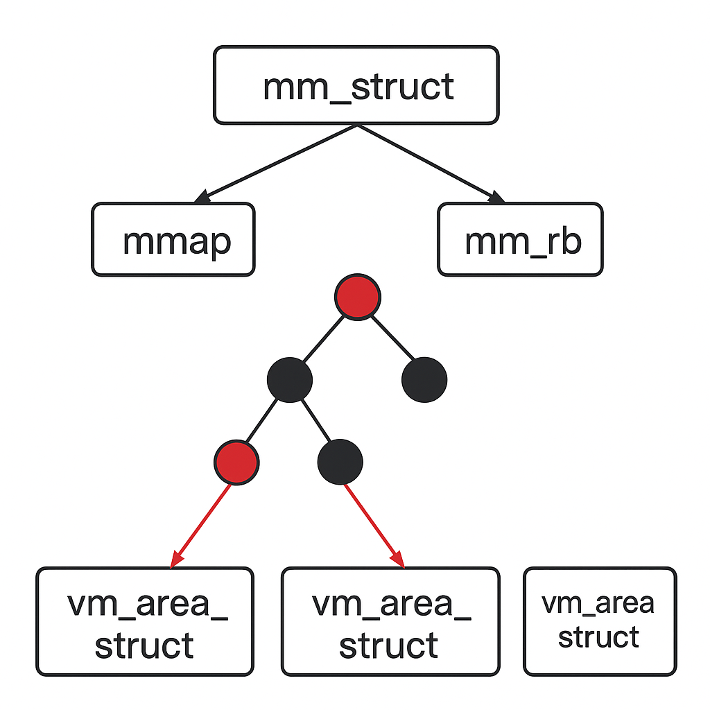

内存管理预备知识问答
=====================

- 简述内存架构中的UMA和NUMA的区别

UMA中所有CPU/核心共享同一块物理内存，每个CPU访问任意地址的延迟和带宽基本相同(访问均匀)。适合单路CPU或小规模对称多处理器(SMP),多个CPU同时访问时
容易产生内存带宽瓶颈。

NUMA中每个CPU插槽都有自己的本地内存，访问本地内存延迟低，访问远端节点内存需要跨互联总线，延迟高。主要应用于多路服务器，大规模多核。

- 请绘制内存管理常用的数据结构的关系图。如mm_struct、VMA、vaddr、page、PFN、PTE、zone、paddr和pg_data等，并思考如下转换关系。

TODO

- 如何由mm_struct和vaddr找到对应的VMA？

内核中提供了对应 ``find_vma`` 函数去查找vaddr对应的vma区域

::

    struct vm_area_struct *find_vma(struct mm_struct *mm, unsigned long addr)
    {
        struct rb_node *rb_node;
        struct vm_area_struct *vma;

        //首先在高速缓存中查找是否由对应的vma存在
        vma = vmacache_find(mm, addr);
        if (likely(vma))
            return vma;

        //获取内存管理对应的红黑树
        rb_node = mm->mm_rb.rb_node;

        while (rb_node) {
            struct vm_area_struct *tmp;

            tmp = rb_entry(rb_node, struct vm_area_struct, vm_rb);
            //遍历红黑树查找addr落在的vma
            if (tmp->vm_end > addr) {
                vma = tmp;
                if (tmp->vm_start <= addr)
                    break;
                rb_node = rb_node->rb_left;
            } else
                rb_node = rb_node->rb_right;
        }

        if (vma)
            vmacache_update(addr, vma);
        return vma;
    }

- 如何由page和VMA找到vaddr

这个问题其实是 ``反向地址映射`` 在linux内核中的经典场景，已知某个物理页struct page和某个虚拟内存区域VMA，希望找到该物理页在VMA中对应的虚拟地址vaddr

1. 物理页转页框号, ``unsigned long pfn = page_to_pfn(page)`` , PFN = (物理地址 >> PAGE_SHIFT)

2. 通过VMA的vm_start 以及 vm_pgoff计算虚拟地址. 其中vm_start为VMA的起始虚拟地址，vm_pgoff为该VMA起始虚拟地址对应文件的页偏移

.. note::
    vma_pgoff = vma->vm_pgoff;
    vaddr = vma->vm_start + ((page_to_pfn(page) - vma_pgoff) << PAGE_SHIFT);

- 如何由page找到所有映射的VMA

linux内核中，一个page可能被多个进程映射(例如共享内存、mmap文件)，要找到所有映射它的VMA，通常依赖反向映射(Reverse Mapping, RMAP)机制

linux为了能从page--->vma建立联系，引入了RMAP，主要有两种

1. 匿名页(anonymous page)，每个vma有一个anon_vma指针，anon_vma里维护了一个链表，记录了哪些VMA引用了这类匿名页

2. 文件页(fil-backed page), page的mapping指向address_space, 通过struct address_space---->i_mmap(红黑树/链表)，能找到所有映射该页的VMA

对于匿名页查找过程如下，struct page --> page->mapping(anon_vma), 遍历anon_vma_chain链表，得到所有的vma,并计算对应的虚拟地址

文件页的查找过程如下，struct page --> page->mapping(address_space), 在mapping->i_mmap红黑树中查找

- 如何由VMA和vaddr找出相应的page数据结构？

::

    vaddr -> PGD -> P4D -> PUD -> PMD -> PTE -> struct page

    pgd_t *pgd = pgd_offset(vma->vm_mm, vaddr);
    p4d_t *p4d = p4d_offset(pgd, vaddr);
    pud_t *pud = pud_offset(p4d, vaddr);
    pmd_t *pmd = pmd_offset(pud, vaddr);
    pte_t *pte = pte_offset_map(pmd, vaddr);

    pfn_t pfn = pte_pfn(*pte);
    struct page *page = pfn_to_page(pfn);

- page/PFN/paddr/PTE/zone/pg_data之间如何互换

::

    #PFN本质上是物理页帧号 = paddr >> PAGE_SHIFT
    struct page *page = pfn_to_page(pfn)
    unsigned long pfn = page_to_pfn(page)

    phys_addr_t paddr = (phys_addr_t)pfn << PAGE_SHIFT
    unsigned long pfn = paddr >> PAGE_SHIFT

    pte_t pte = pfn_pte(page_to_pfn(page), prot);   //prot: 页表权限
    struct page *page = pfn_to_page(pte_pfn(pte));

    struct zone *z = page_zone(page);

    struct pglist_data *pgdat = zone->zone_pgdat;
    struct zone *z = &pgdat->node_zones[i];     //i = ZONE_DMA / ZONE_NORMAL / ZONE_HIGHMEM

