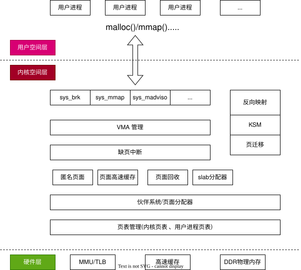
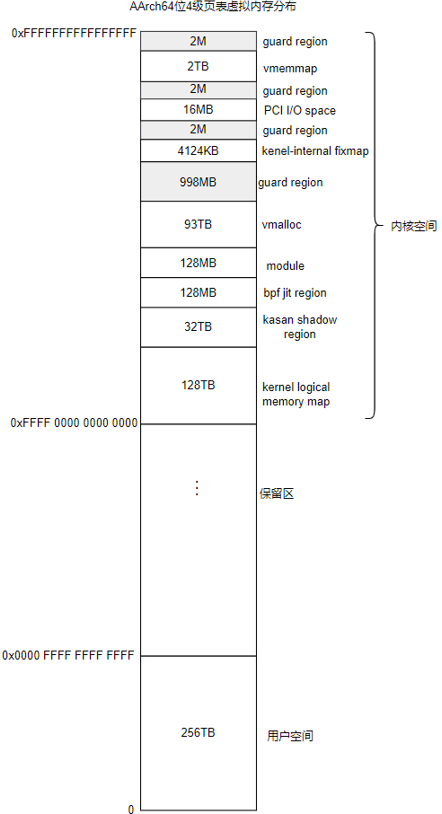
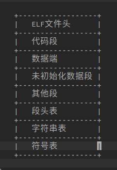
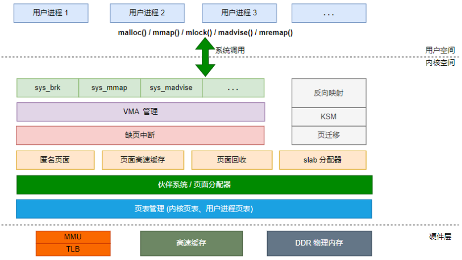

linux內存管理概述
======================

linux内核中内存管理是一个复杂而重要的子系统，负责管理系统中的物理内存和虚拟内存，包括内存的分配，释放，映射，页表管理等功能．
下面是对内存管理的一些核心概念的解释

- 物理内存管理: 它包括对物理页面的分配和释放，以及维护物理页面的状态和属性

- 虚拟内存管理: 它通过页表映射将虚拟地址映射到物理地址，以实现地址的隔离和虚拟内存的抽象

- 页表管理: 页表管理是虚拟内存管理的核心，它负责建立和维护虚拟地址与物理地址之间的映射关系．内核会维护一组页表，包括顶级页表，中间级页表
  和页表项,用于管理不同级别的地址映射

- 内存分配器: 内核中的内存分配器负责动态分配和释放内存块，以满足系统和应用程序的内存需求．常见的内存分配器包括SLAB分配器，SLUB分配器和SLOB分配器

- 虚拟内存区域: 虚拟内存区域用于管理连续的虚拟地址空间，并提供了不同属性和访问权限的内存区域．每个虚拟内存区域由起始地址，大小，属性标志等信息定义

- 内存映射: 内存映射是将文件或设备的内容映射到进程的虚拟地址空间，使得可以通过内存访问的方式来读取和写入文件或设备．

- 内存回收: 内存回收是值在系统中不再使用的内存资源时，将其释放回内存池以供其他进程或系统使用．内核会使用一定的策略和算法来回收空闲的物理内存页面

::

    +---------------------------------------+
    |                PGD                    |
    |                                       |
    |          +------------------------+   |
    |          |          PUD           |   |
    |          |                        |   |
    |          |   +----------------+   |   |
    |          |   |      PMD       |   |   |
    |          |   |                |   |   |
    |          |   |   +--------+   |   |   |
    |          |   |   |   PT   |   |   |   |
    |          |   |   +--------+   |   |   |
    |          |   |                |   |   |
    |          |   +----------------+   |   |
    |          |                        |   |
    |          +------------------------+   |
    |                                       |
    +---------------------------------------+

在上述拓扑图中，PGD 是最顶层的页表目录，每个 PGD 条目指向一个 PUD 表。PUD 是第二级的页表目录，每个 PUD 条目指向一个 PMD 表。PMD 是第三级的页表目录，每个 PMD 条目指向一个 PT 表。

PT 是最底层的页表，用于存储页表项。每个 PT 条目对应一个物理页面。

linux内存分布
===================== 

虚拟内存
------------

最初的操作系统并没有那么完善，开始的时候程序是直接装载到物理内存中的，这就导致了下面的一些问题

- 程序编写困难: 操作系统是同时运行好多程序的，编写的程序如果直接操作物理内存的话，需要考虑程序操作的内存地址是否已经被其他程序占用

- 修改内存数据导致程序崩溃: 一个应用程序可以访问所有的物理内存，如果一个应用程序恶意修改其他应用程序的内存地址的话，可能导致其他程序崩溃
  

虚拟内存概念的出现解决了上面的问题，应用程序不再直接操作物理内存，对每个应用程序来说，他们相当于拥有了所有的内存空间．

每个进程都拥有自己的虚拟内存地址，不用的硬件对应不用的虚拟内存

对于32位的处理器x86来说，每个进程可以拥有4G的虚拟内存，其中

- 0x08048000~0xBFFFFFFF(3G大小，最低的128M内存没用)表示用户空间

- 0xC0000000~0xFFFFFFFF(1G)表示内核空间

对于64位的处理器来说，一般会保留48位的虚拟内存，大概是256TB的虚拟内存空间

上图为4级页表下的虚拟地址分布

从进程的角度看内存分配
------------------------

在linux系统中，应用程序通常采用ELF格式，ELF结构图如下图所示

程序在编译，链接时会尽量把相同权限属性的段分配在同一空间里，如把可读，可执行的段放在一起，包括代码段，init段．
把可读可写的段放在一起，包括数据段和未初始化的数据段等．ELF把这些属性相似并链接在一起的段叫做分段．进程在加载时按照
这些分段来映射可执行文件的

linux操作系统提供了proc文件系统来窥探linux内核的执行情况，每个进程在执行之后，在/proc/pid/maps节点会列出当前进程的地址映射情况

从内核角度看内存分配
----------------------

