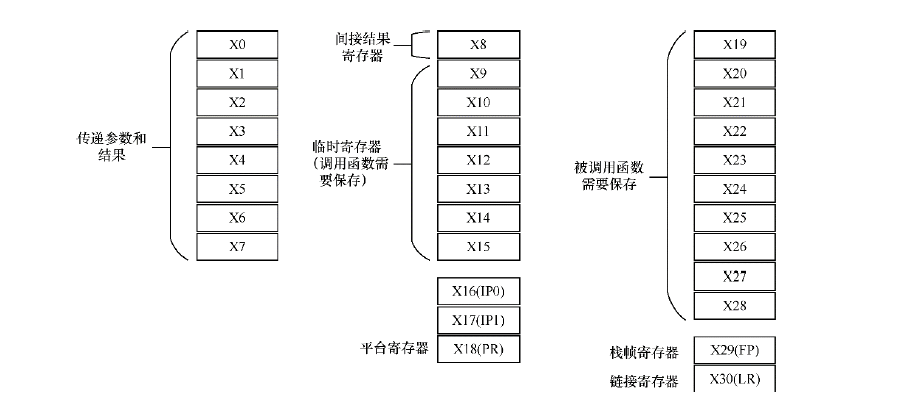
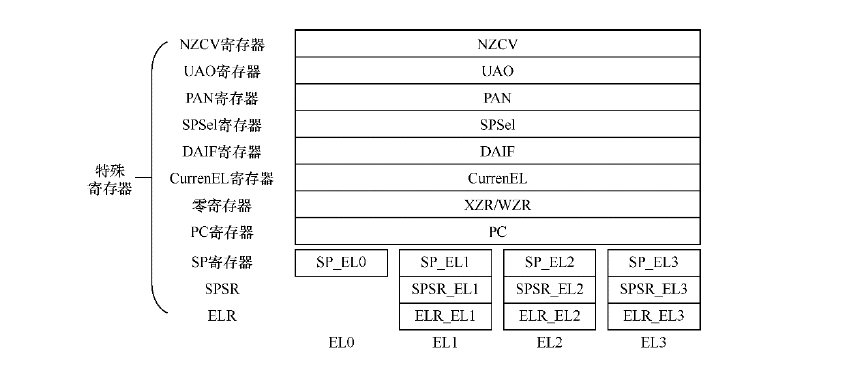
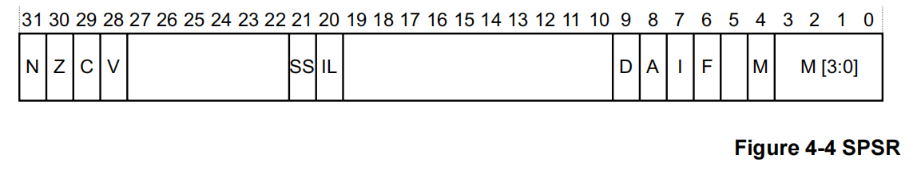
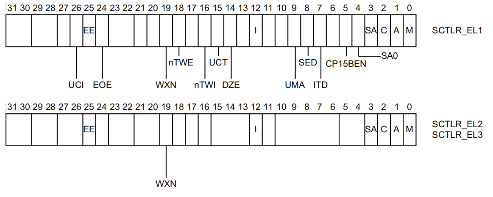

arm64寄存器
===============

通用寄存器
----------------

arm64提供了32个在任何时间任何特权级下都可以访问的64位通用寄存器， 他们通常被称为寄存器X0~X30

======================== ==================================================================================================
    寄存器                          描述
------------------------ --------------------------------------------------------------------------------------------------
 X30(LR)                    链接寄存器(函数返回地址)
 X29(FP寄存器)              栈帧指针寄存器
 X19~X28                    被调用函数保存的寄存器，在子函数使用时需要保存到栈中
 X18                        平台寄存器
 X17                        临时寄存器或者第二个IPC(Intra-Procedure-Call)临时寄存器
 X16                        临时寄存器或者第一个IPC临时寄存器
 X9~X15                     临时寄存器
 X8                         间接结果位置寄存器，用于保存子程序的返回地址
 X0~X7                      用于传递子程序参数和结果，若参数个数大于8，就采用栈来传递。X0寄存器用于返回结果
======================== ==================================================================================================

.. note::
    每个异常级别都有自己的栈指针，SP_EL0, SP_EL1, SP_EL2, SP_EL3

特殊寄存器
---------------

- PC程序计数器: 指向当前运行指令的下一条指令的地址，用于控制程序中指令的运行顺序，但编程人员不能通过指令来直接访问它

- SP寄存器: 每个异常等级下都有一个专门的SP寄存器SP_ELn

- 异常链接寄存器(ELR): 保存异常返回地址

- 程序状态保存寄存器(SPSR): 当异常发生时，CPSR中的处理器状态佳能保存在相关的程序状态保存寄存器(SPSR)中， SPSR保存着异常发生之前的PSTATE的值，
  用于异常返回时恢复PSTATE的值

.. note::
   - N: 负数标志位，如果为负数则N=1  
   - Z: 零标志位，如果结果为零，则Z=1
   - C: 进位标志位
   - V: 溢出标志位
   - SS: 软件步进标志位，表示一个异常发生时，软件步进是否开启
   - IL: 非法执行状态位
   - D: 程序状态调试掩码，在异常发生时的异常级别下，来自监视点、断点和软件单步调试事件中的调试异常是否被屏蔽
   - A: SError(系统错误)掩码位
   - I: IRQ掩码位
   - F: FIQ掩码位
   - M: 异常发生时的执行状态，0表示aarch64
   - M[3:0]: 异常发生时的异常级别

- 处理器状态寄存器(PSTATE): 保存处理器的状态信息，包括条件标志、异常级别、IRQ使能状态等

::

    | 31       | 30 | 29  | 28   | 27    | 26 | 25 | 24 | 23-22 | 21-20 | 19-16 | 15-10    | 9-8 | 7-6  | 5-4  | 3-0 |
    |----------|----|-----|------|-------|----|----|----|-------|-------|-------|----------|-----|------|------|-----|
    | Reserved |PAN | DIT | SSBS | IL    | A  | I  | F  |   M   | T     | E     | Reserved | S   | M    | V    | C   |

.. note::
    - PAN: 该位控制是否允许在特权界别下访问某些内存区域，PAN=1时，禁止在特权模式下访问用户空间内存区域
    - DIT: 禁用中断控制位
    - SSBS: 控制是否禁用规范存储绕过
    - IL: 标志指令的长度，arm64中可以使用32位及64位长度指令
    - A: 是否能够响应一步中断
    - I: 是否禁用IRQ
    - F: 是否禁用FIQ
    - M: 指示当前处理器异常级别
    - T: 指示是否在thumb模式下执行指令，arm处理器支持arm和thumb两种指令集架构
    - E: 存储当前处理器状态下的异常标志
    - S: 用于控制堆栈指针对齐检查
    - M: 指示当前处理器的工作模式
    - V: 指示是否启用了向量处理器
    - C: 表示条件标志，包括零标志、负标志

- 系统控制寄存器(SCTLR): 用来控制标准内存、配置系统能力、提供处理器核状态信息的寄存器

 
.. note::
    - UCI: 设置此位后，在arm64中DC CVAU, DC CIVAC, DC CVAC和IC IVAU指令启用EL0访问
    - EE： 异常字节序，0小端， 1大端
    - EOE: EL0显示数据访问的字节序
    - WXN: 写权限不可执行，0可写区域不设置不可执行权限，1可写区域强制为不可执行
    - nTWE: 不陷入WFE, 1表示WFE作为普通指令执行
    - nTWI: 不陷入WFI, 1表示WFI作为普通指令执行
    - UCT: 开启arm64的EL0访问CTR_EL0寄存器
    - DNE: EL0下访问DC AVA指令，0禁止执行
    - I: 开启指令缓存
    - UMA: 用户屏蔽访问，控制从EL0的中断屏蔽访问
    - SED: 禁止SETEND, 在EL0使用aarch32精致SETEND指令， 0使能，1禁止
    - ITD: 禁止IT指令
    - CP15BEN: CP15 barrier使能
    - SA0: EL0栈对齐检查使能位
    - C: 数据cache使能
    - A: 对齐检查使能位
    - M: 使能MMU

