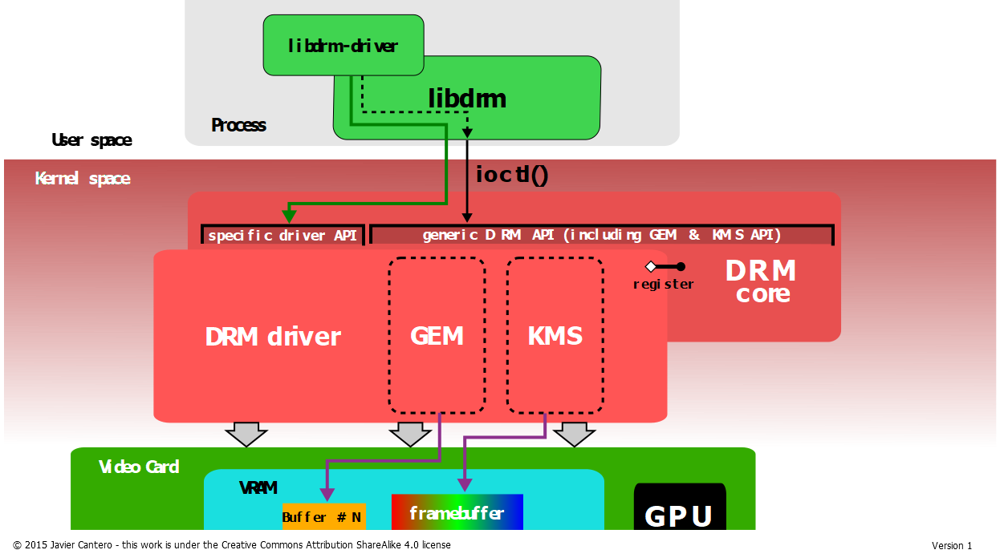
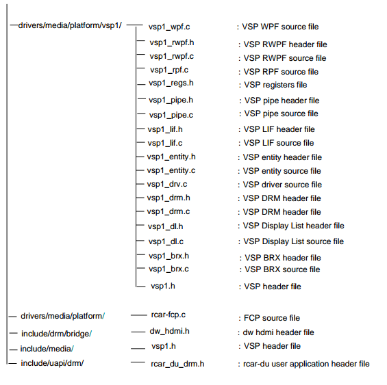
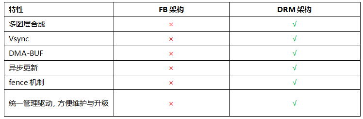
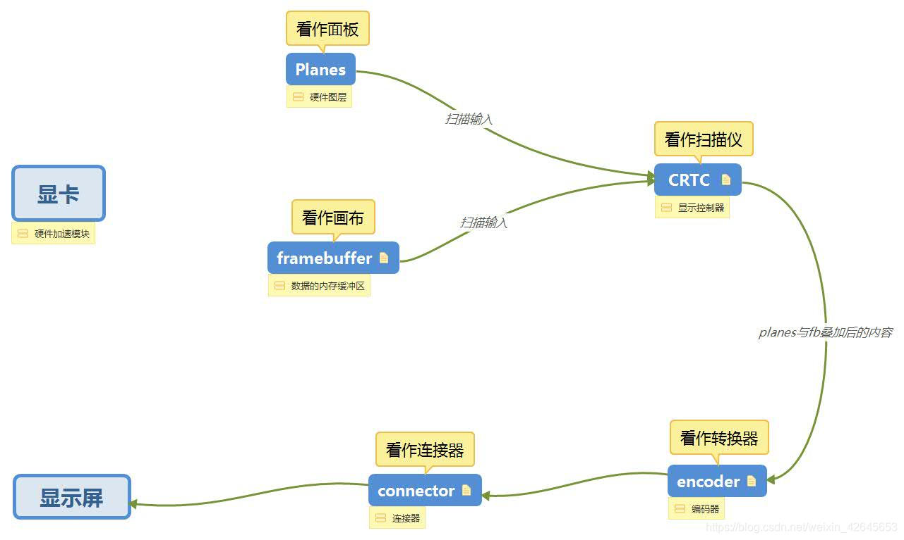

DRM框架
==========

DRM主要分为KMS和Render两大部分,从功能上讲KMS负责搭建显示控制器的pipeline,并控制显示硬件将图像缓冲区scanout到屏幕上,而如何加速生成framebuffer中的内容则是
3D引擎(即Render)负责的事情.

DRM在源码中的分布

.. image::
    res/kernel_drm_source_1.png

内核中的内容:

- DRM驱动通用代码:包括GEM,KMS

用户态代码:

- MESA: OpenGL state tracker, egl, gbm

- libdrm:基本为内核提供的IOCTL的wrapper

drm与fb框架对比

KMS
-----

KMS全称是kernel mode setting,这里的mode是指显示控制器的mode.

其实KMS主要做了两件事: ``更新画面`` 和 ``设置显示参数``

- 更新画面: 显示buffer的切换，多图层的合成方式，以及每个图层的显示位置

- 设置显示参数: 包括分辨率、刷新率、电源状态(休眠唤醒)等

KMS将整个显示控制器的显示pipeline抽象成以下几个部分:

- plane : 硬件图层，有的display硬件支持多层合成显示，但所有的display controller至少要有一个plane

- crtc : 显示控制器,产生时序信号的硬件模块，主要用于显示控制(如显示时序、分辨率、刷新率等)例如在RCAR-V3H中对应SOC内部的DU模块

- encoder : 负责将CRTC输出的timing时序转换成外部设备所需要的信号的模块,如HDMI转换器或DSI Controller

- connector : 连接物理显示设备的连接器，如HDMI, DSI总线，通常和Encoder驱动绑定在一起

- Bridge : 桥接设备,一般用户注册encoder后面另外连接的转换芯片,比如DSI2HDMI转换芯片

- Panel : 泛指LCD\HDMI等显示设备的抽象

- Fb: Framebuffer,单个图层的显示内容，惟一一个和硬件无关的基本元素

- VBLANK: 软件和硬件的同步机制，时序中的垂直消隐区，软件通常使用硬件VSYNC来实现

这些组件组合成display pipeline:

.. image::
    res/drm_pipeline.png

对象管理
-------------

对上面几个部分,DRM框架将其称作对象,有一个公共的基类 ``struct drm_mode_object`` 

::

    struct drm_mode_object {
        uint32_t id;
        uint32_t type;
        struct drm_object_properties *properties;
        struct kref refcount;
        void (*free_cb)(struct kref *kref);
    };

    struct drm_plane {
        ...
        struct drm_mode_object base;
        ...
    };

    struct drm_crtc {
        ...
        struct drm_mode_object base;
        ...
    };

    struct drm_encoder {
        ...
        struct drm_mode_object base;
        ...
    };

    struct drm_connector {
        ...
        struct drm_mode_object base;
        ...
    };

其中id和type分别为这个对象在KMS子系统中的ID和类型（即上面提到的几种）.当前DRM框架中存在如下的对象类型

::

    #define DRM_MODE_OBJECT_CRTC 0xcccccccc 
    #define DRM_MODE_OBJECT_CONNECTOR 0xc0c0c0c0 
    #define DRM_MODE_OBJECT_ENCODER 0xe0e0e0e0 
    #define DRM_MODE_OBJECT_MODE 0xdededede 
    #define DRM_MODE_OBJECT_PROPERTY 0xb0b0b0b0 
    #define DRM_MODE_OBJECT_FB 0xfbfbfbfb 
    #define DRM_MODE_OBJECT_BLOB 0xbbbbbbbb 
    #define DRM_MODE_OBJECT_PLANE 0xeeeeeeee 
    #define DRM_MODE_OBJECT_ANY 0

``drm_mode_object`` 的id共用一个namespace，保存在 ``drm_device->mode_config.object_idr`` 中。因此，框架中提供了
 ``drm_mode_object_find`` 函数用于查找对应id的对象。

drm_mode_object定义了两个比较重要的功能

- 引用计数及生命周期管理

- 属性管理

属性在DRM中由 ``struct drm_object_properties`` 中表示, 其本质是一个 ``DRM_MODE_OBJECT_PROPERTY`` 类型的 ``drm_mode_object``

::

    struct drm_property {
        ...
        struct drm_mode_object base;
        ...
    };

    struct drm_object_properties {
        int count;
        struct drm_property *properties[DRM_OBJECT_MAX_PROPERTY];
        uint64_t values[DRM_OBJECT_MAX_PROPERTY];
    };

可以看到每一个对象最多可以有24个属性，

helper架构
-------------

DRM驱动核心的接口使用了helper架构，其基本思想是通过一组回调函数抽象特定组件的操作，比如 ``drm_connector_funcs`` ,
同时又实用另外一组helper函数给出了原先那组回调函数的通用实现，让开发者实现这组helper函数抽象出的回调函数即可。

驱动入口
-------------

drm_device用于抽象一个完整的DRM设备,而其中与Mode Setting相关的部分则有drm_mode_config进行管理.为了让一个drm_device支持KMS相关的API,DRM框架要求驱动:

- 注册drm_driver时,driver_feature标志中需要存在DRIVER_MODESET

- 在probe函数中调用drm_mode_config_init函数初始化KMS框架,本质上是初始化drm_device中的mode_config结构体

- 填充mode_config中int min_width,min_height; int max_width,max_height;的值,这些值是framebuffer的大小限制

- 设置mode_config->funcs指针,本质上是一组由驱动实现的回调函数,涵盖KMS中一些相当基本的操作

- 最后初始化drm_device中包含的drm_connector,drm_crtc等对象

驱动程序填充file_operations结构体

::

    #define DEFINE_DRM_GEM_CMA_FOPS(name) \
        static const struct file_operations name = {\
            .owner		= THIS_MODULE,\
            .open		= drm_open,\
            .release	= drm_release,\
            .unlocked_ioctl	= drm_ioctl,\
            .compat_ioctl	= drm_compat_ioctl,\
            .poll		= drm_poll,\
            .read		= drm_read,\
            .llseek		= noop_llseek,\
            .mmap		= drm_gem_cma_mmap,\
            DRM_GEM_CMA_UNMAPPED_AREA_FOPS \
        }

Framebuffer
^^^^^^^^^^^^

framebuffer应该是唯一一个与硬件无关的抽象了.驱动程序需要提供自己的framebuffer实现,其主要入口就是前面提到的 ``drm_mode_config_funcs->fb_create回调函数.
fb_create`` 函数接受一个drm_mode_fb_cmd2类型的参数

::

    static const struct drm_mode_config_funcs rcar_du_mode_config_funcs = {
        .fb_create = rcar_du_fb_create,
        .atomic_check = rcar_du_atomic_check,
        .atomic_commit = drm_atomic_helper_commit,
    };

    struct drm_mode_fb_cmd2 {
            __u32 fb_id;
            __u32 width;
            __u32 height;
            __u32 pixel_format; /* fourcc code from drm_fourcc.h */
            __u32 flags; /* see above flags */
            __u32 handles[4];
            __u32 pitches[4]; /* pitch for each plane */
            __u32 offsets[4]; /* offset of each plane */
            __u64 modifier[4]; /* ie, tiling, compress */
    };

其中最重要的就是handle, handle是buffer object的指针

Plane
^^^^^^^^

plane由 ``drm_plane`` 表示,其本质是对显示控制器中scanout硬件的抽象,简单来说,给定一个plane可以让其与一个framebuffer关联表示进行scanout的数据.同时控制scanout时进行
额外的操作,比如colorspace的改变,旋转,拉伸等操作.drm_plane是与硬件强相关的,显示控制器支持的plane是固定的,其支持的功能也是由硬件决定的.

一个plane必须要与一个 ``drm_device`` 关联,且一个drm_device支持的所有plane都被保存在一个链表中,drm_plane中存有一个mask,用以表示该drm_plane可以绑定的CRTC,同时drm_plane中
也保存了一个formate_type数组,用以表示该plane支持的framebuffer格式

所有的drm_plane必为以下三种类型之一:

- Primary : 主plane,一般控制整个显示器的输出,CRTC必须要有一个这样的plane

- Curosr : 表示鼠标光标,可选

- Overlay : 叠加plane,可以在主plane上叠加一层输出,可选

CRTC
^^^^^

阴级摄像管上下文(显示控制器)，也可以理解为扫描仪(对显示buffer进行扫描，并产生时序信号的硬件模块). CRTC对内连接Framebuffer地址，对外连接Encoder, 会扫描Framebuffer上的内容，
叠加上Planes的内容，最后传给Encoder. 

.. image::
    res/crtc_sample.png

Encoder
^^^^^^^^

简单来说mode是一组信号时序，用以驱动显示器正确显示一帧图像

::

	 *               Active                 Front           Sync           Back
	 *              Region                 Porch                          Porch
	 *     <-----------------------><----------------><-------------><-------------->
	 *       //////////////////////|
	 *      ////////////////////// |
	 *     //////////////////////  |..................               ................
	 *                                                _______________
	 *     <----- [hv]display ----->
	 *     <------------- [hv]sync_start ------------>
	 *     <--------------------- [hv]sync_end --------------------->
	 *     <-------------------------------- [hv]total ----------------------------->*

上面内核注释中的字符画完美的解释了 ``drm_display_mode`` 中变量的定义。

编码器/输出转换器，负责将CRTC输出的timing时序转换成外部设备所需要的信号的模块。它的作用就是将内存的pixel像素编码为显示器所需要的信号(因为画面显示到不同的设备上，所需要的电信号
是不同的), 如RGB, LVDS, DSI, eDP, HDMI等显示接口。另外Encoder与CRTC之间的交互就是我们所说的ModeSetting, 其中还包含了前面提到的色彩模式、时序

Connector
^^^^^^^^^

connector抽象的是一个能够显示像素的设备,由struct drm_connector进行表示

::

	struct drm_connector {
        /** @dev: parent DRM device */
        struct drm_device *dev;
        /** @kdev: kernel device for sysfs attributes */
        struct device *kdev;
        /** @attr: sysfs attributes */
        struct device_attribute *attr;
		.......	

从以上部分可以看出，struct drm_connector是sysfs树形结构的一员，也就是说drm_connector对象会对应 ``/sys`` 目录下的某个
子文件夹(节点). 

connector代码层面的作用

- 获取上报热插拔状态

- 读取并解析屏的EDID信息

事件传递
------------

DRM可以异步的向用户态发送事件，最为常见的是Page Flip完成事件和vblank事件，但也可以是其他通用的事件。由于涉及用户态，
那么相关定义肯定在 ``uapi`` 中， ``include/uapi/drm/drm.h``

事件本身通过文件描述符的read操作传递，所有事件都有一个公共的header

::

	struct drm_event {
		__u32 type;
		__u32 length;
	};

0-0x7FFFFFFF事件类型为通用的DRM事件，目前只看到三个定义，而超过0x80000000的事件则为设备特定的

::

	#define DRM_EVENT_VBLANK	0x01
	#define DRM_EVENT_FLIP_COMPLETE	0x02
	#define DRM_EVENT_CRTC_SEQUENCE	0x03

