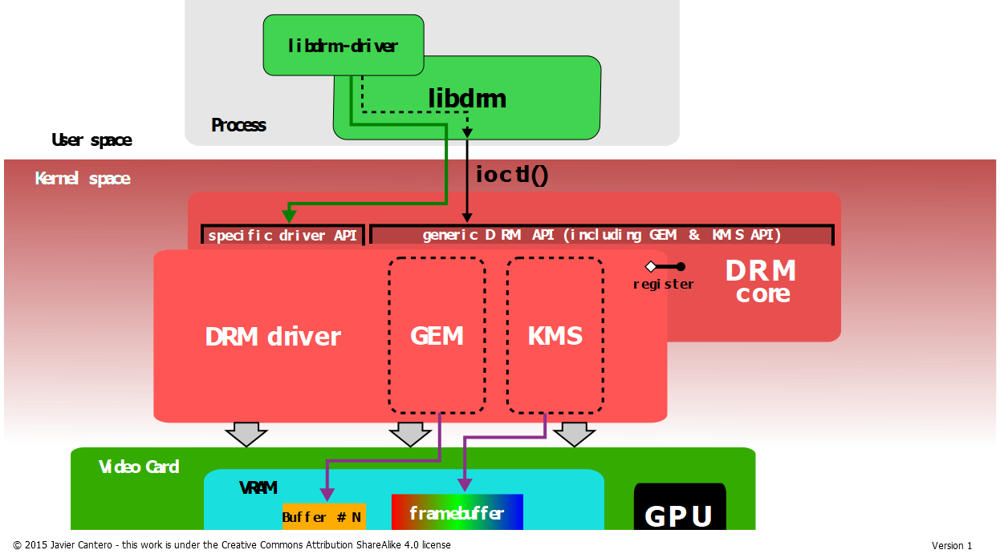
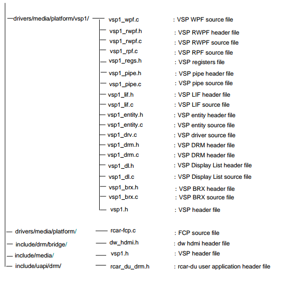

DRM框架
==========

DRM主要分为KMS和Render两大部分,从功能上讲KMS负责搭建显示控制器的pipeline,并控制显示硬件将图像缓冲区scanout到屏幕上,而如何加速生成framebuffer中的内容则是
3D引擎(即Render)负责的事情.

DRM在源码中的分布

内核中的内容:

- DRM驱动通用代码:包括GEM,KMS

用户态代码:

- MESA: OpenGL state tracker, egl, gbm

- libdrm:基本为内核提供的IOCTL的wrapper

KMS
-----

KMS全称是kernel mode setting,这里的mode是指限制控制器的mode.

KMS将整个显示控制器的显示pipeline抽象成以下几个部分:

- plane : 硬件图层，有的display硬件支持多层合成显示，但所有的display controller至少要有一个plane

- crtc : 显示控制器,产生时序信号的硬件模块，例如在RCAR-V3H中对应SOC内部的DU模块

- encoder : 负责将CRTC输出的timing时序转换成外部设备所需要的信号的模块,如HDMI转换器或DSI Controller

- connector : 连接物理显示设备的连接器，如HDMI, DSI总线，通常和Encoder驱动绑定在一起

- Bridge : 桥接设备,一般用户注册encoder后面另外连接的转换芯片,比如DSI2HDMI转换芯片

- Panel : 泛指LCD\HDMI等显示设备的抽象

- Fb: Framebuffer,单个图层的显示内容，惟一一个和硬件无关的基本元素

- VBLANK: 软件和硬件的同步机制，时序中的垂直消隐区，软件通常使用硬件VSYNC来实现

这些组件组合成display pipeline:

对象管理
^^^^^^^^^^^

对上面几个部分,DRM框架将其称作对象,有一个公共的基类 ``struct drm_mode_object`` 

::

    struct drm_mode_object {
        uint32_t id;
        uint32_t type;
        struct drm_object_properties *properties;
        struct kref refcount;
        void (*free_cb)(struct kref *kref);
    };

其中id和type分别为这个对象在KMS子系统中的ID和类型（即上面提到的几种）.当前DRM框架中存在如下的对象类型

::

    #define DRM_MODE_OBJECT_CRTC 0xcccccccc 
    #define DRM_MODE_OBJECT_CONNECTOR 0xc0c0c0c0 
    #define DRM_MODE_OBJECT_ENCODER 0xe0e0e0e0 
    #define DRM_MODE_OBJECT_MODE 0xdededede 
    #define DRM_MODE_OBJECT_PROPERTY 0xb0b0b0b0 
    #define DRM_MODE_OBJECT_FB 0xfbfbfbfb 
    #define DRM_MODE_OBJECT_BLOB 0xbbbbbbbb 
    #define DRM_MODE_OBJECT_PLANE 0xeeeeeeee 
    #define DRM_MODE_OBJECT_ANY 0

drm_mode_object定义了两个比较重要的功能

- 引用计数及生命周期管理

- 属性管理

属性在 struct drm_object_properties中表示

::

    struct drm_object_properties {
        int count;
        struct drm_property *properties[DRM_OBJECT_MAX_PROPERTY];
        uint64_t values[DRM_OBJECT_MAX_PROPERTY];
    };

驱动入口
^^^^^^^^^^^^

drm_device用于抽象一个完整的DRM设备,而其中与Mode Setting相关的部分则有drm_mode_config进行管理.为了让一个drm_device支持KMS相关的API,DRM框架要求驱动:

- 注册drm_driver时,driver_feature标志中需要存在DRIVER_MODESET

- 在probe函数中调用drm_mode_config_init函数初始化KMS框架,本质上是初始化drm_device中的mode_config结构体

- 填充mode_config中int min_width,min_height; int max_width,max_height;的值,这些值是framebuffer的大小限制

- 设置mode_config->funcs指针,本质上是一组由驱动实现的回调函数,涵盖KMS中一些相当基本的操作

- 最后初始化drm_device中包含的drm_connector,drm_crtc等对象

驱动程序填充file_operations结构体

::

    #define DEFINE_DRM_GEM_CMA_FOPS(name) \
        static const struct file_operations name = {\
            .owner		= THIS_MODULE,\
            .open		= drm_open,\
            .release	= drm_release,\
            .unlocked_ioctl	= drm_ioctl,\
            .compat_ioctl	= drm_compat_ioctl,\
            .poll		= drm_poll,\
            .read		= drm_read,\
            .llseek		= noop_llseek,\
            .mmap		= drm_gem_cma_mmap,\
            DRM_GEM_CMA_UNMAPPED_AREA_FOPS \
        }

CRTC
^^^^^

Framebuffer
^^^^^^^^^^^^

framebuffer应该是唯一一个与硬件无关的抽象了.驱动程序需要提供自己的framebuffer实现,其主要入口就是前面提到的drm_mode_config_funcs->fb_create回调函数.
fb_create函数接受一个drm_mode_fb_cmd2类型的参数

::

    struct drm_mode_fb_cmd2 {
            __u32 fb_id;
            __u32 width;
            __u32 height;
            __u32 pixel_format; /* fourcc code from drm_fourcc.h */
            __u32 flags; /* see above flags */
            __u32 handles[4];
            __u32 pitches[4]; /* pitch for each plane */
            __u32 offsets[4]; /* offset of each plane */
            __u64 modifier[4]; /* ie, tiling, compress */
    };

其中最重要的就是handle, handle是buffer object的指针

Plane
^^^^^^^^

plane由drm_plane表示,其本质是对显示控制器中scanout硬件的抽象,简单来说,给定一个plane可以让其与一个framebuffer关联表示进行scanout的数据.同时控制scanout时进行
额外的操作,比如colorspace的改变,旋转,拉伸等操作.drm_plane是与硬件强相关的,显示控制器支持的plane是固定的,其支持的功能也是由硬件决定的.

一个plane必须要与一个drm_device关联,且一个drm_device支持的所有plane都被保存在一个链表中,drm_plane中存有一个mask,用以表示该drm_plane可以绑定的CRTC,同时drm_plane中
也保存了一个formate_type数组,用以表示该plane支持的framebuffer格式

所有的drm_plane必为以下三种类型之一:

- Primary : 主plane,一般控制整个显示器的输出,CRTC必须要有一个这样的plane

- Curosr : 表示鼠标光标,可选

- Overlay : 叠加plane,可以在主plane上叠加一层输出,可选

Connector
^^^^^^^^^

connector抽象的是一个能够显示像素的设备,由struct drm_connector进行表示

