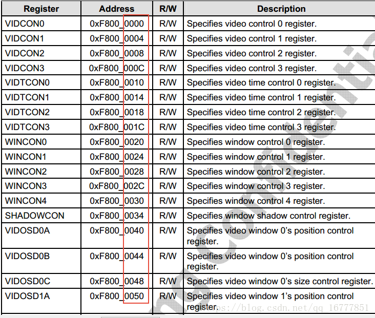

framebuffer驱动
=================

framebuffer驱动是基于platform平台总线创建的，主要分为两部分,一部分是操作接口和配置接口，称为driver。一部分是和显示器相关的一些时序，分辨率等一些参数，
称为device

下面以s3c的framebuffer进行分析

driver相关操作接口
-------------------

数据结构
^^^^^^^^^^^

::

	static struct platform_driver s3c_fb_driver = {
		.probe		= s3c_fb_probe,	//探针函数，主要用来映射资源，申请资源中断，初始化硬件，注册设备等
		.remove		= s3c_fb_remove,	//释放probe申请得资源
		.id_table	= s3c_fb_driver_ids,	//匹配规则中的一种
		.driver		= {
			.name	= "s3c-fb",	//按名称匹配
			.pm	= &s3cfb_pm_ops,	//电源管理相关
		},
	};
	module_platform_driver(s3c_fb_driver);

- id_table

::

	static const struct platform_device_id s3c_fb_driver_ids[] = {
		{
			.name		= "s3c-fb",
			.driver_data	= (unsigned long)&s3c_fb_data_64xx,
		}, {
			.name		= "s3c2443-fb",
			.driver_data	= (unsigned long)&s3c_fb_data_s3c2443,
		},
		{},
	};
	MODULE_DEVICE_TABLE(platform, s3c_fb_driver_ids);

- driver_data

::

	/* S3C2443/S3C2416 style hardware */
	static struct s3c_fb_driverdata s3c_fb_data_s3c2443 = {
		.variant = {
			.nr_windows	= 2,	//窗口数量
			.is_2443	= 1,

			.vidtcon	= 0x08,	//vidton0寄存器相对LCD首寄存器的偏移
			.wincon		= 0x14,
			.winmap		= 0xd0,
			.keycon		= 0xb0,
			.osd		= 0x28,
			.osd_stride	= 12,
			.buf_start	= 0x64,
			.buf_size	= 0x94,	//帧缓存大小寄存器
			.buf_end	= 0x7c,

			.palette = {
				[0] = 0x400,
				[1] = 0x800,
			},
			.has_clksel	= 1,
		},
		.win[0] = &(struct s3c_fb_win_variant) {
			.palette_sz	= 256,
			.valid_bpp	= VALID_BPP1248 | VALID_BPP(16) | VALID_BPP(24),
		},
		.win[1] = &(struct s3c_fb_win_variant) {
			.has_osd_c	= 1,
			.has_osd_alpha	= 1,
			.palette_sz	= 256,
			.valid_bpp	= (VALID_BPP1248 | VALID_BPP(16) |
					   VALID_BPP(18) | VALID_BPP(19) |
					   VALID_BPP(24) | VALID_BPP(25) |
					   VALID_BPP(28)),
		},
	};
	

fb_info参数
--------------

首先看几个时序相关的参数

    
probe函数
-----------

::

    
    static int s3c_fb_probe(struct platform_device *pdev)
    {
        const struct platform_device_id *platid;
        struct s3c_fb_driverdata *fbdrv;
        struct device *dev = &pdev->dev;
        struct s3c_fb_platdata *pd;
        struct s3c_fb *sfb;
        struct resource *res;
        int win;
        int ret = 0;
        u32 reg;

        platid = platform_get_device_id(pdev); //在id_table中根据.name得到driver_data
        fbdrv = (struct s3c_fb_driverdata *)platid->driver_data;

        if (fbdrv->variant.nr_windows > S3C_FB_MAX_WIN) {   //检测窗口数量是否超限
            dev_err(dev, "too many windows, cannot attach\n");
            return -EINVAL;
        }

        pd = dev_get_platdata(&pdev->dev);//得到设备数据
        if (!pd) {
            dev_err(dev, "no platform data specified\n");
            return -EINVAL;
        }

        sfb = devm_kzalloc(dev, sizeof(*sfb), GFP_KERNEL);
        if (!sfb)
            return -ENOMEM;

        dev_dbg(dev, "allocate new framebuffer %p\n", sfb);

        sfb->dev = dev; //把设备绑定到三星的fb中
        sfb->pdata = pd;    //把dev传过来的数据绑定到fb中
        sfb->variant = fbdrv->variant;  //可变参数绑定到fb中

        spin_lock_init(&sfb->slock);

        sfb->bus_clk = devm_clk_get(dev, "lcd");    //获取时钟
        if (IS_ERR(sfb->bus_clk)) {
            dev_err(dev, "failed to get bus clock\n");
            return PTR_ERR(sfb->bus_clk);
        }

        clk_prepare_enable(sfb->bus_clk);

        if (!sfb->variant.has_clksel) {
            sfb->lcd_clk = devm_clk_get(dev, "sclk_fimd");
            if (IS_ERR(sfb->lcd_clk)) {
                dev_err(dev, "failed to get lcd clock\n");
                ret = PTR_ERR(sfb->lcd_clk);
                goto err_bus_clk;
            }

            clk_prepare_enable(sfb->lcd_clk);
        }

        pm_runtime_enable(sfb->dev);    //电源管理开启

        res = platform_get_resource(pdev, IORESOURCE_MEM, 0);   //获取寄存器资源
        sfb->regs = devm_ioremap_resource(dev, res);    //映射寄存器资源
        if (IS_ERR(sfb->regs)) {
            ret = PTR_ERR(sfb->regs);
            goto err_lcd_clk;
        }

        res = platform_get_resource(pdev, IORESOURCE_IRQ, 0);   //获取中断资源
        if (!res) {
            dev_err(dev, "failed to acquire irq resource\n");
            ret = -ENOENT;
            goto err_lcd_clk;
        }
        sfb->irq_no = res->start;   //设置中断号到fb中
        ret = devm_request_irq(dev, sfb->irq_no, s3c_fb_irq,
                  0, "s3c_fb", sfb);    //绑定中断处理函数
        if (ret) {
            dev_err(dev, "irq request failed\n");
            goto err_lcd_clk;
        }

        dev_dbg(dev, "got resources (regs %p), probing windows\n", sfb->regs);

        platform_set_drvdata(pdev, sfb);    //将fb绑定到driver_data上
        pm_runtime_get_sync(sfb->dev);

        /* setup gpio and output polarity controls */

        pd->setup_gpio(); //调用dev的gpio初始化函数

        writel(pd->vidcon1, sfb->regs + VIDCON1);

        /* set video clock running at under-run */
        if (sfb->variant.has_fixvclk) {
            reg = readl(sfb->regs + VIDCON1);
            reg &= ~VIDCON1_VCLK_MASK;
            reg |= VIDCON1_VCLK_RUN;
            writel(reg, sfb->regs + VIDCON1);
        }

        /* zero all windows before we do anything */

        for (win = 0; win < fbdrv->variant.nr_windows; win++)
            s3c_fb_clear_win(sfb, win); //清空窗口寄存器

        /* initialise colour key controls */
        for (win = 0; win < (fbdrv->variant.nr_windows - 1); win++) {
            void __iomem *regs = sfb->regs + sfb->variant.keycon;

            regs += (win * 8);
            writel(0xffffff, regs + WKEYCON0);
            writel(0xffffff, regs + WKEYCON1);
        }

        s3c_fb_set_rgb_timing(sfb); //设置时序和模式到相关的寄存器里
    
        /* we have the register setup, start allocating framebuffers */

        for (win = 0; win < fbdrv->variant.nr_windows; win++) {
            if (!pd->win[win])
                continue;

            ret = s3c_fb_probe_win(sfb, win, fbdrv->win[win],
                           &sfb->windows[win]);
            if (ret < 0) {
                dev_err(dev, "failed to create window %d\n", win);
                for (; win >= 0; win--)
                    s3c_fb_release_win(sfb, sfb->windows[win]);
                goto err_pm_runtime;
            }
        }

        platform_set_drvdata(pdev, sfb);    //设置fb到drv中的私有数据
        pm_runtime_put_sync(sfb->dev);  //电源管理同步

        return 0;

    err_pm_runtime:
        pm_runtime_put_sync(sfb->dev);

    err_lcd_clk:
        pm_runtime_disable(sfb->dev);

        if (!sfb->variant.has_clksel)
            clk_disable_unprepare(sfb->lcd_clk);

    err_bus_clk:
        clk_disable_unprepare(sfb->bus_clk);

        return ret;
    }

s3c_fb_set_rgb_timing时序和显示模式设置
^^^^^^^^^^^^^^^^^^^^^^^^^^^^^^^^^^^^^^^^^^

::

    static void s3c_fb_set_rgb_timing(struct s3c_fb *sfb)
    {
        struct fb_videomode *vmode = sfb->pdata->vtiming;
        void __iomem *regs = sfb->regs; //得到lcd寄存器基址
        int clkdiv;
        u32 data;

        if (!vmode->pixclock)
            s3c_fb_missing_pixclock(vmode); //计算像素时钟

        clkdiv = s3c_fb_calc_pixclk(sfb, vmode->pixclock);

        data = sfb->pdata->vidcon0;
        data &= ~(VIDCON0_CLKVAL_F_MASK | VIDCON0_CLKDIR);

        if (clkdiv > 1)
            data |= VIDCON0_CLKVAL_F(clkdiv-1) | VIDCON0_CLKDIR;
        else
            data &= ~VIDCON0_CLKDIR;	/* 1:1 clock */

        if (sfb->variant.is_2443)
            data |= (1 << 5);
        writel(data, regs + VIDCON0);   //设置时钟VCLK

        data = VIDTCON0_VBPD(vmode->upper_margin - 1) |
               VIDTCON0_VFPD(vmode->lower_margin - 1) |
               VIDTCON0_VSPW(vmode->vsync_len - 1);
        writel(data, regs + sfb->variant.vidtcon);  //设置V方向时间参数

        data = VIDTCON1_HBPD(vmode->left_margin - 1) |
               VIDTCON1_HFPD(vmode->right_margin - 1) |
               VIDTCON1_HSPW(vmode->hsync_len - 1);
        writel(data, regs + sfb->variant.vidtcon + 4);  //设置H方向时间参数
    
        data = VIDTCON2_LINEVAL(vmode->yres - 1) |
               VIDTCON2_HOZVAL(vmode->xres - 1) |
               VIDTCON2_LINEVAL_E(vmode->yres - 1) |
               VIDTCON2_HOZVAL_E(vmode->xres - 1);
        writel(data, regs + sfb->variant.vidtcon + 8);  //设置分辨率
    }

中断处理函数
^^^^^^^^^^^^^^^

::

    static irqreturn_t s3c_fb_irq(int irq, void *dev_id)
    {
        struct s3c_fb *sfb = dev_id;
        void __iomem  *regs = sfb->regs;
        u32 irq_sts_reg;

        spin_lock(&sfb->slock);

        irq_sts_reg = readl(regs + VIDINTCON1);

        if (irq_sts_reg & VIDINTCON1_INT_FRAME) {   //判断是否有VSYNC帧中断，如果有则说明一屏数据刷完了，可以唤醒等待刷第二屏

            /* VSYNC interrupt, accept it */
            writel(VIDINTCON1_INT_FRAME, regs + VIDINTCON1);    //清中断
    
            sfb->vsync_info.count++;    //中断计数
            wake_up_interruptible(&sfb->vsync_info.wait);   //唤醒这个设备等待列表上的进程
        }

        /* We only support waiting for VSYNC for now, so it's safe
         * to always disable irqs here.
         */
        s3c_fb_disable_irq(sfb); //关掉fb中断

        spin_unlock(&sfb->slock);
        return IRQ_HANDLED;
    }

上面的函数中关掉了中断，这里是因为如果写的太快在A帧图像还没显示完，B帧已经又开始写显存的时候会有
花屏出现。所以最好就是A进程在写的时候，其他进程等待，等A写完其他在写，这样就需要上面的等待队列

所以正确的执行顺序如下

1. 写显存
2. 调用ioctl,开中断，并睡眠到等待队列
3. 显示完会触发中断，唤醒等待队列上的进程，关中断
4. 根据ioctl返回值确定是否显示完成

::

    static int s3c_fb_ioctl(struct fb_info *info, unsigned int cmd,
                unsigned long arg)
    {
        struct s3c_fb_win *win = info->par;
        struct s3c_fb *sfb = win->parent;
        int ret;
        u32 crtc;

        switch (cmd) {
        case FBIO_WAITFORVSYNC: //应用层传过来的是等待VSYNC信号
            if (get_user(crtc, (u32 __user *)arg)) {
                ret = -EFAULT;
                break;
            }

            ret = s3c_fb_wait_for_vsync(sfb, crtc); //调用这个等待vsync中断
            break;
        default:
            ret = -ENOTTY;
        }

        return ret;
    }

::

    static int s3c_fb_wait_for_vsync(struct s3c_fb *sfb, u32 crtc)
    {
        unsigned long count;
        int ret;

        if (crtc != 0)
            return -ENODEV;

        pm_runtime_get_sync(sfb->dev);

        count = sfb->vsync_info.count;
        s3c_fb_enable_irq(sfb); //开启中断
        //这边会把ioctl等待vsync信号的进程加入到等待队列
        ret = wait_event_interruptible_timeout(sfb->vsync_info.wait,
                           count != sfb->vsync_info.count,
                           msecs_to_jiffies(VSYNC_TIMEOUT_MSEC));

        pm_runtime_put_sync(sfb->dev);

        if (ret == 0)
            return -ETIMEDOUT;

        return 0;
    }

s3c_fb_probe_vin
--------------------

上面的所有操作都属于三星平台的硬件初始化以及利用平台总线进行的数据填充和绑定。下面的操作就是真正的framebuffer的注册，这里面就没有硬件操作
只是把我们初始化的lcd控制器注册到内核的framebuffer类里面去

::

    static int s3c_fb_probe_win(struct s3c_fb *sfb, unsigned int win_no,
                    struct s3c_fb_win_variant *variant,
                    struct s3c_fb_win **res)
    {
        struct fb_var_screeninfo *var;
        struct fb_videomode initmode;
        struct s3c_fb_pd_win *windata;
        struct s3c_fb_win *win;
        struct fb_info *fbinfo;
        int palette_size;
        int ret;

        dev_dbg(sfb->dev, "probing window %d, variant %p\n", win_no, variant);

        init_waitqueue_head(&sfb->vsync_info.wait); //初始化等待队列，中断中使用

        palette_size = variant->palette_sz * 4;
        //申请一个fb窗口设备
        fbinfo = framebuffer_alloc(sizeof(struct s3c_fb_win) +
                       palette_size * sizeof(u32), sfb->dev);
        if (!fbinfo)
            return -ENOMEM;

        windata = sfb->pdata->win[win_no];  //获取窗口数据
        initmode = *sfb->pdata->vtiming;    //获取时序模式数据

        WARN_ON(windata->max_bpp == 0);
        WARN_ON(windata->xres == 0);
        WARN_ON(windata->yres == 0);

        //将数据填充到fbinfo中，
        win = fbinfo->par;
        *res = win;
        var = &fbinfo->var;
        win->variant = *variant;
        win->fbinfo = fbinfo;
        win->parent = sfb;
        win->windata = windata;
        win->index = win_no;
        win->palette_buffer = (u32 *)(win + 1);
        //计算需要的显存大小，并申请显存空间
        ret = s3c_fb_alloc_memory(sfb, win);
        if (ret) {
            dev_err(sfb->dev, "failed to allocate display memory\n");
            return ret;
        }

        /* setup the r/b/g positions for the window's palette */
        if (win->variant.palette_16bpp) {   //根据窗口调色板设置参数
            /* Set RGB 5:6:5 as default */
            win->palette.r.offset = 11;
            win->palette.r.length = 5;
            win->palette.g.offset = 5;
            win->palette.g.length = 6;
            win->palette.b.offset = 0;
            win->palette.b.length = 5;

        } else {
            /* Set 8bpp or 8bpp and 1bit alpha */
            win->palette.r.offset = 16;
            win->palette.r.length = 8;
            win->palette.g.offset = 8;
            win->palette.g.length = 8;
            win->palette.b.offset = 0;
            win->palette.b.length = 8;
        }

        /* setup the initial video mode from the window */
        initmode.xres = windata->xres;  //设置窗口分辨率
        initmode.yres = windata->yres;
        fb_videomode_to_var(&fbinfo->var, &initmode);

        //设置固定参数
        fbinfo->fix.type	= FB_TYPE_PACKED_PIXELS;
        fbinfo->fix.accel	= FB_ACCEL_NONE;
        fbinfo->var.activate	= FB_ACTIVATE_NOW;
        fbinfo->var.vmode	= FB_VMODE_NONINTERLACED;
        fbinfo->var.bits_per_pixel = windata->default_bpp;
        fbinfo->fbops		= &s3c_fb_ops;
        fbinfo->flags		= FBINFO_FLAG_DEFAULT;
        fbinfo->pseudo_palette  = &win->pseudo_palette;

        /* prepare to actually start the framebuffer */
        //
        ret = s3c_fb_check_var(&fbinfo->var, fbinfo);
        if (ret < 0) {
            dev_err(sfb->dev, "check_var failed on initial video params\n");
            return ret;
        }

        /* create initial colour map */

        ret = fb_alloc_cmap(&fbinfo->cmap, win->variant.palette_sz, 1);
        if (ret == 0)
            fb_set_cmap(&fbinfo->cmap, fbinfo);
        else
            dev_err(sfb->dev, "failed to allocate fb cmap\n");

        s3c_fb_set_par(fbinfo);

        dev_dbg(sfb->dev, "about to register framebuffer\n");

        /* run the check_var and set_par on our configuration. */

        ret = register_framebuffer(fbinfo); //注册到fb类中
        if (ret < 0) {
            dev_err(sfb->dev, "failed to register framebuffer\n");
            return ret;
        }

        dev_info(sfb->dev, "window %d: fb %s\n", win_no, fbinfo->fix.id);

        return 0;
    }

