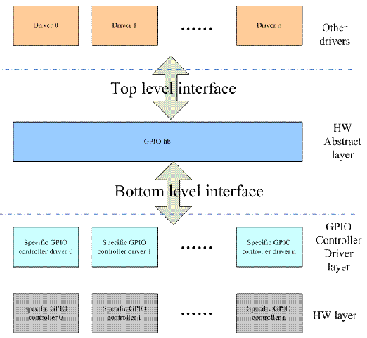

GPIO子系统
==========

GPIO按硬件功能大致可以分为以下三类

-   有些硬件逻辑是IO port本身的功能设定相关的，我们称这个HW block为pin control，软件通过设定pin controller这个硬件单元的寄存器可以实现

1)  引脚g功能配置。是GPIO或者一些特殊功能引脚
2)  引脚特性配置，例如pull-up/pull-down，driver-strengthe的设定

-   如果一组GPIO被配置成SPI，那么这些引脚被链接到SPI controller，如果配置成GPIO则连接到GPIO controller

1)  配置GPIO方向
2)  如果是输出z，可以配置high leval或者low leval
3)  如果是输入，可以获取电平状态

-   如果有中断的功能

1)  中断的enable和disable
2)  触发方式
3)  中断状态清除

通过软件抽象来掩盖硬件差异

1)  pin control subsystem 驱动pin controller硬件的软件子系统
2)  GPIO subsystem 驱动GPIO controller的软件子系统
3)  GPIO interrupt chip driver。这个模块是作为一个interrupt subsystemd中的一个底层硬件驱动模块存在的。

pin control subsystem block diagram

.. image::  res/pin_control.gif

gpio control subsystem block diagram

pin control subsystem
----------------------

- pin control subsystem文件列表

linux/driver/pintrol 目录下重要文件列表

+-----------------------------------+------------------------------------------------------------------------------------------+
|          file name                |                                 descrpition                                              |
+===================================+==========================================================================================+
| core.c core.h                     | pin control subsystem core driver                                                        |
+------------------------------------------------------------------------------------------------------------------------------+
| pinctrl-utils.c pinctrl-utils.h   | pin ctl subsys 的一些utillity的接口函数                                                  |
+------------------------------------------------------------------------------------------------------------------------------+
| pinmux.c pinmux.h                 | pin muxing部分的f代码，也成为pinmux dirver                                               |
+------------------------------------------------------------------------------------------------------------------------------+
| pinconf.c pinconf.h               | pin config部分的代码，也称为pinconf driver                                               |
+------------------------------------------------------------------------------------------------------------------------------+
| devicetree.c devicetree.h         | device tree 代码                                                                         |
+------------------------------------------------------------------------------------------------------------------------------+
| pinctrl-xxx.c                     | 各种pin controller的low level driver                                                     |
+------------------------------------------------------------------------------------------------------------------------------+
