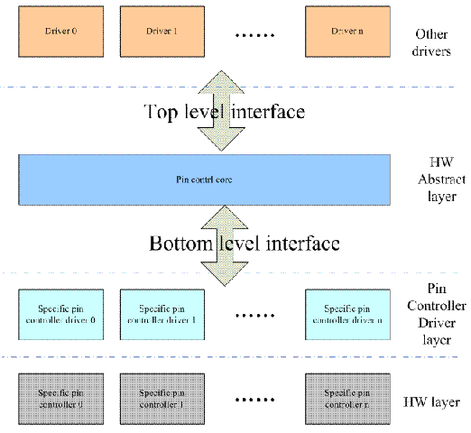

GPIO子系统
==========

GPIO按硬件功能大致可以分为以下三类

-   有些硬件逻辑是IO port本身的功能设定相关的，我们称这个HW block为pin control，软件通过设定pin controller这个硬件单元的寄存器可以实现

1)  引脚g功能配置。是GPIO或者一些特殊功能引脚
2)  引脚特性配置，例如pull-up/pull-down，driver-strengthe的设定

-   如果一组GPIO被配置成SPI，那么这些引脚被链接到SPI controller，如果配置成GPIO则连接到GPIO controller

1)  配置GPIO方向
2)  如果是输出z，可以配置high leval或者low leval
3)  如果是输入，可以获取电平状态

-   如果有中断的功能

1)  中断的enable和disable
2)  触发方式
3)  中断状态清除

通过软件抽象来掩盖硬件差异

1)  pin control subsystem 驱动pin controller硬件的软件子系统
2)  GPIO subsystem 驱动GPIO controller的软件子系统
3)  GPIO interrupt chip driver。这个模块是作为一个interrupt subsystemd中的一个底层硬件驱动模块存在的。

pin control subsystem block diagram

gpio control subsystem block diagram

..  image::  res/gpio_control.gif

pin control subsystem
----------------------

pin control subsystem文件列表
^^^^^^^^^^^^^^^^^^^^^^^^^^^^^

linux/driver/pintrol 目录下重要文件列表

+-----------------------------------+------------------------------------------------------------------------------------------+
|          file name                |                                 descrpition                                              |
+===================================+==========================================================================================+
| core.c core.h                     | pin control subsystem core driver                                                        |
+-----------------------------------+------------------------------------------------------------------------------------------+
| pinctrl-utils.c pinctrl-utils.h   | pin ctl subsys 的一些utillity的接口函数                                                  |
+-----------------------------------+------------------------------------------------------------------------------------------+
| pinmux.c pinmux.h                 | pin muxing部分的f代码，也成为pinmux dirver                                               |
+-----------------------------------+------------------------------------------------------------------------------------------+
| pinconf.c pinconf.h               | pin config部分的代码，也称为pinconf driver                                               |
+-----------------------------------+------------------------------------------------------------------------------------------+
| devicetree.c devicetree.h         | device tree 代码                                                                         |
+-----------------------------------+------------------------------------------------------------------------------------------+
| pinctrl-xxx.c                     | 各种pin controller的low level driver                                                     |
+-----------------------------------+------------------------------------------------------------------------------------------+

和其他内核模块接口头文件

+-----------------------------------+------------------------------------------------------------------------------------------+
|          file name                |                                 descrpition                                              |
+===================================+==========================================================================================+
|                                   |  其他driver要使用pin constrol subsystem的下列接口                                        |             
|                                   |  a、设置银角复用功能                                                                     | 
|    consumer.h                     |  b、设置引脚电气特性                                                                     |
|                                   |                                                                                          |                 
+-----------------------------------+------------------------------------------------------------------------------------------+
|                                   |  其他driver要使用pin constrol subsystem的下列接口                                        |             
|                                   |  a、设置银角复用功能                                                                     | 
|    devinfo.h                      |  b、设置引脚电气特性                                                                     |
|                                   |                                                                                          |                 
+-----------------------------------+------------------------------------------------------------------------------------------+
|                                   |  Linux 内核的驱动模型模块(driver model)使用的接口                                        |             
|                                   |  struct device中包含了一个struct dev_pin_info \*pins的成员,该成员描述了该设备的引脚      | 
|    consumer.h                     |  的初始状态信息，在probe之前，driver Model的core driver会在调用driver的probe函数之前     |
|                                   |  设定pin state                                                                           |                 
+-----------------------------------+------------------------------------------------------------------------------------------+
|    machin.h                       |  和machine模块的接口                                                                     |             
+-----------------------------------+------------------------------------------------------------------------------------------+

low level pin controller driver接口

+-----------------------+------------------------------------------------------------------------------+
|  文件名               |       描述                                                                   |
+=======================+==============================================================================+
|  pinconf-generic.h    |       这个接口主要是提供给各种Pin controller driver使用的，不是外部接口      |
+-----------------------+------------------------------------------------------------------------------+
|  pinconf.h            |       pin configuration 接口                                                 |  
+-----------------------+------------------------------------------------------------------------------+
|  pinctrl-state.h      |       pin control state 状态定义                                             |  
+-----------------------+------------------------------------------------------------------------------+
|  pinmux.h             |       pin mux function 接口                                                  |  
+-----------------------+------------------------------------------------------------------------------+

软件框架图
^^^^^^^^^^

pinctrol system和其他linux内核模块的接口关系图

.. image::  res/gpio_other_mofules.gif

pinctrol subsystem会向系统中的其他driver提供接口以便该driver的pin control和pin mux的设定.

pincontrol subsystem内部block dragram

.. image::  res/pinctrol_dragram.gif

pin control subsystem向其他driver提供的接口
^^^^^^^^^^^^^^^^^^^^^^^^^^^^^^^^^^^^^^^^^^^

普通driver调用pin control subsystem的主要目标是：
1)  设定该设备的复用功能
2)  设定该device对应的那些pin的电气特性
3)  由于电源管理的需求，某个device可能处于电源管理状态

综合上述需求，我们定义了pin control state的概念，也就是说设备可能处于非常多状态中的一个，device driver可以切换设备状态。pincontrol定义了
pin control state的概念，为了方便管理pin control state，又定义了pin control state holder的概念。以下是操作逻辑

1) 获取pin control state holder的句柄
2) 设定pin control状态
3) 释放pin control state holder的句柄

pin control state holder的定义如下

::

    struct pinctrl{
        struct list_head node;      //系统中所有device的pin control state holder被挂入到了一个全局链表中
        struct device *dev;         //该pin control state holder对应的device
        struct list_head state;     //该设备的所有状态都被挂入到这个链表中
        struct pinctrl_state *state;    //当前pin control state
        struct list_head dt_maps;       //mapping table
        struct kref users；             //reference count 
    };

系统中每个需要和pin control subsystem进行交互的设备在进行设定之前都需要首先获取这个句柄。而属于该设备的所有状态都是挂入到了一个链表中，链表头就是
pin control state holder的states成员，一个state的定义如下

::

    struct pinctrl_state {
        struct list_head node;      //挂入链表头的节点
        const char *name:           //该state的名字
        struct list_head setting;   //属于该状态的所有的setting
    };

一个pin state包含若干个setting，所有的setting被挂入到一个链表中，链表头就是pin state的setting成员，定义如下

::

    struct pinctrl_setting {
        struct list_head node;
        enum pinctrl_map_type type;
        struct pinctrl_dev *pctldev;
        const char *dev_name;
        union{
            struct pinctrl_setting_mux mux;
            struct pinctrl_setting_configs configs;
        }
    };

当driver设定一个pin state的时候，pin control subsystem内部会遍历该state的settings链表，将一个一个的setting进行设定。这些setting有各种类型，定义如下

::

    enum pinctrl_map_type {
        PIN_MAP_TYPE_INVALID,
        PIN_MAP_TYPE_DUMMY_STATE,
        PIN_MAP_TYPE_MUX_GROUP,             //功能复用的setting
        PIN_MAP_TYPE_CONFIGS_PIN,           //设定单一一个pin的电气特性
        PIN_MAP_TYPE_CONFIGS_GROUP          //设定但pin group的电气特性
    };

pin mux相关的设(PIN_MAP_TYPE_MUX_GROUP),定义如下

::

    struct pinctrl_setting_mux{
        unsigned group;             //该setting对应的group selector
        unsigned func;              //该setting对应的function selector 
    };

有了function selector以及属于该function的group selector就可以进行该device和pin mux相关的设定了。设定电气特性的setting定义如下

::

    struct pinctrl_map_configs {
        const char *group_or_pin;           //该pin或者pin group的名字
        unsigned long *configs;             //要设定的值的列表，这个值用来写入HW
        unsigned num_configs;               //列表中值的个数
    };

- 函数接口

1)  devm_pinctl_get和pinctrl_get。devm_pinctl_get是resource managed版本的pinctrl_get，核心还是pinctrl_get函数。这两个接口都是获取设备(设备模型中的struct device)
的pin control state holder(struct pinctrl)。pin control state holder不是静态定义的，一般是在第一次调用该函数的时候动态创建，创建一个pin control state holder是一个
大工程，代码如下

::

    satic struct pinctrl *create_pinctrl(struct device *dev)
    {
        //分配pin control state holder占用的内存并初始化
        p = kzalloc(sizeof(*p), GFP_KERNEL);
        P->dev = dev;
        INIT_LIST_HEAD(&p->state);
        INIT_LIST_HEAD(&p->dt_maps);

        //mapping table 这个database的建立也是动态的，当第一次调用pin control state holder的get 函数的时候，就会通过调用pinctrl_dt_to_map
        来建立该device需要的mapping entry

        ret = pinctrl_dt_to_map(p);
        devname = dev_name(dev);

        mutex_lock(&pinctrl_maps_mutex);
        for_each_maps(maps_node, i, map)
        {
            if(strcmp(map->dev_name, devname))
                continue;
            ret = add_setting(p,map);       //分析一个mapping entry，把这个setting的代码加入到holder中
        }
        mutex_unlock(&pinctrl_maps_mutex);
        kref_init(&p->users);

        //把这个新增加的pin control state holder加入到全局链表中
        mutex_lock(&pinctrl_list_mutex);
        list_add_tail(&p->node,&pinctrl_list);
        mutex_unlock(&pinctrl_list_mutex);

        return p;
    }

2)  devm_pinctrl_put和pinctrl_put是1)中的逆函数

3)  pinctrl_lookup_state 根据state name在pin control state holder找到对应的pin control state。具体的state是各个device定义的，不过pin control subsystem自己定义了
    一些标准的pin control state。定义在pinctrl-state.h中

::

    #define PINCTRL_STATE_DEFAULT   "default"
    #define PINCTRL_STATE_IDLE      "idle"
    #define PINCTRL_STATE_SLEPP     "sleep"

4)  pinctrl_select_state    设定一个具体的pin control state接口的

- 和GPIO subsystem交互

接口函数

1)  pinctrl_request_gpio    该接口主要用来申请GPIO，GPIO也是一种资源，使用前应该request，使用完毕后释放

::

    int pinctrl_request_gpio(unsigned gpio)     //传入GPIO的ID
    {
        struct pinctrl_dev *pctldev;
        sttuct pinctrl_gpio_range   *range;
        int ret;
        int pin;

        ret = pinctrl_get_device_gpio_range(gpio, &pctldev, &range);  -----A
        if(ret)
        {
            if(pinctrl_ready_for_gpio_range(gpio))
                ret = 0;
            return ret;
        }
        mutex_lock(&pctldev->mutex);
        pin = gpio_to_pin(range, gpio);
        ret = pinmux_request_gpio(pctldev, range, pin, gpio);  --------B
        mutex_unlock(&pctldev->mutex);
        return ret;
    }

A)  根据GPIO ID找到该ID对应的pin control device(struct pinctrl_dev)和GPIO range(pinctrl_gpio_range)。在core driver中，每个low level的pin controller device都被
    映射成一个struct pinctrl_dev，并形成链表，链表头就是pinctrldev_list。由于实际的硬件设计(例如GPIO block被分成若干个GPIO的bank，每个bank就对应一个HW GPIO controoler
    block),一个pin control device要管理的GPIO ID是分成区域的，每个区域用struct pinctrl_gpio_range来抽象，在low level的pin controller初始化的时候会调用pinctrol_add_gpio_range
    将每个GPIO bank表示的gpio range挂入到pin control device的range list中(gpio_ranges成员)。 pinctrl_gpio_range的定义如下

::

    struct pinctrl_gpio_range 
    {
        struct list_head node;
        const char *name;
        unsigned char *name;
        unsigned int id;            //GPIO chip id 
        unsigned int base;          //该range中起始GPIO ID 
        unsigned int pin_base;      //在线性映射的情况下，这是起始的pin base 
        unsigned const *pins;       //在非线性映射的时候，这是table 是pin到gpio的lookup table 
        unsigned int npins;         //这个range有多少个GPIO引脚
        struct gpio_chip *gc;       //每个GPIO bank都是一个gpio chip，对应一个gpio range 
    }

pin id和GPIO id有两种映射关系，一种是线性映射，一种是非线性映射

B)  这里主要是进行复用功能的设定，毕竟GPIO也是引脚的一种特定功能。这个函数的功能有两个一个是在core driver中标记该pin已经用作GPIO了，这样，如果有模块后续request该资源
    那么core driver可以拒绝不合理的要求，第二步就是调用底层的pin controller driver的callbak函数，进行底层寄存器相关的操作。

2)  pinctrl_free_gpio。有申请就有释放

3)  pinctrl_gpio_direction_input和output。为已经指定为GPIO功能的引脚设定方向，输入或者输出

- 和驱动模型的接口
