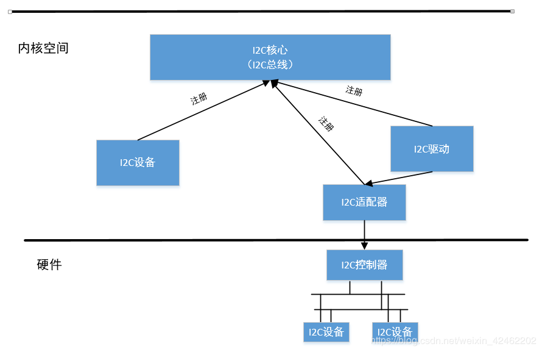
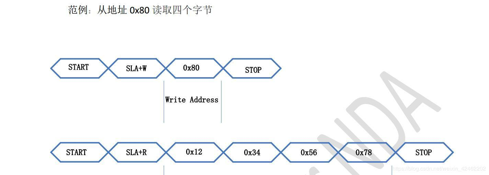

I2C驱动框架以及I2C设备驱动
==========================

I2C驱动框架
-----------

主要对象
^^^^^^^^

- I2C总线

::

    struct bus_type i2c_bus_type = {
        .name		= "i2c",
        .match		= i2c_device_match, //匹配规则
        .probe		= i2c_device_probe, //匹配成功后的行为
        .remove		= i2c_device_remove,
        .shutdown	= i2c_device_shutdown,
        .pm		= &i2c_device_pm_ops,
    };

I2C总线对应这/bus下的一条总线，这个I2C总线结构体管理着I2C设备与I2C驱动的匹配，删除等操作，当设备或者驱动
注册到总线时，I2C总线会调用i2c_device_match函数查看I2C设备和驱动是否匹配，如果匹配则调用i2c_device_probe函数
，进而调用I2C驱动的probe函数。

注：i2c_device_match会管理i2c设备和总线匹配规则，这将和如何编写I2C驱动程序息息相关。

- I2C驱动

::

    struct i2c_driver {
        int (*probe)(struct i2c_client *, const struct i2c_device_id *); //probe函数
        struct device_driver driver; //表明这是一个驱动
        const struct i2c_device_id *id_table; //要匹配的从设备信息(名称)
        int (*detect)(struct i2c_client *, struct i2c_board_info *); //设备探测函数
        const unsigned short *address_list; //设备地址
        struct list_head clients; //设备链表
    };

- I2C设备

::

    struct i2c_client {
        unsigned short addr; //设备地址
        char name[I2C_NAME_SIZE]; //设备名称
        struct i2c_adapter *adapter; //适配器，I2C控制器。
        struct i2c_driver *driver; //设备对应的驱动
        struct device dev; //表明这是一个设备
        int irq; //中断号
        struct list_head detected; //节点
    };

- I2C适配器

i2c_adapter对应物理上的一个i2c适配器

::

    struct i2c_adapter {    //适配器
        unsigned int id; //适配器的编号
        const struct i2c_algorithm *algo; //算法，发送时序
        struct device dev; //表明这是一个设备
    };

i2c_algorithm 对应着一套通讯方法

::

    struct i2c_algorithm {
        /* 作为主设备时的发送函数 */
        int (*master_xfer)(struct i2c_adapter *adap, struct i2c_msg *msgs,
                   int num);

        /* 作为从设备时的发送函数 */
        int (*smbus_xfer) (struct i2c_adapter *adap, u16 addr,
                   unsigned short flags, char read_write,
                   u8 command, int size, union i2c_smbus_data *data);
    };

- I2C驱动有4个重要的东西，I2C总线、I2C驱动、I2C设备、I2C适配器

1)  I2C总线：维护着两个链表(I2C驱动，I2C设备)，管理着I2C设备和驱动的匹配以及删除
2)  I2C驱动：对应着I2C设备驱动程序
3)  I2C设备：对应着具体硬件设备的抽象
4)  I2C适配器： 用于I2C驱动和I2C设备间的通讯，是SOC上I2C控制器的一个抽象

- I2C总线运行机制

I2C驱动框架可以分为4部分，I2C核心、I2C设备、I2C驱动、I2C适配器，其中I2C总线位于I2C核心中。

内核源码分析
^^^^^^^^^^^^

- 注册I2C设备

1)  设备树解析过程

kernel会为设备树root节点下所有带 ``compatible`` 属性的节点都分配并注册一个 ``platform_device`` 。
另外如果某个节点的compatible符合某些matches条件，则会为该节点下的所有带compatible属性的子节点(child)
也分配并注册一个platform_device

Platform_devce数据结构如下

::

     struct platform_device {
        const char      *name;
        int             id;
        bool            id_auto;
        /* 以此挂入统一设备模型 */
        struct device   dev;
        u64             platform_dma_mask;
        /* io和irq资源的总数 */
        u32             num_resources;
        /* 指向resource数组 */
        struct resource *resource;

        const struct platform_device_id *id_entry;
    };

解析设备树以及生成platform_device的过程如下所示：

::

    //第一层  
    /* kerner加载 */
    start_kernel
    --> arch_call_rest_init
        --> rest_init
            --> kernel_init
                --> kernel_init_freeable
                    --> do_basic_setup
                        --> do_initcalls
                            --> of_platform_default_populate_init

    //第二层
    /* drivers/of/platform.c */
    static int __init of_platform_default_populate_init(void)
    {
            /* 检查of_root（"/"节点）是否为NULL */
            if (!of_have_populated_dt())
                    return -ENODEV;

            /* 进行实际的platform_device填充操作 */
            of_platform_default_populate(NULL, NULL, NULL);

            return 0;
    }

    /* 在do_initcalls会被调用执行 */
    arch_initcall_sync(of_platform_default_populate_init);

    //第三层
    const struct of_device_id of_default_bus_match_table[] = {
            { .compatible = "simple-bus", },
            { .compatible = "simple-mfd", },
            { .compatible = "isa", },
    #ifdef CONFIG_ARM_AMBA
            { .compatible = "arm,amba-bus", },
    #endif /* CONFIG_ARM_AMBA */
            {} /* Empty terminated list */
    };

    int of_platform_default_populate(struct device_node *root,
                                     const struct of_dev_auxdata *lookup,
                                     struct device *parent)
    {
            /* of_default_bus_match_table即为上述的matches条件，其他形参均为NULL */
            return of_platform_populate(root, of_default_bus_match_table, lookup,
                                        parent);
    }
    EXPORT_SYMBOL_GPL(of_platform_default_populate);

    //第五层
    int of_platform_populate(struct device_node *root,
                            const struct of_device_id *matches,
                            const struct of_dev_auxdata *lookup,
                            struct device *parent)
    {
            struct device_node *child;
            int rc = 0;
            /* 传入的root为NULL，获取"/"节点 */
            root = root ? of_node_get(root) : of_find_node_by_path("/");
            /* 遍历"/"节点下所有的child节点 */
            for_each_child_of_node(root, child) {
                    /* 分配并创建platform_device */
                    rc = of_platform_bus_create(child, matches, lookup, parent, true);
                    if (rc) {
                            of_node_put(child);
                            break;
                    }
            } 
            /* 设置已填充标志位，避免重复填充 */
            of_node_set_flag(root, OF_POPULATED_BUS);

            of_node_put(root);
            return rc;
    }
    EXPORT_SYMBOL_GPL(of_platform_populate);

    //第六层
    /* bus：root下的child节点
     * matches：of_default_bus_match_table
     * lookup：NULL
     * parent：NULL
     * strict：true
     */
    static int of_platform_bus_create(struct device_node *bus,
                                      const struct of_device_id *matches,
                                      const struct of_dev_auxdata *lookup,
                                      struct device *parent, bool strict)
    {
            const struct of_dev_auxdata *auxdata;
            struct device_node *child;
            struct platform_device *dev;
            const char *bus_id = NULL;
            void *platform_data = NULL;
            int rc = 0;

            /* 只为含"compatible"属性的节点创建platform_device */
            if (strict && (!of_get_property(bus, "compatible", NULL))) {
                    return 0;
            }
            /* 跳过符合of_skipped_node_table条件的节点 */
            if (unlikely(of_match_node(of_skipped_node_table, bus))) {
                    return 0;
            }
            /* 跳过已经创建过platform_device的节点 */
            if (of_node_check_flag(bus, OF_POPULATED_BUS)) {
                    return 0;
            }
            /* 创建并填充platform_device */
            dev = of_platform_device_create_pdata(bus, bus_id, platform_data, parent);
            /* 1、创建platform_device失败，则直接返回，继续遍历root下其他child node
             * 2、创建platform_device成功，但当前node不符合matches条件，即compatible属性值
             *    不为"simple-bus"、"simple-mfd"、"isa"等时，也直接返回；否则继续为当前node
             *    下所有含compatible属性的child node创建并填充platform_device
             */
            if (!dev || !of_match_node(matches, bus))
                    return 0;
            /* 遍历当前node下的所有child node */
            for_each_child_of_node(bus, child) {
                    /* 递归调用of_platform_bus_create函数 */
                    rc = of_platform_bus_create(child, matches, lookup, &dev->dev, strict);
                    if (rc) {
                            of_node_put(child);
                            break;
                    }
            }
            /* 设置已填充标志位：OF_POPULATED_BUS */
            of_node_set_flag(bus, OF_POPULATED_BUS);
            return rc;
    }

    //第七层
    static struct platform_device *of_platform_device_create_pdata(
                                            struct device_node *np,
                                            const char *bus_id,
                                            void *platform_data,
                                            struct device *parent)
    {
            struct platform_device *dev;
            /* of_device_is_available: 检查节点的status属性，如果没有该属性，或者属性值
             *                         为"ok"、"okay"，则认为该node是有效的
             */
            if (!of_device_is_available(np) ||
                of_node_test_and_set_flag(np, OF_POPULATED))
                    return NULL;
            /* 创建platform_device结构体，并对结构体成员进行赋值:
             *      如dev->dev.of_node = of_node_get(np)，即将当前的device_node结构体
             *      赋值给了platform_device->device.of_node成员，即完成绑定操作
             */
            dev = of_device_alloc(np, bus_id, parent);
            if (!dev)
                    goto err_clear_flag;

            dev->dev.coherent_dma_mask = DMA_BIT_MASK(32);
            if (!dev->dev.dma_mask)
                    dev->dev.dma_mask = &dev->dev.coherent_dma_mask;
            /* struct bus_type platform_bus_type = {
             *          .name           = "platform",
             *          .dev_groups     = platform_dev_groups,
             *          .match          = platform_match,
             *          .uevent         = platform_uevent,
             *          .dma_configure  = platform_dma_configure,
             *          .pm             = &platform_dev_pm_ops,
             * };
             * 设置struct device的总线类型，此后与platform_driver的匹配即是通过
             * platform_match函数
             */
            dev->dev.bus = &platform_bus_type;
            dev->dev.platform_data = platform_data;
            of_msi_configure(&dev->dev, dev->dev.of_node);
            /* 调用device_add加入统一设备模型 */
            if (of_device_add(dev) != 0) {
                ...
            }

            return dev;
    }

至此，为所有设备树中符合条件的node都创建了platform_device结构体，node下描述的资源也解析到了platform_device
中，并通过i ``dev成员`` 将该node描述的设备加入了统一设备模型。

在统一设备模型中，每次device或者driver加入bus中，都会调用对应bus的match函数(如platform_match)对driver或者device
链表进行遍历，如有匹配项，则进入driver的probe函数。

spi、i2c等真实的物理总线的控制器设备(controller)是作为 ``platform_device`` 挂入 ``platform_bus`` 的，所以在
spi_master或者i2c_adapter等driver注册到platform_bus时，会与device进行配对并进入driver的probe函数。在probe函数
中会对控制器节点下的子节点(即：spi、i2c从设备)进行解析，创建对应的spi_device、i2c_client等结构体，最终挂入对应的
spi、i2c总线。

这样，设备树中描述的所有设备都有了对应的xxx_device，并加入了统一设备模型中。

- i2c从设备节点创建过程

::

    /* 首先找到i2c控制器(adaper)驱动,他是与设备树通过compatible匹配 */
    static const struct of_device_id i2c_imx_dt_ids[] = {
        { .compatible = "fsl,imx1-i2c", .data = &imx1_i2c_hwdata, },
        { .compatible = "fsl,imx21-i2c", .data = &imx21_i2c_hwdata, },
        { .compatible = "fsl,vf610-i2c", .data = &vf610_i2c_hwdata, },
        { .compatible = "fsl,imx7d-i2c", .data = &imx7d_i2c_hwdata, },
        { /* sentinel */ }
    };
    MODULE_DEVICE_TABLE(of, i2c_imx_dt_ids);

    static struct platform_driver i2c_imx_driver = {
        .probe = i2c_imx_probe,
        .remove = i2c_imx_remove,
        .driver = {
            .name = DRIVER_NAME,
            .pm = I2C_IMX_PM_OPS,
            .of_match_table = i2c_imx_dt_ids,
        },
        .id_table = imx_i2c_devtype,
    };

匹配后进入i2c_imx_probe(struct platform_device  \*pdev)函数

::

    //第一层
    i2c_imx_probe //i2c-imx.c
    --> i2c_add_numbered_adapter //i2c-core-base.c
        --> __i2c_add_numbered_adapter //i2c-core-base.c
            --> i2c_register_adapter //i2c-core-base.c
                -->of_i2c_register_devices //i2c-core-of.c

    //第二层 i2c-core-of.c
    void of_i2c_register_devices(struct i2c_adapter *adap)
    {
        struct device_node *bus, *node;
        struct i2c_client *client;
        /* 获取总线 */
        bus = of_get_child_by_name(adap->dev.of_node, "i2c-bus");
        if (!bus)
            bus = of_node_get(adap->dev.of_node);

        /* 遍历有效的子节点 */
        for_each_available_child_of_node(bus, node) {
                /* 如已被填充则跳过 */
                if (of_node_test_and_set_flag(nc, OF_POPULATED))
                        continue;
                client = of_i2c_register_device(adap, node);
        }
    }
    //第三层 of_i2c_register_device
    static struct i2c_client *of_i2c_register_device(struct i2c_adapter *adap,
                             struct device_node *node)
    {
        struct i2c_board_info info = {};
        const __be32 *addr_be;
        u32 addr;
        /* 获取I2C从设备地址 */
        addr_be = of_get_property(node, "reg", &len);
        addr = be32_to_cpup(addr_be);
        /* 填充info */
        /* 填充info.type */
        if (of_modalias_node(node, info.type, sizeof(info.type)) < 0) {
            dev_err(&adap->dev, "of_i2c: modalias failure on %pOF\n",
                node);
            return ERR_PTR(-EINVAL);
        }
        /* 填充info.addr */
        info.addr = addr;
        /* 如上注册 */
        result = i2c_new_device(adap, &info);

    }

- 注册I2C驱动

与注册设备驱动过程基本一致

::

    //第一层
    int i2c_register_driver(struct module *owner, struct i2c_driver *driver)
    {
        driver->driver.bus = &i2c_bus_type; //指定I2C总线
        
        driver_register(&driver->driver); //向总线注册驱动
    }
    //第二层
    int driver_register(struct device_driver *drv)
    {
        bus_add_driver(drv);
    }
    //第三层
    int bus_add_driver(struct device_driver *drv)
    {
        driver_attach(drv); //此函数会遍历总线设备链表进行操作
        
        klist_add_tail(&priv->knode_bus, &bus->p->klist_drivers); // 添加进bus的driver链表中
    }
    //第四层
    int driver_attach(struct device_driver *drv)
    {
        /* 遍历总线的设备链表，调用__driver_attach */
        bus_for_each_dev(drv->bus, NULL, drv, __driver_attach);
    }
    //第五层
    static int __driver_attach(struct device *dev, void *data)
    {
        if (!driver_match_device(drv, dev))
            return 0;
        
        driver_probe_device(drv, dev);
    }

- I2C adapter

I2C适配器有两个重要的数据结构, ``i2c_adapter`` 和 ``i2c_algorithm``

::
    
    //第一层
    struct i2c_adapter{
        const struct i2c_algorithm *algo; /* 总线访问算法 */
    }
    /* i2c_algorithm 就是I2C适配器与IIC设备进行通信的方法。*/
    //第二层
    struct i2c_algorithm {
        ......
        /* I2C适配器的传输函数,此函数完成与IIC设备的通信 */
        int (*master_xfer)(struct i2c_adapter *adap,
        struct i2c_msg *msgs,
        int num); 
        /* SMBUS总线的传输函数 */
        int (*smbus_xfer) (struct i2c_adapter *adap, u16 addr,
        unsigned short flags, char read_write,
        u8 command, int size, union i2c_smbus_data *data);
        
        /* To determine what the adapter supports */
        u32 (*functionality) (struct i2c_adapter *);
        ......
    };
    /* 实例-构建适配器 */
    static const struct i2c_algorithm s3c24xx_i2c_algorithm = {
        .master_xfer		= s3c24xx_i2c_xfer,
        .functionality		= s3c24xx_i2c_func,
    };

    static int s3c24xx_i2c_probe(struct platform_device *pdev)
    {
        i2c->adap.algo    = &s3c24xx_i2c_algorithm; //构建了算法
        i2c_add_numbered_adapter(&i2c->adap); //注册了适配器
    }

- I2C数据传输

设备驱动中I2C数据传输时通过I2C适配器完成的，可使用 ``i2c_transfer`` 来传输I2C数据，如下

::

    int i2c_transfer(struct i2c_adapter *adap, struct i2c_msg *msgs, int num)
    {
        adap->algo->master_xfer(adap, msgs, num); //调用适配器的算法
    }

设备驱动编写方法
----------------

I2C设备驱动中重点关注两个数据结构 ``i2c_clent`` 和 ``i2c_driver`` ,前是用来描述设备信息的，后者是描述驱动的。

注册设备
^^^^^^^^

- 设置I2C设备驱动信息

::

    /* 设备树匹配列表 */
    static const struct of_device_id my_i2c_dev_of_match[] = {
        { .compatible = "my_i2c_dev, 0" },
        { /* Sentinel */ }
    };

    /* i2c驱动结构体 */	
    static struct i2c_driver my_i2c_drv = {
        .probe = ap3216c_probe,
        .remove = ap3216c_remove,
        .driver = {
                .owner = THIS_MODULE,
                .name = "no",
                .of_match_table = my_i2c_dev_of_match,
               },
    };

- 注册I2C设备驱动

::

    static int __init my_i2c_drv_init(void)
    {
     
        i2c_add_driver(&my_i2c_drv);
     
        return 0;
    }

- 注册I2C设备

::

    /* 在i2c节点下添加设备信息 */
    &i2c1 {
        my_i2c_dev@20 {
            compatible = "my_i2c_dev,0"
        } 
    }

数据传输函数
^^^^^^^^^^^^

- 传输函数

::

    /*
     * adap：i2c适配器
     * msgs：消息数据
     * num：数组的个数
     */
    int i2c_transfer(struct i2c_adapter *adap, struct i2c_msg *msgs, int num)

- 传输报文msg的组成

::

    struct i2c_msg {
        __u16 addr;	//从设备地址
        __u16 flags; //读或写
        __u16 len;	//消息的长度
        __u8 *buf;	//消息
    };

示例：

::

    /* 定义 i2c_msg 结构体 */
    struct i2c_msg msg[2]; 
     
    char val[10]
     
    /* 填充msg */
    msg[0].addr = my_i2c_client->addr; /* 这个client在probe函数中得到的 */
    msg[0].flags = 0; /* 0表示写，1表示读 */
    msg[0].buf = 0x80; /* 写：要发送的数据地址，读：读取到的数据存放的地址 */
    msg[0].len = 1; /* 想要传输的字节数 */
     
    /* 填充msg */
    msg[1].addr = my_i2c_client->addr; /* 这个client在probe函数中得到的 */
    msg[1].flags = 1; /* 1表示读 */
    msg[1].buf = val; /* 读到的数据存在这里 */
    msg[1].len = 4; /* 想要读取的字节数 */
     
     
    /* 传输数据 */
    i2c_transfer(my_i2c_client->adapter, msg, 2); /* 有两个msg */

