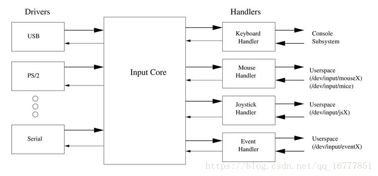
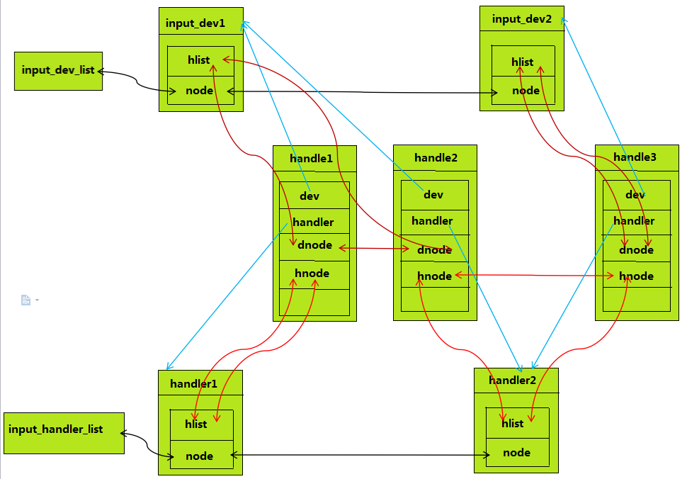

输入子系统框架
================

概述
------

input驱动程序是linux输入设备的驱动程序，分成游戏杆(joystick)、鼠标(mouse和mice)、键盘(keyboard)、事件设备(event)。其中事件设备驱动程序是目前通用的驱动程序，
可支持键盘、鼠标、触摸屏等多种输入设备

linux input子系统将一个输入设备的输入过程分成了设备驱动(input device driver)和事件驱动(input event driver)两个层。前者负责从底层硬件采集数据，后者负责与用户程序接口，
将采集到的数据分发给不同的用户接口。通过这样的设计，将千差万别的设备统一到了为数不多的几种驱动接口上，同一种事件驱动可以用来处理多个同类设备，同一个设备也可以和多种
事件驱动相衔接。而事件驱动和设备驱动则由输入核心层进行连接，匹配

首先输入子系统是分为三层的，面对应用层的是 ``输入事件层(handler)`` ，处理底层驱动的是 ``输入设备层(dirver或device)`` 。而衔接dev和handler的则是 ``输入核心层(core)`` 。
真个输入子系统的核心层起到承上启下的作用

::

    上：输入事件驱动层         （打包数据，面向应用）
     
    中：输入核心层             （向下提供注册接口，向上给具体的hander发送数据）
     
    下：输入设备驱动层         （底层驱动，面向硬件）     

应用程序使用input子系统的核心是，对驱动层打包好的数据进行分析，其中打包的数据结构如下

::

	/*
	 * The event structure itself
	 */
	 
	struct input_event {
		struct timeval time;	//表示输入的时间
		__u16 type;				//表示输入设备是哪种类型，鼠标键盘等
		__u16 code;				//不同的type有不同的code，比如键盘的哪个按键等
		__s32 value;			//根据不同的type和code决定，比如键盘A键按下和松开，鼠标的移动方向等
	};

一个设备可能对应两个设备驱动，比如鼠标既可以对应mouse也可以对应event。event事件设备驱动程序是通用的，也是目前的主流。后面的内容将以此为例进行分析

一次鼠标按下事件为例，说明input输入子系统的工作过程

1. 设备驱动层:当鼠标左键被按下时就会触发中断，然后去执行中断注册的处理函数，在函数中会读取硬件寄存器来判断按下的是哪个按键和状态
2. 然后将按键信息上报给input core层，input core层处理完成之后会上报给input event层，input event层会将我们的输入事件封装成一个input_event结构体放入到一个缓冲区
3. 应用层read就会将缓冲区中的数据读取出去

输入子系统整体由核心层维护，主要使用两条链表，维护着两个层

::

    static LIST_HEAD(input_dev_list);   //维护着所有的dev
    static LIST_HEAD(input_handler_list);   //维护着所有的handler

数据结构
----------

input_handler
^^^^^^^^^^^^^^^

::

	struct input_handler {
	 
		void *private;
	 	
		//用于向上层上报输入事件的函数
		void (*event)(struct input_handle *handle, unsigned int type, unsigned int code, int value);	
		void (*events)(struct input_handle *handle,
				   const struct input_value *vals, unsigned int count);
		bool (*filter)(struct input_handle *handle, unsigned int type, unsigned int code, int value);
		//函数用来匹配handler与input_dev
		bool (*match)(struct input_handler *handler, struct input_dev *dev);
		//当handler与input_dev匹配成功之后用来连接
		int (*connect)(struct input_handler *handler, struct input_dev *dev, const struct input_device_id *id);
		void (*disconnect)(struct input_handle *handle);
		void (*start)(struct input_handle *handle);
	 
		bool legacy_minors;
		int minor;		//该handler编号(在input_table数组中用来计算数组下标), input_table数组就是input子系统用来管理注册的handler的一个数据结构
		const char *name;
	 
		const struct input_device_id *id_table;	//里面保存着dev和handler能匹配在一起的信息
	 
		struct list_head	h_list;
		struct list_head	node;
	};

用此数据结构来表述一个handler，主要是面向应用层的。 node用于把该handler链接在input_handler_list链表上，h_list用于指向handle

input_handle
^^^^^^^^^^^^^^^^^

handle: 用于将input_dev和handler连接起来，对应于一个具体的设备文件

::

	/**
	 * struct input_handle - links input device with an input handler
	 * @private: handler-specific data
	 * @open: counter showing whether the handle is 'open', i.e. should deliver
	 *	events from its device
	 * @name: name given to the handle by handler that created it
	 * @dev: input device the handle is attached to
	 * @handler: handler that works with the device through this handle
	 * @d_node: used to put the handle on device's list of attached handles
	 * @h_node: used to put the handle on handler's list of handles from which
	 *	it gets events
	 */
	struct input_handle {
	 
		void *private;
	 
		int open;		//打开计数
		const char *name;	
	 
		struct input_dev *dev;	//用来指向该handle绑定的input_dev结构体
		struct input_handler *handler;	//用来指向该handle绑定的handler结构体
	 
		struct list_head	d_node;
		struct list_head	h_node;
	};

这个数据结构用来连接dev和handler，这里要说明的是一个dev可能会连接多个handler，所以会有多个handle负责连接dev和多个handler.

input_dev
^^^^^^^^^^

input_dev代表着具体的输入设备，负责底层的实现，它直接从硬件中读取数据，并以事件的形式转发，包括该输入设备支持的输入类型，键值等.

::

	struct input_dev {
		const char *name;	//设备名称
		const char *phys;	//设备在分层系统的路径
		const char *uniq;	
		struct input_id id;		//设备信息
	 	//可以上报的事件类型有哪些，用位图来表示
		unsigned long propbit[BITS_TO_LONGS(INPUT_PROP_CNT)];
	 
		unsigned long evbit[BITS_TO_LONGS(EV_CNT)];
		unsigned long keybit[BITS_TO_LONGS(KEY_CNT)];
		unsigned long relbit[BITS_TO_LONGS(REL_CNT)];
		unsigned long absbit[BITS_TO_LONGS(ABS_CNT)];
		unsigned long mscbit[BITS_TO_LONGS(MSC_CNT)];
		unsigned long ledbit[BITS_TO_LONGS(LED_CNT)];
		unsigned long sndbit[BITS_TO_LONGS(SND_CNT)];
		unsigned long ffbit[BITS_TO_LONGS(FF_CNT)];
		unsigned long swbit[BITS_TO_LONGS(SW_CNT)];
	 
		unsigned int hint_events_per_packet;
	 
		unsigned int keycodemax;
		unsigned int keycodesize;
		void *keycode;
	 
		int (*setkeycode)(struct input_dev *dev,
				  const struct input_keymap_entry *ke,
				  unsigned int *old_keycode);
		int (*getkeycode)(struct input_dev *dev,
				  struct input_keymap_entry *ke);
	 
		struct ff_device *ff;
	 
		unsigned int repeat_key;	//重复上报键值，比如键盘A按着一直不松手
		struct timer_list timer;	//重复上报时间
	 
		int rep[REP_CNT];
	 
		struct input_mt *mt;
	 
		struct input_absinfo *absinfo;
	 
		unsigned long key[BITS_TO_LONGS(KEY_CNT)];
		unsigned long led[BITS_TO_LONGS(LED_CNT)];
		unsigned long snd[BITS_TO_LONGS(SND_CNT)];
		unsigned long sw[BITS_TO_LONGS(SW_CNT)];
	 
		int (*open)(struct input_dev *dev);		//设备open函数
		void (*close)(struct input_dev *dev);
		int (*flush)(struct input_dev *dev, struct file *file);
		int (*event)(struct input_dev *dev, unsigned int type, unsigned int code, int value); //上报事件
	 
		struct input_handle __rcu *grab;
	 
		spinlock_t event_lock;
		struct mutex mutex;
	 
		unsigned int users;
		bool going_away;
	 
		struct device dev;
	 
		struct list_head	h_list;	//用来挂接这个struct input_dev和所有struct handler的链表头
		struct list_head	node;	//
	 
		unsigned int num_vals;
		unsigned int max_vals;
		struct input_value *vals;
	 
		bool devres_managed;
	};

以上几个数据结构之间的关系可以用下面的图示说明

下面是系统目前为设备定义的次设备号信息

::

	#define JOYDEV_MINOR_BASE	0        /* 游戏手柄类次设备号开始位置 */
	#define JOYDEV_MINORS		16       /* 游戏手柄类次设备号个数 */
	 
	#define MOUSEDEV_MINOR_BASE	32       /*鼠标类次设备号开始位置 */
	#define MOUSEDEV_MINORS		32       /* 鼠标类次设备号个数 */
	 
	#define EVDEV_MINOR_BASE	64       /*通用事件类次设备号开始位置 */
	#define EVDEV_MINORS		32       /*通用事件类次设备号个数 */

输入子系统初始化
-------------------

::

	static int __init input_init(void)
	{
		int err;
	 
		err = class_register(&input_class);
		if (err) {
			pr_err("unable to register input_dev class\n");
			return err;
		}
	 
		err = input_proc_init();
		if (err)
			goto fail1;
	 
		/* 一次性注册完所有的次设备 */
		err = register_chrdev_region(MKDEV(INPUT_MAJOR, 0),
						 INPUT_MAX_CHAR_DEVICES, "input");
		if (err) {
			pr_err("unable to register char major %d", INPUT_MAJOR);
			goto fail2;
		}
	 
		return 0;
	 
	 fail2:	input_proc_exit();
	 fail1:	class_unregister(&input_class);
		return err;
	}
	 
	subsys_initcall(input_init);

start_kernel中会调用subsys_initcall函数来完成input_init的的调用

在dev和handler匹配上之后，会调用connect, 不同的输入设备有不同的connect函数

::

	/*
	 * Create new evdev device. Note that input core serializes calls
	 * to connect and disconnect.
	 */
	static int evdev_connect(struct input_handler *handler, struct input_dev *dev,
				 const struct input_device_id *id)
	{
		struct evdev *evdev;
		int minor;
		int dev_no;
		int error;
	 
		minor = input_get_new_minor(EVDEV_MINOR_BASE, EVDEV_MINORS, true);
		if (minor < 0) {
			error = minor;
			pr_err("failed to reserve new minor: %d\n", error);
			return error;
		}
	 
		evdev = kzalloc(sizeof(struct evdev), GFP_KERNEL);
		if (!evdev) {
			error = -ENOMEM;
			goto err_free_minor;
		}
	 
		INIT_LIST_HEAD(&evdev->client_list);
		spin_lock_init(&evdev->client_lock);
		mutex_init(&evdev->mutex);
		init_waitqueue_head(&evdev->wait);
		evdev->exist = true;
	 
		dev_no = minor;
		/* Normalize device number if it falls into legacy range */
		if (dev_no < EVDEV_MINOR_BASE + EVDEV_MINORS)
			dev_no -= EVDEV_MINOR_BASE;
		dev_set_name(&evdev->dev, "event%d", dev_no);
	 
		evdev->handle.dev = input_get_device(dev);
		evdev->handle.name = dev_name(&evdev->dev);
		evdev->handle.handler = handler;
		evdev->handle.private = evdev;
	 
		evdev->dev.devt = MKDEV(INPUT_MAJOR, minor);
		evdev->dev.class = &input_class;
		evdev->dev.parent = &dev->dev;
		evdev->dev.release = evdev_free;
		device_initialize(&evdev->dev);
	 
		error = input_register_handle(&evdev->handle);
		if (error)
			goto err_free_evdev;
	 
		cdev_init(&evdev->cdev, &evdev_fops);
		evdev->cdev.kobj.parent = &evdev->dev.kobj;
		error = cdev_add(&evdev->cdev, evdev->dev.devt, 1);
		if (error)
			goto err_unregister_handle;
	 
		error = device_add(&evdev->dev);
		if (error)
			goto err_cleanup_evdev;
	 
		return 0;
	 
	 err_cleanup_evdev:
		evdev_cleanup(evdev);
	 err_unregister_handle:
		input_unregister_handle(&evdev->handle);
	 err_free_evdev:
		put_device(&evdev->dev);
	 err_free_minor:
		input_free_minor(minor);
		return error;
	}
 
真正的设备注册主要由cdev_init和cdev_add函数完成

