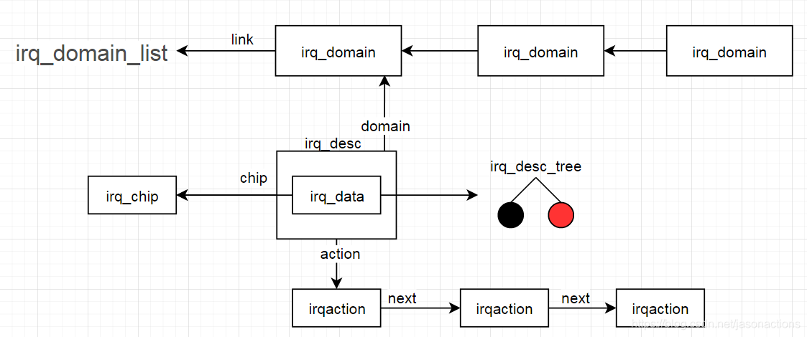
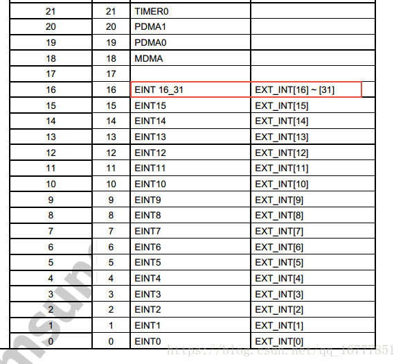
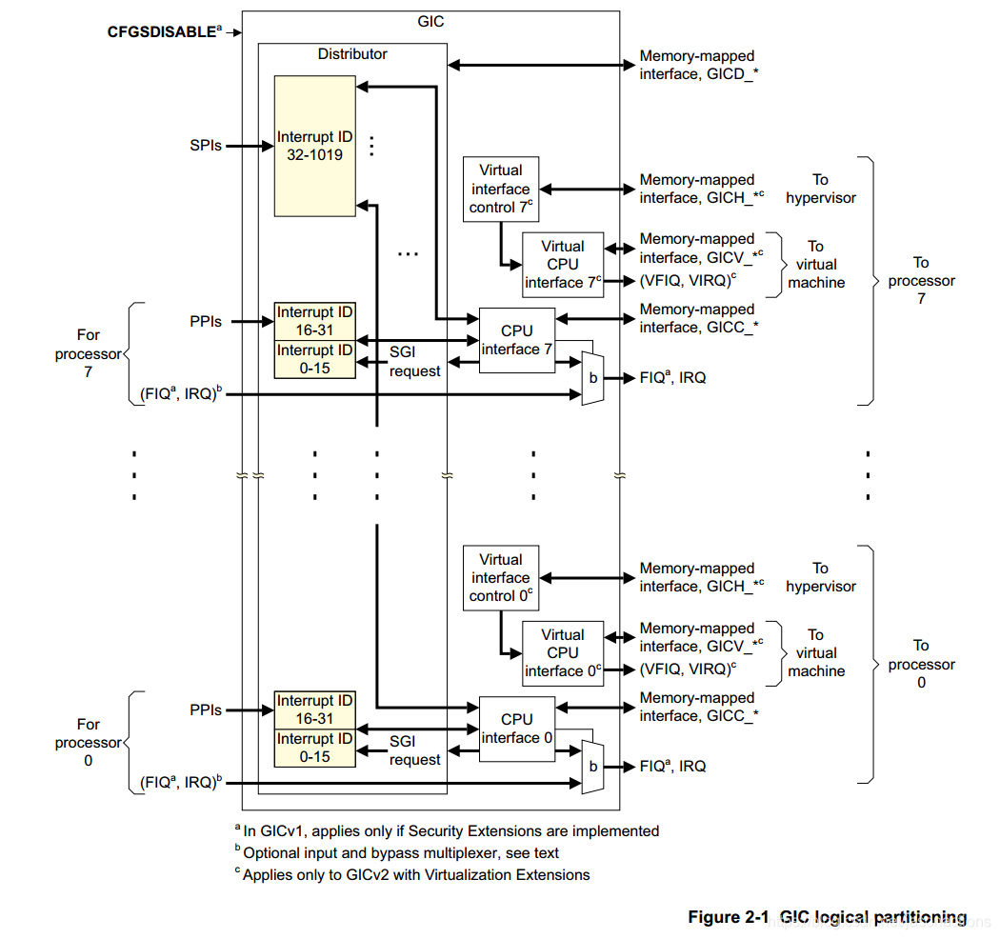
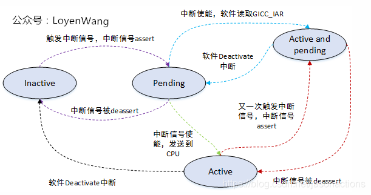
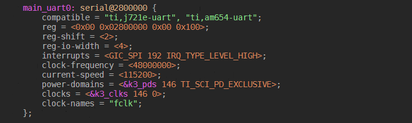

linux 中断框架
=================

数据结构
-----------

中断管理主要数据结构

irq_desc中断描述符
^^^^^^^^^^^^^^^^^^^

每个中断都有一个中断描述符

irq_desc在include/linux/irqdesc.h中定义

::

    /**
     * struct irq_desc - interrupt descriptor
     * @irq_common_data:	per irq and chip data passed down to chip functions
     * @kstat_irqs:		irq stats per cpu
     * @handle_irq:		highlevel irq-events handler
     * @preflow_handler:	handler called before the flow handler (currently used by sparc)
     * @action:		the irq action chain
     * @status:		status information
     * @core_internal_state__do_not_mess_with_it: core internal status information
     * @depth:		disable-depth, for nested irq_disable() calls
     * @wake_depth:		enable depth, for multiple irq_set_irq_wake() callers
     * @tot_count:		stats field for non-percpu irqs
     * @irq_count:		stats field to detect stalled irqs
     * @last_unhandled:	aging timer for unhandled count
     * @irqs_unhandled:	stats field for spurious unhandled interrupts
     * @threads_handled:	stats field for deferred spurious detection of threaded handlers
     * @threads_handled_last: comparator field for deferred spurious detection of theraded handlers
     * @lock:		locking for SMP
     * @affinity_hint:	hint to user space for preferred irq affinity
     * @affinity_notify:	context for notification of affinity changes
     * @pending_mask:	pending rebalanced interrupts
     * @threads_oneshot:	bitfield to handle shared oneshot threads
     * @threads_active:	number of irqaction threads currently running
     * @wait_for_threads:	wait queue for sync_irq to wait for threaded handlers
     * @nr_actions:		number of installed actions on this descriptor
     * @no_suspend_depth:	number of irqactions on a irq descriptor with
     *			IRQF_NO_SUSPEND set
     * @force_resume_depth:	number of irqactions on a irq descriptor with
     *			IRQF_FORCE_RESUME set
     * @rcu:		rcu head for delayed free
     * @kobj:		kobject used to represent this struct in sysfs
     * @request_mutex:	mutex to protect request/free before locking desc->lock
     * @dir:		/proc/irq/ procfs entry
     * @debugfs_file:	dentry for the debugfs file
     * @name:		flow handler name for /proc/interrupts output
     */
    struct irq_desc {
        struct irq_common_data	irq_common_data;
        struct irq_data		irq_data;   //每个irq和芯片数据传递给芯片功能
        unsigned int __percpu	*kstat_irqs;
        irq_flow_handler_t	handle_irq; //高级irq-events处理程序
    #ifdef CONFIG_IRQ_PREFLOW_FASTEOI
        irq_preflow_handler_t	preflow_handler;
    #endif
        struct irqaction	*action;	/* IRQ action list */
        unsigned int		status_use_accessors;   //状态信息
        unsigned int		core_internal_state__do_not_mess_with_it;   //核心内部状态信息
        unsigned int		depth;		/* nested irq disables */
        unsigned int		wake_depth;	/* nested wake enables */
        unsigned int		tot_count;
        unsigned int		irq_count;	/* For detecting broken IRQs */
        unsigned long		last_unhandled;	/* Aging timer for unhandled count */
        unsigned int		irqs_unhandled;
        atomic_t		threads_handled;
        int			threads_handled_last;   //
        raw_spinlock_t		lock;       //锁定SMP
        struct cpumask		*percpu_enabled;
        const struct cpumask	*percpu_affinity;
    #ifdef CONFIG_SMP
        const struct cpumask	*affinity_hint;
        struct irq_affinity_notify *affinity_notify;
    #ifdef CONFIG_GENERIC_PENDING_IRQ
        cpumask_var_t		pending_mask;
    #endif
    #endif
        unsigned long		threads_oneshot;
        atomic_t		threads_active;
        wait_queue_head_t       wait_for_threads;
    #ifdef CONFIG_PM_SLEEP
        unsigned int		nr_actions;
        unsigned int		no_suspend_depth;
        unsigned int		cond_suspend_depth;
        unsigned int		force_resume_depth;
    #endif
    #ifdef CONFIG_PROC_FS
        struct proc_dir_entry	*dir;   //proc irq procfs条目
    #endif
    #ifdef CONFIG_GENERIC_IRQ_DEBUGFS
        struct dentry		*debugfs_file;
        const char		*dev_name;  
    #endif
    #ifdef CONFIG_SPARSE_IRQ
        struct rcu_head		rcu;
        struct kobject		kobj;
    #endif
        struct mutex		request_mutex;
        int			parent_irq;
        struct module		*owner;
        const char		*name;      //proc interrupt输出的中断处理名称
    } ____cacheline_internodealigned_in_smp;

irq_data
^^^^^^^^^^

::

    /**
     * struct irq_data - per irq chip data passed down to chip functions
     * @mask:		precomputed bitmask for accessing the chip registers
     * @irq:		interrupt number
     * @hwirq:		hardware interrupt number, local to the interrupt domain
     * @common:		point to data shared by all irqchips
     * @chip:		low level interrupt hardware access
     * @domain:		Interrupt translation domain; responsible for mapping
     *			between hwirq number and linux irq number.
     * @parent_data:	pointer to parent struct irq_data to support hierarchy
     *			irq_domain
     * @chip_data:		platform-specific per-chip private data for the chip
     *			methods, to allow shared chip implementations
     */
    struct irq_data {
        u32			mask;   //预先计算的位掩码，用于访问芯片寄存器
        unsigned int		irq;    //中断号
        unsigned long		hwirq;  //硬件中断号，中断域本地
        struct irq_common_data	*common;    //
        struct irq_chip		*chip;  //低级中断硬件访问
        struct irq_domain	*domain;    //中断域
    #ifdef	CONFIG_IRQ_DOMAIN_HIERARCHY
        struct irq_data		*parent_data;
    #endif
        void			*chip_data;
    };

::

    /*
     * Interrupt flow handler typedefs are defined here to avoid circular
     * include dependencies.
     */

    struct irq_desc;
    struct irq_data;
    typedef	void (*irq_flow_handler_t)(struct irq_desc *desc);  //handle_irq中断处理函数
    typedef	void (*irq_preflow_handler_t)(struct irq_data *data);

::

    //函数指针，通常是我们要实现的
    typedef irqreturn_t (*irq_handler_t)(int, void *);

    /**
     * struct irqaction - per interrupt action descriptor
     * @handler:	interrupt handler function
     * @name:	name of the device
     * @dev_id:	cookie to identify the device
     * @percpu_dev_id:	cookie to identify the device
     * @next:	pointer to the next irqaction for shared interrupts
     * @irq:	interrupt number
     * @flags:	flags (see IRQF_* above)
     * @thread_fn:	interrupt handler function for threaded interrupts
     * @thread:	thread pointer for threaded interrupts
     * @secondary:	pointer to secondary irqaction (force threading)
     * @thread_flags:	flags related to @thread
     * @thread_mask:	bitmask for keeping track of @thread activity
     * @dir:	pointer to the proc/irq/NN/name entry
     */
    struct irqaction {
        irq_handler_t		handler;    //中断处理函数
        void			*dev_id;        //用于识别设备的cookie
        void __percpu		*percpu_dev_id; //用于识别设备的cookie
        struct irqaction	*next;  //指向共享中断的下一个irqaction指针
        irq_handler_t		thread_fn;  //用于线程中断的中断处理函数
        struct task_struct	*thread;    //线程中断的线程指针
        struct irqaction	*secondary; 
        unsigned int		irq;        //中断号码
        unsigned int		flags;      //
        unsigned long		thread_flags;   //与thread相关的标志
        unsigned long		thread_mask;    //用于跟踪thread活动的位掩码
        const char		*name;              //设备名称
        struct proc_dir_entry	*dir;       //指向proc irq NN name条目的指针
    } ____cacheline_internodealigned_in_smp;

- 中断标志位

::

    #define IRQF_TRIGGER_NONE	0x00000000
    #define IRQF_TRIGGER_RISING	0x00000001  //上升沿中断
    #define IRQF_TRIGGER_FALLING	0x00000002
    #define IRQF_TRIGGER_HIGH	0x00000004      //高电平中断
    #define IRQF_TRIGGER_LOW	0x00000008
    #define IRQF_TRIGGER_MASK	(IRQF_TRIGGER_HIGH | IRQF_TRIGGER_LOW | \
                     IRQF_TRIGGER_RISING | IRQF_TRIGGER_FALLING)
    #define IRQF_TRIGGER_PROBE	0x00000010

    #define IRQF_SHARED		0x00000080  //允许多个设备之间共享irq
    #define IRQF_PROBE_SHARED	0x00000100  //当呼叫着期望发生共享不匹配时由呼叫者设置
    #define __IRQF_TIMER		0x00000200  //定时器中断标志
    #define IRQF_PERCPU		0x00000400      //中断是每个CPU
    #define IRQF_NOBALANCING	0x00000800  //用于从irq平衡中排除此中断的标志
    #define IRQF_IRQPOLL		0x00001000  //用于轮询
    #define IRQF_ONESHOT		0x00002000
    #define IRQF_NO_SUSPEND		0x00004000
    #define IRQF_FORCE_RESUME	0x00008000
    #define IRQF_NO_THREAD		0x00010000
    #define IRQF_EARLY_RESUME	0x00020000
    #define IRQF_COND_SUSPEND	0x00040000

    #define IRQF_TIMER		(__IRQF_TIMER | IRQF_NO_SUSPEND | IRQF_NO_THREAD)

- irq_chip

irq_chip用于描述中断控制器底层操作相关的函数操作集合

::

    struct irq_chip {       //硬件中断描述符
        struct device	*parent_device;
        const char	*name;      //proc/interrupt的名称
        unsigned int	(*irq_startup)(struct irq_data *data);  //启动中断
        void		(*irq_shutdown)(struct irq_data *data);     //关闭中断
        void		(*irq_enable)(struct irq_data *data);
        void		(*irq_disable)(struct irq_data *data);

        void		(*irq_ack)(struct irq_data *data);  //开始新的中断
        void		(*irq_mask)(struct irq_data *data); //屏蔽中断源
        void		(*irq_mask_ack)(struct irq_data *data);
        void		(*irq_unmask)(struct irq_data *data);
        void		(*irq_eoi)(struct irq_data *data);  //中断结束

        int		(*irq_set_affinity)(struct irq_data *data, const struct cpumask *dest, bool force);     //在SMP机器上设置亲和力
        int		(*irq_retrigger)(struct irq_data *data);    //向CPU重启发送IRQ
        int		(*irq_set_type)(struct irq_data *data, unsigned int flow_type); //设置IEQ的流类型(IRQ_TYPE_LEVEL)
        int		(*irq_set_wake)(struct irq_data *data, unsigned int on);    //启用/禁用IRQ的电源管理

        void		(*irq_bus_lock)(struct irq_data *data); //用于锁定对慢速总线(I2c)芯片的访问功能
        void		(*irq_bus_sync_unlock)(struct irq_data *data);  //用于同步和解锁慢速总线芯片的功能
    
        void		(*irq_cpu_online)(struct irq_data *data);   //为辅助CPU设置中断源
        void		(*irq_cpu_offline)(struct irq_data *data);

        void		(*irq_suspend)(struct irq_data *data);
        void		(*irq_resume)(struct irq_data *data);   //恢复时从核心代码调用的函数
        void		(*irq_pm_shutdown)(struct irq_data *data);

        void		(*irq_calc_mask)(struct irq_data *data);

        void		(*irq_print_chip)(struct irq_data *data, struct seq_file *p);
        int		(*irq_request_resources)(struct irq_data *data);
        void		(*irq_release_resources)(struct irq_data *data);

        void		(*irq_compose_msi_msg)(struct irq_data *data, struct msi_msg *msg);
        void		(*irq_write_msi_msg)(struct irq_data *data, struct msi_msg *msg);

        int		(*irq_get_irqchip_state)(struct irq_data *data, enum irqchip_irq_state which, bool *state);
        int		(*irq_set_irqchip_state)(struct irq_data *data, enum irqchip_irq_state which, bool state);

        int		(*irq_set_vcpu_affinity)(struct irq_data *data, void *vcpu_info);

        void		(*ipi_send_single)(struct irq_data *data, unsigned int cpu);
        void		(*ipi_send_mask)(struct irq_data *data, const struct cpumask *dest);

        int		(*irq_nmi_setup)(struct irq_data *data);
        void		(*irq_nmi_teardown)(struct irq_data *data);

        unsigned long	flags;
    };

通常我们所说的中断可以分为两种，一种是内部中断(定时器，串口，i2c等)，另一种是外部中断(GPIO+触发类型),内部中断是由固定的独立的中断号的。而外部中断，因为数量较多，
每个单独占用一个的话特别浪费中断资源，所以有些外部中断是有单独的中断号的，而另外一些则是多个端口共享一个中断号

中断控制器
--------------

linux内核中断管理分层架构:

1. 硬件层: CPU和中断控制器的连接
2. 处理器架构管理层: 如CPU中断异常处理
3. 中断控制器管理层: 如IRQ号的映射
4. linux内核通用中断处理器层: 如中断注册与中断处理

中断控制器
^^^^^^^^^^^

GIC中断控制器由两部分组成，distributor和cpu interface

- distributor 集中管理所有中断源

1. 配置中断的优先级
2. 设置每个中断可路由的CPU列表
3. 向每个CPU interface配送最高优先级的中断
4. 中断屏蔽、中断抢占
5. 配置中断时边缘触发还是水平触发

- cpu interface是GIC连接到CPU的接口，每个cpu interface提供了一个编程接口，主要功能包括

1. 使能中断请求信号到CPU
2. acknowledging 中断，表示CPU接收到中断请求
3. 指示中断的处理完成
4. 设置处理器中断优先级，高于此优先级方可发送给处理器
5. 设置处理器的抢占策略
6. 确定处理器的最高优先级待处理中断

**支持的中断类型**

=====================   =================   ==============  ===================================================================
中断类型                硬件中断号范围      含义            应用场景
---------------------   -----------------   --------------  -------------------------------------------------------------------
SGI私有软件触发中断     0~15                用于核间通信    通常用于多核通信
PPI私有外设中断         16~31               处理器私有中断  如CPU本地时钟Local timer
SPI公用外设中断         32~1019             用用外设中断    用用外设中断，如SPI,I2C，IO等
=====================   =================   ==============  ===================================================================

- 中断状态

1. inactive(不活跃)状态：中断处于无效状态；
2. pending(等待)状态：中断处于有效状态，但是等待CPU响应该中断；
3. active(活跃)状态：CPU已经响应中断；
4. active and pending(活跃并等待)状态：CPU正在响应中断，但是该中断源又发送中断过来

转换图如下

.. note::
    GIC总是会选择优先级最高的pending的中断发送给CPU，通过cat /proc/interrupts可以查看当前平台的中断源

虚拟中断号和硬中断号
---------------------

- 虚拟中断号

::

	<include/asm-generic/irq.h>
	/*
	* NR_IRQS is the upper bound of how many interrupts can be handled
	* in the platform. It is used to size the static irq_map array,
	* so don't make it too big.
	*/
	#ifndef NR_IRQS
	#define NR_IRQS 64
	#endif

	<kernel/irq/internals.h>
	#ifdef CONFIG_SPARSE_IRQ
	# define IRQ_BITMAP_BITS        (NR_IRQS + 8196)
	#else
	# define IRQ_BITMAP_BITS        NR_IRQS
	#endif

	<kernel/irq/irqdesc.c>
	static DECLARE_BITMAP(allocated_irqs, IRQ_BITMAP_BITS);

linux定义了位图来管理这些虚拟中断号，allocated_irqs变量分配了IRQ_BITMAP_BOTS个bit位，每个bit位代表一个中断

- 硬件中断号

1. 0~31中断号给了SGI和PPI
2. 其他外设中断号会从32开始
3. dts中会用interrupts = <硬中断号n>来指定硬件中断号，真正的硬中断号为32+n

cat /proc/interrupts看到的是实际的硬件中断号，即转换完成的

.. note::
	dts中interrupts域主要包含三个属性: 1.中断类型:GIC_SPI(共享外设型，用0表示) GIC_PPI(私有外设中断，用1表示) 2.中断ID 3.触发类型:IRQ_TYPE_EDGE_RISING等

