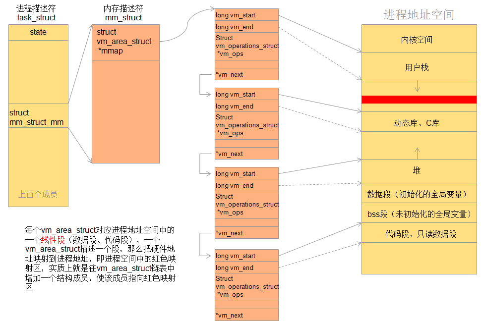

mmap原理
==========

概念
------

mmap是一种内存映射文件的一种方法，即将一个文件或者其他对象映射到进程的地址空间，实现文件磁盘地址和进程虚拟地址空间中一段虚拟地址的一一对应关系。
实现这样的映射关系后，进程就可以此阿用指针的方式读写操作这一段内存，而系统会自动回写脏页面到对应的文件磁盘上，即完成了对文件的操作而不必再调用
read write等系统调用函数。相反，内核空间对这段区域的修改也直接反映用户空间，从而实现不同进程间的文件共享

.. image::
    res/address_apace.png

由上图可以看出进程的虚拟地址空间，由多个虚拟地址区域构成，虚拟内存区域是进程的虚拟地址空间中的一个同质区间，即具有下共同特性的连续地址范围。上图
中的text数据段(代码段)、初始数据段、BSS数据段、堆、栈、和内存映射，都是一个独立的虚拟内存区域。

虚拟地址空间
^^^^^^^^^^^^^^^^

在32位系统中，每个进程都有4G的虚拟地址空间，其中3G用户空间，1G内核空间，每个进程共享内核空间，独立的用户空间。

驱动程序运行在内核空间，所以驱动程序是面向所有进程的。

用户空间切换到内核空间有两种方法：
1) 系统调用，即软中断
2) 硬件中断

linux内核采用task_struct结构体来描述进程，并且维护一个该结构体的链表来管理所有进程。该结构体中包含一些进程状态、调度信息等上千个成员，这里我们关注
进程描述符中内存描述符成员(struct mm_struct mm)。linux内核使用vm_area_struct结构来表示一个独立的虚拟内存区域，由于每个不同质的虚拟内存区域功能和内部
机制不同，因此一个进程使用多个vm_area_struct来表示不同类型的虚拟内存区域。各个vm_area_struct结构使用链表或者树形结构链接，方便进程快速访问

::

    /*
     * This struct defines a memory VMM memory area. There is one of these
     * per VM-area/task.  A VM area is any part of the process virtual memory
     * space that has a special rule for the page-fault handlers (ie a shared
     * library, the executable area etc).
     */
    struct vm_area_struct {
        /* The first cache line has the info for VMA tree walking. */

        unsigned long vm_start;		/* Our start address within vm_mm. */
        unsigned long vm_end;		/* The first byte after our end address
                           within vm_mm. */

        /* linked list of VM areas per task, sorted by address */
        struct vm_area_struct *vm_next, *vm_prev;

        struct rb_node vm_rb;

        /*
         * Largest free memory gap in bytes to the left of this VMA.
         * Either between this VMA and vma->vm_prev, or between one of the
         * VMAs below us in the VMA rbtree and its ->vm_prev. This helps
         * get_unmapped_area find a free area of the right size.
         */
        unsigned long rb_subtree_gap;

        /* Second cache line starts here. */

        struct mm_struct *vm_mm;	/* The address space we belong to. */
        pgprot_t vm_page_prot;		/* Access permissions of this VMA. */
        unsigned long vm_flags;		/* Flags, see mm.h. */

        /*
         * For areas with an address space and backing store,
         * linkage into the address_space->i_mmap interval tree.
         */
        struct {
            struct rb_node rb;
            unsigned long rb_subtree_last;
        } shared;

        /*
         * A file's MAP_PRIVATE vma can be in both i_mmap tree and anon_vma
         * list, after a COW of one of the file pages.	A MAP_SHARED vma
         * can only be in the i_mmap tree.  An anonymous MAP_PRIVATE, stack
         * or brk vma (with NULL file) can only be in an anon_vma list.
         */
        struct list_head anon_vma_chain; /* Serialized by mmap_sem &
                          * page_table_lock */
        struct anon_vma *anon_vma;	/* Serialized by page_table_lock */

        /* Function pointers to deal with this struct. */
        const struct vm_operations_struct *vm_ops;

        /* Information about our backing store: */
        unsigned long vm_pgoff;		/* Offset (within vm_file) in PAGE_SIZE
                           units */
        struct file * vm_file;		/* File we map to (can be NULL). */
        void * vm_private_data;		/* was vm_pte (shared mem) */

        atomic_long_t swap_readahead_info;
    #ifndef CONFIG_MMU
        struct vm_region *vm_region;	/* NOMMU mapping region */
    #endif
    #ifdef CONFIG_NUMA
        struct mempolicy *vm_policy;	/* NUMA policy for the VMA */
    #endif
        struct vm_userfaultfd_ctx vm_userfaultfd_ctx;
    } __randomize_layout;

内存映射是把设备地址映射到进程地址空间，实质上是分配了一个vm_area_struct结构体加入到进程的地址空间，也就是说把设备地址映射到这个结构体，映射过程就是
驱动程序要做的事了

mmap映射原理
--------------

mmap内存映射的实现过程，总的来说可以分为三个阶段

**进程启动映射过程，并在虚拟地址空间中为映射创建虚拟映射区域**

1) 进程在用户空间调用库函数mmap,原型 

::

    void *mmap(void *start, size_t length, int port, int flags, int fd, off_t offset)

2) 在当前进程的虚拟地址空间中，寻找一段空闲的满足要求的连续的虚拟地址

3) 为此虚拟区域分配一个vm_area_struct结构，接着对这个结构各个域进行初始化

4) 将新建的虚拟区域结构(vm_area_struct)插入进程的虚拟地址区域链表或树中

**调用内核空间的系统调用函数mmap(不同于用户空间函数)，实现文件物理地址和进程虚拟地址的一一映射关系**

5) 为映射分配了新的虚拟地址区域后，通过待映射的文件指针，在文件描述符表中找到对应的文件描述符，通过文件描述符，链接到内核"已打开文件集"中该文件的文件结构体(struct file)
每个文件结构体维护着和这个已打开文件相关各项信息

6) 通过该文件的文件结构体，链接到file_operation模块，调用内核函数mmap,其原型为

::

    int mmap(struct file *filp, struct vm_area_struct *vma)

7) 内核mmap函数通过虚拟文件系统inode模块定位到文件磁盘物理位置

8) 通过remap_pfn_range函数建立页表，即实现了文件地址和虚拟地址区域的映射关系。此时，这片虚拟地址并没有任何数据关联到主存中

**进程发起对这篇映射空间的访问，引发缺页异常，实现文件内容到物理内存(主存)的拷贝**

.. note::
    前两个阶段仅在于创建虚拟区间并完成地址映射，但是没有任何文件数据拷贝到主存。真正的文件读取是当进程发起读或写操作时。

9) 进程的读或写操作访问虚拟地址空间这一段映射地址，通过查询页表，发现这一段地址并不在物理页面上。因为目前只建立了地址映射，真正的硬盘数据还没有拷贝到内存中，因此没有引发缺页异常

10) 缺页异常进行一系列判断，确定无非法操作后，内核发起请求调页过程

11) 调页过程先在交换缓存空间(swap cache)中寻找需要访问的内存页，如果没有则调用nopage函数把所缺的页从磁盘装入主存中

12) 之后进程即可对这片主存进行读或者写操作，如果写操作改变了其内容，一定时间后系统会自动回写脏页到对应磁盘地址，也即完成了写入到文件的过程

映射是指磁盘上的文件和进程的逻辑地址空间中一块大小相同的区域之间的一一对应，这种对应是逻辑上的概念，物理上是不存在的。

.. image::
    res/mmap_process.gif

既然建立内存映射没有进行设计的数据拷贝，那么进程又怎么能最终通过内存操作访问到磁盘上的文件呢。

mmap()会返回一个指针ptr，它指向进程逻辑地址空间中的一个地址，这样以后，进程无需再调用read或write对文件进行读写，而只需要通过Ptr就能够操作文件。但是ptr所指向是一个逻辑地址
要操作其中的数据，必须通过MMU将逻辑地址转换成物理地址。MMU在地址映射表中无法找到与ptr相对应的物理地址，则产生一个缺页中断，缺页中断的中断响应函数会在swap中寻找相对应的页面
如果找不到，则会通过mmap()建立的映射关系，从磁盘上将文件读取到物理内存中

mmap和常规文件操作的区别
-------------------------

常规文件系统操作(调用read/fread等类函数)，函数调用过程

1) 进程发起读文件请求
2) 内核通过查找进程文件符表，定位到内核已打开文件集上的文件信息，从而找到此文件的inode
3) inode在address_space上查找到要请求的文件页是否已经缓存在页缓存中。如果存在，则直接返回这片文件页的内容
4) 如果不存在，则通过inode定位到文件磁盘地址，将数据从磁盘复制到页缓存。之后再次发起读页面，进而将页缓存中的数据发给用户进程

总结来说，常规文件操作为了提高读写效率和保护磁盘，使用了页缓存机制。这样造成了读文件时需要先将文件页从磁盘拷贝到页缓存中，由于页缓存处在内核空间，不能被用户进程直接
寻址，所以还需要将页缓存中数据页再次拷贝到对应的用户空间中。这样，通过了两次数据拷贝过程，才能完成进程对文件内容的获取。写操作也是一样，待写入的buffer不能在内核中直接
访问，必须要先拷贝至内核空间对应的主存，在写回磁盘(延迟写回)，也是需要两次数据拷贝

而使用mmap操作文件中，创建新的虚拟内存区域和建立文件磁盘地址和虚拟内存区域映射这两步，没有任何文件拷贝操作。而之后访问数据时发现内存中并无数据而引发的缺页异常过程，
可以通过已经建立好的映射关系，只使用一次数据拷贝，就从磁盘中将数据传入内存的用户空间中，供进程使用。即，常规文件操作需要两次拷贝，而mmap只需要一次，因此mmap效率更高

mmap优点总结
--------------

1) 对文件的读取操作跨过了页缓存，减少了数据的拷贝次数，用内存读写取代了I/O读写，提高了文件读取效率
2) 实现了用户空间和内核空间的高效交互方式，两空间的各自修改操作可以直接反映在映射的区域内，从而被对方空间即时捕捉
3) 提供进程间共享内存及相互通信的方式。不管是父子进程还是无亲缘关系的进程，都可以将自身用户空间映射到同一个文件或匿名映射到同一片区域。
4) 可用于实现高效的大规模数据传输，内存空间不足，是制约大数据操作的一个方面，解决方案往往是借助硬盘空间协助操作，补充内存的不足。

mmap相关函数
-------------

函数原型

::

    void *mmap(void *start, size_t length, in prot, int flags, int fd, off_t offset)

返回说明

成功执行时，mmap()返回被映射区的指针，失败时，返回MAP_FAILED(值为-1),err被设为以下的值

::

    EACCESS:    访问出错
    EAGAIN：    文件已被锁定，或者太多的内存已被锁定
    EBADR：     fd不是有效的文件描述符
    EINVAL：    一个或者多个参数无效
    ENFILE：    已达到系统对打开文件的限制
    ENODEV：    指定文件所在的文件系统不支持内存映射
    ENOMEM：    内存不足，或者进程已超出最大内存映射数量
    EPERM：     权能不足，操作不允许
    ETXTBSY：   以写的方式打开文件，同时指定MAP_DENYWRITE标志
    SIGSEGV：   向只读区域写入
    SIGBUS:     试着访问不属于进程的内存区

参数

::

    start:  映射开始的地址(设置为0时由系统决定地址)
    length: 映射区域的长度
    prot:   期望的内存保护标志，不能与文件的打开模式冲突
    flags:  指定映射对象的类型，映射选项和映射页是否可以共享。
    fd:     有效的文件描述符
    offset: 被映射对象内容的起点，通常为0,该值被设置为PAGE_SIZE的整数倍

相关函数

::

    int munmap(void *addr, size_t len);

mmap使用细节
-------------

1) 使用mmap需要注意的一个关键点是，mmap映射区域大小必须是物理页大小(page_size)的整数倍(32位系统中通常是4K)，原因是内存的最小粒度是页
2) 内核可以跟踪被内存映射的底层对象(文件)的大小，进程可以合法的访问在当前文件大小以内。
3) 映射建立之后，即时文件关闭，映射依然存在。因为映射的是磁盘地址，而不是文件本身，和文件描述符无关。同时可用于进程见通信的有效地值空间不完全受限于映射文件的大小，因为是按页映射的

- 一个文件的大小是5000字节，mmap函数从一个文件的起始位置开始，映射5000字节到虚拟内存中。

分析：因为单位物理页面的大小是4096字节，虽然被映射的文件只有5000字节，但是对应到进程虚拟地址区域的大小需要满足整页大小，因此mmap函数执行后，实际映射到虚拟内存区域8192个 
字节，5000~8191的字节部分用零填充。

此时：

1) 读/写前5000个字节（0~4999），会返回操作文件内容。
2) 读字节5000~8191时，结果全为0。写5000~8191时，进程不会报错，但是所写的内容不会写入原文件中 。
3) 读/写8192以外的磁盘部分，会返回一个SIGSECV错误。

- 一个文件的大小是5000字节，mmap函数从一个文件的起始位置开始，映射15000字节到虚拟内存中，即映射大小超过了原始文件的大小。

分析：由于文件的大小是5000字节，和情形一一样，其对应的两个物理页。那么这两个物理页都是合法可以读写的，只是超出5000的部分不会体现在原文件中。由于程序要求映射15000字节，而文件只占两个物理页，因此8192字节~15000字节都不能读写，操作时会返回异常。

此时：

1) 进程可以正常读/写被映射的前5000字节(0~4999)，写操作的改动会在一定时间后反映在原文件中。
2) 对于5000~8191字节，进程可以进行读写过程，不会报错。但是内容在写入前均为0，另外，写入后不会反映在文件中。
3) 对于8192~14999字节，进程不能对其进行读写，会报SIGBUS错误。
4) 对于15000以外的字节，进程不能对其读写，会引发SIGSEGV错误。

- 一个文件初始大小为0，使用mmap操作映射了1000*4K的大小，即1000个物理页大约4M字节空间，mmap返回指针ptr。

分析：如果在映射建立之初，就对文件进行读写操作，由于文件大小为0，并没有合法的物理页对应，如同情形二一样，会返回SIGBUS错误。

但是如果，每次操作ptr读写前，先增加文件的大小（通过文件操作），那么ptr在文件大小内部的操作就是合法的。例如，文件扩充4096字节，ptr就能操作ptr ~ [ (char)ptr + 4095]的
空间。只要文件扩充的范围在1000个物理页（映射范围）内，ptr都可以对应操作相同的大小。

这样，方便随时扩充文件空间，随时写入文件，不造成空间浪费。

