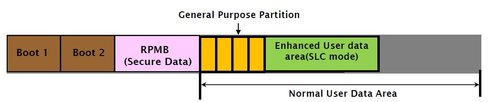
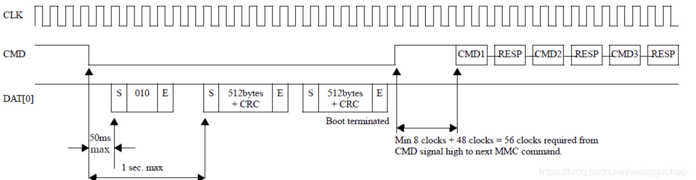
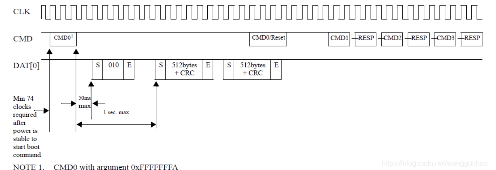
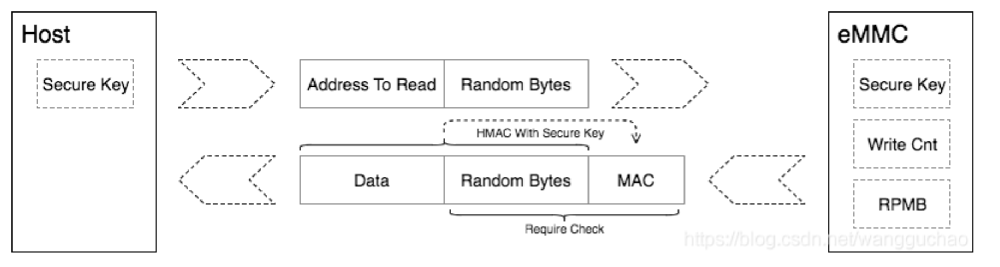
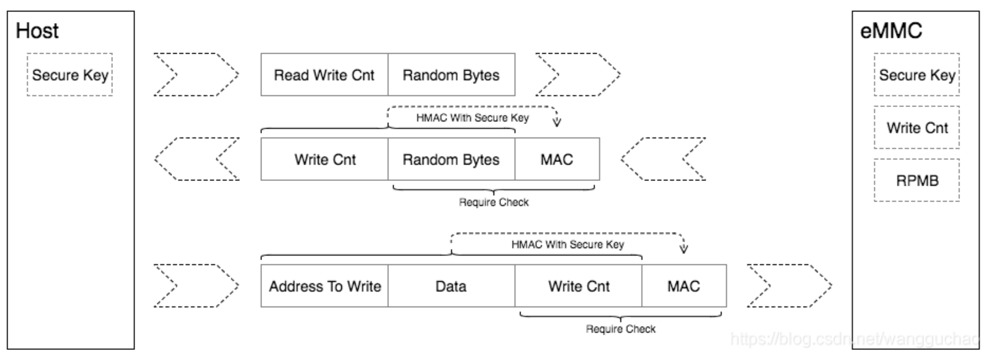
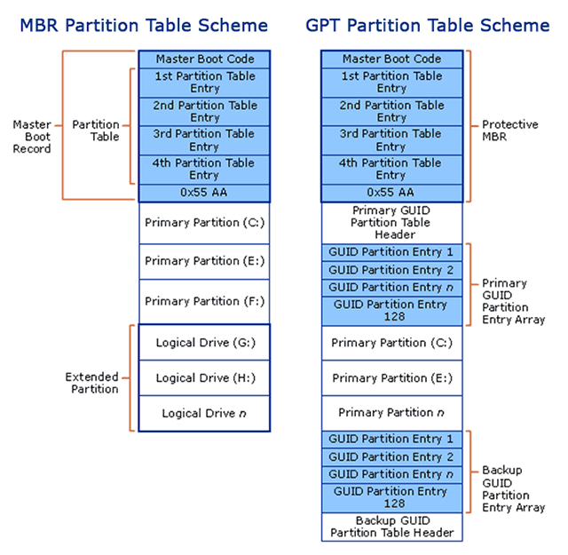

emmc driver
===========

emmc硬件特性
-----------------

emmc标准中，可将内部的Flash  Memory划分为4个区域，最多支持8个硬件分区

==========================  ================    ==================  ======================================================================
 Partitions                  NAND type              Default  size       Remarks
--------------------------  ----------------    ------------------  ----------------------------------------------------------------------
 Boot Area Partition 1       SLC Mode               128K              128k的倍数，最大支持32M
 Boot Area Partition 2       SLC Mode               128K              128k的倍数，最大支持32M
 RPMB Area Partition         SLC Mode               128K              128k的倍数，最大支持32M
 General Purlose Part        MLC or Enh             
 User Data  Area             MLC Mode 
==========================  ================    ==================  ======================================================================

boot分区
^^^^^^^^^^

Boot Area包含两个分区，主要用于存储Bootloader，支持SOC从emmc启动系统。此分区主要是为了支持从EMMC启动系统而设计的，该分区的数据，在emmc上电后
可以通过很简单的协议就可以读取出来。同时大部分的SOC都可以通过GPIO或者FUSE的配置，让ROM代码在上电后，将emmc boot分区的内容加载到soc内部的sram中执行

boot分区的大小在厂家生产过程中配置的,一般大小为4M，并且大小不能配置。计算公式如下

::

    size = 128K x BOOT_SIZE_MULT
    //一般情况下，BOOT_SIZE_MULT为32

**从boot area启动**

emmc中定义了Boot State，在Power-up、HW reset或者SW reset后，如果满足一定的条件，emmc就会进入该state。进入boot state的条件如下

在74个时钟周期后，在CMD信号首次拉低或者host发送CMD1之前，host发送参数为0xFFFFFFFA的CMD0时，会触发Alternative Boot Operation,进入boot state

在boot state下，如果有配置BOOT_ACK,emmc会先发送"010"的ack包，接着emmc会将最大为128k x BOOT_SIZE_MULT的boot data发送给host。传输过程中，host可以
通过拉高cmd信号，或者发送reset命令来中断emmc的数据发送，完成boot data传输。

.. note::
    boot data根据Extended CSD register的PARTITION_CONFIG Field的Bit[5:3]:BOOT_PARTITION_ENABLE的设定，可以从BOOT_1, BOOT_2,或者USER DATA AREA读出

**写保护**

通过设定Extended CSD register的BOOT_WP Field，可以为两个boot分区独立配置写保护的功能，以防止数据被意外篡改或者擦除

emmc中定义了两种写保护模式

- Power-on write protection: 使能后，如果emmc掉电 ，写保护功能失效，需要每次power-on后进行配置
 
- Permanennt write protection: 使能后，即使掉电也不会失效，主动进行关闭才会失效

RPMB分区
^^^^^^^^^

RPMB(Replay Protected Memory Block)是emmc中一个具有安全特性的分区。emmc在写入数据到RPMB时，会校验数据的合法性，只有指定的host才能写入。
同时在读取数据时，也提供了签名机制，保证host读取到的数据是RPMB内部数据，而不是攻击者伪造的数据

RPMB在实际应用中，通常用于存储 一些有防止非法篡改需求的数据，例如收集指纹支付相关的公钥、序列号等。RPMB可以对写入操作进行鉴权，但是读取
不需要鉴权，任何人都可以进行读取操作，因此存储到RPMB中的数据通常是进行加密后的数据。

::

    Size = 128k x RPMB_SIZE_MULT
    //一般情况下RPMB的大小为4M，即RPMB_SIZE_MULT为32.最大支持到16M

.. note::
   安全原理: emmc在产线生产时，会为每一个产品生产一个唯一的256bit的secure key，烧录到emmc的OTP区域(只能烧写一次的区域)，同时Host在安全区域中(例如TEE)
   也会保留该secure key。在emmc内部，还有一个RPMB Write Counter, RPMB每进行一次合法的写入操作时，write counter会自动加一。通过secure key和write counter的
   应用，RPMB可以实现数据写入和读取的replay protect

**RPMB数据读取**

- host向emmc发起读rpmb的请求，同时生成一个16 bytes的随机数，发送给emmc
 
- emmc将请求的数据从RPMB中读出，并使用secure key通过SHA-256算法，计算读取到的数据和接收到的随机数拼接到一起后的签名。然后emmc将读取到的数据、
  接收到的随机数、计算的签名一并发送给host

- host接收到数据、随机数以及签名后，首先比较随机数是否与自己发送的一致，如果一致，再用同样的secure key通过SHA-256算法对数据和随机数组合到一起进行
  签名，如果签名和emmc发送的一致，那么认为数据是正确的，否在认为是伪造的

**RPMB数据写入**

- host按照上面的读数据流程，读取RPMB的write counter

- host将需要写入的数据和write counter拼接到一起并计算签名，然后将数据、write counter以及签名发送给emmc

- emmc收到数据后，先对比write counter是否与当前值相同，如果相同在对数据和write counter的组合进行签名，然后与host发送的签名对比，如果相同则鉴权通过，写入RPMB中

用户分区
^^^^^^^^^^

为了更合理的管理数据，满足不同的应用需求，在实际产品中会进行软件再分区。目前主流的软件分区技术有 ``MBR(Master Boot Record)``  和 ``GPT(GUID Partition Table)`` 
两种，对比如下

软件分区技术一般是将存储介质划分为多个区域，即SW Partition，然后通过一个Partition table来维护这些SW partitions。在partition table中，每一个条目
都保存着一个分区的起始地址、大小等属性信息。软件系统在启动后，会去扫描partition table，然后根据这些信息，将各个partition加载到系统中，进行数据存取。

