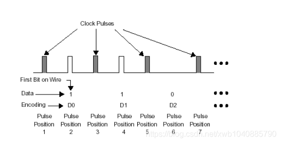
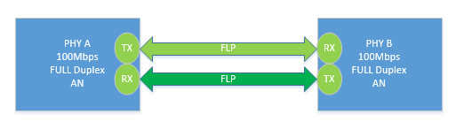
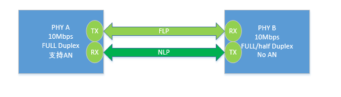
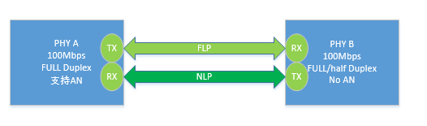
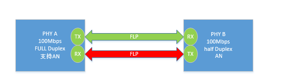
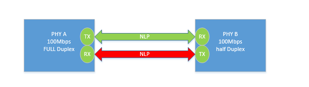

自协商原理
=================

自协商机制
------------

- 自协商是通过一种叫做快速连接脉冲(Fast Link Pulse)的信号实现的，简称FLP。自协商的双方通过FLP来交换数据

在具备自协商能力的端口在没有link的状态下，端口一直发送FLP，在FLP中包含着自己的连接能力信息，包括支持的速率能力，双工能力，流控能力等，这个能力是从自协商能力寄存器中得到的
(Auto-Negatiation Advertisement Register, PHY标准寄存器4)

依靠脉冲位置编码携带数据，一个FLP突发包含33个脉冲位置。17个奇数位置脉冲为时钟脉冲，时钟脉冲总是存在的。16个偶数位置脉冲来表示数据：此位置有脉冲表示1，此位置没有脉冲表示0。
这样一个FLP的突发就可以传输16bit的数据。

如果两端都支持自协商，则都会接收到对方的FLP，并且把FLP中的信息解码出来，得到对方的连接能力。并且把对端的自协商能力值记录在自协商对端能力寄存器中(PHY标准寄存器5)。同时把状态
寄存器(标准寄存器1)的自协商完成bit(bit5)置成1。在自协商未完成的情况下，这个bit一直为0。然后根据自己和对方的最大连接能力，选择最好的连接方式link. 一旦建立link，FLP就停止发送

并行检测
---------

为了保证在对端不能支持自协商的情况下也能连接，引入了被称为并行检测(parallel detection)的机制。在一端打开自协商，另一端关闭自协商的情况下，连接的建立就依靠并行检测功能实现

并行检测机制是这样的，在具有自协商能力的设备端口上，如果接收不到FLP，则检测是否有10M链路的特征信号或100M链路的特征信号. 

1). 如果设备是10M设备，不支持自协商，则在链路上发送普通连接脉冲(Normal Link Pulse)简称NLP。NLP仅仅表示设备在位，不包含其他的额外信息。NLP脉冲如图

2). 如果是100M设备，不支持自协商，则在没有数据的情况下，在链路上一直发送4B/5B编码的idle符号

.. note::
    并行检测机制如果检测到NLP,则知道对方支持10M速率，如果检测到4B/5B编码的idle符号，则知道对方支持100M速率。但是对方是否支持全双工，是否支持流控帧这些信息是无法得到的。
    因此在这种情况下，认为对方支持半双工，不支持全双工，不支持流控。通过并行检测建立连接后，自协商寄存器标志位需要置1

示例说明
-----------

下面说明10/100M自协商的过程，两台均支持自协商，协商100MB、全双工，A和B的设备均发送FLP携带自己的速率和模式，两台设备分别把自己的速率和模式设置最优的，链路连接成功

一台自协商和10MB设备互相连接，设备A向B发送FLP,然而B只发送NLP，设备A进行平行检测，收到B的NLP后，将本端设置10M 半双工模式

一台自协商和100MB设备互相连接，设备A向B发送FLP,然而B只发送NLP，设备A进行平行检测，收到B的NLP后，将本端设置100M 半双工模式

设备A支持自协商、全双工； 设备B支持自协商半双工，两者FLP冲突无法链接上

两者均不支持自协商，设备A是半双工、设备B是全双工 无法链接上

