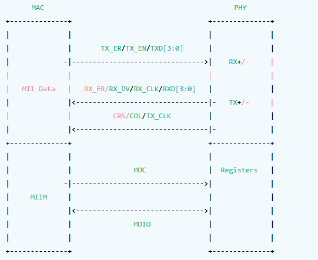
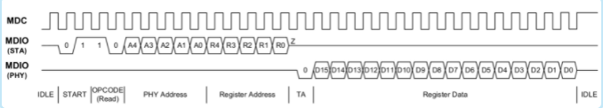
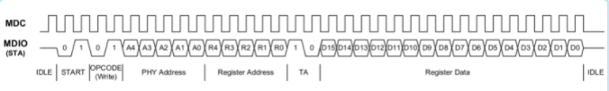
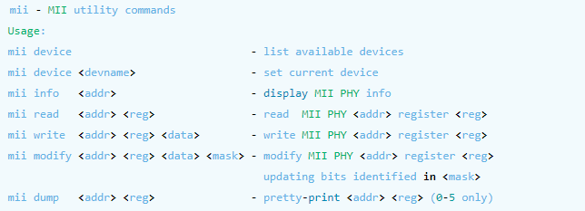
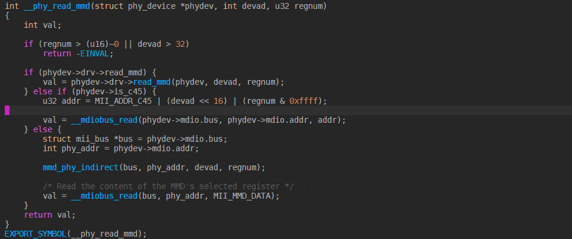

MDIO
======

MDIO原理
------------

MII是一个标准接口，用于连接MAC和PHY，MII是IEEE-802.3定义的以太网标准，MII接口可以同时控制多个PHY。MII包含两个接口

1. 一个数据接口，用户MAC和PHY之间收发Ethernet数据
2. 一个管理接口，这个管理接口通常称为MDIO,或者SMI。这个接口用于MAC从PHY读写相关管理寄存器的值

拓扑图如下

mdio包括两根信号线，分别如下:

1. MDC时钟线：MDIO的时钟信号，由MAC驱动PHY
2. MDIO数据线: 双向数据线，用于在MAC和PHY之间传输配置信息

mdio总线支持MAC作为主设备，PHY作为从设备，MDIO支持两种时许，分别为 ``Clasuse 22`` 和 ``Clause 45``

MDIO clause 22
^^^^^^^^^^^^^^^^^

MDIO clause 22是MDIO使用的一种信号时序，在这个信号时序模式，MAC先向MDIO信号线上拍32个周期，接着传输16bit的控制位。16个信号位包含了2个开始位，2bits 读写控制位，5bits的PHY地址，5bits的寄存器地址，以及2bits的
翻转位。当进行写操作时，MAC在接下来的周期中提供地址和数据。当进行读操作时，PHY会翻转MDIO之后向MDIO信号线上发送数据

- MDIO read

- MDIO write

uboot中通过命令访问MDIO
--------------------------

uboot中提供了mii工具去操作MDIO总线，用法如下

uboot中通过源码访问MDIO
-------------------------

uboot中进行MDIO操作可以参考如下代码

::
    
    /* use current device */
    devname = miiphy_get_current_dev();
    /* mdio write */
    miiphy_write (devname, addr, reg, data);
    /* mdio read */
    miiphy_read(devname, addr, reg, &val)

kernel中通过源码访问MDIO
---------------------------

::

     bs = phy_read_mmd(phydev, DP83867_DEVADDR, DP83867_STRAP_STS2);
     phy_write_mmd(phydev, DP83867_DEVADDR, DP83867_RGMIICTL, val); 

phy_read_mmd 会调用以下函数，从而达到调用mdio接口函数

用户空间通过命令访问MDIO
--------------------------

用户空间可以通过ethtool命令去访问mdio

用户空间通过源码访问MDIO
---------------------------

...待完成
