PHY标准寄存器
===============

寄存器 0h— 基本控制
------------------- 

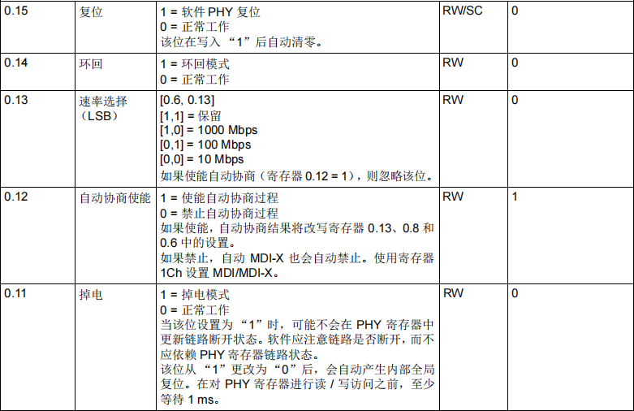

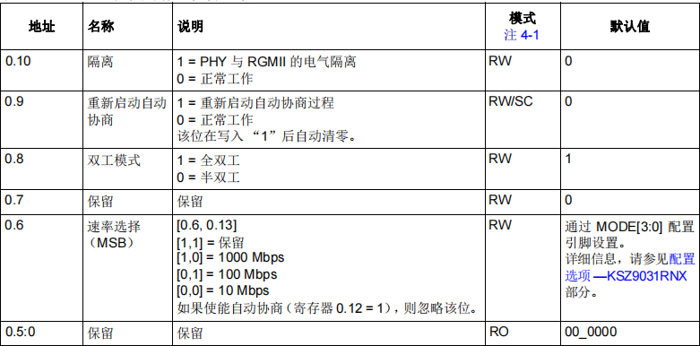

寄存器 1h— 基本状态
---------------------

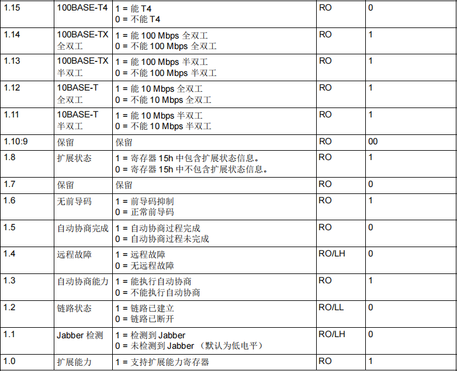

寄存器 2h—PHY 标识符 1
------------------------

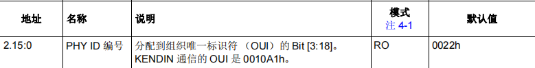

寄存器 3h—PHY 标识符 2
------------------------

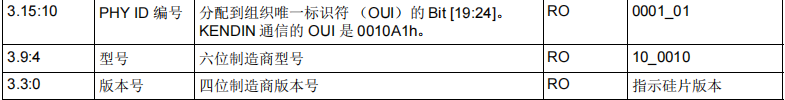

寄存器 4h— 自动协商通告
-------------------------

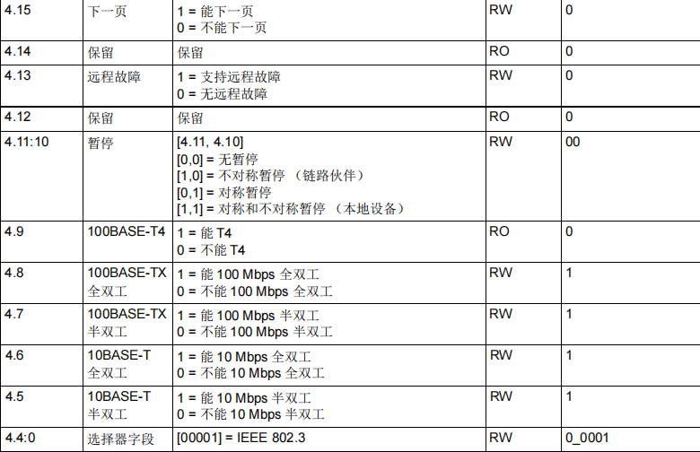

寄存器 5h— 自动协商链路伙伴能力
-----------------------------------

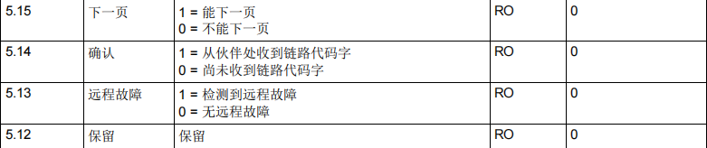

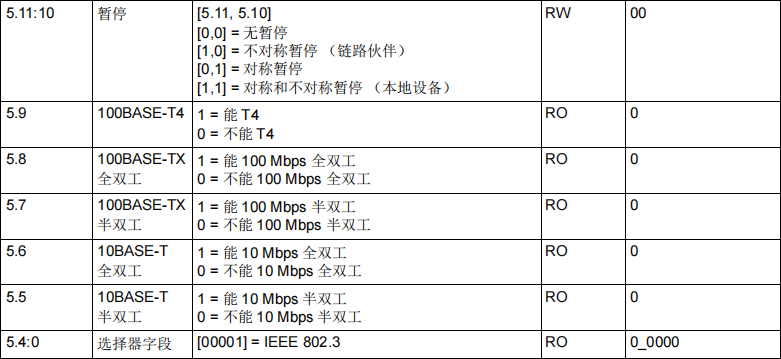

寄存器 6h— 自动协商扩展
--------------------------

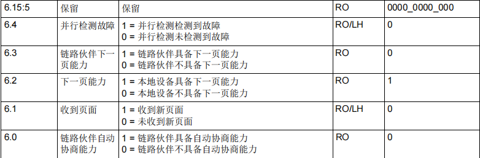

寄存器 7h— 自动协商下一页
---------------------------

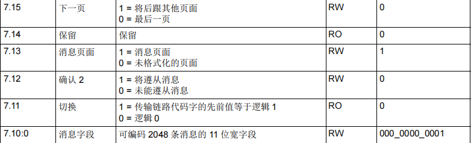

寄存器 8h— 链路伙伴下一页能力
------------------------------

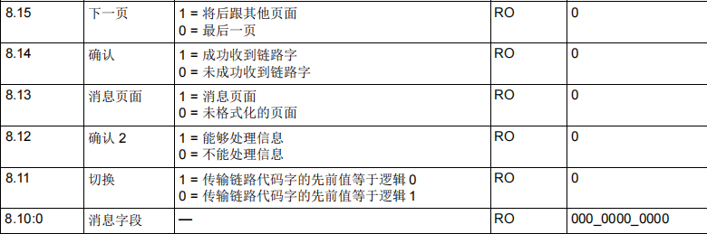

寄存器 9h—1000BASE-T 控制
---------------------------

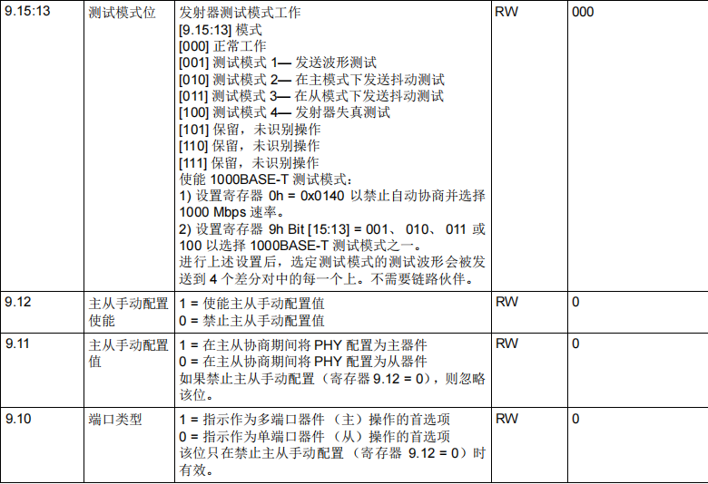

寄存器 Ah—1000BASE-T 状态
----------------------------

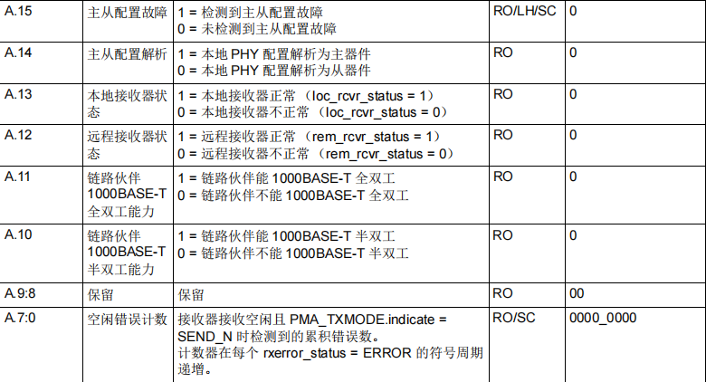

寄存器 Dh—MMD 访问 — 控制
--------------------------

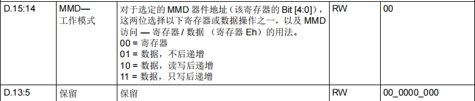

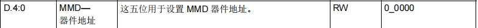

寄存器 Eh—MMD 访问 — 寄存器 / 数据
-------------------------------------

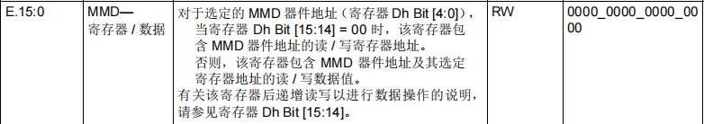

寄存器 Fh— 扩展状态
---------------------

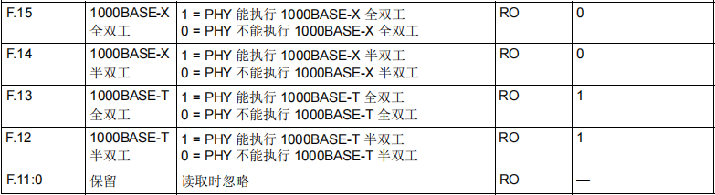
