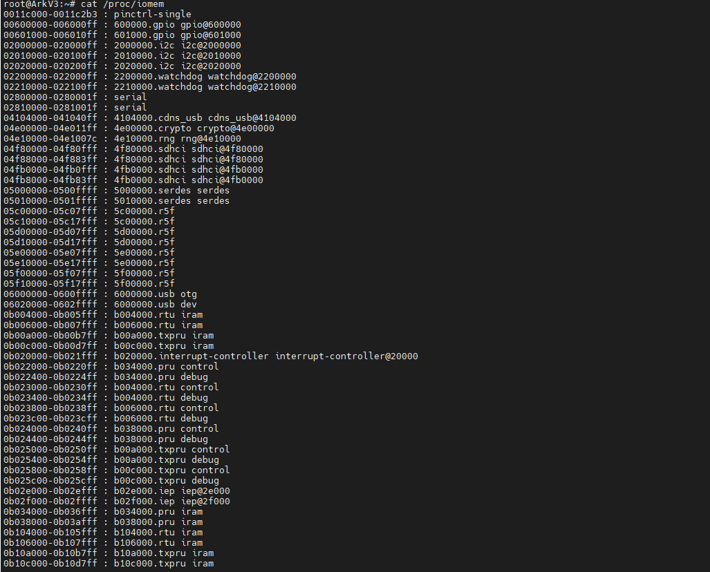

platform总线
============

概述
-----

嵌入式系统中有很多物理总线: i2c、spi、USB、uart、PCIE等。linux中引入了一种驱动管理和注册的机制platform平台总线，它是一条虚拟的总线，并不是一个物理的总线。
相比于PCI、USB等它主要用于描述SOC上的片上资源，platform所描述的资源有一个共同点:在CPU的总线上直接取址

1. platform总线相关代码: driver/base/platform.c
2. 相关结构体定义: include/linux/platform_device.h

数据结构
----------

resource结构体保存了设备资源信息

::

	//include/linux/ioport.h
	struct resource {
		resource_size_t start; //资源起始地址
		resource_size_t end;   //资源结束地址
		const char *name;
		unsigned long flags;    //资源类型
		struct resource *parent, *sibling, *child;
	};

- platform_device

::

	//include/linux/platform_device.h
	struct platform_device {
		const char  *name;        //设备的名字
		int     id;                //ID 是用来区分如果设备名字相同的时候
		bool        id_auto;
		struct device   dev;       //设备结构
		u32     num_resources;     //resource结构个数
		struct resource *resource;  //设备资源

		const struct platform_device_id *id_entry;

		/* MFD cell pointer */
		struct mfd_cell *mfd_cell;

		/* arch specific additions */
		struct pdev_archdata    archdata;
	};

- platform_driver

::

	struct platform_driver {
		int (*probe)(struct platform_device *);  //探测函数，在注册平台设备时被调用
		int (*remove)(struct platform_device *); //删除函数，在注销平台设备时被调用
		void (*shutdown)(struct platform_device *);
		int (*suspend)(struct platform_device *, pm_message_t state);
		int (*resume)(struct platform_device *);
		struct device_driver driver;              //设备驱动结构
		const struct platform_device_id *id_table;//该设备驱动支持的设备的列表
		bool prevent_deferred_probe;
	};

resource
---------

linux platform驱动中常见的几种资源如下:

::

	#define IORESOURCE_IO		0x00000100	/* PCI/ISA I/O ports */
	#define IORESOURCE_MEM		0x00000200
	#define IORESOURCE_REG		0x00000300	/* Register offsets */
	#define IORESOURCE_IRQ		0x00000400
	#define IORESOURCE_DMA		0x00000800
	#define IORESOURCE_BUS		0x00001000

我们主要分析前三种资源，即IO，MEM，REG

几乎每一种外设都是通过读写设备上的寄存器来进行的，外设的寄存器通常被连续的编址。根据CPU体系结构的不同，CPU对IO端口的编址方式有两种

1. I/O映射方式(I/O-mapped)

典型的，如X86处理器为外设专门实现了一个单独的地址空间，称为i/o地址空间或i/o端口空间

2. 内存映射方式(memory-mapped)

RISC指令系统的CPU(如ARM)通常只实现一个物理地址空间，像这种情况，外设的I/O端口的物理地址就被映射到内存地址空间中，外设I/O端口称为内存的一部分。此时CPU可以像访问一个内存单元
那样去访问外设I/O端口，而不需要设立专门的外设I/O指令

我们先分析一下资源树的总信息，然后再分析如何把资源加入到资源树中

::

	[kernel/resource.c]
	struct resource ioport_resource = {
	    .name   = "PCI IO",
	    .start  = 0,
	    .end    = IO_SPACE_LIMIT,
	    .flags  = IORESOURCE_IO,
	};
	EXPORT_SYMBOL(ioport_resource);

	struct resource iomem_resource = {
	    .name   = "PCI mem",
	    .start  = 0,
	    .end    = -1,
	    .flags  = IORESOURCE_MEM,
	};
	EXPORT_SYMBOL(iomem_resource);

可以使用 ``cat /proc/iomem`` 来查看已经插入的资源

实际的插入动作由 __insert_resource函数完成

::

	/*
	 * Insert a resource into the resource tree. If successful, return NULL,
	 * otherwise return the conflicting resource (compare to __request_resource())
	 */
	static struct resource * __insert_resource(struct resource *parent, struct resource *new)
	{
		struct resource *first, *next;
	 
		/* 注意这里是个循环,失败了也是会继续更新parrnt尝试插入的,除非返回值为NULL,或new相对与parent无效 */
		for (;; parent = first) {
			first = __request_resource(parent, new);    /* 返回NULL表示已经插入 */
			if (!first)
				return first;    /* NULL表示已经插入,这里直接返回 */
	 
			if (first == parent)        /* 插入的超过root范围或插入范围无效 */
				return first;
			if (WARN_ON(first == new))	/* duplicated insertion 重复插入个资源 */
				return first;
	 
			/* 失败节点,的start大于new->start 或  失败节点的end小于new->end*/
			if ((first->start > new->start) || (first->end < new->end))
				break;
			/* new和某段资源重复了 */
			if ((first->start == new->start) && (first->end == new->end))
				break;
		}
	 
		/* 到这里表示通过break出来的,即要插入的资源和资源池里面的资源有重叠 */
		for (next = first; ; next = next->sibling) {
			/* Partial overlap? Bad, and unfixable,部分重叠会认为是bad, */
			if (next->start < new->start || next->end > new->end)
				return next;
			if (!next->sibling)    
				break;
			if (next->sibling->start > new->end)    /* 找到的某个资源的start大于new->end,即new资源整个都小于next->siblig,即可能可以做next->siblig节点的child */
				break;
		}
	 
		new->parent = parent;        /* new的parent指向根节点 */
		new->sibling = next->sibling;    /* new的sibling指向上一个节点(new < next) */
		new->child = first;            /* 挂接属于new范围内的资源到new里面 */
	 
		next->sibling = NULL;
		for (next = first; next; next = next->sibling)
			next->parent = new;
	 
		if (parent->child == first) {
			parent->child = new;
		} else {
			next = parent->child;
			while (next->sibling != first)
				next = next->sibling;
			next->sibling = new;
		}
		return NULL;
	}

- 几个常用的资源注册函数

 
::

	[lib/devres.c]
	/**
	 * devm_ioremap_resource() - check, request region, and ioremap resource
	 * @dev: generic device to handle the resource for
	 * @res: resource to be handled
	 *
	 * Checks that a resource is a valid memory region, requests the memory
	 * region and ioremaps it. All operations are managed and will be undone
	 * on driver detach.
	 *
	 * Returns a pointer to the remapped memory or an ERR_PTR() encoded error code
	 * on failure. Usage example:
	 *
	 *  res = platform_get_resource(pdev, IORESOURCE_MEM, 0);
	 *  base = devm_ioremap_resource(&pdev->dev, res);
	 *  if (IS_ERR(base))
	 *      return PTR_ERR(base);
	 */
	void __iomem *devm_ioremap_resource(struct device *dev,
	  				  const struct resource *res)
	{
	    resource_size_t size;
	    void __iomem *dest_ptr;

	    BUG_ON(!dev);

		//通常ioremap的都是mem资源，如果不是则退出
	    if (!res || resource_type(res) != IORESOURCE_MEM) {
	  	  dev_err(dev, "invalid resource\n");
	  	  return IOMEM_ERR_PTR(-EINVAL);
	    }

	    size = resource_size(res);	//得到资源的大小

		//请求资源
	    if (!devm_request_mem_region(dev, res->start, size, dev_name(dev))) {
	  	  dev_err(dev, "can't request region for resource %pR\n", res);
	  	  return IOMEM_ERR_PTR(-EBUSY);
	    }
		//ioremap映射物理地址到虚拟地址
	    dest_ptr = devm_ioremap(dev, res->start, size);
	    if (!dest_ptr) {
	  	  dev_err(dev, "ioremap failed for resource %pR\n", res);
	  	  devm_release_mem_region(dev, res->start, size);
	  	  dest_ptr = IOMEM_ERR_PTR(-ENOMEM);
	    }

	    return dest_ptr;
	}
	EXPORT_SYMBOL(devm_ioremap_resource);

::

	#define devm_request_mem_region(dev,start,n,name) \
	__devm_request_region(dev, &iomem_resource, (start), (n), (name))

	  struct resource *
	  __devm_request_region(struct device *dev, struct resource *parent,
					resource_size_t start, resource_size_t n, const char *name)
	  {
		  struct region_devres *dr = NULL;
		  struct resource *res;

		  //申请空间，管理资源
		  dr = devres_alloc(devm_region_release, sizeof(struct region_devres),
					GFP_KERNEL);
		  if (!dr)
			  return NULL;

		  dr->parent = parent;	//初始化
		  dr->start = start;
		  dr->n = n;

		  res = __request_region(parent, start, n, name, 0);
		  if (res)
			  devres_add(dev, dr);	//把申请到的资源加入到该设备中
		  else
			  devres_free(dr);

		  return res;
	  }
	  EXPORT_SYMBOL(__devm_request_region);

::

	/**
   * __request_region - create a new busy resource region
   * @parent: parent resource descriptor
   * @start: resource start address
   * @n: resource region size
   * @name: reserving caller's ID string
   * @flags: IO resource flags
   */
  struct resource * __request_region(struct resource *parent,
                     resource_size_t start, resource_size_t n,
                     const char *name, int flags)
  {
      DECLARE_WAITQUEUE(wait, current);
      struct resource *res = alloc_resource(GFP_KERNEL);
  
      if (!res)
          return NULL;
  
      //填充资源信息
      res->name = name;
      res->start = start;
      res->end = start + n - 1;
  
      write_lock(&resource_lock);
  
      for (;;) {
          struct resource *conflict;
  
          res->flags = resource_type(parent) | resource_ext_type(parent);
          res->flags |= IORESOURCE_BUSY | flags;
          res->desc = parent->desc;
  
          conflict = __request_resource(parent, res);
          if (!conflict)
              break;
          /*
           * mm/hmm.c reserves physical addresses which then
           * become unavailable to other users.  Conflicts are
           * not expected.  Warn to aid debugging if encountered.
           */
          if (conflict->desc == IORES_DESC_DEVICE_PRIVATE_MEMORY) {
              pr_warn("Unaddressable device %s %pR conflicts with %pR",
                  conflict->name, conflict, res);
          }
          if (conflict != parent) {
              if (!(conflict->flags & IORESOURCE_BUSY)) {
                  parent = conflict;
                  continue;
              }
          }
          //如果这个资源是多个设备使用的话，把这个设备加入到等待队列，资源可用时再唤醒
          if (conflict->flags & flags & IORESOURCE_MUXED) {
              add_wait_queue(&muxed_resource_wait, &wait);
              write_unlock(&resource_lock);
              set_current_state(TASK_UNINTERRUPTIBLE);
              schedule();

platform_device注册
---------------------

::

	[drivers/base/platform.c]
	int platform_device_register(struct platform_device *pdev)
	{
		device_initialize(&pdev->dev);
		  	|--dev->kobj.kset = devices_kset;
		  	|--kobject_init(&dev->kobj, &device_ktype);
		  	|--INIT_LIST_HEAD(&dev->dma_pools);
		  	|--mutex_init(&dev->mutex);
		  	|--lockdep_set_novalidate_class(&dev->mutex);
		  	|--spin_lock_init(&dev->devres_lock);
		  	|--INIT_LIST_HEAD(&dev->devres_head);
		  	|--device_pm_init(dev);
		  	|--set_dev_node(dev, -1);
		  	|--INIT_LIST_HEAD(&dev->links.consumers);
		  	|--INIT_LIST_HEAD(&dev->links.suppliers);
		  	|--dev->links.status = DL_DEV_NO_DRIVER;
		arch_setup_pdev_archdata(pdev);
		return platform_device_add(pdev);
	}

::

	int platform_device_add(struct platform_device *pdev)
	{
		u32 i;
		int ret;

		if (!pdev)
			return -EINVAL;

		if (!pdev->dev.parent)
			pdev->dev.parent = &platform_bus;	//设置总线的父设备为平台设备

		pdev->dev.bus = &platform_bus_type;		//设备挂接在平台总线下

		switch (pdev->id) {
		default:	//设置设备标号
			dev_set_name(&pdev->dev, "%s.%d", pdev->name,  pdev->id);
			break;
		case PLATFORM_DEVID_NONE:	//-1表示不需要设备标号
			dev_set_name(&pdev->dev, "%s", pdev->name);
			break;
		case PLATFORM_DEVID_AUTO:	//由总线自行分配
			/*
			 * Automatically allocated device ID. We mark it as such so
			 * that we remember it must be freed, and we append a suffix
			 * to avoid namespace collision with explicit IDs.
			 */
			ret = ida_simple_get(&platform_devid_ida, 0, 0, GFP_KERNEL);
			if (ret < 0)
				goto err_out;
			pdev->id = ret;
			pdev->id_auto = true;
			dev_set_name(&pdev->dev, "%s.%d.auto", pdev->name, pdev->id);
			break;
		}

		//对该设备的资源插入资源树
		for (i = 0; i < pdev->num_resources; i++) {
			struct resource *p, *r = &pdev->resource[i];

			if (r->name == NULL)
				r->name = dev_name(&pdev->dev);	//如果没有设置资源名字则和设备名一样

			p = r->parent;
			if (!p) {
				if (resource_type(r) == IORESOURCE_MEM) //如果没有父节点则检查资源是否是MEM或者IO
					p = &iomem_resource;	//iomem资源树
				else if (resource_type(r) == IORESOURCE_IO)
					p = &ioport_resource;
			}

			if (p) {
				ret = insert_resource(p, r);	//插入资源
				if (ret) {
					dev_err(&pdev->dev, "failed to claim resource %d: %pR\n", i, r);
					goto failed;
				}
			}
		}

		pr_debug("Registering platform device '%s'. Parent at %s\n",
			 dev_name(&pdev->dev), dev_name(pdev->dev.parent));

		//增加设备，节点，sysfs信息
		ret = device_add(&pdev->dev);
		if (ret == 0)
			return ret;

	 failed:
		if (pdev->id_auto) {
			ida_simple_remove(&platform_devid_ida, pdev->id);
			pdev->id = PLATFORM_DEVID_AUTO;
		}

		while (i--) {
			struct resource *r = &pdev->resource[i];
			if (r->parent)
				release_resource(r);
		}

	 err_out:
		return ret;
	}

