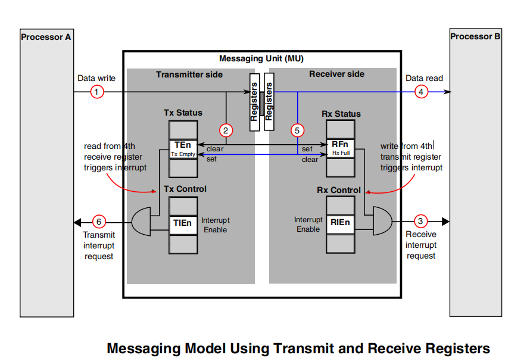
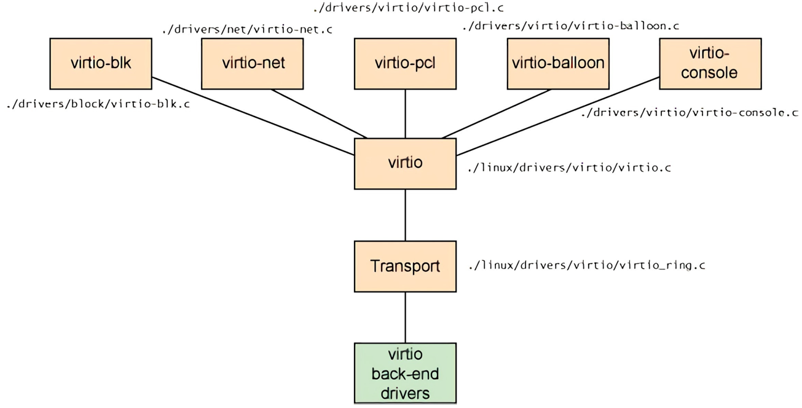

A核与M核异构通信过程解析
===========================

硬件层通信实现原理
---------------------

通过物理内存DDR分配，将硬件层分了两部分, ``TXVring Buffer(发送虚拟环形缓冲区)`` 和 ``RXVring Buffer(接收虚拟环形缓冲区)`` ,其中M核
从TXVring区发送数据，从RXVring区接收数据，A核则反之．

处理器支持消息传递单元(MessagingUnit, 简称MU)功能模块，通过MU传递消息进行通信和协调，M核和A核之间通过寄存器中断的方式传递命令，最多
支持4组MU双向传递消息，即可通过中断告知对方数据传递的状态，也可发送最多4字节数据，还可在低功耗模式下唤醒对方，是保证双核通信实时性
的重要手段．

下图展示了，CORE-A向CORE-B传递消息的具体过程．

驱动层Virtio下的RPMsg通信实现
------------------------------

virio是一个通用的I/O虚拟化框架，位于设备之上的抽象层，负责前后端之间的通知机制和控制流程，为异构多核间数据通信提供了层的实现．
hypervisor通过他模拟出一系列的虚拟化设备，例如:virio-net, virio-blk等．并使得这些设备在虚拟机内部通过api调用的方式变得可用．
它包含四个部分: ``前端驱动`` , ``后端驱动`` , ``vring`` 及 ``通信间统一的接口`` . 与其他的模拟I/O方式相比，virio减少了虚拟机
的退出和数据拷贝，能极大的提高I/O性能．

- virio前端驱动

virio前端驱动位于linux内核中，针对不同类型的设备有不同类型的驱动程序，包括virio-net, virio-blk, virio-pci等．这些驱动程序与后端驱动
交互的接口都是统一的．

- virio层

virio层实现虚拟队列接口，作为前后端通信的桥梁，不同类型的设备使用的虚拟队列数量不同，例如virio-net使用两个虚拟队列，一个用于接收，
一个用于发送．virio-blk驱动仅使用一个虚拟队列．

- virio-ring层

virio-ring是虚拟队列的具体实现，其中实现了环形缓冲区(ring buffer)，用于保存前端驱动和后端处理程序执行的信息，并且它可以一次性保存
前端驱动的多次I/O请求，交由后端驱动去批量处理．

应用层双核通信实现方式
-----------------------

