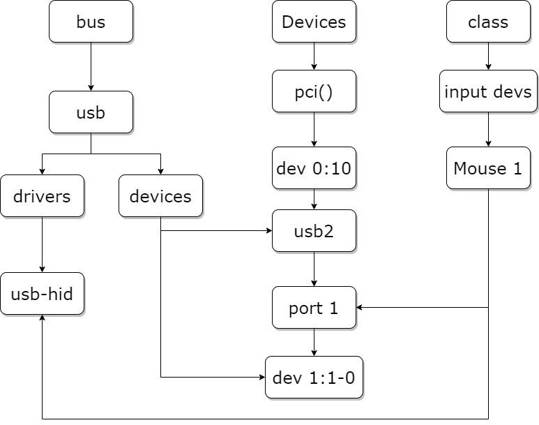

sysfs、udev以及它们背后的linux统一设备模型
==========================================

sysfs
-----

sysfs是一个基于内存的虚拟的文件系统，有kernel提供，挂载到/sys目录下，负责以设备树的形式向user space提供直观的设备和驱动信息。

sysfs以不同的视角展示当前系统接入的设备：

- /sys/block 历史遗留问题，存放块设备，提供一设备名(如sda)到/sys/devices的符号链接

- /sys/bus 按总线类型分类，在某个总线目录之下可以找到链接该总线的设备的符号链接，指向/sys/devices. 某个总线目录之下的drivers目录
  包含了该总线所需的所有驱动的符号链接。对应卡尔呢了中的struct bus_type

- /sys/calss 按设备功能分类，如输入设备在/sys/class/input之下，图形设备在/sys/class/graphics之下，是指向/sys/devices的符号链接。
  对应kernel中的struct class

- /sys/dev 按设备驱动程序分层(字符设备 块设备)，提供以major:minor为名到/sys/devices的符号链接。 对应Kernel中的struct device_driver

- /sys/devices 包含所有被发现的注册在各种总线上的各种物理设备。
  所有物理设备都按其在总线上的拓扑结构来显示，除了platform devices和system devices。
  platform devices 一般是挂载在芯片内部高速或者低速总线上的各种控制器和外设，能被CPU直接寻址。
  system devices不是外设，而是芯片内部的核心结构，比如CPU，timer等。对应kernel中的strcut device

- /sys/firmware 提供对固件的查询和操作接口(关于固件有专用于固件加载的一套api)

- /sys/fs 描述当前加载的文件系统，提供文件系统和文件系统已挂载的设备信息。

- /sys/kernel 提供kernel所有可调整参数，但大多数可调整参数依然存放在sysctl(/proc/sys/kernel)

- /sys/module 所有加载模块(包括内联、编译进kernel、外部的模块)信息，按模块类型分类。

- /sys/power 电源选项，可用于控制整个机器的电源状态，如写入控制命令进行关机、重启等。

sysfs支持多视角查看，通过符号链接，同样的信息可出现在多个目录下。

以硬盘sda为例，既可以在块设备目录/sys/block下找到，又可以在/sys/devices/pci0000:00/0000:00:10.0/host32/target32:0:0/下找到

统一设备模型
------------

sysfs的功能基于linux的统一设备模型，其由以下结构组成：

kobject
^^^^^^^

统一设备模型中最基本的对象

- kobject

::

    struct kobject{
        const char *name;               //名称，将在sysfs中作为文件名
        struct list_head entry;         //加入kset链表的结构
        struct kobject *parent;         //父节点指针，构成树状结构
        struct kset *kset;              //指向所属的kset
        struct kobj_type *ktype;        //类型
        struct kernfs_node *sd;         //指向所属(sysfs)目录项
        struct kref kref;               //引用计数

        unsigned int state_initialized:1;           //是否已经初始化
        unsigned int state_in_sysfs:1;              //是否已经在sysfs中显示
        unsigned int state_add_uevent_sent:1;       //是否已经向user space发送add uevent
        unsigned int state_remove_uevent_sent:1;
        unsigned int uevent_suppress:1;             //是否忽略上报
    };

其中 kobj_type结构如下

::

    struct kobj_type{
        void (*release)(struct kobject *kobj);          //析构函数，kobject的引用计数为0时调用
        const struct sysfs_ops *sysfs_ops;              //操作函数，当用户读取sysfs属性时调用show(),写入sysfs属性时调用store()
        struct attribute **default_attrs;               //默认属性，体现为该kobject目录下的文件
        const struct kobject_ns_type_operations *(*child_ns_type)(struct kobject *kobj);   //namespace 操作函数
        const void *(*namespace)(struct kobject *kobj);
    };

实际上这里实现的类似与对kobject的派生，包含不同kobj_type的kobject可以看作不同的子类。通过实现相同的函数来实现多态。
每一个kobject的数据结构(如kset、device、device_driver等)，都要实现自己的kobj_type，并实现其中的函数。

kobj_type的定义会如实的在sysfs中反映，其中的属性attribute会以attribute.name为文件名在该目录下创建文件，对该文件进行读写会调用
sysfs_ops 中定义的show()和store()

- kset

kobject的容器，维护了其包含的kobject链表，链表的最后一项指向kset.kobj，用于表示某一类型的kobject

::

    struct kset{
        struct list_head list;          //kobject链表头
        spinlock_t list_lock;           //自旋锁，保障操作安全
        struct kobject kobj;            //自身的kobject
        const struct kset_uevent_ops *uevent_ops;       //uevent 操作函数集。
    };

注意和kobj_type的关联，kobject会利用成员kset找到自己所属的kset，设置自身的ktype为kset.kobj.ktype。当没有指定的kset成员时，才会用ktype来建立关系。

此外，kobject调用的是它所属的kset的uevent操作函数来发送uevent，如果kobject不属于任何kset，则无法发送uevent

- device/driver/bus/class

linux设备模型的更上一层的表述是device/driver/bus/class。他们都定义在include/linux/device.h中

1)  /sys/bus 目录下的每个子目录都是注册好了的总线类型，每个子目录下包含两个子目录(devices和driver文件夹)。其中devices下是该总线类型下的所有设备，
    这些设备都是符号链接，指向/sys/devices。

2)  /sys/devices 目录是是全局设备结构体系，包含所有被发现的注册在总线上的各种物理设备。

3)  /sys/class  目录则是包含所有注册在kernel中的设备类型。

下图是一个usb设备的设备去驱动拓扑图

在总线上管理着两个链表，分别管理着设备和驱动，当我们向系统注册一个驱动时，便会向驱动的管理链表插入我们的新驱动，同样当我们向系统注册一个设备时，便会
向设备的管理链表插入我们的新设备。在插入的同时总线会执行一个 ``bus_type`` 结构体中的 ``match`` 方法对新插入的设备/驱动进行匹配。匹配成功后会调用
device_driver结构体中probe方法，移除驱动或者设备时调用device_driver结构体中的remove方法。

- device

device描述了一项设备，对应数据结构device

::

    struct device{
        struct device *parent;
        struct device_private *p;
        strcut kobject kobj;
        const char *init_name;
        const struct device_type  *type;
        struct mutex mutex;
        struct bus_type *bus;
        struct device_driver *driver;
        struct class *class;
    };

1)  **init_name**:指定设备名字
2)  **parent**:表示该设备的父对象
3)  **bus**:表示该设备挂载在哪条总线，当我们注册设备时，内核便会将该设备注册到对应的总线。
4)  **driver**:表示该设备对应的驱动

可以使用以下函数注册和注销设备

::

    int device_register(struct device *dev);
    void device_unregister(struct device *dev);

其中维护了类型为device_private的指针p

::

    struct device_private{
        struct klist list_children;
        struct klist_node knode_parent;
        struct klist_node knode_driver;
        struct klist_node knode_bus;
        struct list_head deferred_probe;
        struct device *device;
    };

klist_node 用来作为所属driver链表，所属bus链表中的节点。

设备通过device_register来注册到系统中，通过device_unregister来从系统中卸载。

- driver

设备依赖于driver来进行驱动，对应的数据结构为device_driver

::

    struct device_driver{
        const char *name;   
        struct bus_type *bus;
        
        strcut module *owner;
        const char *mod_name;
        
        bool suppress_bind_attrs;
        enum probe_type probe_type;
        
        const strcut of_device_id *of_match_table;
        const struct acpi_device_id *acpi_match_table;

        int(*probe)(strcut device *dev);
        int(*remove)(struct device *dev);
        void (*shutdown)(struct device *dev);
        int(*suspend)(struct device *dev, pm_message_t state);
        int(*resume)(struct device *dev);
        const struct attribute_group **groups;
        const struct dev_pm_ops *pm;

        struct driver_private *p;
    };

1) **name**:指定驱动名称
2) **bus**:表示驱动依赖于哪个总线
3) **suppress_bind_attrs**:用于指定是否通过sysfs导出bind与unbind文件，bind和unbind文件时驱动用于绑定/解绑关联的设备。
4) **of_match_table**:指定驱动支持的设备类型，当内核使能设备树时，会利用该成员与设备树中的 ``compatible`` 属性进行比较
5) **probe**:驱动与设备匹配后会执行该回调函数。
6) **groups**:表示驱动的属性

其中维护了类型为driver_private的指针p

::

    struct driver_private{
        struct kobject kobj;
        struct klist klist_device;
        struct klist_node knode_bus;
        struct module_kobject *mkobj;
        struct device_driver *driver;
    };

其维护了dirver自身的私有属性，比如由于他也是kobject的子类，因此包含了kobj。可通过driver_cteate_file/ dirver_remove_file来增删属性，属性将直接作用于p->kobj.

- bus

设备总是挂载在某一条总线上的，对应的数据结构为bus_type

::

    struct bus_type{
        const char *name;
        const char *dev_name;
        struct device *dev_root;
        struct device_attribute *dev_attrs;
        const struct attribute_group **bus_groups;
        const struct attribute_group **dev_groups;
        const struct attribute_group **drv_groups;

        int (*match)(struct device *dev, struct device_driver *drv);
        int (*uevent)(struct device *dev, struct kobj_uvent_env *env);
        int (*probe)(struct device *dev);
        int (*remove)(struct device *dev);
        void (*shutdown)(struct device *dev);

        int (*online)(struct device *dev);
        int (*offline)(struct device *dev);

        int (*suspend)(struct device *dev,pm_message_t state);
        int (*resume)(struct device *dev);

        struct subsys_private *p;
        struct lock_class_key lock_key;
    };

1)  **name**:指定总线名称，会在/sys/bus目录下创建一个新的目录，目录名称就是该参数的值
2)  **bus_groups,dev_groups,drv_groups**:分别表示总线、设备、驱动的属性。这些属性可以时内部变量、字符串等等，
3)  **match**:当向总线注册一个新的设备或者新的驱动时，会调用该回调函数。
4)  **uevent**:当总线上的设备发生添加、移除就会调用该函数。
5)  **probe**:设备和驱动匹配后会调用该函数。
6)  **p**:该结构它用于存放特定的私有数据，其成员klist_devices和klist_drivers记录了挂载在该总线上的设备和驱动。

通过以下函数注册和注销bus

::

    int bus_register(struct bus_type *bus);
    void bus_ungister(struct bus_type *bus);

其中维护了类型为subsys_private的指针P

::

    struct subsys_private{
        struct kset subsys;
        struct kset *devices_kset;
        struct list_head interface;
        struct mutex mutex;

        struct kset *drivers_kset;
        struct klist klist_devices;
        struct klist klist_drivers;
        struct blocking_nottifier_head bus_notifier;
        unsigned int drivers_autoprober:1;
        struct bus_type *bus;

        struct kset glue_dirs;
        struct class *class;
    };

它维护了bus自身的私有属性，它维护了挂载在该总线上的设备集合device_kset和与该总线相关的驱动程序集合drivers_kset

对应到sysfs中，每个bus_type对象对应/sys/bus目录下的一个子目录，子目录下必有devices和dirver文件夹，里面存放指向设备和驱动的符号链接。

下图是总线上关联设备和驱动之后的数据结构关系图：

.. image::  res/linux_device_driver_bus.png

- class

class对应一种设备分类，对应的数据结构为class

::

    struct class{
        const char *name;
        struct module *owner;

        struct class_attribute *class_attrs;
        const struct attribute_group **dev_grpoups;
        struct kobject *dev_kobj;

        int (*dev_uevent)(struct device *dev,struct kobj_uvent_env *env);
        char *(*devnode)(struct device *dev, umode_t *mode);

        void (*class_release)(struct class *class);
        void (*dev_release)(struct device *dev);

        int (*suspend)(struct device *dev,pm_message_t state);
        int (*resume)(struct device *dev);
        int (*shutdown)(struct device *dev);

        const struct kobj_ns_type_operation *ns_type;
        const void *(*namespace)(struct device *dev);

        const struct dev_pm_ops *pm;

        struct subsys_private *p;
    };

class 只是一种抽象的概念，用于描述接口相似的一类设备。

- 小结

device driver bus class四者之间存在着这样的关系：

driver用于驱动device，其保存了所有能够被它所驱动的设备链表。

bus是连接CPU和device的桥梁，其保存了所有挂载在它上面的设备链表和驱动这些设备的驱动链表。

class用于描述一类device，其保存了所有该类device的设备链表。

- attribute

用于定义设备模型中的各项属性，基本属性有两种，分别为普通属性attribute和二进制属性bin_attribute

::

    struct attribute{
        const char *name;
        umode_t mode;
        #ifdef CONFIG_DEBUG_LOCK_ALLOC
        bool ignore_lockdep:1;
        struct lock_class_key *key;
        struct lock_class_ket skey;
        #endif 
    };

    struct bin_attribute{
        struct attribute attr;
        size_t size;
        void *private;
        ssize_t (*read)(struct file *,struct kobject *,struct bin_attribute *,char *, loff_t , size_t);
        ssize_t (*write)(struct file *,struct kobject *,struct bin_attribute *,char *, loff_t ,size_t);
        int (*mmap)(struct file *,struct kobject *,struct bin_attribute *attr, struct vm_area_struct *vma);
    };

使用attribute生成的sysfs文件，只能用字符串的形式读写，而struct bin_attribute在attribute的基础上，增加了read、write函数，因此
它生成的sysfs文件可以用任何方式读写。

- attribute_gpoup

顾名思义就是属性组，将一组属性打包成一个对象，其包含了以attribute和bin_attribute指针数组。

::

    struct attribute_group{
        const char *name;
        umode_t (*is_visible)(struct kobject *,struct attribute *,int);
        umode_t (*is_bin_visible)(struct kobject *, struct bin_attribute *, int);
        struct attribute **attrs;
        struct bin_attribute **bin_attrs;
    };

- sysfs 映射

sysfs本质上是对统一设备模型中的各结构的映射。换句话说sysfs本质上就是通过vfs接口去读写kobject的层次结构后动态建立的内存文件系统。

::

    int __init sysfs_init(void)
    {
        int err;

        sysfs_root = kernfs_create_root(NULL, KERNFS_ROOT_EXTRA_OPEN_PERM_CHEACK, NULL);
        if(IS_ERR(sysfs_root))
            return PTR_ERR(sysfs_root);

        sysfs_root_kn = sysfs_root->kn;

        err = register_filesystem(&sysfs_fs_type);
        if(err)
        {
            kernfs_destroy_root(sysfs_root);
            return err;
        }
        return 0;
    }

sysfs_init通过kernfs_create_root创建新的kernfs层级，然后将其保存在静态全局变量中，供各处使用，然后通过register_filesystem将其注册到名
为sysfs的文件系统中。

- 目录映射

kobject 在sysfs中对应的是目录(dir)

当我们注册一个kobject时，会调用kobject_add 于是

::

    kobject_add===>kobject_add_varg===>kobject_add_internal===>create_dir====>sysfs_create_dir_ns

如果kobj有parent，则它的父节点为kobj->parent->sd

- 属性映射

属性在sysfs中对应的是文件(file)

当需要为设备添加属性时，可以调用device_create_file，于是

::

    deivice_create_file===>sysfs_create_file===>sysfs_create_file_ns====>sysfs_add_file_mode_ns===>__kernfs_create_file

创建的文件大小即为存放该属性值的长度，对于普通属性来说，大小为 PAGE_SIZE(4K)，而对于二进制属性来说，大小由属性自定义，即 bin_attribute.size 指定。

当用户对属性文件进行读写时，会调用绑定的读写函数，比如对于 mode 为 SYSFS_PREALLOC 且 kobj->ktype->sysfs_ops 定义了 show 和 store 函数的属性，
绑定是 sysfs_prealloc_kfops_rw 。这里的 kobj 指的是该属性的父节点，也就是属性所属设备的 kobj。

于是在读文件时，调用 sysfs_kf_read ，它会根据属性文件找到其父节点类型对应的 sysfs_ops ，然后调用 sysfs_ops.show 。show 需要将输出写到传入的 buf 缓冲区中，
并返回写入的长度。

在写文件时，调用 sysfs_kf_write ，它会根据属性文件找到其父节点类型对应的 sysfs_ops ，然后调用 sysfs_ops.store 。 store 可以从传入的 buf 缓冲区中，
读取用户写入的长度为 len 的内容。

但是需要注意的是， sysfs_ops 中的 show 和 store 函数并非是读写我们属性所需要的 show 和 store 。因为一个设备只有一个类型，因此 sysfs_ops 打扰 show 和 store
只有一种实现，但实际上 show 和 store 应该根据属性的不同而不同。怎么办呢？绕个弯子：在调用 sysfs_ops.show 和 sysfs_ops.store 时传入属性 attribute 的指针，
然后在函数中将指针转换为设备类型对应属性的指针后调用属性的 show 和 store 函数。这也就是 device_attribute 、 class_attribute 或一些设备自定义属性
(比如 cpuidle_driver_attr) 中定义有 show 和 store 函数的原因。

uedev
------

udev完全工作在用户空间，当一个设备被插入或者移除时，内核会通过netlink套接字发送设备详细信息到用户空间，udev获取到设备信息，根据信息内容在/dev下创建并命名设备节点。

- 冷插拔的设备怎么办

由于冷插拔的设备在开机时就已经存在，在udev启动前已经被插入，针对这种情况，sysfs的设备都存在 ``uevent`` 文件，向该文件写入 ``add`` ，内核会重新发送netlink，之后udev就可以
受到设备的详细信息了，从而创建/dev下对应的设备节点。

udev规则
^^^^^^^^

- 配置文件

udev的配置文件位于/etc/udev/和/lib/udev

udev的主配置文件是/etc/udev/udev.conf，它包含一套变量，允许用户修改udev默认值，可以设置的变量如下：

udev_root 设备目录，默认是/dev

udev_log  日志等级(表示严重程度)，跟syslog一致，例如err,info,debug

- 规则文件

udev的规则文件一般位于/lib/udev/rules.d/，也可以位于/etc/udev/rules.d/

规则文件是按照字母顺序处理的，对于相同名字的规则文件，/etc/udev/rules.d比/lib/udev/rules.d优先

规则文件必须以.rules作为扩展名，否则不被当作规则文件。

规则文件的每一行哦第时key=vaule的格式，key有两种类型，1) ``匹配型key`` 2) ``赋值型key``

当所有匹配型key都匹配时，该规则即被采用，赋值型key就会获得相应的值。

一条规则有多个key=value组成，以英文逗号个凯，每个key有一个操作，取决于操作符，有效的操作符如下：

1)  == 比较是否相等
2)  != 比较是否不想等
3)  = 给一个key赋值，表示一个列表的key会被重置，并且把这个唯一的值传给它
4)  += 将一个值增加到key中
5)  := 将一个值传给一个key，并且不允许再修改这个key

- 匹配型key

下面的key可以匹配设备属性，部分key也可以用于匹配sysfs中父设备属性，不仅仅是产生事件的那个设备。如果在一个规则中，有多个key
匹配了一个父设备，则这些key必须匹配同一个父设备。

+------------------+----------------------------------------------------------------------------------------+
|    key           |                              description                                               |
+==================+========================================================================================+
|    ACTION        | 匹配事件的动作名                                                                       |        
+------------------+----------------------------------------------------------------------------------------+
|    DEVPATH       | 匹配事件的设备devpath                                                                  |        
+------------------+----------------------------------------------------------------------------------------+
|    KERNEL        | 匹配事件的设备名                                                                       |        
+------------------+----------------------------------------------------------------------------------------+
|    NAME          | 匹配网络接口或者设备节点名字，NAME只有在前面的规则中赋值之后才可以使用                 |        
+------------------+----------------------------------------------------------------------------------------+
|    SYMLINK       | 匹配设备节点的符号连接名字，只有在赋值之后才可以使用                                   |        
+------------------+----------------------------------------------------------------------------------------+
|    SUBSYSTEM     | 匹配设备子系统                                                                         |        
+------------------+----------------------------------------------------------------------------------------+
|    DRIVER        | 匹配设备的驱动名，只对绑定到一个驱动的设备有用                                         |        
+------------------+----------------------------------------------------------------------------------------+
| ATTR{filename}   | 匹配事件设备的sysfs属性                                                                |        
+------------------+----------------------------------------------------------------------------------------+
|    KERNELS       | 向上搜索devpath，知道找到一个匹配的设备名                                              |        
+------------------+----------------------------------------------------------------------------------------+
|    SUBSYSTEMS    | ...                                                                                    |        
+------------------+----------------------------------------------------------------------------------------+
|    DRIVERS       | ...                                                                                    |        
+------------------+----------------------------------------------------------------------------------------+
| ATTRS{filename}  | ...                                                                                    |        
+------------------+----------------------------------------------------------------------------------------+
|    ENV{key}      | 环境变量取值                                                                           |        
+------------------+----------------------------------------------------------------------------------------+
|    TAG           | 设备的TAG                                                                              |        
+------------------+----------------------------------------------------------------------------------------+
|    TEST{ }       | 测试一个文件是否存在                                                                   |        
+------------------+----------------------------------------------------------------------------------------+
|    PROGRAM       | 执行一个程序，如果程序成功返回，key为true，可以从RESULT把这个key读取                   |        
+------------------+----------------------------------------------------------------------------------------+
|    RESULT        | 匹配最近一次PROGRAM调用的返回字符串，应该在PROGRAM之后使用                             |        
+------------------+----------------------------------------------------------------------------------------+

支持一些shell的通配符

1)  * 代表0到无穷多个任意字符
2)  ? 代表【一定有一个】任意字符
3)  [] 代表一定有一个在括号内的字符

- 赋值型KEY

+------------------+----------------------------------------------------------------------------------------+
|    key           |                              description                                               |
+==================+========================================================================================+
|    NAME          |  根据这个规则创建的设备文件的文件名                                                    |        
+------------------+----------------------------------------------------------------------------------------+
|    SYMLINK       |                                                                                        |        
+------------------+----------------------------------------------------------------------------------------+
|    OWNER         |  设备文件的属组                                                                        |        
+------------------+----------------------------------------------------------------------------------------+
|    GROUP         |  设备文件所在的组                                                                      |        
+------------------+----------------------------------------------------------------------------------------+
|    MODE          |  设备文件的权限，采用8进制                                                             |        
+------------------+----------------------------------------------------------------------------------------+
|    ATTR{key}     |                                                                                        |        
+------------------+----------------------------------------------------------------------------------------+
|    TAG           |                                                                                        |        
+------------------+----------------------------------------------------------------------------------------+
|    RUN           | 为设备而执行的程序列表                                                                 |        
+------------------+----------------------------------------------------------------------------------------+
|    LABEL         | GOTO 可以跳到的地方                                                                    |        
+------------------+----------------------------------------------------------------------------------------+
|    GOTO          | 跳到下一个带有匹配名字的LABEL处                                                        |        
+------------------+----------------------------------------------------------------------------------------+
|    IMPORT        | 导入一个文件或者一个程序执行后而生成的规则集到当前文件                                 |        
+------------------+----------------------------------------------------------------------------------------+
|    WAIT_FOR      | 等待一个特定的设备文件的创建，主要是用作时序和依赖问题                                 |        
+------------------+----------------------------------------------------------------------------------------+
|    OPTIONS       | 特定选项：last_rule对这类设备终端规则执行。ignore_divice忽略当前规则                   |        
+------------------+----------------------------------------------------------------------------------------+

NAME、SYMLINK、PROGRAM、OWNER、GROUP、MODE、RUN这些filed支持一个简单的，类似于printf函数的格式字符串替换，可以的字符串替换如下；

1)  $kernel,%k  :该设备在内核中的名字(%k替换$kernel)
2)  $number,%n  :该设备的内核号码，例如sda1的内核号码是1
3)  $devpath,%p :该设备的devpath
4)  $id,%b      :向上搜索devpath，寻找SUBSYSTEMS，KERNELS，DRIVERS和ATTRS时，被匹配的设备名字
5)  $driver     :...被匹配的驱动名字
6)  $attr{file}, %s{file}   :一个被发现的设备的sysfs属性的值，如果该设备没有该属性，且前面的KERNELS ，SUBSYSTEMS，DRIVERS或ATTRS测试选择的是一个父设备，那么就用父设备的属性，如果属性是一个符号链，符号链的最后一个元素作为返回值。
7)  $env{key},%E{key}   :一个设备的属性值
8)  $major,%M   :主设备号
9)  $minor,%m   :次设备号
10) $result,%c  :由PROGRAM调用的外部程序返回的字符串，如果这个字符串包含空格，可以用%c{N}选中第N个字段。如果这个数字N后面有一个+字符，则表示选中这个字段开始的后面所有字符
11) $parent,%p  :父设备的节点名字
12) $name       :设备节点的名字，用一个空格作为分割符，该值只有在前面的规则赋值之后才存在
13) $links      :当前符号链的列表，用空格隔开
14) $root,%r    :udev_root的值
15) $sys,%S     :sysfs挂载点
16) $tempmpde,%N    :在真正的设备节点创建之前，创建的一个临时设备节点的名字，这个临时节点供外部程序使用。

- 查询设备信息

例如：设备sda的SYSFS{size}可以通过cat /sys/block/sda/size得到。SYSFS{model}信息可以通过cat /sys/block/sda/device/model得到

或者可以通过udevadm命令获取设备信息

::
    
    root@ArkV3:/dev# udevadm info --query=all --name=/dev/mmcblk0
    P: /devices/platform/interconnect@100000/4f80000.sdhci/mmc_host/mmc0/mmc0:0001/block/mmcblk0
    N: mmcblk0
    S: disk/by-id/mmc-S0J57X_0x11bc20a7
    S: disk/by-path/platform-4f80000.sdhci
    E: DEVLINKS=/dev/disk/by-id/mmc-S0J57X_0x11bc20a7 /dev/disk/by-path/platform-4f80000.sdhci
    E: DEVNAME=/dev/mmcblk0
    E: DEVPATH=/devices/platform/interconnect@100000/4f80000.sdhci/mmc_host/mmc0/mmc0:0001/block/mmcblk0
    E: DEVTYPE=disk
    E: ID_NAME=S0J57X
    E: ID_PART_TABLE_TYPE=dos
    E: ID_PART_TABLE_UUID=19c5099c
    E: ID_PATH=platform-4f80000.sdhci
    E: ID_PATH_TAG=platform-4f80000_sdhci
    E: ID_SERIAL=0x11bc20a7
    E: MAJOR=179
    E: MINOR=0
    E: SUBSYSTEM=block
    E: TAGS=:systemd:
    E: USEC_INITIALIZED=2619079

- 调试

以下内容为通过udevadm monitor监测SD卡的拔出以及插入事件

::

    root@ArkV3:~# udevadm monitor
    monitor will print the received events for:
    UDEV - the event which udev sends out after rule processing
    KERNEL - the kernel uevent

    KERNEL[95305.858326] remove   /devices/platform/interconnect@100000/4fb0000.sdhci/mmc_host/mmc1/mmc1:aaaa/block/mmcblk1/mmcblk1p2 (block)
    KERNEL[95305.863476] remove   /devices/platform/interconnect@100000/4fb0000.sdhci/mmc_host/mmc1/mmc1:aaaa/block/mmcblk1/mmcblk1p1 (block)
    UDEV  [95305.863909] remove   /devices/platform/interconnect@100000/4fb0000.sdhci/mmc_host/mmc1/mmc1:aaaa/block/mmcblk1/mmcblk1p2 (block)
    KERNEL[95305.865764] remove   /devices/virtual/bdi/179:96 (bdi)
    KERNEL[95305.865813] remove   /devices/platform/interconnect@100000/4fb0000.sdhci/mmc_host/mmc1/mmc1:aaaa/block/mmcblk1 (block)
    UDEV  [95305.866439] remove   /devices/virtual/bdi/179:96 (bdi)
    UDEV  [95305.869234] remove   /devices/platform/interconnect@100000/4fb0000.sdhci/mmc_host/mmc1/mmc1:aaaa/block/mmcblk1/mmcblk1p1 (block)
    UDEV  [95305.869314] remove   /devices/platform/interconnect@100000/4fb0000.sdhci/mmc_host/mmc1/mmc1:aaaa/block/mmcblk1 (block)
    KERNEL[95305.884325] unbind   /devices/platform/interconnect@100000/4fb0000.sdhci/mmc_host/mmc1/mmc1:aaaa (mmc)
    KERNEL[95305.884538] remove   /devices/platform/interconnect@100000/4fb0000.sdhci/mmc_host/mmc1/mmc1:aaaa (mmc)
    UDEV  [95305.887321] unbind   /devices/platform/interconnect@100000/4fb0000.sdhci/mmc_host/mmc1/mmc1:aaaa (mmc)
    UDEV  [95305.887671] remove   /devices/platform/interconnect@100000/4fb0000.sdhci/mmc_host/mmc1/mmc1:aaaa (mmc)

    KERNEL[95312.630739] add      /devices/platform/interconnect@100000/4fb0000.sdhci/mmc_host/mmc1/mmc1:aaaa (mmc)
    UDEV  [95312.634149] add      /devices/platform/interconnect@100000/4fb0000.sdhci/mmc_host/mmc1/mmc1:aaaa (mmc)
    KERNEL[95312.644368] add      /devices/virtual/bdi/179:96 (bdi)
    UDEV  [95312.646727] add      /devices/virtual/bdi/179:96 (bdi)
    KERNEL[95312.652352] add      /devices/platform/interconnect@100000/4fb0000.sdhci/mmc_host/mmc1/mmc1:aaaa/block/mmcblk1 (block)
    KERNEL[95312.652402] add      /devices/platform/interconnect@100000/4fb0000.sdhci/mmc_host/mmc1/mmc1:aaaa/block/mmcblk1/mmcblk1p1 (block)
    KERNEL[95312.652431] add      /devices/platform/interconnect@100000/4fb0000.sdhci/mmc_host/mmc1/mmc1:aaaa/block/mmcblk1/mmcblk1p2 (block)
    KERNEL[95312.652881] bind     /devices/platform/interconnect@100000/4fb0000.sdhci/mmc_host/mmc1/mmc1:aaaa (mmc)
    UDEV  [95312.713507] add      /devices/platform/interconnect@100000/4fb0000.sdhci/mmc_host/mmc1/mmc1:aaaa/block/mmcblk1 (block)
    UDEV  [95312.827378] add      /devices/platform/interconnect@100000/4fb0000.sdhci/mmc_host/mmc1/mmc1:aaaa/block/mmcblk1/mmcblk1p1 (block)
    UDEV  [95312.827647] add      /devices/platform/interconnect@100000/4fb0000.sdhci/mmc_host/mmc1/mmc1:aaaa/block/mmcblk1/mmcblk1p2 (block)
    UDEV  [95312.830561] bind     /devices/platform/interconnect@100000/4fb0000.sdhci/mmc_host/mmc1/mmc1:aaaa (mmc)

