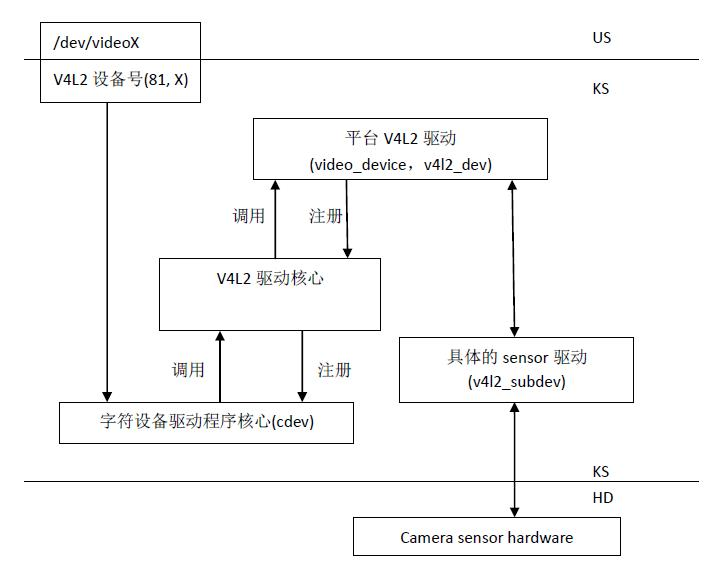
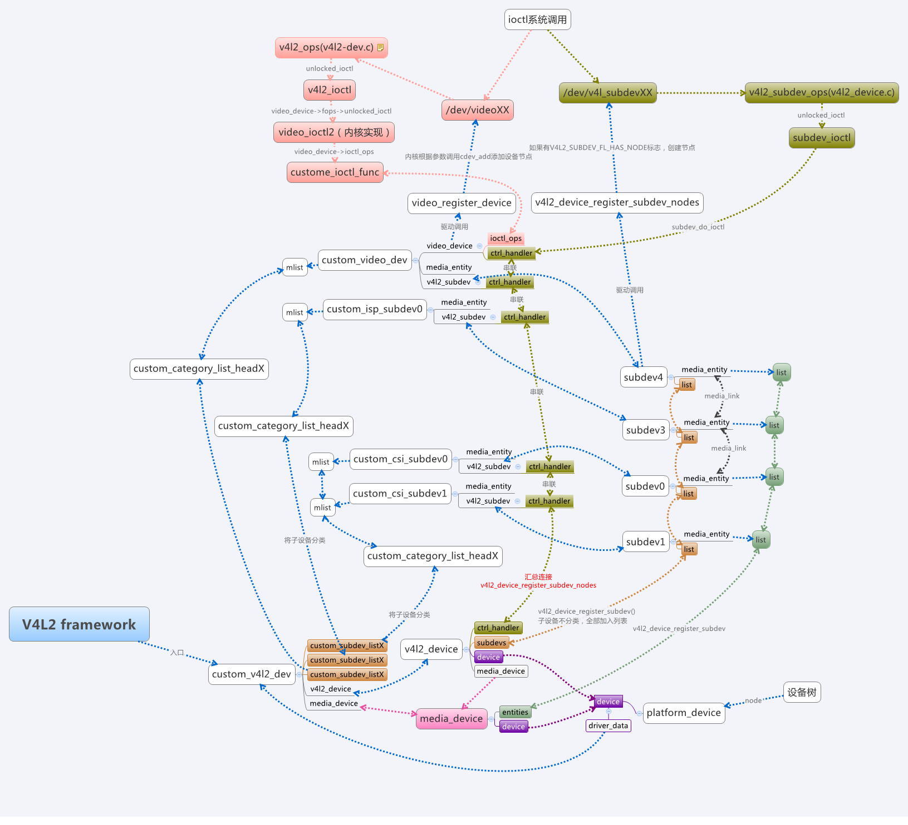
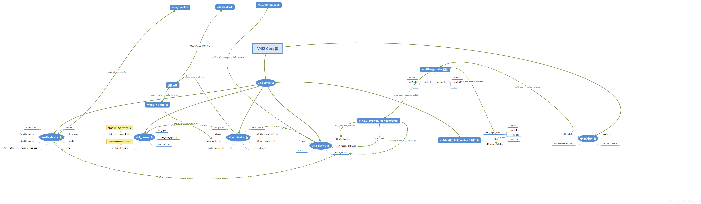
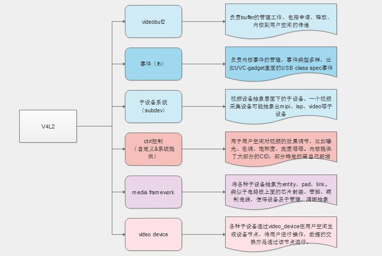
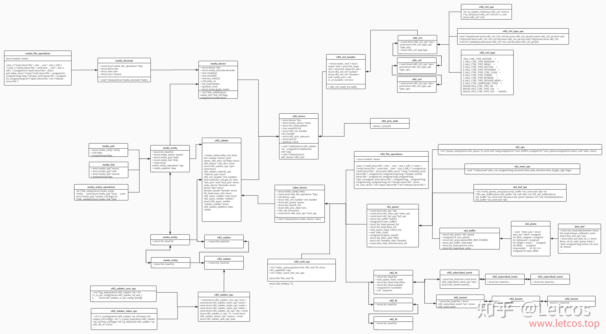
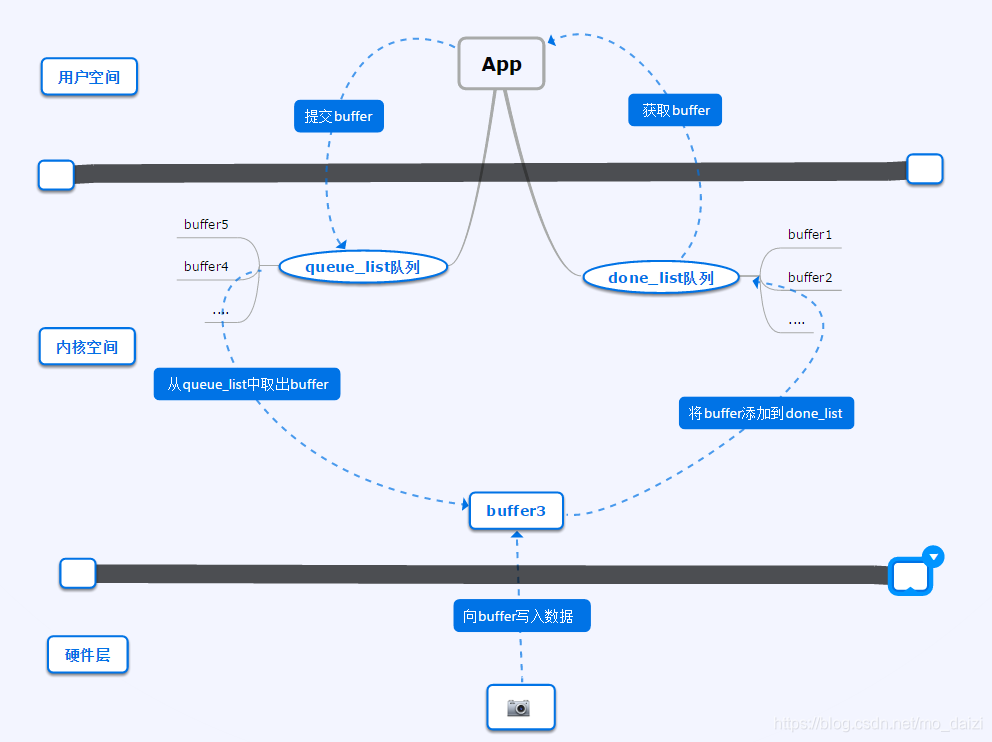
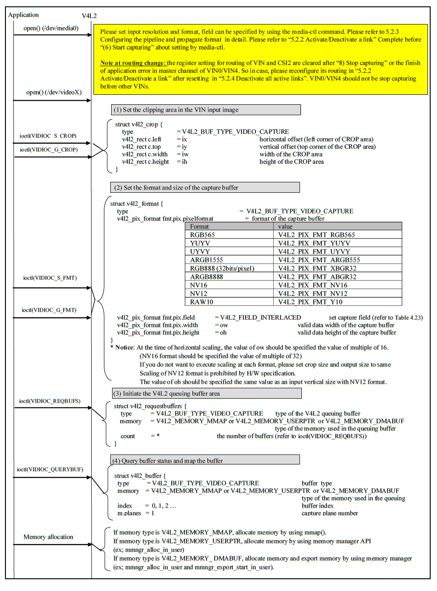
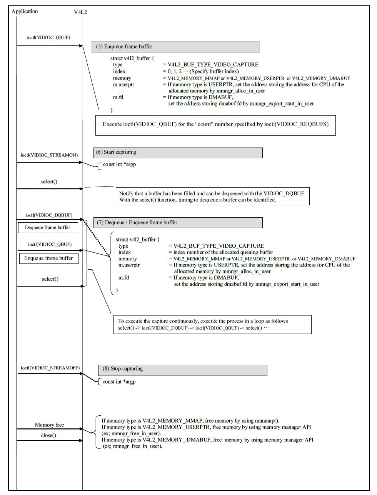

V4L2框架概述
=================

* :download:`v4l2_驱动编写指南.pdf<res/v4l2_驱动编写指南.pdf>` 

整体框架
----------

Video for Linux 2,简称V4L2,是linux内核中关于视频设备的内核驱动框架,为上层访问底层的视频设备提供了统一的接口.

V4L2框架主要涉及以下几个部分

- 字符设备驱动程序核心: V4L2本身就是一个字符设备,具有字符设备所有的特性,暴露接口给用户空间

- V4L2驱动核心: 主要是构建一个内核中标准视频设别驱动的框架,为视频操作提供统一的接口

- 平台V4L2设备驱动:在V4L2框架下,根据平台自身的特性实现与平台相关的V4L2驱动部分,包括注册video_device和v4l2_device

- 具体的sensor驱动: 实现各种设备控制方法供上层调用,并注册v4l2_subdev

内核中V4L2各组件关系图

图中包含来以下几个关键因素

**cocntroler主要抽象的结构体**

- ``v4l2_device`` : 这是整个输入设备的总结构体,可以认为他是整个v4l2框架的入口,充当驱动的管理者. 

- ``video_device`` : 用于生成设备节点(/dev/videoX), 给用户提供操作接口,如查询/设置参数,获取buffer数据,向内核提交处理好的buffer等

- ``v4l2_async_notifier`` : 用于子设备的异步注册,subdev子设备的注册通常和controller设备是分开的,controler设备需要通过v4l2_async_notifier查找子设备并将其注册到v4l2_device进行统一管理

- ``media_device`` : 用于运行时数据流的管理,嵌在V4L2 device内部

- ``vb2_queue`` : 提供内核与用户空间的buffer流转接口,包括buffer的申请,buffer在内核和用户空间之间的切换等

**subdev子设备主要抽象的结构体**

- ``v4l2_subdev`` : 子设备抽象结构体,提供子设备的基本参数设置及函数接口

- ``v4l2_ctrl_handler`` : 控制模块,提供子设备(主要是ISP和video)在用户空间的操作接口,比如改变图像的亮度,对比度等

主要的数据结构
-----------------

在V4L2架构下视频的获取以及控制通过open,read以及ioctl等系统调用接口完成

数据结构关系图

v4l2_fops
^^^^^^^^^^

::

    static const struct file_operations v4l2_fops = {
        .owner = THIS_MODULE,
        .read = v4l2_read,
        .write = v4l2_write,
        .open = v4l2_open,
        .get_unmapped_area = v4l2_get_unmapped_area,
        .mmap = v4l2_mmap,
        .unlocked_ioctl = v4l2_ioctl,
    #ifdef CONFIG_COMPAT
        .compat_ioctl = v4l2_compat_ioctl32,
    #endif
        .release = v4l2_release,
        .poll = v4l2_poll,
        .llseek = no_llseek,
    };

v4l2_fops在__video_register_device函数中会被绑定到一个cdev上,并注册到系统中去

video_device
^^^^^^^^^^^^^

video_device结构体用于在/dev目录下生成设备节点文件,把操作设备的接口暴露给用户空间. 

::  

    struct video_device
    {
    #if defined(CONFIG_MEDIA_CONTROLLER)
        struct media_entity entity;
        struct media_intf_devnode *intf_devnode;
        struct media_pipeline pipe;
    #endif
        const struct v4l2_file_operations *fops;    #设备操作函数

        u32 device_caps;

        /* sysfs */
        struct device dev;  #V4L2设备
        struct cdev *cdev;  #字符设备

        struct v4l2_device *v4l2_dev;
        struct device *dev_parent;  #父设备

        struct v4l2_ctrl_handler *ctrl_handler;

        struct vb2_queue *queue;

        struct v4l2_prio_state *prio;

        /* device info */
        char name[32];      #设备信息
        enum vfl_devnode_type vfl_type;
        enum vfl_devnode_direction vfl_dir;
        int minor;
        u16 num;
        unsigned long flags;
        int index;

        /* V4L2 file handles */
        spinlock_t		fh_lock;
        struct list_head	fh_list;

        int dev_debug;

        v4l2_std_id tvnorms;

        /* callbacks */
        void (*release)(struct video_device *vdev);
        const struct v4l2_ioctl_ops *ioctl_ops;
        DECLARE_BITMAP(valid_ioctls, BASE_VIDIOC_PRIVATE);

        struct mutex *lock;
    };

v4l2_device
^^^^^^^^^^^^

::

    struct v4l2_device {
        struct device *dev;
        struct media_device *mdev;
        struct list_head subdevs;   #用于跟踪注册的subdevs
        spinlock_t lock;
        char name[V4L2_DEVICE_NAME_SIZE];   #设备名称,默认情况下,驱动程序名字+总线ID
        void (*notify)(struct v4l2_subdev *sd,
                unsigned int notification, void *arg);  #由子设备调用的回调函数
        struct v4l2_ctrl_handler *ctrl_handler;
        struct v4l2_prio_state prio;
        struct kref ref;
        void (*release)(struct v4l2_device *v4l2_dev);
    };

每个设备实例都通过v4l2_vevice(v4l2-device.h)结构体来表示,大多数情况下这个结构体会嵌入式到更大的结构体中

v4l2_device_register(struct device dev, struct v4l2_device v4l2_dev);函数可以注册一个v4l2设备

v4l2_subdev
^^^^^^^^^^^^^

::
    
    struct v4l2_subdev {
    #if defined(CONFIG_MEDIA_CONTROLLER)
        struct media_entity entity;
    #endif
        struct list_head list;
        struct module *owner;
        bool owner_v4l2_dev;
        u32 flags;
        struct v4l2_device *v4l2_dev;   //指向父设备
        const struct v4l2_subdev_ops *ops; //v4l2设备操作接口
        const struct v4l2_subdev_internal_ops *internal_ops;
        struct v4l2_ctrl_handler *ctrl_handler;     //subdev控制接口
        char name[V4L2_SUBDEV_NAME_SIZE];
        u32 grp_id;
        void *dev_priv; #私有数据指针
        void *host_priv;
        struct video_device *devnode;
        struct device *dev;
        struct fwnode_handle *fwnode;
        struct list_head async_list;
        struct v4l2_async_subdev *asd;
        struct v4l2_async_notifier *notifier;
        struct v4l2_async_notifier *subdev_notifier;
        struct v4l2_subdev_platform_data *pdata;
    };

    struct v4l2_subdev_ops {
        const struct v4l2_subdev_core_ops	*core;
        const struct v4l2_subdev_tuner_ops	*tuner;
        const struct v4l2_subdev_audio_ops	*audio;
        const struct v4l2_subdev_video_ops	*video;
        const struct v4l2_subdev_vbi_ops	*vbi;
        const struct v4l2_subdev_ir_ops		*ir;
        const struct v4l2_subdev_sensor_ops	*sensor;
        const struct v4l2_subdev_pad_ops	*pad;
    };

设备驱动程序必须向v4l2_device注册v4l2_subdev, v4l2_device_register_subdev(v4l2_dev, sd).注册成功后subdev->dev就指向来v4l2_device

media_device
^^^^^^^^^^^^^

::

    struct media_device {
        /* dev->driver_data points to this struct. */
        struct device *dev;
        struct media_devnode *devnode;

        char model[32];
        char driver_name[32];
        char serial[40];
        char bus_info[32];
        u32 hw_revision;

        u64 topology_version;

        u32 id;
        struct ida entity_internal_idx;
        int entity_internal_idx_max;

        struct list_head entities;
        struct list_head interfaces;
        struct list_head pads;
        struct list_head links;

        /* notify callback list invoked when a new entity is registered */
        struct list_head entity_notify;

        /* Serializes graph operations. */
        struct mutex graph_mutex;
        struct media_graph pm_count_walk;

        void *source_priv;
        int (*enable_source)(struct media_entity *entity,
                     struct media_pipeline *pipe);
        void (*disable_source)(struct media_entity *entity);

        const struct media_device_ops *ops;

        struct mutex req_queue_mutex;
        atomic_t request_id;
    };

代码分析
-----------

以下的代码分析基于瑞萨的rcar平台

rcar-core.c中的rcar_vin_probe函数

::

    static int rcar_vin_probe(struct platform_device *pdev)
    {
        const struct soc_device_attribute *attr, *dev_attr;
        struct rvin_dev *vin;
        struct resource *mem;
        int irq, ret;
        struct device_node *isp_node;

        vin->dev = &pdev->dev;  

        rvin_mc_init(vin)
        ----rvin_group_get(vin)
            ----rvin_group_init(group, vin) 
                ----mdev->dev = vin->dev;
                ----mdev->ops = &rvin_media_ops;
                ----media_device_init(mdev)
        ----rvin_mc_parse_of_graph(vin)
            ----v4l2_async_notifier_init(&vin->group->notifier)
            ----vin->group->notifier.ops = &rvin_group_notify_ops;
            ----v4l2_async_notifier_register(&vin->v4l2_dev,&vin->group->notifier)
                ----v4l2_async_notifier_try_all_subdevs(notifier)
                    ----v4l2_async_match_notify(notifier, v4l2_dev, sd, asd)
                        ----v4l2_device_register_subdev(v4l2_dev, sd);
                ----v4l2_async_notifier_try_complete(notifier)
                    ----v4l2_async_notifier_call_complete(notifier)
                        ----notifier->ops->complete(notifier)       //此函数会调用rvin_v4l2_register函数
        ----v4l2_ctrl_handler_init(&vin->ctrl_handler, 1)
        ----v4l2_ctrl_new_std(&vin->ctrl_handler, &rvin_ctrl_ops...)
        ----vin->vdev.ctrl_handler = &vin->ctrl_handler;

        rvin_parallel_init(vin)
        ----v4l2_async_notifier_register(&vin->v4l2_dev, &vin->notifier)
    }

rcar-csi2.c中的rcsi2_probe函数 

::

    static int rcsi2_probe(struct platform_device *pdev)
    {
        struct rcar_csi2 * priv;
        v4l2_subdev_init(&priv->subdev, &pdev->dev) 
        v4l2_set_subdevdata(&priv->subdev, &pdev->dev)
        priv->subdev.entity.ops = &rcar_csi2_entity_ops;

        media_entity_pads_init(&priv->subdev.entity, NR_OF_RCAR_CSI2_PAD, priv->pads)

        v4l2_async_register_subdev(&priv->subdev)
        ----list_for_each_entry(notifier, &notifier_list, list)
        ----v4l2_async_notifier_find_v4l2_dev(notifier)
        ----v4l2_async_find_match(notifier, sd); 
        ----v4l2_async_match_notify(notifier, v4l2_dev, sd, asd)
            ----v4l2_device_register_subdev(v4l2_dev, sd)
                ----v4l2_async_notifier_call_bound(notifier, sd, asd)
                    ----notifier->ops->bound
        ----v4l2_async_notifier_try_complete(notifier);
            ----notifier->ops->complete
    }

rcar-v4l2.c中主要的函数是rvin_v4l2_register, 此函数在rcar-core.c中的rvin_parallel_notify_complete调用. 而rvin_parallel_notify_complete被注册到rvin_parallel_notify_ops
结构体中.

::

    int rvin_v4l2_register(struct rvin_dev *vin)
    {
        struct video_device *vdev = &vin->vdev;
        int ret;

        vin->v4l2_dev.notify = rvin_notify;

        /* video node */
        vdev->v4l2_dev = &vin->v4l2_dev;
        vdev->queue = &vin->queue;
        snprintf(vdev->name, sizeof(vdev->name), "VIN%u output", vin->id);
        vdev->release = video_device_release_empty;
        vdev->lock = &vin->lock;
        vdev->fops = &rvin_fops;
        vdev->device_caps = V4L2_CAP_VIDEO_CAPTURE | V4L2_CAP_STREAMING |
            V4L2_CAP_READWRITE;

        /* Set a default format */
        vin->format.pixelformat	= RVIN_DEFAULT_FORMAT;
        vin->format.width = RVIN_DEFAULT_WIDTH;
        vin->format.height = RVIN_DEFAULT_HEIGHT;
        vin->format.field = RVIN_DEFAULT_FIELD;
        vin->format.colorspace = RVIN_DEFAULT_COLORSPACE;

        if (vin->info->use_mc) {
            vdev->ioctl_ops = &rvin_mc_ioctl_ops;
        } else {
            vdev->ioctl_ops = &rvin_ioctl_ops;
            rvin_reset_format(vin);
        }

        rvin_format_align(vin, &vin->format);

        ret = video_register_device(&vin->vdev, VFL_TYPE_GRABBER, -1);
        if (ret) {
            vin_err(vin, "Failed to register video device\n");
            return ret;
        }

        video_set_drvdata(&vin->vdev, vin);

        v4l2_info(&vin->v4l2_dev, "Device registered as %s\n",
              video_device_node_name(&vin->vdev));

        return ret;
    }

rvin_fops

::

    static const struct v4l2_file_operations rvin_fops = {
        .owner		= THIS_MODULE,
        .unlocked_ioctl	= video_ioctl2,
        .open		= rvin_open,
        .release	= rvin_release,
        .poll		= vb2_fop_poll,
        .mmap		= vb2_fop_mmap,
        .read		= vb2_fop_read,
    };

rvin_mc_ioctl_ops

::

    static const struct v4l2_ioctl_ops rvin_mc_ioctl_ops = {
        .vidioc_querycap		= rvin_querycap,
        .vidioc_try_fmt_vid_cap		= rvin_mc_try_fmt_vid_cap,
        .vidioc_g_fmt_vid_cap		= rvin_g_fmt_vid_cap,
        .vidioc_s_fmt_vid_cap		= rvin_mc_s_fmt_vid_cap,
        .vidioc_enum_fmt_vid_cap	= rvin_enum_fmt_vid_cap,

        .vidioc_g_selection		= rvin_g_selection,
        .vidioc_s_selection		= rvin_s_selection,

        .vidioc_enum_input		= rvin_mc_enum_input,
        .vidioc_g_input			= rvin_g_input,
        .vidioc_s_input			= rvin_s_input,

        .vidioc_reqbufs			= vb2_ioctl_reqbufs,
        .vidioc_create_bufs		= vb2_ioctl_create_bufs,
        .vidioc_querybuf		= vb2_ioctl_querybuf,
        .vidioc_qbuf			= vb2_ioctl_qbuf,
        .vidioc_dqbuf			= vb2_ioctl_dqbuf,
        .vidioc_expbuf			= vb2_ioctl_expbuf,
        .vidioc_prepare_buf		= vb2_ioctl_prepare_buf,
        .vidioc_streamon		= vb2_ioctl_streamon,
        .vidioc_streamoff		= vb2_ioctl_streamoff,

        .vidioc_log_status		= v4l2_ctrl_log_status,
        .vidioc_subscribe_event		= rvin_subscribe_event,
        .vidioc_unsubscribe_event	= v4l2_event_unsubscribe,
    };

应用层处理流程
---------------

图像数据从内核空间传输到用户空间主要有两种方法:

- 用户空间通过read系统调用进入内核空间,驱动程序通过v4l2_file_operation->read函数调用copy_to_user将数据拷贝到用户空间.这种方式效率比较低

- 通过指针传递的方式,有两种方式, 1)buffer在用户空间申请,然后传递给内核驱动层 2) buffer在内核空间申请,用户空间通过 ``mmap`` 函数映射到buffer

V4L2驱动中会维护 ``queue_list`` 和 ``done_list`` 两个存储buffer指针的队列

1) 用户空间app端会向内核申请已经写入新数据的buffer，内核空间驱动从done_list队列中返回buffer指针

2) app得到buffer数据进行处理，处理完成后将buffer提交给内核，内核将app提交的buffer添加到queue_list队列中

3) 内核驱动从queue_list队列中取出空闲的buffer，并写入最新的视频数据，当一帧数据更新完后，将该buffer加入到 done_list队列中等待app获取

