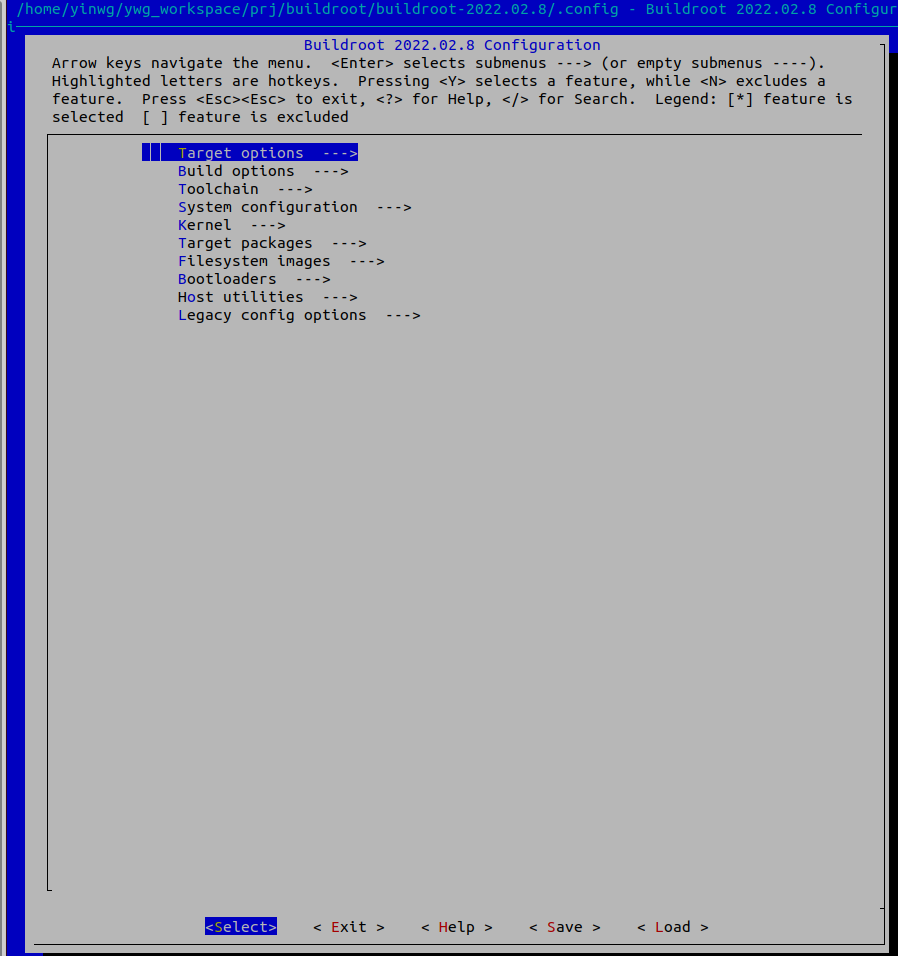

Buildroot简介
==============

以下内容包含配置选项注释，目录结构分析，常用命令，构建示例，使用技巧

buildroot基本介绍
--------------------

buildroot是linux平台上一个构建嵌入式linux系统的框架．

整个Buildroot是由Makefile(\*.mk)脚本和Kconfig(Config.in)配置文件构成的，因此可以像配置linux内核一样执行 ``make menuconfig`` 进行配置，编译出一个
完整的，可以直接烧录到机器上运行的Linux系统文件(包含bootloader,kernel,rootfs和rootfs中的各种库和应用程序)

构建开源软件包的工作流程大致如下:

- 获取: 获取源代码

- 解压: 解压源代码

- 补丁: 针对缺陷修复和增加的功能应用补丁

- 配置: 根据环境准备构建过程

- 安装: 复制二进制和辅助文件到他们的目标目标目录

- 打包: 为在其他系统上安装而打包二进制和辅助文件

构建每个软件包的工作流几乎是相同的，Bildroot主要就是把这些重复操作自动化，用户只需要勾选上所需软件包，便自动完成以上所有操作．

Buildroot目录结构
-------------------

目录结构中主要包含两种文件 ``*.mk`` 和 ``Config.in/Config.in.host`` . Config.in用于目标，Config.in.host用于主机， \*/mk则根据前面的配置信息执行相应动作

::

    - arch/ : 存放CPU架构喜爱嗯关的配置文件及构建脚本

    - board/ : 存放某个具体单板紧密相关的文件，比如内核配置文件，SD卡制作脚本，rootfs覆盖文件等

    - boot/ : 存放各种bootloader相关的补丁(.patch)，校验文件(.hash)，构建脚本，配置选项等

    - configs/ : 存放各个单板的buildroot配置文件

    - docs/ : 存放pdf, html格式的buildroot详细介绍

    - fs/ : 存放各种文件系统的构建脚本和配置选项

    - linux/ : 存放linux的构建脚本和配置选项

    - output/ : 存放编译后的各种文件，包括所有软件的解压，编译后的现场，交叉编译工具链，生成的内核，根文件系统镜像等

    - package/ : 存放所有软件包的构建脚本，配置选项，以及软件下载解压编译的构建脚本

    - support/ : 存放一些为buildroot提供功能支持的脚本，配置文件

    - system/ : 存放制作根文系统的配置文件，设备节点的模块等

    - toolchain/ : 存放制作各种交叉编译工具链的构建脚本

    - utils/ : 存放一些buildroot的实用脚本和工具

    - CHANGES : buildroot修改日志

    - .config : make menuconfig后生成的最终配置文件

    - Config.in : 所有Config.in的入口，也是Build options的提供者

    - Config.in.legacy : legacy config options的提供者

    - COPYING : buildroot版权信息

    - Makefile : 顶层Makefile

    - README : buildroot简单说明

Buildroot配置选项
-------------------

执行 make menuconfig进入以及配置菜单

后面将对每个子菜单进行注释

Target options(目标选项)
^^^^^^^^^^^^^^^^^^^^^^^^^^^

::

  Target Architecture (AArch64 (little endian))  --->  //目标处理器的架构和大小端模式
  Target Binary Format (ELF)  --->                     //目标二进制格式
  Target Architecture Variant (cortex-A53)  --->       //目标处理器核心类型          
  Floating point strategy (FP-ARMv8)  --->             //浮点运算策略

Build options(编译选项)
^^^^^^^^^^^^^^^^^^^^^^^^^^^

::

     Commands  --->                                 //指定下载，解压命令参数选项                
         (wget --passive-ftp -nd -t 3) Wget command              //用于常规FTP,HTTP下载
         (svn --non-interactive) Subversion (svn) command        //svn下载
         (bzr) Bazaar (bzr) command                              //版本控制工具bazaa
         (git) Git command                                       //git工具
         (cvs) CVS command                                       //cvs版本控制
         (cp) Local files retrieval command                      //本地文件拷贝命令
         (scp) Secure copy (scp) command                         //基于ssh的安全的远程文件拷贝命令
         (sftp) Secure file transfer (sftp) command              //sftp远程文件传输
         (hg) Mercurial (hg) command                             //版本控制工具hg
         (gzip -d -c) zcat command                               //zip包解压
         (bzcat) bzcat command                                   //bz2包解压缩
         (xzcat) xzcat command                                   //xz包解压缩
         (lzip -d -c) lzcat command                              //lz包解压
         ()  Tar options                                         //tar命令
     ($(CONFIG_DIR)/defconfig) Location to save buildroot config         //指定配置文件保存路径           
     ($(TOPDIR)/dl) Download dir                                //指定文件下载保存路径
     ($(BASE_DIR)/host) Host dir                                //指定主机编译所需工具安装目录
         Mirrors and Download locations  --->                   //镜像和下载路径
     (0) Number of jobs to run simultaneously (0 for auto)      //指定编译时运行的cpu核心数,0表示自动      
     [ ] Enable compiler cache                                  //使能编译缓存
     [ ] build packages with debugging symbols                  //启用带调试编译软件包        
     [ ] build packages with runtime debugging info             //
     [*] strip target binaries                                  //strip命令裁剪掉调试信息                   
     ()    executables that should not be stripped              //strip跳过可执行文件
     ()    directories that should be skipped when stripping    //strip跳过的目录 
         gcc optimization level (optimize for size)  --->       //gcc优化等级     
     [ ] Enable google-breakpad support                         //启动崩溃日志收集         
         libraries (shared only)  --->                          //库类型    
     ($(CONFIG_DIR)/local.mk) location of a package override file     //包覆盖文件的路径              
     ()  global patch directories                                     //全局补丁目录
         Advanced  --->                                                   
         *** Security Hardening Options ***                                         
     -*- Build code with PIC/PIE                                                    
         Stack Smashing Protection (-fstack-protector-strong)  --->         //堆栈粉碎保护     
         RELRO Protection (Full)  --->                                          
         Buffer-overflow Detection (FORTIFY_SOURCE) (Conservative)  --->    //缓冲区溢出检测

Toolchain(工具链)
^^^^^^^^^^^^^^^^^^^

::

     Toolchain type (External toolchain)  --->                          //工具链类型(外部工具链)
     *** Toolchain External Options ***                                          
     Toolchain (Arm AArch64 2021.07)  --->                              //工具选择
     Toolchain origin (Toolchain to be downloaded and installed)  --->  //工具链来源 
     [*] Copy gdb server to the Target                                  //拷贝gdb服务到目标         
         *** Toolchain Generic Options ***                                           
     [ ] Copy gconv libraries                                           //拷贝gconv库(gconv库用于在不同字符集之间进行转换)
     ()  Extra toolchain libraries to be copied to target               //拷贝额外的工具链到目标                           
     [*] Enable MMU support                                             //使能MMU支持             
     ()  Target Optimizations                                           //目标优化(需设置前面的GCC优化等级)  
     ()  Target linker options                                          //目标链接器选项(构建目标时传递给链接器的额外选项)
     [ ] Register toolchain within Eclipse Buildroot plug-in            //在Eclipse Buildroot插件中注册工具链

System configuration(系统配置)
^^^^^^^^^^^^^^^^^^^^^^^^^^^^^^^^

::

     Root FS skeleton (default target skeleton)  --->               //根文件系统框架
     (buildroot) System hostname                                    //系统主机名字
     (Welcome to Buildroot) System banner                           //系统开机提示
         Passwords encoding (sha-256)  --->                         //密码编码
         Init system (BusyBox)  --->                                //系统初始化方式(busybox或systemd) [#init]_ 
         /dev management (Dynamic using devtmpfs only)  --->        //dev管理方案 [#dev]_ 
     (system/device_table.txt) Path to the permission tables        //权限表路径
     [ ] support extended attributes in device tables               //支持设备表中的扩展属性
     [ ] Use symlinks to /usr for /bin, /sbin and /lib              //是否将/bin /sbin /lib链接到/usr
     [*] Enable root login with password                            //使能root登录密码
     ()    Root password                                            //设置root密码
         /bin/sh (busybox' default shell)  --->                     //设置shell类型(bash)
     [*] Run a getty (login prompt) after boot  --->                //启动后运行getty(登录提示)
     [*] remount root filesystem read-write during boot             //在引导期间安装根文件系统支持读写
     ()  Network interface to configure through DHCP                //设置dhcp配置的网络接口
     (/bin:/sbin:/usr/bin:/usr/sbin) Set the system's default PATH  //设置系统的默认路径
     [*] Purge unwanted locales                                     //清除不需要的区域设置
     (C en_US) Locales to keep                                      //要保留的语言环境
     ()  Generate locale data                                       //生成区域设置数据
     [ ] Enable Native Language Support (NLS)                       //启用本地语言支持
     [ ] Install timezone info                                      //安装时区信息
     ()  Path to the users tables                                   //
     ()  Root filesystem overlay directories                        //根文件系统覆盖目录      
     ()  Custom scripts to run before commencing the build          
     ()  Custom scripts to run before creating filesystem images    //在创建文件系统之前运行的自定义脚本
     ()  Custom scripts to run inside the fakeroot environment      //自定义脚本在fakeroot环境中运行
     ()  Custom scripts to run after creating filesystem images     //创建文件系统镜像后运行的自定义脚本

.. [#init] 
    - Busybox init: 启动时读取/etc/inittab, 启动/etc/init.d/rcS中的shell脚本
    - SystemV: 在/etc目录下会生成init.d,rc0.d,rc1.d等，init.d里面包含真正的服务脚本，rcN.d里面是链接向init.d里脚本的软连接，N表示运行级别.脚本命名规则:以[S|K]+NN+其他，S是启动脚本，K是停止脚本
    - systemd: 支持并行化任务，采用socket与d-bus总线式激活服务，按需启动守护进程(daemon)

.. [#dev]
    - Static using device table: 使用静态的设备表，/dev将根据system/device_table_dev.txt的内容创建设备，进入系统添加或删除设备，无法自动更新
    - Dynamic using devtmpfs only: 在系统启动过程中，会自动生成/dev文件，进入系统添加或删除设备时，无法自动更新
    - Dynamic using devtmpfs + mdev: 在devtmpfs基础上加入mdev用户空间实用程序，进入系统添加或删除设备时，可以自动更新，自动创建规则在/etc/mdev.conf
    - Dynamic using devtmpfs + eudev: 在devtmpfs的基础上加入eudev用户空间守护程序，eudev是udev的独立版本，是systemd的一部分

kernel(内核配置)
^^^^^^^^^^^^^^^^^^^

::

     [*] Linux Kernel                                                       //使能编译内核
           Kernel version (Custom tarball)  --->                            //内核版本选择
     ()    Custom kernel patches                                            //自定义内核补丁
           Kernel configuration (Using a custom (def)config file)  --->     //内核配置
     ()    Configuration file path                                          //配置文件路径
     ()    Additional configuration fragment files                          //
     ()    Custom boot logo file path                                       //自定义启动logo文件路径
           Kernel binary format (Image)  --->                               //内核二进制文件格式
           Kernel compression format (gzip compression)  --->               //内核压缩格式
     [ ]   Build a Device Tree Blob (DTB)                                   //构建设备树二进制文件
     [ ]   Install kernel image to /boot in target                          //安装内核镜像到/boot目录
     [ ]   Needs host OpenSSL                                               //主机需要openssl
     [ ]   Needs host libelf                                                //主机需要libelf(用于读取，修改或创建elf文件)
     [ ]   Needs host pahole                                              
           Linux Kernel Extensions  --->                                    //linux内核扩展
           Linux Kernel Tools  --->                                         //linux内核工具

.. note::
    - vmlinux: 静态编译出来的最原始的elf文件，包括了内核镜像，调试信息，符号表等．vm代表virtual memory
    - Image: 将所有的符号和重定位信息都删除，只剩下二进制数据的内核代码，此时还没经过压缩
    - zImage: Image加上解压代码经过gzip压缩后的文件，适用于小内核，常见于arm
    - bzImage: Image加上解压代码经过gzip压缩后的文件，适用于大内核，常见于x86
    - uImage: 是u-boot专用的镜像文件，使用mkimage工具在zimage之前加上一个长度为0x40的头信息，在头信息中说明了该镜像文件的类型，加载位置，生成时间，大小等信息

Target packages(目标包配置)
^^^^^^^^^^^^^^^^^^^^^^^^^^^^^^^^

::

    -*- BusyBox                                                           //使能编译busybox
    (package/busybox/busybox.config) BusyBox configuration file to use?   //设置busybox配置文件路径
    ()    Additional BusyBox configuration fragment files                 //其他busybox配置片段文件 
    [ ]   Show packages that are also provided by busybox                 //列出部分busybox也提供的包
    [ ]   Individual binaries                                             //每个应用程序作为单独的二进制文件(为selinux提供支持)
    [ ]   Install the watchdog daemon startup script                      //在启动脚本中安装看门狗守护程序
        Audio and video applications  --->                                //音视频应用
        Compressors and decompressors  --->                               //压缩和解压缩
        Debugging, profiling and benchmark  --->                          //调试，分析和基准测试
        Development tools  --->                                           //开发工具
        Filesystem and flash utilities  --->                              //文件系统和闪存实用程序
        Fonts, cursors, icons, sounds and themes  --->                    //字体，游标，图标，声音和主题
        Games  --->                                                       //游戏
        Graphic libraries and applications (graphic/text)  --->           //图形库和应用程序
        Hardware handling  --->                                           //硬件处理
        Interpreter languages and scripting  --->                         //编程语言和脚本
        Libraries  --->                                                   //库
        Mail  --->                                                        //邮箱
        Miscellaneous  --->                                               //杂项
        Networking applications  --->                                     //网络应用
        Package managers  --->                                            //安装包管理
        Real-Time  --->                                                   //实时时钟
        Security  --->                                                    //安全
        Shell and utilities  --->                                         //shell和程序
        System tools  --->                                                //系统工具
        Text editors and viewers  --->                                    //文本编辑和浏览

- Audio and video applications

::

     [ ] alsa-utils  ----           //ALSA声卡测试和音频编辑
     [ ] atest                      //ALSA Asoc驱动测试工具                           
     [ ] aumix                      //声卡混音器                            
     [ ] bluez-alsa                 //蓝牙音频ALSA后端
     [ ] dvblast                    //MPEG-2/TS解复用和流媒体            
     [ ] dvdauthor                  //创作DVDD光盘文件和目录结构                          
     [ ] dvdrw-tools                //创作蓝光光盘和DVD光盘媒体                       
     [ ] espeak                     //用于英语和其他语言的语音合成器软件                        
     [ ] faad2                      //开源的MPEG-4和MPEG-2　AAC解码器               
     [ ] ffmpeg  ----               //录制，转换，以及流化音视频的完整解决方案                  
     [ ] flac                       //开源无损音频解码器         
     [ ] flite                      //小型，快速的TTS系统(TextToSpeech),即文字转语言                               
     [ ] fluid-soundfont            //   
     [ ] fluidsynth                                                                  
     [ ] gmrender-resurrect         //基于gstreamer的upnp媒体渲染器                                                
     [ ] gstreamer 1.x              //开源多媒体框架1.x版本，与前面的0.10版本不兼容                    
     [ ] jack1                      //JACK音频连接套件
     [ ] jack2                                                                       
         *** kodi needs python3 w/ .py modules, a uClibc or glibc toolchain w/ C++, t
         *** kodi needs udev support for gbm ***                                     
         *** kodi needs an OpenGL EGL backend with OpenGL or GLES support ***        
     [ ] lame                       //高质量的MPEG Audio Layer III(MP3)编辑器                                 
     [ ] madplay                    //libmad的命令行前端，一个高质量的MPEG音频解码器          
     [ ] mimic                      //快速，轻量级的文本到语音引擎   
     [ ] minimodem                                       
         *** miraclecast needs systemd and a glibc toolchain w/ threads and wchar ***
     [ ] mjpegtools                 //录制视频和回放，简单的剪切和粘贴编辑以及音频和视频的MPEG压缩                                                  
     [ ] modplugtools               //支持MOD,S3M,XM等格式音频文件
     [ ] motion                     //监控摄像机视频信号的程序，可以检测物体运动                                                 
     [ ] mpd  ----                  //用于播放音乐的服务端应用程序       
     [ ] mpd-mpc                    //MPD的简约命令行界面                     
     [ ] mpg123                     //MPEG音频播放器                              
     [ ] mpv                        //mplayer的一个分支                                   
     [ ] multicat                   //高效的操作多播流，特别是MPEG-2传输流                                
     [ ] musepack                   //音频高品质压缩             
     [ ] ncmpc                      //功能齐全的MPD客户端                                   
     [ ] opus-tools                 //opus编解码器命令行工具                              
     [ ] pipewire                   //                           
     [ ] pulseaudio                 //声音服务代理，可对声音进行操作后播放                                                
     [ ] sox                        //可录制，播放，格式转换，修改音频文件             
     [ ] squeezelite                //logitech媒体服务器客户端             
     [ ] tstools                    //处理MPEG数据的跨平台命令行工具                         
     [ ] twolame                    //优化的MPEG Audio Layer 2(MP2)编码器                   
     [ ] udpxy                      //将UDP流量转发到请求HTTP客户端的中继守护程序              
     [ ] upmpdcli                   //mpd音乐播放器前端      
     [ ] v4l2grab                   //用于从V4L2设备获取JPEG程序                              
     [ ] v4l2loopback               //创建虚拟视频设备                       
     [ ] vlc                        //可播放大多数多媒体文件以及DVDD,音频CD,VCD和各种流媒体协议                                 
     [ ] vorbis-tools               //用于ogg格式文件的独立播放器，编码器和解码器，也可作为流媒体播放器
     [ ] wavpack                    //提供无损，高质量的有损和独特的混合压缩模式
     [ ] yavta                      //一个V4L2测试应用程序       
     [ ] ympd                       //MPD网页客户端                             
     [ ] zynaddsubfx       

- Compressors and decompressors

::

     [ ] brotli   //通用无损压缩库
     [ ] bzip2    //免费的压缩工具
     [ ] lrzip    //
     [ ] lzip     //类似gzip
     [ ] lzop     //与gzip相似
     [ ] p7zip    //unix的7-zip命令行版本
     [ ] pigz     //是gzip的全功能替代品
     [ ] pixz     //是xz的并行索引版本
     [ ] unrar    //rar文件解压
     [ ] xz-utils //用于处理xz压缩的命令行工具，包括xz,unxz,xzcat,xzgrep等
     [ ] zip      //压缩和解压zip
     [ ] zstd     //zstandard或zstd的简短版本
                  

- Debugging, peofiling and benchmark

::

     [ ] babeltrace2        //                      
     [ ] blktrace           //对通用块层(block layer)的I/O跟踪机制，它能抓取详细的I/O请求，发送到用户空间                     
     [ ] bonnie++           //执行一系列简单的硬盘驱动器和文件系统性能测试                      
     [ ] bpftool            //
     [ ] cache-calibrator   //用于分析计算机(缓存)内存系统并提取有用信息，以及作为负载生成器进行实时测试                     
         *** clinfo needs an OpenCL provider ***  
     [ ] coremark           //                      
     [ ] coremark-pro                             
         *** dacapo needs OpenJDK ***             
     [ ] delve                                    
     [ ] dhrystone          //测量处理器运算能力的最常见基准测试程序之一，常用于处理器的整型运算性能的测量                     
     [ ] dieharder                                
     [ ] dmalloc                                  
     [ ] dropwatch                                
     [ ] dstat                                    
     [ ] dt                                       
     [ ] duma                                     
     [ ] fio                                      
     [ ] fwts                                     
     [ ] gdb                                      
     [ ] google-breakpad                          
     [ ] iozone                                   
     [ ] kexec                                    
     [ ] ktap                                     
     [ ] latencytop                               
     [ ] libbpf                                   
     [ ] lmbench                                  
     [ ] ltp-testsuite                            
     [ ] ltrace                                   
     [ ] lttng-babeltrace                         
     [ ] lttng-modules                            
     [ ] lttng-tools                              
     [ ] memstat                                  
     [ ] netperf                                  
     [ ] netsniff-ng                              
     [ ] nmon                                     
     [ ] oprofile                                 
     [ ] pax-utils                                
     [ ] ply                                      
     [ ] poke                                     
     [ ] ptm2human                                
     [ ] pv                                       
     [ ] ramspeed/smp                             
     [ ] ramspeed                                 
     [ ] rt-tests                                 
     [ ] rwmem                                    
     [ ] sentry-native                            
     [ ] spidev_test                              
     [ ] strace                                   
     [ ] stress                                   
     [ ] stress-ng                                
         *** sysdig needs a glibc or uclibc toolchain w/ C++, threads, gcc >= 4.8, dy  
     [ ] tcf-agent                                
     [ ] tinymembench                             
     [ ] trace-cmd                                
     [ ] trinity                                  
     [ ] uclibc-ng-test                           
     [ ] uftrace                                  
     [ ] valgrind                                 
     [ ] vmtouch                                  
     [ ] whetstone                                

