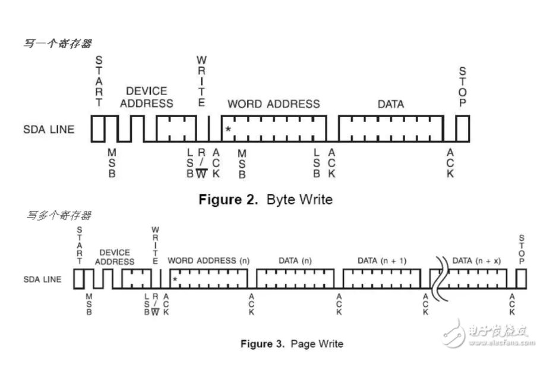
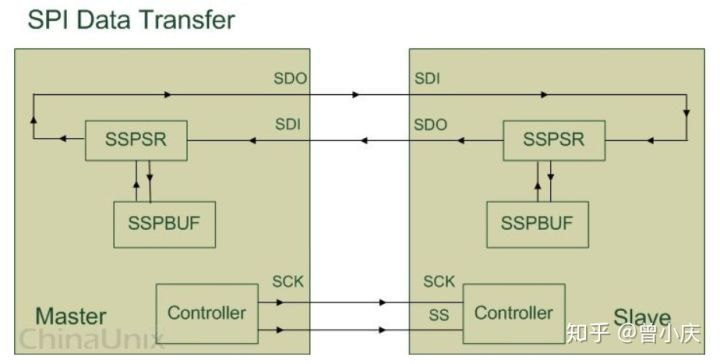
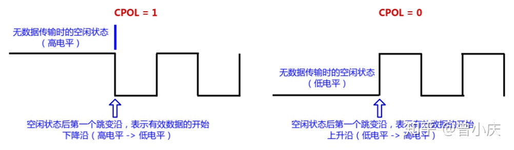
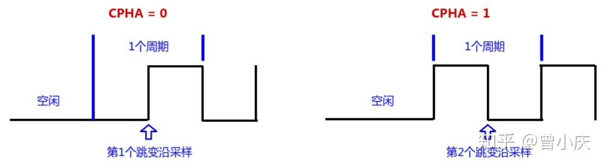

嵌入式系统常见总线
===================

I2C总线
---------

I2C总线在物理连接上非常简单，分别由SDA(串行数据线)和SCL(串行时钟线)及上拉电阻组成。通信原理是通过对SCL和SDA线高低电平时序的控制，来产生I2C总线协议所需要的信号进行数据的传递。
在总线空闲的状态下，这两根线一般被上面所接的上拉电阻拉高，保持着高电平。

I2C通信方式为半双工，只有一根SDA，同一时间只能单向通信。

I2C总线特征
^^^^^^^^^^^^^

I2C总线上的每一个设备都可以作为主设备或从设备，而且每一个设备都会对应一个唯一的地址(7位地址，最低位来表示读写).主从设备之间就通过这个地址来确定与哪个期间进行通信。

I2C总线上可挂接的设备数量受总线的最大电容400pf控制。

I2C总线数据传输速率在标准模式下可达100kbit/s，快速模式下可达400kbit/s，高速模式下可达3.4Mbit/s。

I2C总线上的主从设备之间以字节(8位)为单位进行双向数据传输。

I2C总线协议
^^^^^^^^^^^^^

I2C协议规定，总线上数据的传输必须一个起始信号为开始条件，以一个结束信号作为传输的停止条件。起始和结束信号总是由主设备产生(意味着从设备不可以主动通信，只能主设备请求然后从设备应答)

起始和结束信号产生条件：总线在空闲状态时，SCL和SDA都保持着高电平，当SCL为高电平而SDA由高到低的跳变，产生一个起始条件。当SCL为高而SDA由低到高产生一个跳变，则产生一个停止条件。

当一个字节按数据位从高位到低位的顺序传输完后，紧接着从设备将拉低SDA线，回传给主设备一个应答位，此时才认为一个字节真正的被传输完成

下面为I2C通信图示

.. image::
    res/i2c_rw.png

以下为I2C写寄存器的一个示例

 

SPI总线
----------

SPI,是serial peripheral interface的缩写，顾名思义就是串行外围设备接口。SPI是一种高速的、全双工的、同步的通信总线，采用四根线进行通信。

SPI总线特征
^^^^^^^^^^^^

SPI规定了两个SPI设备之间通信必须由主设备(master)来控制次设备(slave),一个master设备可以通过提供clock一i及对slave设备片选(slave select)来控制多个slave设备。

Master 设备会根据将要交换的数据来产生相应的时钟脉冲(Clock Pulse), 时钟脉冲组成了时钟信号(Clock Signal) , 时钟信号通过时钟极性 (CPOL) 和 时钟相位 (CPHA) 
控制着两个 SPI 设备间何时数据交换以及何时对接收到的数据进行采样, 来保证数据在两个设备之间是同步传输的.

SPI总线协议
^^^^^^^^^^^^^

SPI有四种传输模式：上升沿、下降沿、前沿、后沿触发。

上图只是对 SPI 设备间通信的一个简单的描述, 下面就来解释一下图中所示的几个组件:

SSPBUF：泛指 SPI 设备里面的内部缓冲区，一般在物理上是以 FIFO 的形式，保存传输过程中的临时数据；

SSPSR：泛指 SPI 设备里面的移位寄存器，它的作用是根据设置好的数据位宽(bit-width) 把数据移入或者移出 SSPBUF；

Controller：泛指 SPI 设备里面的控制寄存器，可以通过配置它们来设置 SPI 总线的传输模式。

SPI四根通信线解释如下

=============   =====================================================================================================================
 SPI通信线              描述
-------------   ---------------------------------------------------------------------------------------------------------------------
SCK                 主要的作用是 Master(主)设备往 Slave(从)设备传输时钟信号, 控制数据交换的时机以及速率；
SS/CS               用于 Master(主)设备片选 Slave (从)设备，使被选中的 Slave(从)设备能够被 Master(主)设备所访问；
SDO/MOSI            在 Master(主)上面也被称为 Tx-Channel，作为数据的出口，主要用于 SPI 设备发送数据；
SDI/MISO            在 Master(主)上面也被称为 Rx-Channel，作为数据的入口，主要用于SPI 设备接收数据；
=============   =====================================================================================================================

SPI的极性Polarity和相位Phase，最常见的写法是CPOL和CPHA，不过也有一些其他写法，简单总结如下：

CKPOL (Clock Polarity) = CPOL = POL = Polarity = （时钟）极性

CKPHA (Clock Phase) = CPHA = PHA = Phase = （时钟）相位

SCK=SCLK=SPI的时钟

**SPI总线极性**

极性，会直接影响SPI总线空闲时的时钟信号是高电平还是低电平。

CPOL = 1：表示空闲时是高电平；

CPOL = 0：表示空闲时是低电平。

如下图所示

**SPI总线相位**

一个时钟周期会有2个跳变沿。而相位，直接决定SPI总线从那个跳变沿开始采样数据。

CPHA = 0：表示从第一个跳变沿开始采样；

CPHA = 1：表示从第二个跳变沿开始采样。

所以极性和相位结合后会有四种传输方式。

