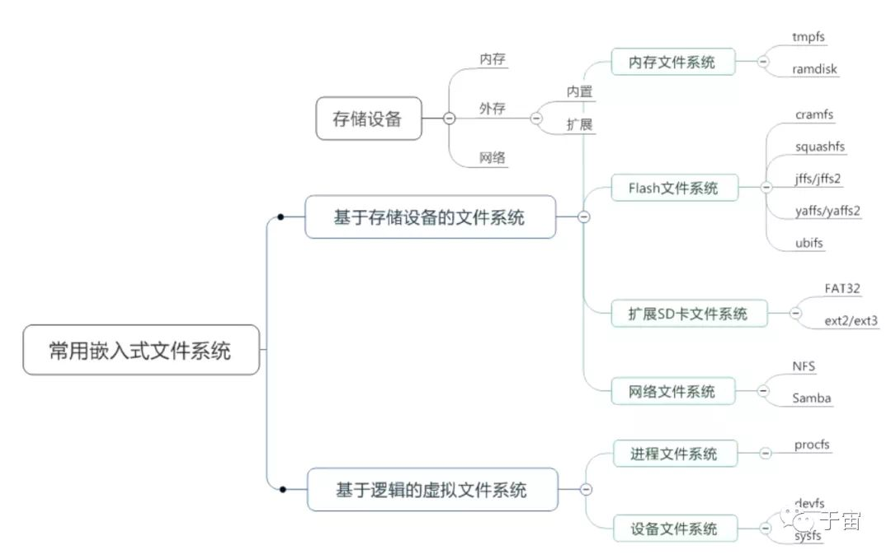

嵌入式文件系统概览
=====================

linux文件系统结构由4层组成，分别是用户层、内核层、驱动层和硬件层。用户层为用户层提供一个操作接口，内核层实现了各种文件系统，驱动层
是块设备的驱动程序，硬件层是嵌入式系统使用的几种存储器

**嵌入式文件系统**

文件系统可以分为两类

- 一类文件系统有大小，称为基于存储设备的文件系统，包括内存文件系统 flash文件系统和扩展SD卡文件系统和网络文件系统
- 一类文件系统无法查看大小，称为基于逻辑的虚拟文件系统. 此类系统主要为kernel生成的proc文件系统和sysfs文件系统

**内存文件系统**

 内存文件系统包括 ``tmpfs`` 和 ``ramdisk``

 tmpfs文件系统是一种临时的文件系统，由linux内核来支持，只需要在内存中指定一个区域，指定最大的大小就可以直接使用，不需要对内存进行格式化

 - ramdisk

 ramdisk是将一部分固定大小的内存当作分区来使用,它并非一个实际的文件系统，而是一种将实际的文件系统装入内存的机制，并且可以作为根文件系统。将一些经常访问而不会更改的文件(如只读的根文件系统)通过
 ramdisk放在内存中,可以明显提高系统性能

 在linux的启动阶段,initrd提供了一套机制，可以将内核映像和根文件系统一起装入内存

flash文件系统
--------------

**flash文件系统**

 flash是一种是常用的存储设备，flash闪存作为嵌入式系统的主要存储设备有其自身的特性。 `flash的写入操作只能把对应位置的1修改成0，而不能把0修改为1，擦除flash就是把对应的存储块
 的内容恢复为1` .一般情况乱下向flash写入内容时，需要先擦除对应的存储区间，这种擦除是以块(block)为单位的，闪存主要有NOR和NAND两种技术。因为flash存储器的擦写次数是有限制的，NAND
 闪存还有特殊的硬件接口和读写时序，于是就出现了专门针对FLASH的文件系统，比较常用的有jffs2 yaffs2 ubifs。传统的文件系统如ext2 ext3 等都是为机械式硬盘设计的，用作flash文件系统会有很多弊端

 .. image::
    res/structure.png

在嵌入式linux中,MTD(memory technology device,存储技术设备)为底层硬件(闪存)和上层(文件系统)之间提供一个统一的抽象接口，即flash文件系统都是基于MTD驱动层。使用MTD驱动程序的优点在于
它是专门针对各种非易失性存储器(以闪存为主)而设计的，因而它对flash有更好的支持、管理和基于扇区的擦除、读写操作接口。另外一块flash芯片可以被划分为多个分区，各分区可以采用不同的文件系统。

 flash文件系统包括 ``cramfs`` ``squashfs`` 和 ``jffs/jffs2`` 和 ``yaffs/yaffs2`` 和 ``ubifs``

 cramfs是只读压缩的文件系统，可以将文件系统进行压缩，提高存储效率

 squashfs是只读压缩的文件系统，相比于cramfs可以支持更大的单个文件大小

 - jffs/jffs2是可以读写，压缩的日志文件系统，主要是应用于nor flash

优点: 使用了压缩的文件格式，最重要的特性是可读写操作

缺点: jffs2文件系统挂载时需要扫描整个jffs2我呢见系统，因此当jffs2文件系统分区增大时，挂载时间也会相应的变长。使用jffs2格式可能带来少量的flash空间浪费，这主要是由于日志文件的过度开销
      和用于回收系统的无用存储单元，浪费的空间大小大致是若干个数据段。另一缺点是当文件系统已满或接近满时，jfss2运行速度会迅速降低

.. note::
    1.日志文件结构文件系统并不采用本地更新的方式，而是采用异步更新的方式，即当某个数据块需要更新时，先找一个新块将数据写入，再将旧块擦除。不过旧数据并不马上在闪存中擦除，而是以日志方式作为历史记录
    保存下来，这为文件系统的恢复操作打下了基础

    2.不适合NAND闪存的主要是因为NAND闪存容量一般比较大，这样导致jffs为维护日志节点所占用的空间迅速增大，另外jffs文件系统挂载时需要扫描整个flash分区，以找出所有日志节点，建立文件结构，对于大容量的NAND闪存会浪费大量时间

-  yaffs/yaffs2是另一种日志闪存文件系统，主要是为nand型flash设计的文件系统，为了应对flash容量的快速增长

yaffs/yaffs2是专门为NAND FLASH设计的嵌入式文件系统，它是日志结构的文件系统，提供了损耗平衡和掉电保护,可以有效的避免意外掉电对文件系统一致性和完整性造成影响，与jffs2相比，它减少了一些功能(例如不支持数据压缩),
所以速度更快，挂载时间很短，对内存占用很少

优点:
1. 专门针对NAND flash，软件结构得到优化,速度快

2. 使用硬件的spare area区域存储文件组织信息，启动时只需要扫描组织信息，启动比较快

3. 采用多策略垃圾回收算法，能够提高垃圾回收的效率和公平性，达到损耗平衡的目的

缺点:

没有采用压缩的文件格式，当包含的内容相同时，yaffs2镜像文件要比jffs2镜像文件大

yaffs与yaffs2的主要区别在于,前者支持小页(512 bytes)nand闪存，后者则可支持大页(2k)

- ubifs是作为jffs2的后继文件系统,满足大容量的需求

无排序区块图像文件系统(unsorted block image file system,ubifs)是用于固态硬盘存储设备上，作为jffs2的后继文件系统之一。由于nand flash容量增长，yaffs等皆无法再去控制nand flash的空间。
ubifs通过子系统ubi处理与mtd device之间的动作，与jffs2一样，ubifs构建于mtd device之上
  
ubifs涉及了三个子系统:

1. MTD子系统，提供对flash芯片的访问接口，mtd子系统提供了MTD device的概念，比如/dev/mtdx MTD可以认为是raw flash

2. UBI子系统,为flash device它提供了wear-leveling和volume management功能,UBI工作在mtd设备之上提供了UBI volume;UBI是MTD设备的高层次表示，对上层屏蔽了一些MTD不得不处理的问题，比如wearing以及坏块管理

3. UBIFS文件系统，工作于ubi之上

以下是UBIFS的一些特点:

可扩展性：UBIFS对flash尺寸有很好的扩展性，也就是说mount时间,内存消耗以及I/O速度都不依赖于flash尺寸(对于内存消耗并不完全准确，但依赖性非常低)。ubifs可以很好的适应GB flashes。当然ubi本身还有扩展性
的问题

快速mount:不像jffs2，ubifs在mount阶段不需要扫描整个文件系统，ubifs mount介质的时间只是毫秒级,时间不依赖flash容量,但是ubi的初始化时间是依赖flash尺寸的

write-back支持: 回写或者叫延迟写更准确，同jffs2的write-through相比可以显著的提高文件系统的吞吐量

异常unmount适应度:ubifs是一个日志文件系统可以容忍突然掉电以及unclean重启。ubifs通过reply日志来恢复unclean unmount,在这种情况下reply会消耗一些时间，因此mount时间会稍微增加

快速I/O: 即使我们disable write-back(可以在mount时使用-o sync mount选项)ubifs的性能仍然接近jffs2，jffs2的同步i/o速度时很快的，因为它不需要再flash上面维护Indexing data结构.
而ubifs是有index数据的,ubifs之所以够快是因为ubifs提交日志的方式，不是把数据从一个地方移动到另一个地方，而只是把数据的地址加到文件系统的index，然后选择不同的eraseblock作为新的日志块

on-the flight compression: 存储在flash介质上的数据是压缩的，同时也可以灵活的针对单个文件打开关闭压缩

可恢复性: ubifs可以从index破坏后恢复，ubifs的每一片信息都有一个header来描述，因此可以通过扫描这个flash介质来重构文件系统。比如你擦出了FAT文件系统的fat表，那么对于fat fs是致命的错误，但是如果
擦除的ubifs的index，你仍然可以重构文件系统，当然这需要一个特定的用户空间程序来做这个恢复

完整性: UBIFS通过写checksum到flash介质上来保证数据的完整性，ubifs不会无视损坏文件数据或meta-data，缺省的情况，ubifs仅仅检查meta-data的crc

**扩展SD卡文件系统**

扩展SD卡文件系统包括 ``FAT32`` 和 ``ext2/ext3/ext4``

fat32是微软转为windows开发的文件系统，在windows上由很好的兼容性

ext2/ext3/ext4是linux上的日志文件系统，可靠性好

**网络文件系统**

网络文件系统包括 ``NFS`` 和 ``samba``

NFS是开发板与宿主机进行挂载的文件系统

samba是windows与linux之间的共享机制

虚拟文件系统
-------------

procfs文件系统
^^^^^^^^^^^^^^^

procfs文件系统由内核提供支持，procfs是linux内核信息的抽象文件接口，大量的内核中的信息以及可调参数都被作为常规文件映射到一个目录树种/proc。
这样我们可以简单的通过echo和cat这样的文件操作命令对系统信息进行查看和调整。大量的系统工具也通过procfs来获取内核参数,例如df命令就是查看/proc/mounts文件

::

    #-t是指定文件系统类型，第二个参数是挂载设备，因为是内核设备，所以写none，第三个参数是挂载目录
    mount -t proc none /proc

    #或者在/etc/fstab条目下添加,fstab中的文件系统会开机自动挂载
    none /proc proc defaults 0 0

tmpfs文件系统
^^^^^^^^^^^^^^

tmpfs是一种虚拟内存文件系统，使用内存作为存储分区进行文件的临时性存取，掉电会丢失，创建时不需要使用mkfs进行格式化

::
    
    #-o指定文件系统大小
    mount -t tmpfs none -o size=10M /tmp

当本地存储文件系统容量不够时可以使用tmpfs文件系统临时存储文件，另外tmpfs文件系统可以提高文件存取效率

sysfs文件系统
^^^^^^^^^^^^^^

sysfs文件系统挂载于/sys目录下，把实际连接到系统上的设备和总线组织成一个分级的文件。用户空间的程序也同样可以使用这些信息实现和内核的交互，该文件系统
是当前系统上实际设备树的一个直观反应。

每个设备在sysfs中都有唯一对应的目录

::

    mount -t sysfs none /sys

网络文件系统
-------------

NFS
^^^^

network filesystem,通过NFS挂载远程主机目录，访问该目录就像访问本地目录一样。使用NFS服务能够方便的使各linux系统之间实现共享

NFS只是一种文件系统，本身并没有传输功能，是基于RPC协议实现的,为C/S架构。也就是说，NFS只是文件系统，与yaffs和EXT4是一类东西。但是NFS的特殊之处在于，它可以
通过网络来挂载，而不用烧写到设备上

::

    #安装nfs
    sudo apt-get install nfs-kernel-server

    sudo service nfs-kernel-server status

    sudo service nfs-kernel-server restart

    sudo service nfs-kernel-server reload

/etc/exports控制着nfs服务器导出的访问目录列表

::

    /home/yinwg/nfsdir *(rw,sync,no_root_squash)
    #*表示主机名，或者域名，或者ip地址，*表示允许所有主机访问
    #(rw,sync,no_root_squash)表示共享参数
    #rw，表示允许读写
    #sync,表示实时同步
    #no_root_squash,表示root用户拥有所有权限
    #no_suntree_check,表示不检测是否为共享目录的子目录

    showmount -a  #显示所有客户端的ip地址
    showmount -e  #显示所有导出的目录列表

客户端使用NFS需要kernel支持nfs，可以通过cat /proc/filesystems | grep nfs查看是否支持

::

    mount -t nfs 192.168.1.10:/home/yinwg/nfsdir /tmp

内核启动的时候需要挂载根文件系统，所以要在内核镜像中对存储设备进行初始化，但这样会导致内核镜像过大，所以可以使用ramfs文件系统

**rootfs,ramfs,ramdisk,tmpfs区别**

- rootfs与根文件系统的英文rootfs不同，它是指内核启动的时候初始根文件系统，内核自身虚拟了一个文件系统，如果这个空间内没有文件系统，就回去查找其他文件系统
- ramfs是基于内存的文件系统，没有内存大小的限制，会动态的增加容量，直至耗尽系统内存，使用的是基于内存的缓存，所以io效率高
- ramdisk是基于ram的块设备，占据一块固定的内存，使用mk2fs格式化工具创建文件系统，还需要一个文件系统驱动来读写其中的文件。空间固定导致容量有限，想要写入更多
  内容需要重新格式化，由于linux块设备缓冲的特点，ramdisk上的数据会在内存上进行备份
- ramfs的缺点会因为数据的写入自动增长空间，所以可能导致最后系统所有的内存耗完，所以只有root用户或被授权的用户允许使用ramfs但是tmpfs增加了容量的限制

**inird与initramfs**

initrd是initramfs之前的设计，作用都是为了在挂载真正的根文件系统之前将设备驱动，工具以及一些初始化流程先加载到内存中运行

initrd基于ramdisk计数，initrd的初始化程序是linuxrc文件，负责最终完成真正根文件系统的挂载。ubuntu中会有一个boot目录，内核从boot分区找到initrd镜像，然后由initrd完成真正
根文件系统的挂载

initramfs的设计实现比initrd更简单灵活，是基于ramfs文件系统，不是在内核启动完成以后在从磁盘加载到内存进而挂载，而是构建到内核镜像中,所以内核启动完成以后，直接
被拷贝到rootfs空间，作为初始根文件系统，完成真正根文件系统的挂载

使用如下命令打包initramfs镜像

::

    #使用cpio命令进行打包
    #-o指输出,-H newc指定打包格式为newc，这是initramfs必须指定的打包格式
    #gzip进行压缩，不压缩也是可以的
    find . | cpio -o -H newc | gzip > ~/myinitramfs.cpio.gz

使用如下命令进行解压查看

::

    #-i 表示指定文件输入进来 -d 表示解压
    zcat myinitramfs.cpio.gz | cpio -i -d -H newc --no-absolute-filenames

详细的可以参考内核文档 Doccumetation/filesystems/ramfs-rootfs-initramfs.txt

**NOR flash与NAND flash**

==============      ===================     ===================
                    NOR flash               NAND flash
--------------      -------------------     -------------------
硬件规格            简单                    复杂
容量密度            低                      高
容量成本            高                      低
XIP                 yes                     no
写入速度            慢                      快
擦除速度            慢                      快
读取速度            快                      慢
块最大擦写次数      10W                     100W
常用容量            1-16MB                  16-1024M
应用场景            代码存储                数据存储
==============      ===================     ===================

.. note::
    注:XIP指片内执行功能，代码可以直接在存储的flash上面运行，不需要拷贝到内存
