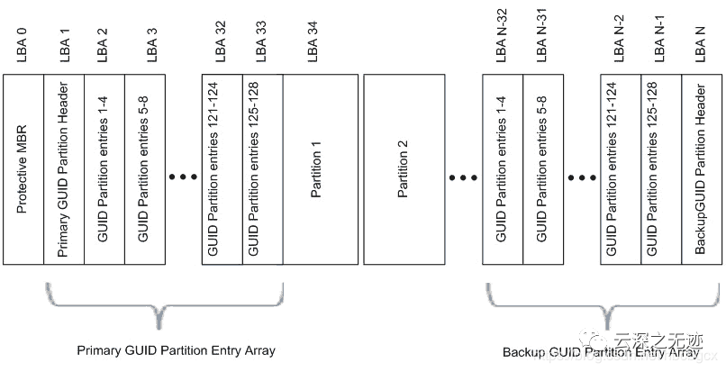
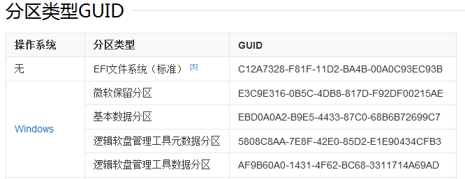
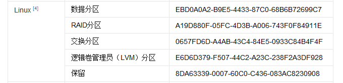
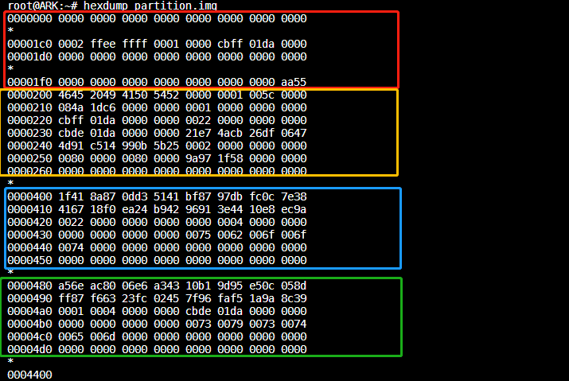
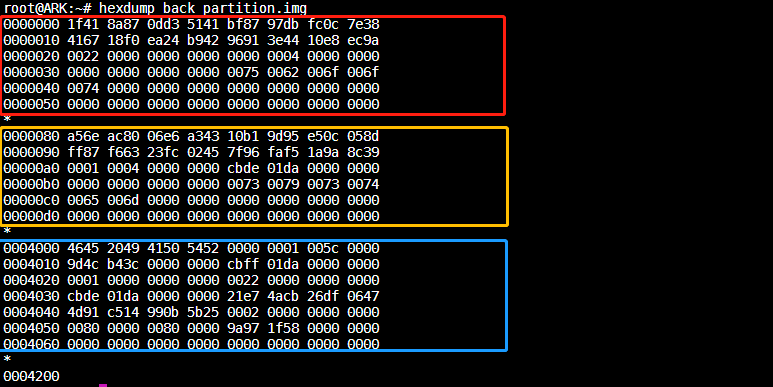

gpt分区表笔记
===============

gpt分区表中有一个比较重要的概念是LBA, 翻译为中文可解释为逻辑区块地址。是描述存储设备上数据所在区块的通用机制，一般用在硬盘或者SD卡这种记忆设备，我们俗称扇区

GUID以及分区表
---------------

- MBR分区方案

传统的分区方案是将分区信息保存在磁盘的第一个扇区中的64个字节中，每个分区项占16个字节。由于MBR扇区只有64个字节用于分区表，所以只能记录4个分区信息，这就是硬盘主分区数目
不能超过4个的原因，后来为了支持更多的分区引入了扩展分区及逻辑分区的概念，但每个分区项仍用16个字节存储。

mbr分区有一个比较大的缺陷是不能支持超过2T容量的磁盘，因为这一方案用4个字节存储分区的总扇区数，最大能表示2的32次方的扇区个数，按每个扇区512字节计算，每个分区最大不能超过2T

- GPT 分区方案

GUID分区表(简称GPT)是源自EFI标准的一种新的磁盘分区表结构的标准。相较于mbr有以下优点

1) 支持2TB 以上的磁盘
2) 分区表自带备份，在磁盘的收尾部分分别保存了一份相同的分区表，其中一份被破坏后可通过另一份恢复
3) 增加CRC校验机制
4) GPT使用一个16字节的全局唯一标识符(guid)来标识分区类型，这使分区类型不容易冲突
5) 每个分区可以有一个名称

- GPT分区表结构

GPT分区表LBA
-------------

LBA0
^^^^^^

在GPT分区表的最开头处于兼容性考虑仍然存储了一份传统的MBR，这个MBR叫做保护性MBR(protective MBR)

在这个MBR中只有一个标识为0xEE的分区，以此来表示这块磁盘使用GPT分区表

LBA1
^^^^^^^^^

分区表头(LBA1)定义了磁盘的可用空间以及组成分区的大小和数量,分区表头结构的详细信息如下

==========  =============   =======================================================================================
起始字节    偏移量                                          内容
----------  -------------   --------------------------------------------------------------------------------------- 
    0           8           签名("EFI PART")
    8           4           修订
    12          4           分区表头的大小
    16          4           分区表头(92字节)的CRC32校验,在计算时先把这个字段写作0处理
    20          4           保留，必须是0
    24          8           当前LBA(这个分区表头的位置)
    32          8           备份LBA(另一个分区表头的位置)
    40          8           第一个可用于分区的LBA(主分区表的最后一个LBA+1)
    48          8           最后一个可用于分区的LBA(备份分区表的第一个LBA-1)
    56          16          磁盘GUID(在类unix系统中也叫UUID)
    72          8           分区表项的起始LBA(在主分区中是2)
    80          4           分区表的数量(windows是128,没用这么多页先占用空间)
    84          4           一个分区表项的大小
    88          4           分区表项的CRC32校验(计算的是所有分区表项的校验和即128*128字节)
    92          420         保留，剩余字节必须是0(420是针对512字节的LBA磁盘)
==========  =============   =======================================================================================

LBA 2-33
^^^^^^^^^

LBA2-33的位置存放的是分区表项，分区表项的结构如下

=============   ================    ========================================
起始字节        偏移量              内容
-------------   ----------------    ----------------------------------------
0               16                  分区类型GUID [#0]_
16              16                  分区GUID
32              8                   起始LBA(小端格式)
40              8                   末尾LBA
48              8                   属性标签 [#1]_
52              72                  分区名
=============   ================    ========================================

.. [#0]
    GUID为固定值，以下列举常见几种

.. [#1]
    分区属性:低位4字节表示与主分区类型无关的属性，高位4字节表示与主分区类型有关的属性

=====   =========================================================================
BIT                         解释
-----   -------------------------------------------------------------------------
0       系统分区
1       EFI隐藏分区
2       传统的BIOS的可引导分区标志
60      只读
62      隐藏
63      不自动挂载，也就是不自动分配盘符
=====   =========================================================================

python生成GPT分区表
--------------------

- 使用python脚本生成gpt分区表

* :download:`gen_gpt.py<res/gen_gpt.py>`

gen_gpt.py 会解析分区表配置文件生成主分区表以及备份分区表

配置文件的示例如下

* :download:`gpt配置文件<res/gpt_partition.conf>`

可使用如下命令生成分区表

::

    python gen_gpt.py gpt_partition.conf main_partition.img back_partition.img

gpt分区表实例
--------------

- 主分区表

- 备份分区表

