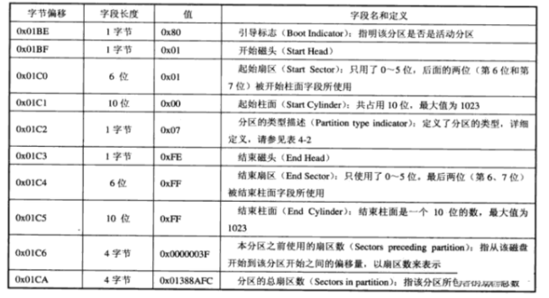
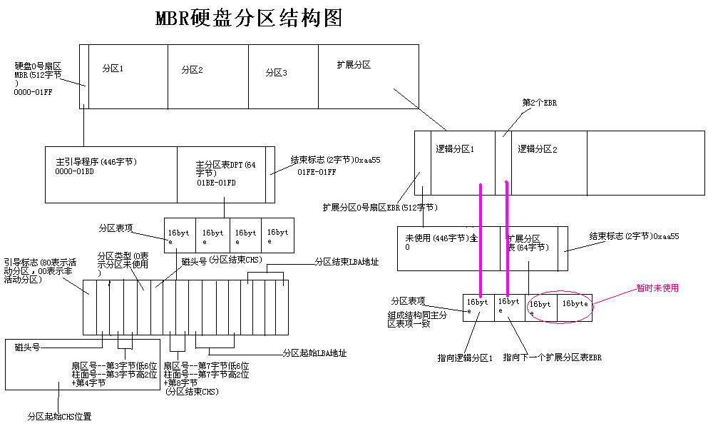

MBR分区表笔记
==============

硬盘结构及参数
---------------

- C-Cylinder: 柱面，柱面数表示硬盘每个盘面上有几条磁道，最大为1024
- H-Head: 磁头，磁头数表示硬盘有多少个磁头，也就是多少盘面，最大为256
- S-Sector: 扇区，扇区数表示每条磁道上有几个扇区，最大为63

当磁盘旋转时，磁头若保持在一个位置上，则每个磁头都会在磁盘表面上画出一个圆形轨迹，这些圆形轨迹就叫磁道

MBR分区
--------

MBR磁盘分区也被称为DOS分区结构，MBR扇区由以下四部分组成

1) 引导代码：引导代码占MBR分区的前440字节，负责整个系统启动，如果引导代码被破坏系统将无法启动
2) 磁盘签名: 占引导代码后面的4字节，如果此标签被破坏则会提示初始化磁盘
3) MBR分区表: 占用64字节，是整个硬盘的分区表
4) MBR结束标志: 占MBR扇区的最后两个字节，一直为"55 AA"

MBR分区表一共占用64个字节，其中每16个字节为一个分区表项，每个分区表项对应的字节解释如下表

分区表总览

扩展分区的结构分析由于MBR仅仅为分区表保留了64字节的存储空间，而每个分区则占用16字节的空间，也就是只能分4个分区，而4个分区在实际情况下往往是不够用的。
因此就有了扩展分区，扩展分区中的每个逻辑分区的分区信息都存在一个类似MBR的扩展引导记录(简称EBR)中，扩展引导记录包括分区表和结束标志“55 AA”，没有引导代码部分。

- 扩展分区

所谓扩展分区，严格讲它不是一个实际意义的分区，它仅仅是一个指向下一个分区的指针，这种指针结构将形成一个单向链表。这样在主引导扇区中除了主分区外，仅需要存储一个被称为扩展分区的分区数据，
通过这个扩展分区的数据可以找到下一个分区(实际上也就是下一个逻辑磁盘)的起始位置，以此位置类推可以找到所有的分区

- 扩展分区结构

扩展分区结构: 扩展引导记录(EBR) + 逻辑分区

扩展引导记录: 类似于MBR的扩展引导记录，扩展引导记录包括一个扩展分区表和该扇区的标签

- 扩展分区表

用于记录分区状态，每16bytes为一项，共四项

1) 指向它自身的引导扇区
2) 指向下一个逻辑驱动器的EBR
3) 未使用
4) 未使用

- MBR分区说明

- 常见分区方式

