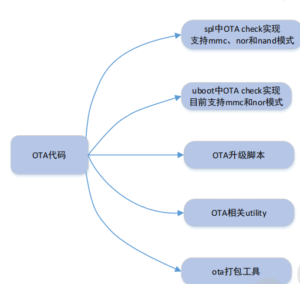
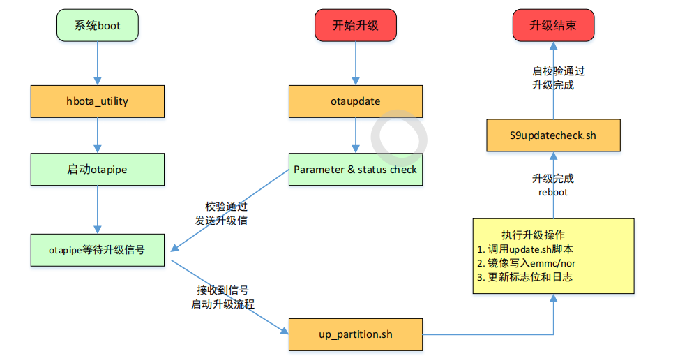
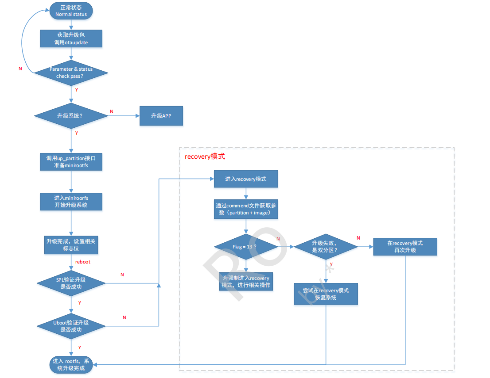
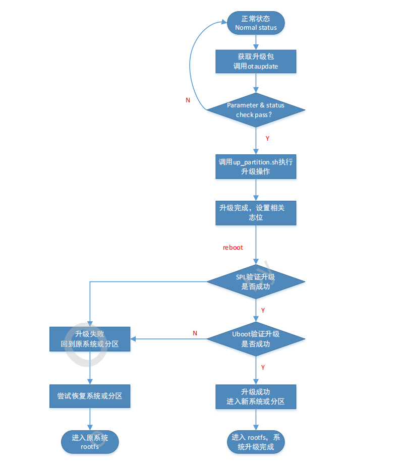

系统软件OTA实现原理
=======================

ota系统组成
------------

ota系统主要以下5部分组成

- SPL

主要实现OTA升级的校验功能，根据OTA的相关标志位，判断升级是否成功，成功SPL会正常启动uboot分区，失败则启动ubootbak分区，进入recovery模式。AB模式下会启动原系统(升级前使用的uboot分区)

- Uboot

实现OTA升级的校验功能和uboot命令下otawrite功能。根据ota的相关标志位，判断升级是否成功，成功uboot会正常启动kernel，失败则会启动recovery分区。AB模式下会启动原系统(升级前使用的kernel和system分区)

- ota升级脚本

OTA升级的主体部分，完成OTA升级包的校验，系统状态判断，以及OTA升级的处理等功能。主要包括otaupdate up_partition.sh S9updatecheck.sh

- ota相关utility

utility支持对veeprom相关标志位的读写功能，支持对log日志的读功能。

- ota打包工具

ota打包工具用于生成ota升级包，升级包中会加入GPT信息、版本信息、warning信息和对应的update.sh升级脚本

系统分区
-----------

其中uboot分区做双备份，ubootB用于recovery模式，在ota升级失败的情况下进入recovery模式进行再升级

单分区
^^^^^^^

+------------+------------+------------+------------+------------+------------+------------+------------+------------+------------+
| veeprom    | spl        |  bl31      | ubootA     | ubootB     | kernel     | recovery   | system     | app        | userdata   |
+------------+------------+------------+------------+------------+------------+------------+------------+------------+------------+

1) veeprom: 存放ota相关标志位，板卡信息
2) spl: 存放second boot的镜像，对应spl.bin
3) bl31: 存放bl31的镜像，对应bl31.bin
4) ubootA(B): uboot分区做双备份，存放normal boot以及recovery boot过程中的third boot镜像，对应uboot.bin
5) kernel: 存放kernel镜像，包括Image.gz \*.dtb
6) recovery: 存放recovery镜像,包括与kernel相同的的文件以及cpio
7) system: 存放rootfs相关文件，对应etc ,sbin, usr, bin, lib等文件
8) app: 存放相关应用程序
9) userdata: 存放user数据，如OTA升级包，app存放的数据等

双分区
^^^^^^^

+------------+------------+------------+------------+------------+------------+------------+------------+-------------+-----------+------------+
| veeprom    | spl        |  bl31      | ubootA     | ubootB     | kernelA    | kernelB    | systemA    |  systemB    | app       | userdata   |
+------------+------------+------------+------------+------------+------------+------------+------------+-------------+-----------+------------+

veeprom、spl、bl31、app、userdata同单分区描述， uboot、kernel、system分别做双备份

ota标志位
----------

ota升级的标志位保存在veeprom分区，用于再ota升级过程中进行完整性和鲁棒性判断，保证ota升级的顺利进行。

update_flag
^^^^^^^^^^^^^

============= =============  =============  =============  =================  ================  =============  =============         
 Bit7           Bit6            Bit5          Bit4           Bit3               Bit2              Bit1            Bit0
------------- -------------  -------------  -------------  -----------------  ----------------  -------------  -------------   
 reserved       reserved       reserved      reserved       update_success     flash_success     firt_try       app_success
============= =============  =============  =============  =================  ================  =============  =============         

1) update_success: 此标志位用于判断OTA升级是否成功，1:升级成功 0:升级失败
2) flash_success: 此标志位用于判断升级包镜像写入emmc或者nor中是否成功
3) first_try: 此标志位用于判断是否为ota升级后的第一次启动 

reset_reson
^^^^^^^^^^^^^

reset_reason用于记录此次ota升级更新的具体partition name，正常启动或者强制进入recovery模式。

1) uboot/kernel/system: 表示此次ota升级的是对应的分区
2) all: 表示ota升级所有的分区
3) normal: 正常启动
4) 进入recovery模式

part_status
^^^^^^^^^^^^^

用于标记当前系统所处的分区状态(即A分区和B分区)

======= ======= =========== ======= ========= ========== =========== ==================
 bit7    bit6    bit5        bit4    bit3       bit2        bit1        bit0
------- ------- ----------- ------- --------- ---------- ----------- ------------------
 R       R       userdata    app     system     kernel      uboot       spl
======= ======= =========== ======= ========= ========== =========== ==================

例如:

    升级前:     00000000    在ubootA分区
    升级后      00000010    在ubootB分区

OTA升级脚本
-------------

OTA升级的主要部分，完成OTA升级包校验、系统状态判断、以及OTA升级镜像的写入功能。

otaupdate
^^^^^^^^^^

otaupdate是CP侧升级的接口，ota升级会首先在CP侧调用此脚本，该脚本的主要功能有

1) 参数检查: 检查partition和image是否合法
2) 创建日志: 保存ota升级的日志信息
3) 模式检查: 检查系统是否支持recovery模式
4) 剩余空间检查: 查询系统空间使用情况，如果空间不足则停止升级
5) 系统版本认证: 对升级包中的版本信息进行验证
6) GPT分区认证: 对升级包中的GPT信息进行验证
7) RSA签名认证: 对升级包中的签名进行验证
8) warning信息提取: 提取warning信息并输出到日志中
9) 向otapipe发送升级信号: 所有上述验证通过后，otaupdate会向otapipe发送升级信息

ota_utility
^^^^^^^^^^^^^

在系统启动的时候，ota_utility会在后台创建otapipe管道，otapipe接收到ota升级信号后主要做两件事:

1) 关闭ota升级前需要退出的程序
2) 调用up_partition.sh进行升级

ota_partition.sh
^^^^^^^^^^^^^^^^^^^^

此脚本用于实现镜像写入emmc或者nor flash的功能

s9updatecheck.sh
^^^^^^^^^^^^^^^^^

初始化和ota升级后检查脚本，主要功能如下

1) 初始化veeprom: 在系统启动时，该脚本会检查veeprom是否初始化，如果未初始化则初始化upflag, resetreason和partstatus等标志位
2) 启动otapipe: 在系统启动时，会启动ota_utility，创建管道otapipe,等待接收ota升级信号
3) 检查升级是否成功: 根据标志位检查ota升级是否成功，并写入相关结果到veeprom的标志位和日志文件
4) 恢复功能: 如果升级失败，双分区模式会尝试使用备份分区去恢复原分区，确保系统的鲁棒性
                                         

recovery实现
-------------

kernel分区镜像包括image.gz recovery.gz \*.dtb

1) image.gz: 用于系统正常启动
2) recovery.gz: recovery系统中image(with cpio),用于升级失败后恢复
3) \*.dtb: 设备树文件

单分区模式下，升级失败后会进入recovery系统，可以再次进行系统升级。或者可以强制进入recovery系统，进行其他操作，比如emmc分区操作

OTA升级流程
--------------

单分区ota升级流程
^^^^^^^^^^^^^^^^^^^

双分区ota升级流程
^^^^^^^^^^^^^^^^^^^

