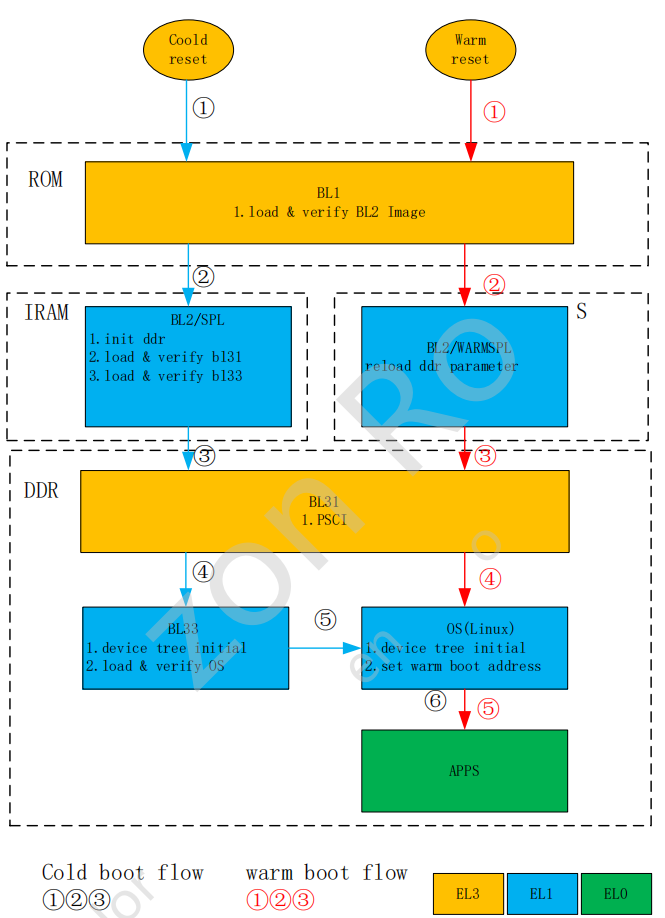

安全启动与加密
===============

概述
------

系统启动流程图
^^^^^^^^^^^^^^^^

上电分为冷启动和热启动两种，热启动特指休眠唤醒流程，其他方式如掉电上电，reboot命令均为冷启动。

签名过程
----------

util_auth.sh 是对文件加密和签名的脚本，签名校验算法使用的是RSA2048，私钥使用标准的PEM PKCS#1格式，公钥和私钥文件分别为spl_rsa_uboot_img_pub.pem spl_rsa_uboot_img_priv.pem

spl需要使用公钥进行验证，spl由两种方式获取公钥:

1. 将公钥打包到spl的keybank中
2. 将公钥打包到image中，并需要将其hash烧写到efuse中，spl将会计算镜像中的hash，与efuse中烧写的hash进行对比

安全校验
----------

下面主要介绍安全启动的两部分:

1. uboot校验linux内核，基于Android Verify Boot(AVB)移植实现
2. linux内核使用dm-verity校验根文件系统，基于linux内核的device mapper及DM-verity(DM指代device mapper)

uboot校验linux内核
^^^^^^^^^^^^^^^^^^^

在安全启动流程中，linux内核文件(包括dtb)会由uboot做整体校验. 此部分需要在uboot中增加avb的实现，应用到的功能包括avb init以及avb verity, avb init会初始化并寻找avb所需镜像所处的存储介质。
avb verity 则负责将kernel以及校验文件内容读取并做校验

linux内核校验根文件系统
^^^^^^^^^^^^^^^^^^^^^^^^

在uboot校验linux内核成功并向kernel提供DM-verify初始化所需元数据后，linux会初始化DM-verify并在使用根文件系统的过程中对每一个读取出来的擦写块进行校验。与普通启动存在区别的一点是，
secure启动使能DM-verity后，根文件系统不再直接从mmcblk分区挂载，改为从DM设备(一般为/dev/dm-0)挂载
