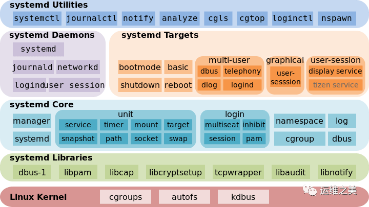
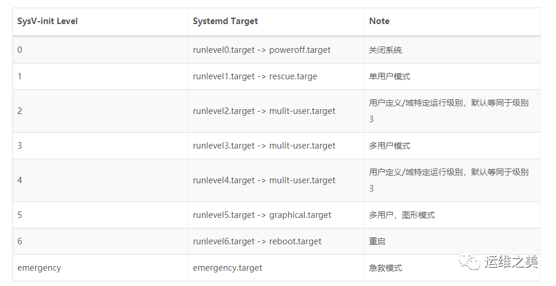

systemd服务管理
=================

systemd简介
--------------

systemd使一系列工具的集合，其作用也远远不仅是启动操作系统，它还接管了后台服务、结束、状态查询，以及日志归档、设备管理、电源管理、定时任务等许多职责，
并支持通过特定事件(如插入特定USB设备)和特定端口数据触发的on-demand任务

systemd的后台服务还有一个特殊的身份，它是系统中PID为1的进程

systemd有以下优势

- 更少的进程

systemd提供了服务按需启动的能力，使得特定的服务只有在特定请求时才启动

- 允许更多的进程并行启动

在sysV-init时代，将每个服务项目编号依次执行启动脚本。systemd通过socket缓存、dbus缓存、和建立临时挂载点等方法解决了启动进程之间的依赖，做到了所有系统服务并发启动。

- 使用CGroup跟踪和管理进程的生命周期

在systemd之间的主流应用管理服务都是使用进程树来跟踪应用的继承关系的，而进程的父子关系很容易通过两次fork的方法脱离。systemd则通过CGroup跟踪进程关系解决了这个问题

- 统一日志管理

systemd包括了一个专用的系统日志管理服务: ``journald`` 。journald采用二机制格式保存所有日志信息，journald提供了一个journalctl命令来查看日志信息

systemd架构

systemd的Unit文件
--------------------

systemd可以管理所有系统资源，不同资源称为Unit

在systemd的生态圈中，unit文件统一了过去各种不同系统资源配置格式，例如服务的启停、定时服务、设备自动挂载、网络配置、虚拟内存配置等，systemd通过不同的文件后缀来区分这些配置文件

systemd支持的12中unit文件类型
^^^^^^^^^^^^^^^^^^^^^^^^^^^^^^^^

================    ====================================================================================================================================
unit文件类型        描述
----------------    ------------------------------------------------------------------------------------------------------------------------------------
.automount          用于控制自动挂载文件系统，相当于sysV-init的autofs服务
.device             对于/dev目录下的设备，主要用于定义设备之间的依赖关系
.mount              定义系统结构层次中的一个挂载点，可以替代过去的/etc/fstab配置文件
.path               用于监控指定目录或文件的变化，并触发其他unit运行
.scope              这种unit文件不是用户创建的，而是systemd运行时产生的，描述一些系统服务的分组信息
.service            封装守护进程的启动、停止、重启和重载操作，时最常见的一种unit文件
.slice              用于表示一个CGroup的树，通常用户不会自己创建这样的unit文件
.snapshot           用于表示一个由systemctl snapshot命令创建的systemd units运行状态快照
.socket             监控来自系统或网络的数据消息，用于实现基于数据自动触发服务启动
.swap               定义一个用户做虚拟内存的交换分区
.target             用于对unit文件进行逻辑分组，引导其他unit的执行，它替代了sysV-init运行级别的作用
.timer              用于配置在特定事件出发的任务，替代了Crontab的功能
================    ====================================================================================================================================

systemd目录
^^^^^^^^^^^

unit文件按照systemd约定，应该被放置在指定的三个系统目录之一中。这三个目录是有优先级的，越靠上的优先级越高，有同名文件的优先级最高的会被使用

1) /etc/systemd/system : 系统或用户自定义的配置文件
2) /run/systemd/system : 软件运行时生成的配置文件
3) /usr/lib/systemd/system : 系统或第三方软件安装时添加的配置文件..  在Ubuntu中该目录被移到了/lib/systemd/system中

systemd默认从目录/etc/systemd/system读取配置文件，但里面存放的大多数时符号连接，指向目录/lib/systemd/system

unit时systemd管理的最基本单元，可以认为每个系统资源就是一个unit。在unit文件中需要包含相应服务的描述、属性以及需要运行的命令

target时systemd中用于指定系统资源启动组的方式

systemd service unit
---------------------

unit文件结构
^^^^^^^^^^^^^

::

    [Unit]
    Description=Hello World
    After=docker.service
    Requires=docker.service
    [Service]
    TimeoutStartSec=0
    ExecStartPre=-/usr/bin/docker kill busybox1
    ExecStartPre=-/usr/bin/docker rm busybox1
    ExecStartPre=/usr/bin/docker pull busybox
    ExecStart=/usr/bin/docker run --name busybox1 busybox /bin/ sh -c "while true; do echo Hello World; sleep 1; done"
    ExecStop="/usr/bin/docker stop busybox1"
    ExecStopPost="/usr/bin/docker rm busybox1"
    [Install]
    WantedBy=multi-user.target

systemd服务的unit文件可以分为三个配置区段

1) Unit和Install段: 所有unit文件通用，用于配置服务的描述、依赖和系统启动的方式
2) Service段: 服务(serivce)类型的unit文件(后缀为.service)特有的，用于定义服务的具体管理和操作方法

- Uint段

=================   ============================================================================================================================
段内容              描述
-----------------   ----------------------------------------------------------------------------------------------------------------------------
Description         描述这个Unit文件的信息
Documentation       指定服务的文档，可以时一个或多个url路径
Requires            依赖的其他unit列表，列在其中的unit会在这个服务启动的同时被启动。如果其中任一服务启动失败，这个服务也会被中止
Wants               与Requires相似，但只是在被配置的这个unit启动时，触发列出的每个unit模块，而不去关注这些模块是否成功
After               与Requires类似，但是在后面列出的所有模块全部启动完成以后才会启动当前的服务
Befor               与After相反，在启动指定的任务一个模块之间，都会首先确认当前服务已经运行
Binds To            与Reuires类似，但这些列表中的任意一个出现意外结束或者重启时这个服务也会跟着终止或者重启
Part Of             一个Bind to作用的子集仅在列出的任务模块失败或重启时，终止或重启当前服务，而不会随列出模板的启动而启动
OnFailure           当这个unit启动失败时，就会自动启动列出的每个模块
Conflicts           与这个这个模块有冲突的模块，如果列出的模块已经有已经在运行的，这个服务就不能启动          
=================   ============================================================================================================================

- Install段

这部分配置的目标模块通常是特定运行目标的.target文件，用来使得服务在系统启动时自动运行。这个区段可以包含三种启动约束

1) WantedBy: 列出的是依赖当前服务的模块，它的值是一个或多个target，当前的Unit激活时(enable)符号链接会放到/etc/systemd/system目录下以<target名>+.wants后缀构成的子目录中

::

    # find /etc/systemd/system/* -type d
    /etc/systemd/system/default.target.wants
    /etc/systemd/system/getty.target.wants
    /etc/systemd/system/graphical.target.wants
    /etc/systemd/system/multi-user.target.wants
    /etc/systemd/system/network-online.target.wants
    /etc/systemd/system/paths.target.wants
    /etc/systemd/system/shutdown.target.wants
    /etc/systemd/system/sockets.target.wants
    /etc/systemd/system/sysinit.target.wants
    /etc/systemd/system/timers.target.wants

2) RequiredBy: 列出的是依赖当前服务的模块，它的值是一个或多个target，当前的Unit激活时(enable)符号链接会放到/etc/systemd/system目录下以<target名>+.required后缀构成的子目录中

3) Also: 当前unit enable/disabled时，同时enable/disable其他unit

sysV-init运行级别与systemd target对应的unit文件

通过systemctl list-units --type=target命令可以获取当前正在使用的运行目标

::

    # systemctl list-units --type=target
    UNIT                   LOAD   ACTIVE SUB    DESCRIPTION
    basic.target           loaded active active Basic System
    cryptsetup.target      loaded active active Encrypted Volumes
    getty.target           loaded active active Login Prompts
    graphical.target       loaded active active Graphical Interface
    local-fs-pre.target    loaded active active Local File Systems (Pre)
    local-fs.target        loaded active active Local File Systems
    multi-user.target      loaded active active Multi-User System
    network-online.target  loaded active active Network is Online
    network.target         loaded active active Network
    nss-user-lookup.target loaded active active User and Group Name Lookups
    paths.target           loaded active active Paths
    remote-fs-pre.target   loaded active active Remote File Systems (Pre)
    remote-fs.target       loaded active active Remote File Systems
    slices.target          loaded active active Slices
    sockets.target         loaded active active Sockets
    sound.target           loaded active active Sound Card
    swap.target            loaded active active Swap
    sysinit.target         loaded active active System Initialization
    time-sync.target       loaded active active System Time Synchronized
    timers.target          loaded active active Timers
    LOAD   = Reflects whether the unit definition was properly loaded.
    ACTIVE = The high-level unit activation state, i.e. generalization of SUB.
    SUB    = The low-level unit activation state, values depend on unit type.
    20 loaded units listed. Pass --all to see loaded but inactive units, too.
    To show all installed unit files use 'systemctl list-unit-files'.

- Service段

只有service类型的unit才会有这个段，它的主要字段分为服务声明周期和服务上下文配置两个方面

**服务生命周期控制相关**

=============== =====================================================================================================================
字段            描述
--------------- ---------------------------------------------------------------------------------------------------------------------
Type_[#]_       定义启动时的进程行为
RemainAferExit  值为true或false，当设置为true时systemd只负责启动，而不监控这个服务
ExecStart       启动当前服务的命令
ExecStartPre    启动当前服务之前执行的命令
ExecStartPost   启动当前服务之后执行的命令
ExecReload      重启当前服务时执行的命令
ExecStop        停止当前服务时执行的命令
ExecStopPost    停止当前服务之后执行的命令
RestartSec      自动重启当前服务间隔的秒数
Restart         定义哪种情况下自动重启,可以是always、on-success、on-failure、on-abnormal、on-abort、on-watchdog
TimeoutStartSec 启动服务时等待的秒数
TimeoutStopSec  停止服务时等待秒数，如果超过这个时间还没有停止，systemd会使用SIGKILL信号强行杀死服务的进程
=============== =====================================================================================================================

**服务上下文配置相关**

=================== =========================================================================================================================
字段                描述
------------------- -------------------------------------------------------------------------------------------------------------------------
Environment         为服务指定环境变量
EnvironmentFile     指定加载一个包含服务所需的环境变量的列表文件，文件的每一行都是一个环境变量的定义
Nice                服务的进程优先级，值越小优先级越高，默认为0，其中-20为最高优先级，19为最低优先级
WorkingDirectory    指定服务的工作目录
RootDirectory       指定服务进程的根目录
User                指定运行服务的用户
Group               指定运行服务的用户组
MountFlags          服务的Mount Namespace配置
LimitCPU            限定特定服务的系统资源量，类似的还有LimitSTACK(堆栈) LimitNOFILE(文件fd数量) LimitNPROC(子进程数量)
=================== =========================================================================================================================

Unit文件占位符
^^^^^^^^^^^^^^^

**Unit文件占位符**

在unit文件中有时会需要一些与运行环境有关的信息，例如节点ID、运行服务的用户等，这些信息可以使用占位符来表示，然后再实际运行时被动态地替换实际的值

=============== ==========================================================================================
占位符          描述
--------------- ------------------------------------------------------------------------------------------
%n              完整的Unit文件名字，包括.service后缀名
%p              unit模板文件名中@符号之前的部分
%i              文件名中@符号之后的部分
%t              存放系统运行文件的目录，通常是"run"
%u              运行服务的用户，如果没有指定默认为root
%U              运行服务的用户ID
%h              运行服务的用户Home目录
%s              运行服务的用户默认shell类型
%m              实际运行节点的Machine ID
%b              Boot ID，这是一个随机数，每次重启都会不一样
%H              实际运行节点的主机名
%v              内核版本，uname -r的输出内容
%%              在unit文件中表示一个普通的百分号
=============== ==========================================================================================

systemd的资源管理
--------------------

systemctl 命令
^^^^^^^^^^^^^^^

::

	# systemctl --help
	systemctl [OPTIONS...] {COMMAND} ...
	Query or send control commands to the systemd manager.
	  -h --help           Show this help
		 --version        Show package version
		 --system         Connect to system manager
	  -H --host=[USER@]HOST
						  Operate on remote host
	  -M --machine=CONTAINER
						  Operate on local container
	  -t --type=TYPE      List units of a particular type
		 --state=STATE    List units with particular LOAD or SUB or ACTIVE state
	  -p --property=NAME  Show only properties by this name
	  -a --all            Show all loaded units/properties, including dead/empty
						  ones. To list all units installed on the system, use
						  the 'list-unit-files' command instead.
	  -l --full           Don't ellipsize unit names on output
	  -r --recursive      Show unit list of host and local containers
		 --reverse        Show reverse dependencies with 'list-dependencies'
		 --job-mode=MODE  Specify how to deal with already queued jobs, when
						  queueing a new job
		 --show-types     When showing sockets, explicitly show their type
	  -i --ignore-inhibitors
						  When shutting down or sleeping, ignore inhibitors
		 --kill-who=WHO   Who to send signal to
	  -s --signal=SIGNAL  Which signal to send
		 --now            Start or stop unit in addition to enabling or disabling it
	  -q --quiet          Suppress output
		 --no-block       Do not wait until operation finished
		 --no-wall        Don't send wall message before halt/power-off/reboot
		 --no-reload      Don't reload daemon after en-/dis-abling unit files
		 --no-legend      Do not print a legend (column headers and hints)
		 --no-pager       Do not pipe output into a pager
		 --no-ask-password
						  Do not ask for system passwords
		 --global         Enable/disable unit files globally
		 --runtime        Enable unit files only temporarily until next reboot
	  -f --force          When enabling unit files, override existing symlinks
						  When shutting down, execute action immediately
		 --preset-mode=   Apply only enable, only disable, or all presets
		 --root=PATH      Enable unit files in the specified root directory
	  -n --lines=INTEGER  Number of journal entries to show
	  -o --output=STRING  Change journal output mode (short, short-iso,
								  short-precise, short-monotonic, verbose,
								  export, json, json-pretty, json-sse, cat)
		 --plain          Print unit dependencies as a list instead of a tree
	Unit Commands:
	  list-units [PATTERN...]         List loaded units
	  list-sockets [PATTERN...]       List loaded sockets ordered by address
	  list-timers [PATTERN...]        List loaded timers ordered by next elapse
	  start NAME...                   Start (activate) one or more units
	  stop NAME...                    Stop (deactivate) one or more units
	  reload NAME...                  Reload one or more units
	  restart NAME...                 Start or restart one or more units
	  try-restart NAME...             Restart one or more units if active
	  reload-or-restart NAME...       Reload one or more units if possible,
									  otherwise start or restart
	  reload-or-try-restart NAME...   Reload one or more units if possible,
									  otherwise restart if active
	  isolate NAME                    Start one unit and stop all others
	  kill NAME...                    Send signal to processes of a unit
	  is-active PATTERN...            Check whether units are active
	  is-failed PATTERN...            Check whether units are failed
	  status [PATTERN...|PID...]      Show runtime status of one or more units
	  show [PATTERN...|JOB...]        Show properties of one or more
									  units/jobs or the manager
	  cat PATTERN...                  Show files and drop-ins of one or more units
	  set-property NAME ASSIGNMENT... Sets one or more properties of a unit
	  help PATTERN...|PID...          Show manual for one or more units
	  reset-failed [PATTERN...]       Reset failed state for all, one, or more
									  units
	  list-dependencies [NAME]        Recursively show units which are required
									  or wanted by this unit or by which this
									  unit is required or wanted
	Unit File Commands:
	  list-unit-files [PATTERN...]    List installed unit files
	  enable NAME...                  Enable one or more unit files
	  disable NAME...                 Disable one or more unit files
	  reenable NAME...                Reenable one or more unit files
	  preset NAME...                  Enable/disable one or more unit files
									  based on preset configuration
	  preset-all                      Enable/disable all unit files based on
									  preset configuration
	  is-enabled NAME...              Check whether unit files are enabled
	  mask NAME...                    Mask one or more units
	  unmask NAME...                  Unmask one or more units
	  link PATH...                    Link one or more units files into
									  the search path
	  add-wants TARGET NAME...        Add 'Wants' dependency for the target
									  on specified one or more units
	  add-requires TARGET NAME...     Add 'Requires' dependency for the target
									  on specified one or more units
	  edit NAME...                    Edit one or more unit files
	  get-default                     Get the name of the default target
	  set-default NAME                Set the default target
	Machine Commands:
	  list-machines [PATTERN...]      List local containers and host
	Job Commands:
	  list-jobs [PATTERN...]          List jobs
	  cancel [JOB...]                 Cancel all, one, or more jobs
	Snapshot Commands:
	  snapshot [NAME]                 Create a snapshot
	  delete NAME...                  Remove one or more snapshots
	Environment Commands:
	  show-environment                Dump environment
	  set-environment NAME=VALUE...   Set one or more environment variables
	  unset-environment NAME...       Unset one or more environment variables
	  import-environment [NAME...]    Import all or some environment variables
	Manager Lifecycle Commands:
	  daemon-reload                   Reload systemd manager configuration
	  daemon-reexec                   Reexecute systemd manager
	System Commands:
	  is-system-running               Check whether system is fully running
	  default                         Enter system default mode
	  rescue                          Enter system rescue mode
	  emergency                       Enter system emergency mode
	  halt                            Shut down and halt the system
	  poweroff                        Shut down and power-off the system
	  reboot [ARG]                    Shut down and reboot the system
	  kexec                           Shut down and reboot the system with kexec
	  exit                            Request user instance exit
	  switch-root ROOT [INIT]         Change to a different root file system
	  suspend                         Suspend the system
	  hibernate                       Hibernate the system
	  hybrid-sleep                    Hibernate and suspend the system

Unit管理
^^^^^^^^^^^

- 查看当前系统的所有Unit

::

	# 列出正在运行的 Unit
	$ systemctl list-units

	# 列出所有Unit，包括没有找到配置文件的或者启动失败的
	$ systemctl list-units --all

	# 列出所有没有运行的 Unit
	$ systemctl list-units --all --state=inactive

	# 列出所有加载失败的 Unit
	$ systemctl list-units --failed

	# 列出所有正在运行的、类型为 service 的 Unit
	$ systemctl list-units --type=service

	# 查看 Unit 配置文件的内容
	$ systemctl cat docker.service

- 查看Unit状态

1) enable : 已建立启动链接
2) disabled : 没建立启动链接
3) static : 该配置文件没有[install]部分(无法执行)，只能作为其他配置文件的依赖
4) masked : 该配置文件被禁止建立启动链接

::

	# 显示系统状态
	$ systemctl status

	# 显示单个 Unit 的状态
	$ ystemctl status bluetooth.service

	# 显示远程主机的某个 Unit 的状态
	$ systemctl -H root@rhel7.example.com status httpd.service

**Unit管理**

::

	# 立即启动一个服务
	$ sudo systemctl start apache.service

	# 立即停止一个服务
	$ sudo systemctl stop apache.service

	# 重启一个服务
	$ sudo systemctl restart apache.service

	# 杀死一个服务的所有子进程
	$ sudo systemctl kill apache.service

	# 重新加载一个服务的配置文件
	$ sudo systemctl reload apache.service

	# 重载所有修改过的配置文件
	$ sudo systemctl daemon-reload

	# 显示某个 Unit 的所有底层参数
	$ systemctl show httpd.service

	# 显示某个 Unit 的指定属性的值
	$ systemctl show -p CPUShares httpd.service

	# 设置某个 Unit 的指定属性
	$ sudo systemctl set-property httpd.service CPUShares=500

- 查看Unit的依赖关系

::

	# 列出一个 Unit 的所有依赖，默认不会列出 target 类型
	$ systemctl list-dependencies nginx.service

	# 列出一个 Unit 的所有依赖，包括 target 类型
	$ systemctl list-dependencies --all nginx.service

服务的生命周期
^^^^^^^^^^^^^^^

1) systemctl enable: 在/etc/systemd/system中建立符号链接
2) systemctl start : 依次启动定义在unit文件中的ExecStartPre ExecStart ExecStartPost命令
3) systemctl stop：依次停止定义在 Unit 文件中的 ExecStopPre、ExecStop 和 ExecStopPost 命令
4) systemctl restart：重启服务
5) systemctl kill：立即杀死服务
6) systemctl daemon-reload：Systemd 会将 Unit 文件的内容写到缓存中，因此当 Unit 文件被更新时，需要告诉 Systemd 重新读取所有的 Unit 文件
7) systemctl reset-failed：移除标记为丢失的 Unit 文件。在删除 Unit 文件后，由于缓存的关系，即使通过 daemon-reload 更新了缓存，在 list-units 中依然会显示标记为 not-found 的 Unit。

Target管理
^^^^^^^^^^^^

Target就是一个Unit组，包含许多相关的Unit，启动某个Target的时候，systemd就会启动里面所有的Unit

::

	# 查看当前系统的所有 Target
	$ systemctl list-unit-files --type=target

	# 查看一个 Target 包含的所有 Unit
	$ systemctl list-dependencies multi-user.target

	# 查看启动时的默认 Target
	$ systemctl get-default

	# 设置启动时的默认 Target
	$ sudo systemctl set-default multi-user.target

	# 切换 Target 时，默认不关闭前一个 Target 启动的进程，systemctl isolate 命令改变这种行为，关闭前一个 Target 里面所有不属于后一个 Target 的进程
	$ sudo systemctl isolate multi-user.target

日志管理
^^^^^^^^^

systemd通过其标准日志服务Journald提供的配套程序journald将其管理的所有的后台进程打印到std::out的输出重定向到了日志文件。默认日志最大限制为所在文件系统容量的10%，
可以修改/etc/systemd/journald.conf中的SystemMaxUse来指定该最大限制

::

	# 查看所有日志（默认情况下 ，只保存本次启动的日志）
	$ sudo journalctl

	# 查看内核日志（不显示应用日志）：--dmesg 或 -k
	$ sudo journalctl -k

	# 查看系统本次启动的日志（其中包括了内核日志和各类系统服务的控制台输出）：--system 或 -b
	$ sudo journalctl -b
	$ sudo journalctl -b -0

	# 查看上一次启动的日志（需更改设置）
	$ sudo journalctl -b -1

	# 查看指定服务的日志：--unit 或 -u
	$ sudo journalctl -u docker.servcie

	# 查看指定服务的日志
	$ sudo journalctl /usr/lib/systemd/systemd

	# 实时滚动显示最新日志
	$ sudo journalctl -f

	# 查看指定时间的日志
	$ sudo journalctl --since="2012-10-30 18:17:16"
	$ sudo journalctl --since "20 min ago"
	$ sudo journalctl --since yesterday
	$ sudo journalctl --since "2015-01-10" --until "2015-01-11 03:00"
	$ sudo journalctl --since 09:00 --until "1 hour ago"

	# 显示尾部的最新 10 行日志：--lines 或 -n
	$ sudo journalctl -n

	# 显示尾部指定行数的日志
	$ sudo journalctl -n 20

	# 将最新的日志显示在前面
	$ sudo journalctl -r -u docker.service

	# 改变输出的格式：--output 或 -o
	$ sudo journalctl -r -u docker.service -o json-pretty

	# 查看指定进程的日志
	$ sudo journalctl _PID=1

	# 查看某个路径的脚本的日志
	$ sudo journalctl /usr/bin/bash

	# 查看指定用户的日志
	$ sudo journalctl _UID=33 --since today

	# 查看某个 Unit 的日志
	$ sudo journalctl -u nginx.service
	$ sudo journalctl -u nginx.service --since today

	# 实时滚动显示某个 Unit 的最新日志
	$ sudo journalctl -u nginx.service -f

	# 合并显示多个 Unit 的日志
	$ journalctl -u nginx.service -u php-fpm.service --since today

	# 查看指定优先级（及其以上级别）的日志，共有 8 级
	# 0: emerg
	# 1: alert
	# 2: crit
	# 3: err
	# 4: warning
	# 5: notice
	# 6: info
	# 7: debug
	$ sudo journalctl -p err -b

	# 日志默认分页输出，--no-pager 改为正常的标准输出
	$ sudo journalctl --no-pager

	# 以 JSON 格式（单行）输出
	$ sudo journalctl -b -u nginx.service -o json

	# 以 JSON 格式（多行）输出，可读性更好
	$ sudo journalctl -b -u nginx.serviceqq
	 -o json-pretty

	# 显示日志占据的硬盘空间
	$ sudo journalctl --disk-usage

	# 指定日志文件占据的最大空间
	$ sudo journalctl --vacuum-size=1G

	# 指定日志文件保存多久
	$ sudo journalctl --vacuum-time=1years

systemd工具集
--------------

::

	systemctl：用于检查和控制各种系统服务和资源的状态
	bootctl：用于查看和管理系统启动分区
	hostnamectl：用于查看和修改系统的主机名和主机信息
	journalctl：用于查看系统日志和各类应用服务日志
	localectl：用于查看和管理系统的地区信息
	loginctl：用于管理系统已登录用户和 Session 的信息
	machinectl：用于操作 Systemd 容器
	timedatectl：用于查看和管理系统的时间和时区信息
	systemd-analyze 显示此次系统启动时运行每个服务所消耗的时间，可以用于分析系统启动过程中的性能瓶颈
	systemd-ask-password：辅助性工具，用星号屏蔽用户的任意输入，然后返回实际输入的内容
	systemd-cat：用于将其他命令的输出重定向到系统日志
	systemd-cgls：递归地显示指定 CGroup 的继承链
	systemd-cgtop：显示系统当前最耗资源的 CGroup 单元
	systemd-escape：辅助性工具，用于去除指定字符串中不能作为 Unit 文件名的字符
	systemd-hwdb：Systemd 的内部工具，用于更新硬件数据库
	systemd-delta：对比当前系统配置与默认系统配置的差异
	systemd-detect-virt：显示主机的虚拟化类型
	systemd-inhibit：用于强制延迟或禁止系统的关闭、睡眠和待机事件
	systemd-machine-id-setup：Systemd 的内部工具，用于给 Systemd 容器生成 ID
	systemd-notify：Systemd 的内部工具，用于通知服务的状态变化
	systemd-nspawn：用于创建 Systemd 容器
	systemd-path：Systemd 的内部工具，用于显示系统上下文中的各种路径配置
	systemd-run：用于将任意指定的命令包装成一个临时的后台服务运行
	systemd-stdio- bridge：Systemd 的内部 工具，用于将程序的标准输入输出重定向到系统总线
	systemd-tmpfiles：Systemd 的内部工具，用于创建和管理临时文件目录
	systemd-tty-ask-password-agent：用于响应后台服务进程发出的输入密码请求

**systemctl**

::
	
	# 重启系统
	$ sudo systemctl reboot

	# 关闭系统，切断电源
	$ sudo systemctl poweroff

	# CPU停止工作
	$ sudo systemctl halt

	# 暂停系统
	$ sudo systemctl suspend

	# 让系统进入冬眠状态
	$ sudo systemctl hibernate

	# 让系统进入交互式休眠状态
	$ sudo systemctl hybrid-sleep

	# 启动进入救援状态（单用户状态）
	$ sudo systemctl rescue

**systemd-analyze**

::

	# 查看启动耗时
	$ systemd-analyze

	# 查看每个服务的启动耗时
	$ systemd-analyze blame

	# 显示瀑布状的启动过程流
	$ systemd-analyze critical-chain

	# 显示指定服务的启动流
	$ systemd-analyze critical-chain atd.servicE

**hostnamectl**

::

	# 显示当前主机的信息
	$ hostnamectl

	# 设置主机名。
	$ sudo hostnamectl set-hostname rhel7

**timedatectl**

::

	# 查看当前时区设置
	$ timedatectl

	# 显示所有可用的时区
	$ timedatectl list-timezones

	# 设置当前时区
	$ sudo timedatectl set-timezone America/New_York
	$ sudo timedatectl set-time YYYY-MM-DD
	$ sudo timedatectl set-time HH:MM:SS

**loginctl**

::

	# 列出当前 session
	$ loginctl list-sessions

	# 列出当前登录用户
	$ loginctl list-users

	# 列出显示指定用户的信息
	$ loginctl show-user ruanyf

