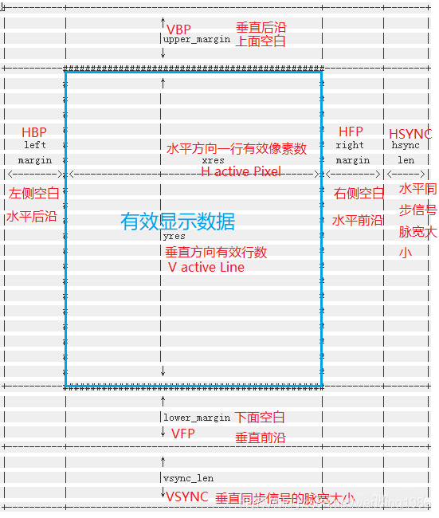
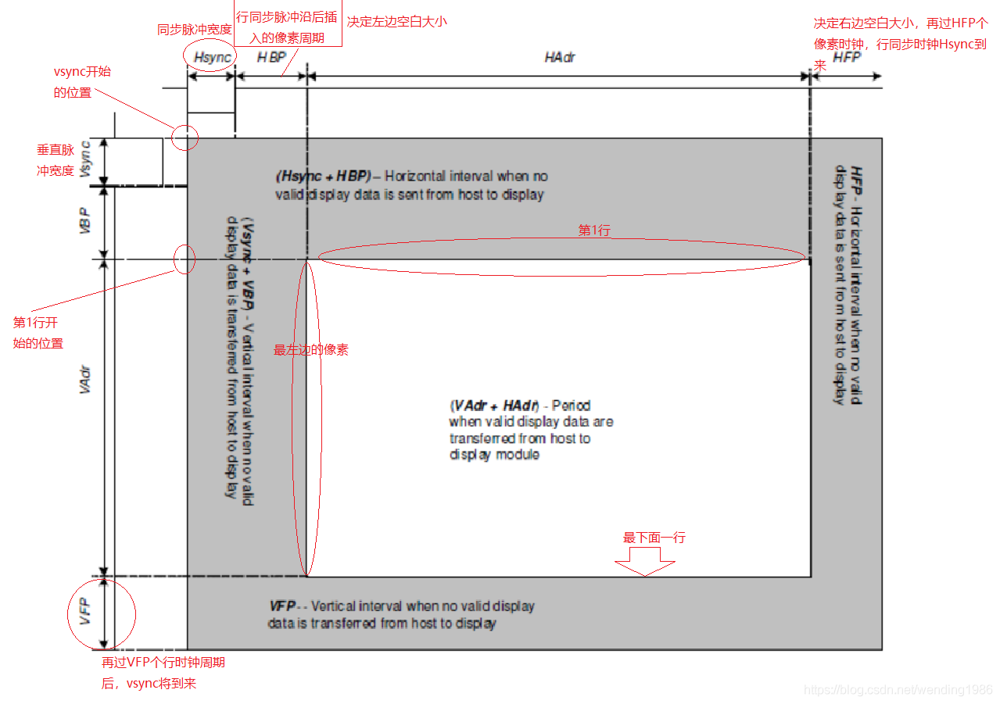
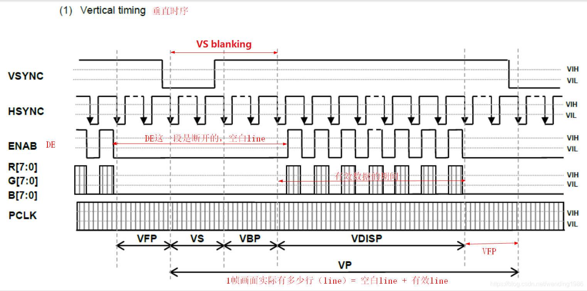
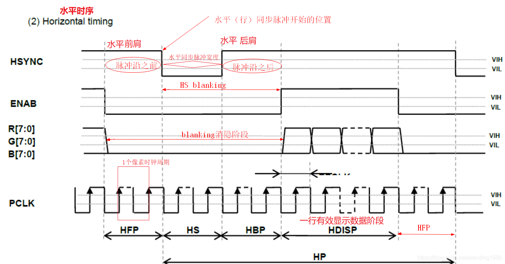

LCD timing
============

关于LCD timing时序参数常见有三种图:Linux对LCD的抽象图,数据手册中的示意图,Timing时序波形图

LCD timing时序示意图
----------------------

**Linux对LCD的抽象图**

::

    struct fb_videomode {
        const char *name;
        u32 refresh;        /* 刷新频率或帧率 */
        u32 xres;           /* 分辨率 x */
        u32 yres;           /* 分辨率 y */
        u32 pixclock;       /* 像素时钟 */
        u32 left_margin;    /* HBP 在每行像素数据开始输出前,需要插入的空闲像素时钟周期数*/
        u32 right_margin;   /* HFP 在每行像素数据结束到LCD行同步时钟脉冲之间,插入的空闲像素时钟数*/
        u32 upper_margin;   /* VBP 在垂直同步脉冲之后,每帧开头前的无效行数*/
        u32 lower_margin;   /* VFP 每帧数据输出结束到下一帧垂直同步时钟周期开始前的无效行数*/
        u32 hsync_len;      /* HSYNC 行同步时钟脉冲宽度(水平同步)*/
        u32 vsync_len;      /* VSYNC 场同步(帧同步或垂直同步)时钟脉冲宽度*/
        u32 vmode;
        u32 flag;
    };

常见概念

=======================   ========================================================================================================================
 词汇                                                           解释
-----------------------   ------------------------------------------------------------------------------------------------------------------------
 margin                     边缘,显示区域外的空白
 Hblank                     行消隐,实际就是HFP+Hsync+HBP的时间,因为此期间并未有效显示,看作消隐状态
 Vblank                     场消隐,实际就是VFP+Vsync+VBP的时间,因为此期间并未有效显示,看作消隐状态
=======================   ========================================================================================================================

**数据手册中的示意图**

**Timing时序波形图**

- Vertial timing

- Horizontal timing

LCD相关计算
---------------

**Pixelclock**

::

    pclk=(left_margin+xres+right_margin+hsync_len)*(upper_margin+yres+lower_margin+vsync_len)*refresh
    或
    pclk=(HBP+xres+HFP+Hsync)*(VBP+yes+VFP+Vsync)*Refresh

**mipi clk**

::

    H-Total-pixel = H-Active-Pixel + HFP + HBP + HSYNC "有版本会包含skew参数,一般为0"
    V-Total-line = V-Active-Line  + VFP + VBP + VSYNC 
    Pclk = H-Total-pixel * V-Total-line * Refresh
    Bitclk = Pclk * bpp /lane_num  "bpp设置是byte个数，例3byte，就是3*8=24bit"
    Mipi Clk = Bitclk / 2 "根据mipi通讯协议，CLK_N、CLK_P这两根时钟线的上升沿/下降沿均可获取数据，双沿采样，所以要除以2"
    Mipi Clk = (Pclk * bpp /lane_num) /2 "知道pclk、bpp、lane_num,也可以计算mipi clk"
