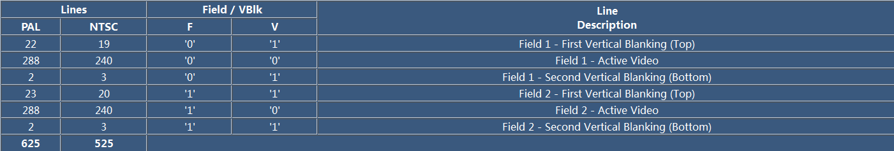
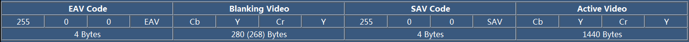
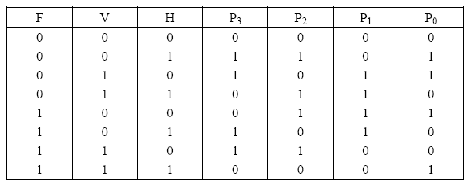
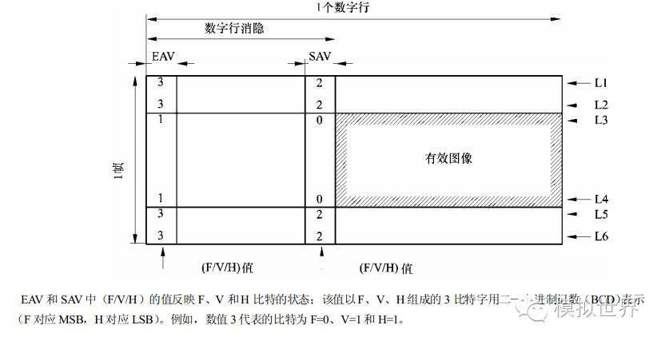

BT656
======

基本概念
-----------

- 帧

一个视频序列是由N个帧组成的，采集图像的时候有两种扫描方式，一种是逐行扫描(progressive scanning),一种是隔行扫描(interlaced scanning).对于隔行扫描，
每一帧一般有两个场(field),一个叫顶场(top filed),也叫偶场，一个叫底场(bottom field),也叫奇场．

- 场

BT656标准中，一个场由三个部分组成

场 = 处置消隐顶场(First Vertical Blanking) + 有效数据行(Active Video) + 垂直消隐底场(Second Vertical Blanking)

对于顶场，有效行数据就是所有的偶数行，而底场，有效行数据就是所有的奇数行．顶场和底场的空白行的个数也有所不同，对于一个标准的8 bit Bt656(4:2:2) SDTV视频而言，
其格式定义如下

由上图可知，对于PAL制式，每一帧有625行，其中顶场有288行，底场有效行数据也是288行，其余行皆为垂直消隐信号．因为PAL制式的SDTV分辨率为720*576.

上图中F标记奇偶场，V标记是否为垂直消隐信号

- 行

一行由四个部分组成

行 = 结束码(EAV) + 水平消隐(Horizontal Vertical Blanking) + 起始码(SAV) + 有效数据(Active Video)

EAV和SAV的四个字节格式规定为 ``FF 00 00 XY`` ,前三个字节是固定的，最后一个字节根据场，消隐信息而定，其8bit定义为 ``1 F V H P3 P2 P1 P0``

.. note::
    F标记场信息，顶场为0,底场为1,V标记消隐信息，传输消隐数据时为1,传输有效视频数据时为0．H标记EAV还是SAV,SAV为0,EAV为1, P0-P3为保护bit,其值取决于FHV起到校验作用

总结如下

- 硬件接口

BT.656输入接口有一根pixel_CLK时钟信号,8根YUV的数据信号

BT656 VS BT601
-----------------

- BT601是16位数据传输，Y U V信号同时传输，是并行数据，行场同步信号单独输出, 21芯

- BT656是8/10位数据传输，不需要硬线同步信号，先传Y后传UV，行场同步信号嵌入在数据流中, 9芯

NTSC VS PAL
--------------

- PAL每秒25帧，奇场在前，偶场在后，分辨率为720*576, 24bit的色彩位深，画面宽高比为4:3

- NTSC每秒30帧，分辨率为720*486
