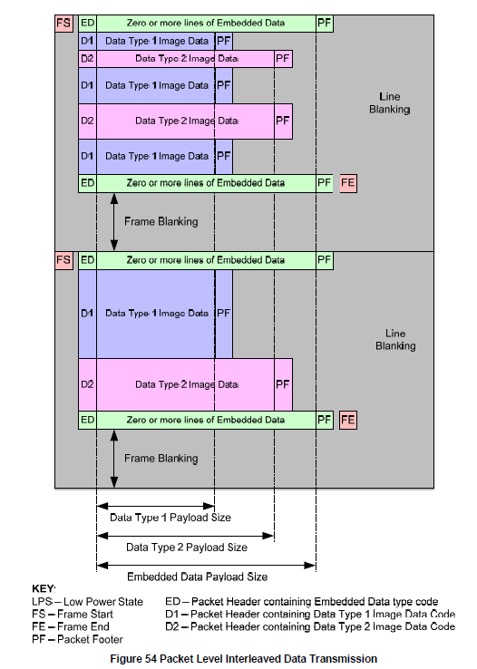

MIPI CSI传输协议解析
======================

* :download:`mipi_stand_protocol.pdf<res/MIPI_Alliance_Specification_for_Camera_S.pdf>` 

MIPI概述
-----------

**传输模式**

LP(Low-Power)模式: 用于传输控制信号,最高速率10MHZ

HS(High-Speed)模式: 用于高速传输素据,速率范围[80M-1.5Gbps] per lane

传输的最小单元为1字节,采用小端的方式即LSB first, MSB last

**Lane States**

LP mode有四种状态: LP00, LP01, LP10, LP11

HS mode有两种状态: HS-0, HS-1

**MIPI CLK 传输时序**

mipi csi clk存在两种工作模式,一种是连续时钟模式,传输过程中不会切换LP状态,另一种是非连续时钟信号模式,每传输一帧图像,帧blanking时会切换为LP状态

时序图如下

从时序图可以看到,clk lane会有一个LP11--->LP01--->LP00的时序,从而进入HS模式

如果camera sensor支持非连续时钟模式,建议配置为非连续时钟模式

**MIPI DATA 传输时序**

在数据线上由3种可能的操作模式: Escap mode, High-Speed(Burst) mode, Control mode

- Escap mode

进入时序: LP11-->LP10-->LP00-->LP01-->LP00

退出时序: LP10-->LP11

- High-Speed mode

进入时序：LP11-->P01-->LP00-->SoT(0001_1101)

退出时序：EoT-->P11

- Turnaround

进入时序：LP11-->LP10-->LP00-->LP10-->LP00

退出时序：LP00-->LP10-->LP11

- MIPI典型时钟值

.. note::
    UI即MIPI的CLK lane的高速时钟周期的二分之一，因为MIPI采用DDR时钟

Multi-Lane Distribution and Merging
--------------------------------------

Low Level Protocol
-------------------

在mipi底层传输协议中,由短包和长包组成,这两种数据包都是由SoT开始EoT结束

底层数据包格式
^^^^^^^^^^^^^^^^

**长包数据格式**

长包数据格式如下

- Data ID: 定义了虚拟通道以及数据类型

- WC: 定义了8-bit的data payload字节数

- ECC: package header的ECC校验,包括Data ID和WC数据域

- Data Payload: 数据域

- CS: checksum(16-bit)

**短包数据格式**

Data ID
^^^^^^^^

Data ID数据包格式如下

Virtual Channel
""""""""""""""""""""

虚拟通道标识符的目的是为在数据流交错的不同数据流中提供单独的通道

即:MIPI接受端可以通过VC标识符将交错的几路视频数据进行拆分

Data Type
""""""""""

- Synchronization Short Packet Data Types

- Generic Short Packet Data Types

- Generic Long Packet Data Types

- YUV Image Data Types

- RGB Image Data Types

- RAW Image Data Types

- User Defined Data Formats

用户自定义数据则可以传输任意数据,例如JPEG或者MPEG4,或者其他类型的通信数据.

ECC
^^^^

CS
^^^^

ECC对Package header进行校验,而Checksum则对数据域(data payload)进行校验,使用16-bit CRC算法

Sync Short package
^^^^^^^^^^^^^^^^^^^^

帧同步信号以及行同步信号内由短包进行发送,在短包的data type域中定义

::

    0x00---->0x02---->0x03........0x02----->0x03------>0x01
    FS        LS       LE          LS        LE         FE

.. image::
    res/frame_trans.png

**hsync以及vsync示意**

**frame示意图**

Data Type Interleaving
^^^^^^^^^^^^^^^^^^^^^^^^

CSI-2支持在同一视频数据中交错传输不同图像格式,也就是MIPI-CSI支持传输不同分辨率不同数据格式的图像.

有两种方式传输交错的视频数据1. 使用Data Type  2.使用Vrtual Channel

Data Formats
--------------

YUV Image data
^^^^^^^^^^^^^^^

- Legacy YUV420 8-bit

- YUV420 8-bit

- YUV420 10-bit

- YUV422 8-bit

- YUV422 10-bit

RGB Image data
^^^^^^^^^^^^^^^

- RGB888

- RGB666

- RGB565

  

- RGB555

.. image::
    res/rgb_555.png

- RGB444

RAW Image data
^^^^^^^^^^^^^^^^

- RAW6

- RAW7

- RAW8

- RAW10

- RAW12

- RAW14

