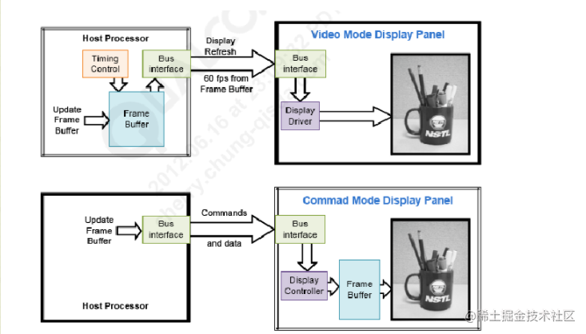
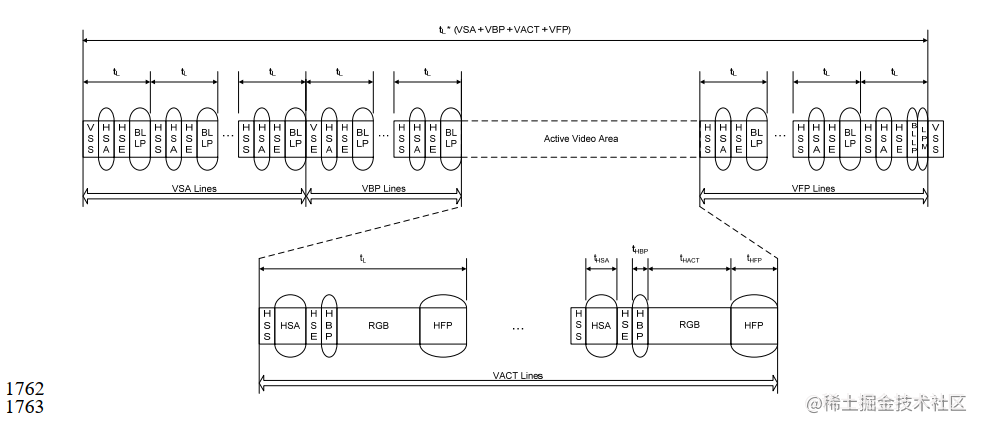
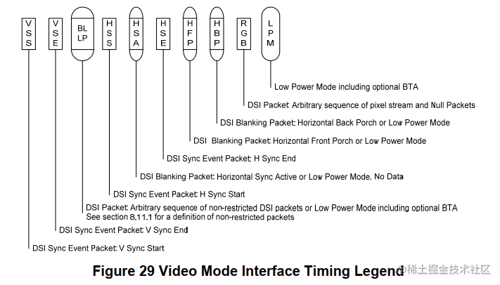
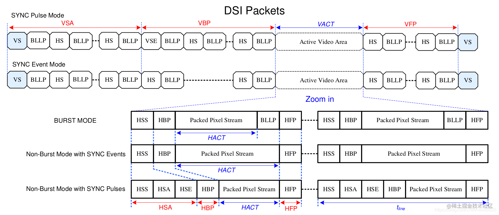
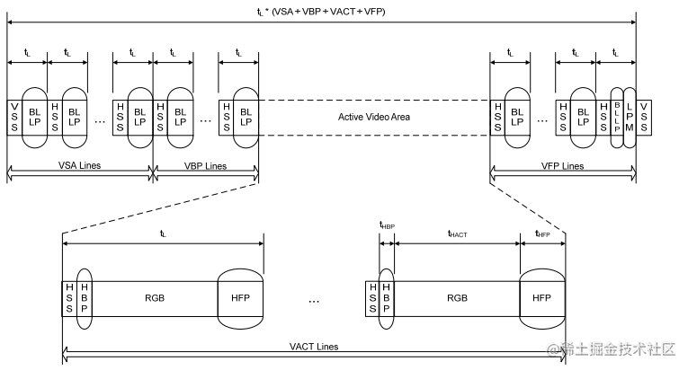
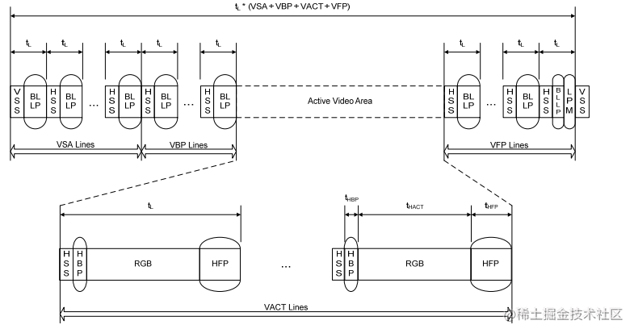

MIPI DSI
==========

MIPI DSI链路层支持两种工作模式，一种是 ``视频模式(Video mode)`` , 另一种是 ``命令模式(Command mode)``

两种工作模式的区别
---------------------

由上图可知

- ``video mode`` 主要针对芯片内没有frame buffer(ram)的lcd屏进行操作的，无论当前显示是否由数据更新，DSI host端移植送数据给panel显示，
  主控要按照lcd的刷新率持续发送pixel数据，与传统的rgb接口类似，主机会持续刷新显示器．由于不使用专用的数据信号v传输同步信息，控制信号
  和RGB数据是以报文的形式通过MIPI总线传输的. ``链路层为video mode时，物理层只能为HS模式``

- ``Command mode`` 针对芯片内含有frame buffer(ram)的cpu屏进行操作的，只要当前数据画面有变化时，DSI host端才送数据给panel显示，主控只在需要更新
  显示图像的时候发送pixel数据，其他时候芯片自己从内部buffer里取数据显示，MIPI总线控制器不需要定期刷新显示器，这种屏幕的分辨率一般来说比较小． 
  ``当链路层为command mode时，物理层可以为HS模式，也可以为LP模式`` 

video mode时序控制模式
------------------------

video mode视频模式在传输时由三种时序控制模式，根据外围设备的要求决定来使用哪种时序控制模式比较合适，这三种模式为 ``Non-Burst Mode with Sync Pulses`` ,
``Non-Burst Mode with Sync Events`` 以及 ``Burst mode`` ,其中Burst mode表示RGB数据传输部分时间会被压缩

Non-Burst MOde with SYnc Pulses
^^^^^^^^^^^^^^^^^^^^^^^^^^^^^^^^^

这个模式可以使外围设备可以准确的重构原始视频时序，包括同步信号，目标是通过DSI串行链路准确的传送DPI时序．这包括对应的DPI像素传输速率和同步脉冲等timing的
宽度．因此，会使用发送同步脉冲的开始和结束的时序包来定义同步周期．此模式的输出示意图如下

上图各数据包的定义如下

::

     VSS:  Vertical Sync Start

     VSE:  Vertical Sync End

     BLLP:  Arbitrary sequence of non-restricted DSI packets or Low Power Mode incluing optional BTA.

     HSS:  Horizontal Sync Start

     HAS:  Horizontal Sync Active or Low Power Mode, No Data

     HSE:  Horizontal Sync End

     HFP:  Horizontal Front Porch or Low Power Mode

     HBP:  Horizontal Back Porch or Low Power Mode

     RGB:  Arbitrary sequence of pixel stream and Null Packets

     LPM:  Low Power Mode incuding optional BTA

由上述时序图可知，MIPI host要输入一帧数据，首先会发送VSPW(VSA lines/帧同步信号)的空数据包----->发送VBP lines的空数据包------>发送VACT lines(屏宽)
的有效RGB数据，其中每一行都包含HSS行开始信号+HSA空数据包+HSE数据包+HBP数据包+RGB数据+HFP数据包．最后发送VFP lines的空数据包．这样屏幕就刷满了一帧的数据

Non-Burst Mode with sync Events
^^^^^^^^^^^^^^^^^^^^^^^^^^^^^^^^^^

这种模式与第一种模式类似，但是不需要准确的重新构建同步数据包，而只发送一种叫做 ``Sync event`` 的包

Burst Mode
^^^^^^^^^^^^

在这个模式像素数据的传输时间会被压缩，留下更多的时间给LP模式或者在DSI链路上传输的数据

mipi dsi clk存在两种工作模式，一种是连续时钟模式，传输过程中不会切换LP状态，另一种是非连续时钟信号模式，每传输完一帧图像数据，帧blanking时会切换
为LP状态．

Command模式
-------------

只有当LCD面板带有显示控制器和帧缓冲区的时候才能使用Command模式，数据传送的格式一般是在像素数据后跟着命令参数和命令．主机端可以读写LCD控制器的寄存器
和帧缓存区的内容．

每一帧数据开始传输的时间可以由TE信号(由LCD面板输出)来控制也可以使用其的外接管脚，TE线或是直接通过DSI接口传送的TE触发信息

为了使用CMD模式，LCD屏需要内置一个时序控制器和缓冲区存储空间(一般为RAM).为了防止出现Tearing Effect(且屏或分屏),LCD屏需要把它的时序时间信息传递给主机端．
在CMD模式下传送这种时序事件可以通过3种方式来实现．

- 自动模式: 当DSI_VC_TE_i[31]寄存器的TE_START位被设置成0x01的时候软件开始传送数据．一旦数据传送完成TE_START位会被硬件自动清零．这种模式让数据的传送可以通过
  软件应用来手动或者使用TE中断来控制．如果数据传送和TE信号不匹配，就有可能出现切屏或分屏的现象

- DSI物理TE触发器: MIPI DSI标准定义来一个从屏到主机端的TE触发信号包，一旦收到这种数据包，Host的像素数据会自动开始传送

.. note::
    DSI Video模式: 主机需要持续刷新显示器，因此相比CMD模式更耗电．可以不带帧缓冲器
    DSI Cmd模式: MIPI总线控制器使用命令报文来发送像素数据，需要帧缓冲区，不需要定期刷新数据
