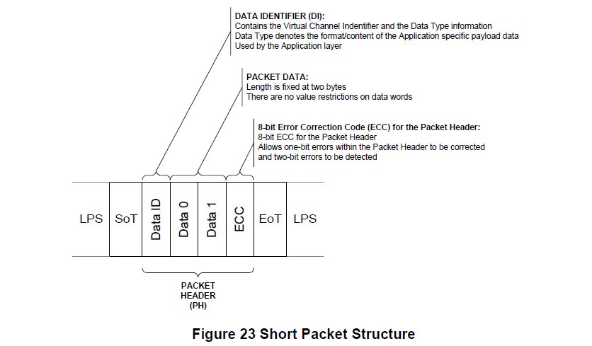
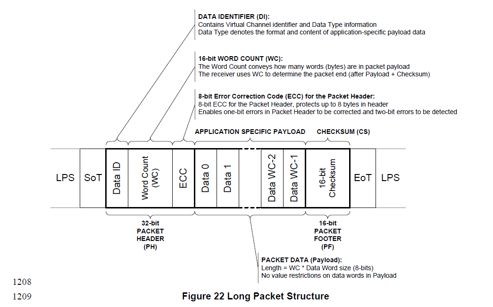
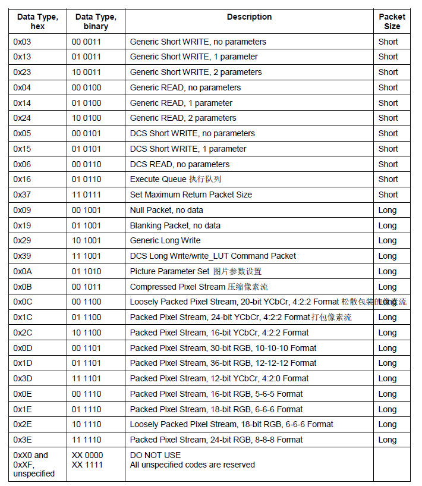

MIPI DSI
==========

* :download:`MIPI_DSI协议.pdf<res/Mipi-DSI-specification-v1-3.pdf>`
* :download:`MIPI_DPHY协议.pdf<res/MIPI-D-PHY-Specification-v01-00-00.pdf>`
* :download:`MIPI协议归纳整理.pdf<res/MIPI-DSI协议归纳整理.pdf>`

名词解释

=========   =============================== ======================================================================
 缩写　         全称　                                  含义
---------   ------------------------------- ----------------------------------------------------------------------
 BPP            Bits per Pixel                  像素深度
 CSI            Camera Serial Interface         摄像串行接口
 DBI            Display Bus Interface           显示总线接口
 DCS            Display Command Set             显示命令集
 DSI            Display Serial Interface        显示串行接口
 Fps            Frames per second               每秒传输帧数
 Mbps           Megabits per second             每秒传输的兆bit位
 PHY            Physical Layer                  物理层
 DI             Data Indentifier                数据识别
 HS             High Speed                      高速
 LP             Low Power                       低功耗
 EoTp           End of Transmission Packet      传输包结尾
 SoT            Start of Transmission           传输开始
 Lps            Low Power State                 低功耗状态
 PH             Packet Head                     包头
 PCLK           Pixel Clock                     像素时钟
 DE             Data Enable                     数据使能
 FR             Frame Rate                      帧率
 HSYNC          Horizontal Sync                 水平同步
 HLW/HPW        Horizontal Low Pulse Width      水平同步信号宽度
 HSA            Horizontal Sync Active          水平同步有效，等同HPW
 HBP            Horizontal Back Porch           水平后肩
 HACT           Horizontal Active               水平有效区，即宽度
 HFP            Horizontal Front POrtch         水平前肩
 VSYNC          Vertical Sync                   垂直同步
 VLW/VPW        Vertiacl Low Pulse Width        垂直同步信号宽度
 VSA            Vertiacl Sync Active            垂直同步宽度，等同VPW
 VBP            Vertiacl Back Porch             垂直后肩
 VACT           Vertiacl Active                 垂直有效区，即高度
 VFP            Vertiacl Front Porch            垂直前肩
=========   =============================== ======================================================================

.. note::
    MIPI lane0是双向的(低速模式双向，高速模式也只能是单向)，其他的lane只能是单向
    低速模式: LP 1-1.2V, 空闲电平(LP11),DP DN是1.2V
    高速模式HS: 100-300mv(典型值200mv)

MIPI DSI链路层支持两种工作模式，一种是 ``视频模式(Video mode)`` , 另一种是 ``命令模式(Command mode)``

两种工作模式的区别
---------------------

由上图可知

- ``video mode`` 主要针对芯片内没有frame buffer(ram)的lcd屏进行操作的，无论当前显示是否由数据更新，DSI host端移植送数据给panel显示，
  主控要按照lcd的刷新率持续发送pixel数据，与传统的rgb接口类似，主机会持续刷新显示器．由于不使用专用的数据信号v传输同步信息，控制信号
  和RGB数据是以报文的形式通过MIPI总线传输的. ``链路层为video mode时，物理层只能为HS模式``

- ``Command mode`` 针对芯片内含有frame buffer(ram)的cpu屏进行操作的，只要当前数据画面有变化时，DSI host端才送数据给panel显示，主控只在需要更新
  显示图像的时候发送pixel数据，其他时候芯片自己从内部buffer里取数据显示，MIPI总线控制器不需要定期刷新显示器，这种屏幕的分辨率一般来说比较小． 
  ``当链路层为command mode时，物理层可以为HS模式，也可以为LP模式`` 

video mode时序控制模式
------------------------

video mode视频模式在传输时由三种时序控制模式，根据外围设备的要求决定来使用哪种时序控制模式比较合适，这三种模式为 ``Non-Burst Mode with Sync Pulses`` ,
``Non-Burst Mode with Sync Events`` 以及 ``Burst mode`` ,其中Burst mode表示RGB数据传输部分时间会被压缩

Non-Burst MOde with SYnc Pulses
^^^^^^^^^^^^^^^^^^^^^^^^^^^^^^^^^

这个模式可以使外围设备可以准确的重构原始视频时序，包括同步信号，目标是通过DSI串行链路准确的传送DPI时序．这包括对应的DPI像素传输速率和同步脉冲等timing的
宽度．因此，会使用发送同步脉冲的开始和结束的时序包来定义同步周期．此模式的输出示意图如下

上图各数据包的定义如下

.. image::
    res/timing_legend.png

::

     VSS:  Vertical Sync Start

     VSE:  Vertical Sync End

     BLLP:  Arbitrary sequence of non-restricted DSI packets or Low Power Mode incluing optional BTA.

     HSS:  Horizontal Sync Start

     HAS:  Horizontal Sync Active or Low Power Mode, No Data

     HSE:  Horizontal Sync End

     HFP:  Horizontal Front Porch or Low Power Mode

     HBP:  Horizontal Back Porch or Low Power Mode

     RGB:  Arbitrary sequence of pixel stream and Null Packets

     LPM:  Low Power Mode incuding optional BTA

.. image::
    res/dsi_packets.png

由上述时序图可知，MIPI host要输入一帧数据，首先会发送VSPW(VSA lines/帧同步信号)的空数据包----->发送VBP lines的空数据包------>发送VACT lines(屏宽)
的有效RGB数据，其中每一行都包含HSS行开始信号+HSA空数据包+HSE数据包+HBP数据包+RGB数据+HFP数据包．最后发送VFP lines的空数据包．这样屏幕就刷满了一帧的数据

Non-Burst Mode with sync Events
^^^^^^^^^^^^^^^^^^^^^^^^^^^^^^^^^^

这种模式与第一种模式类似，但是不需要准确的重新构建同步数据包，而只发送一种叫做 ``Sync event`` 的包

Burst Mode
^^^^^^^^^^^^

在这个模式像素数据的传输时间会被压缩，留下更多的时间给LP模式或者在DSI链路上传输的数据

mipi dsi clk存在两种工作模式，一种是连续时钟模式，传输过程中不会切换LP状态，另一种是非连续时钟信号模式，每传输完一帧图像数据，帧blanking时会切换
为LP状态．

Command模式
-------------

只有当LCD面板带有显示控制器和帧缓冲区的时候才能使用Command模式，数据传送的格式一般是在像素数据后跟着命令参数和命令．主机端可以读写LCD控制器的寄存器
和帧缓存区的内容．

每一帧数据开始传输的时间可以由TE信号(由LCD面板输出)来控制也可以使用其的外接管脚，TE线或是直接通过DSI接口传送的TE触发信息

为了使用CMD模式，LCD屏需要内置一个时序控制器和缓冲区存储空间(一般为RAM).为了防止出现Tearing Effect(且屏或分屏),LCD屏需要把它的时序时间信息传递给主机端．
在CMD模式下传送这种时序事件可以通过3种方式来实现．

- 自动模式: 当DSI_VC_TE_i[31]寄存器的TE_START位被设置成0x01的时候软件开始传送数据．一旦数据传送完成TE_START位会被硬件自动清零．这种模式让数据的传送可以通过
  软件应用来手动或者使用TE中断来控制．如果数据传送和TE信号不匹配，就有可能出现切屏或分屏的现象

- DSI物理TE触发器: MIPI DSI标准定义来一个从屏到主机端的TE触发信号包，一旦收到这种数据包，Host的像素数据会自动开始传送

.. note::
    DSI Video模式: 主机需要持续刷新显示器，因此相比CMD模式更耗电．可以不带帧缓冲器
    DSI Cmd模式: MIPI总线控制器使用命令报文来发送像素数据，需要帧缓冲区，不需要定期刷新数据

DSI 数据包
-------------

实例：

::

    {cmd} , {par...}
    {0xF0}, {0x5A,0x5A},    ## cmd: 0xF0; 数据:0x5A,0x5A
    {0xF1}, {0xA5,0xA5},
    ...
    {0x36}, {0x08},          ## cmd: 0x36; 数据:0x8
    ...
    {0x11},                  ## cmd: 0x11; 无数据

短数据包
^^^^^^^^^

短数据包(Short Packet)共4个字节，包括:1字节 ``DI`` 2字节 ``data`` 和1字节 ``ECC``

格式: DI + DATA0~1 + ECC

长数据包
^^^^^^^^^^^

长数据包(Long Packet)包括: 4字节包头，数据和2字节校验

格式: PH(DI + Word Count + ECC) + Packet Data + PF

.. note::
    DI[7:6]: 虚拟通道ID
    DI[5:0]: 数据类型

.. image::
    res/data_type_list_1.png

DI中Data Type部分值的含义如下:

- 0x5: 没有参数，即只有一个CMD,如上面示例中的命令0x11

- 0x15: 一个参数，即1个CMD + 1个parameter, 如上面示例中的命令0x36

- 0x39: 长包写，即1个CMD + 2个及以上的parameter,如上面示例中的的命令0XF0 0xF1

按照MIPI DSI协议组包后的数据为

::

    0x39,3,ECC,0xF0,0x5A,0x5A,PF
    0x39,3,ECC,0xF1,0xA5,0xA5,PF
    ...
    0x15,0x36,0x08,ECC
    ...
    0x05,0x11,0x0,ECC
