视频传输接口协议
==================

LVDS
------

物理层
^^^^^^^^^^^

LVDS, 全称是Low-Voltage Differential Signaling, 即"低压差分信号",是一种在功耗,无码率,串扰,辐射等方面非常优越的差分信号技术.

差分传输是一种高速信号传输的技术,区别于传统的一根信号线一根地线的做法,差分传输在两根线上都传输信号,这两个信号的振幅相同,相位相反.信号接受端
比较这两个电压的差值来判断发送段发送的逻辑状态.

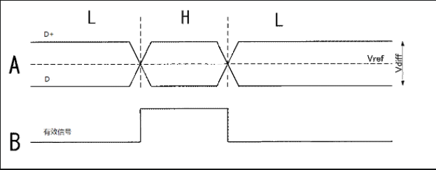

差分信号和普通的单端信号相比,有以下三方面优势

1.抗干扰能力强,因为两根差分走线之间的耦合很好,当外界存在噪声时,几乎同时被耦合到两根线上,而接受端关心的指示两根信号线的差值,所以外界的共模噪声可以被完全抵消

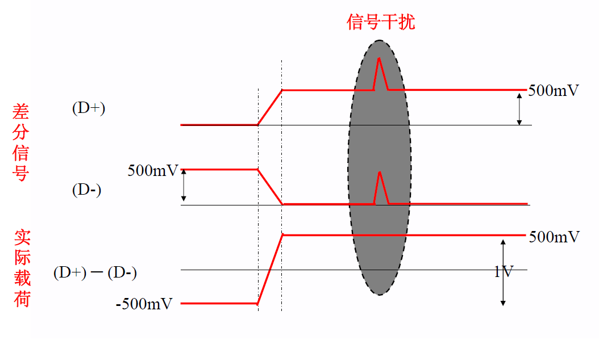

2.能有效抑制EMI.两根信号线相互平行,由于两根信号线的极性相反,他们对外界的辐射可以相互抵消,耦合的越紧密,释放到外界的电磁能量越少.

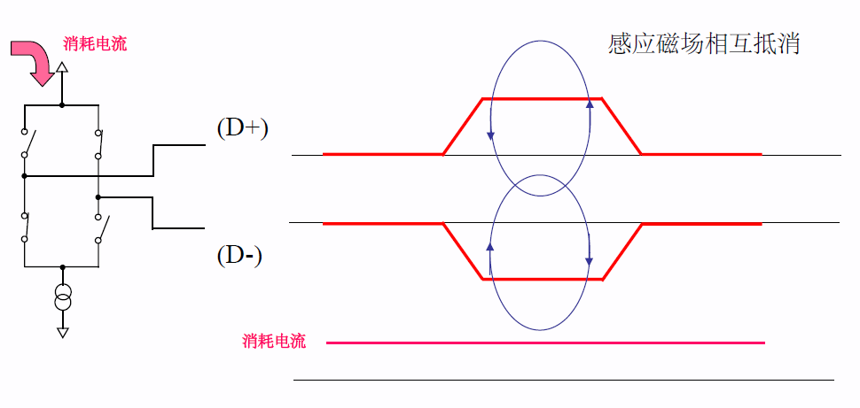

3.时序定位精确.由于差分信号的开关变化是位于两个信号的交点,而不像普通单端信号依靠高低两个阈值电压判断,因而受工艺,温度的影响小.

在dV / dt = 1.32 V/ns的升压速度下，当信号幅度为3.3 V时，从低电平（20%）翻转到高电平（60%）需要1 ns，而如果信号幅度只有500 mV时，从低电平（20%）翻转到高电平（80%）仅需要303ps。通过这样的方式，可以大幅提升差分信号的频率，从而提升传输速度。

即在相同升压速度下,低压差分信号的电平翻转时间短,从而可以提升传输速度.

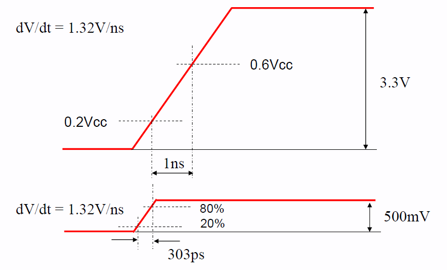

LVDS通过驱动3.5mA的稳定电流电源，可在100Ω終端时，以350mV这样非常低振幅的差动信号来高速传送数据。

LVDS的接口电路比较简单,由差分时钟线(一对或两对),和差分数据线(3对或4对或6对或8对)组成.

* :download:`LVDS用户手册<res/snla187.pdf>` 

LVDS有两种常见的扫描方式:逐行扫描和隔行扫描

- 逐行扫描: 在逐行扫描中，每个视频帧都包含了所有的图像行．也就是说，每一帧都包含图像的所有行，从顶部到底部．

- 隔行扫描: 在隔行扫描中，每个视频帧只包含图像的一半行数．一帧包含奇数行(1,3,5...行),而下一帧包括偶数行(如2,4,6...行)．这样两帧图像交替包含了所有的图像行．
  隔行扫描可以减少带宽需求，提高视频信号的稳定性，减少电磁干扰的影响，但可能会在快速移动的对象或高速摄象中引入闪烁．

这会涉及到另外一个概念，lvds奇偶场信号

数据传输层
^^^^^^^^^^^^^

更准确的来说,LVDS是一个物理层传输协议,它并不只是一个视频总线,事实上,在LVDS上可以传输各种协商好的上层数据.

在视频信号传输的相关场景下使用的LVDS总线,常常遵循一种叫OpenLDI的协议,即Open LVDS  Display Interface,

在OLDI协议中,LVDS接口可以分为这样的几类, ``单路6bit`` , ``双路6bit`` , ``单路8bit`` , ``双路8bit``

比如单路6bit:它采用单路方式传输,一次只传输一个像素.这里的6bit指的是RGB的采样深度为6bit,即RGB666. 这样一个周期只传输18bit的数据,因此也称为18bit LVDS接口

而在双路6 bit中，信号采用双路方式传输，也就是说一次性传输两个像素。这样一来奇路数据为18位，偶路数据为18位，一个周期共传输36 bit 数据。因此，也称36 bit LVDS接口

=============== ==============  ======================= ====================================
 LVDS接口类型    色彩深度        一个周期传输像素数         使用差分信号对数
--------------- --------------  ----------------------- ------------------------------------
 18 bit             6 bit                  1                       4
 36 bit             6 bit                  2                       8
 24 bit             8 bit                  1                       5
 48 bit             8 bit                  2                       10
=============== ==============  ======================= ====================================

**24bit JEIDA编码**

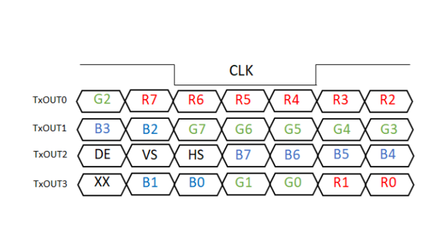

**24bit VESA编码**

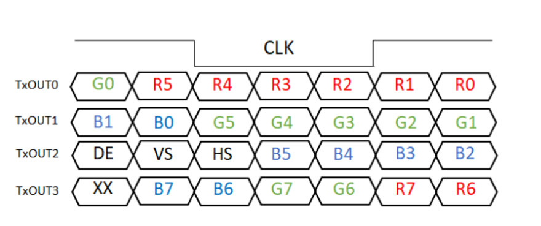

**18bit JEIDA编码**

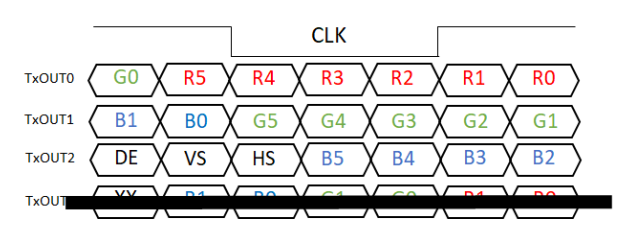

**双路LVDS JEIDA编码**

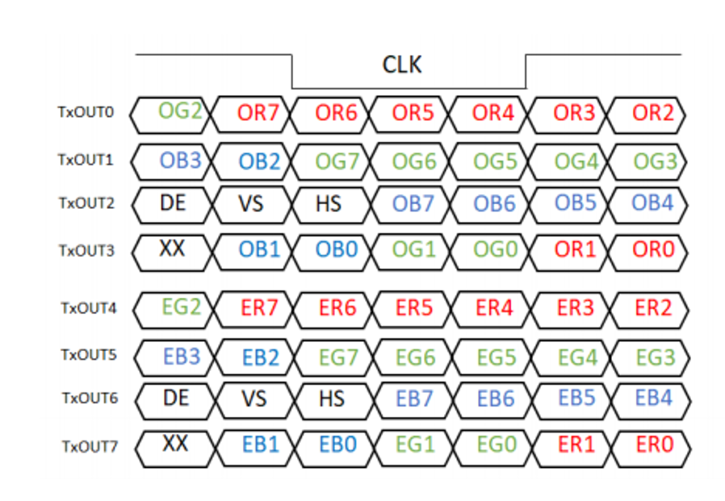

**双路LVDS VESA编码**

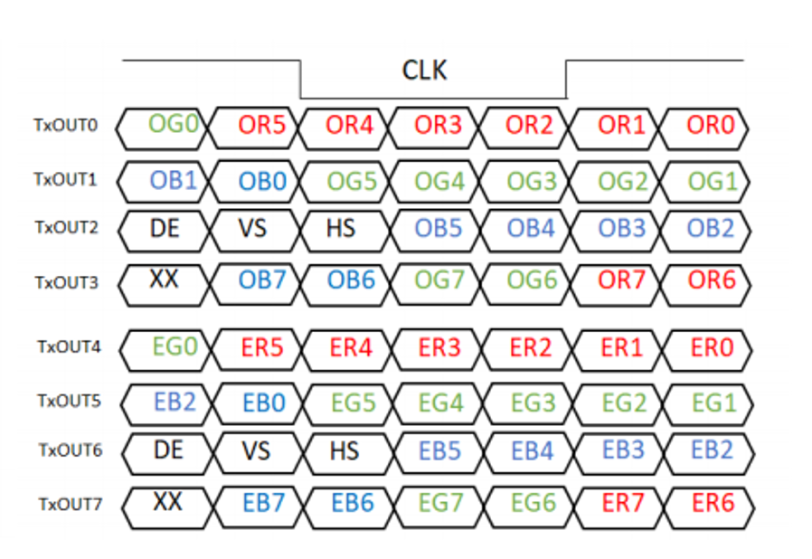

HDMI
-------

HDMI是一种基于TMDS协议的音视频传输协议.

信号定义
^^^^^^^^^^

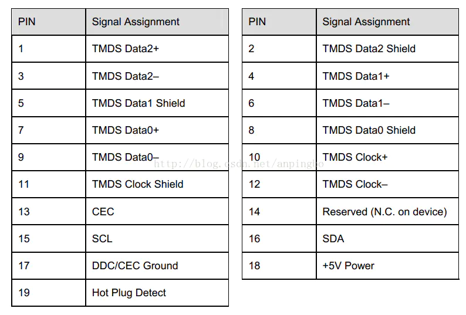

传输接口可以分为: 三对差分数据线,一对差分时钟线,一组i2c控制信号线,CEC信号线, hot plug detect引脚,5V电源 

链路层Frame结构
^^^^^^^^^^^^^^^^

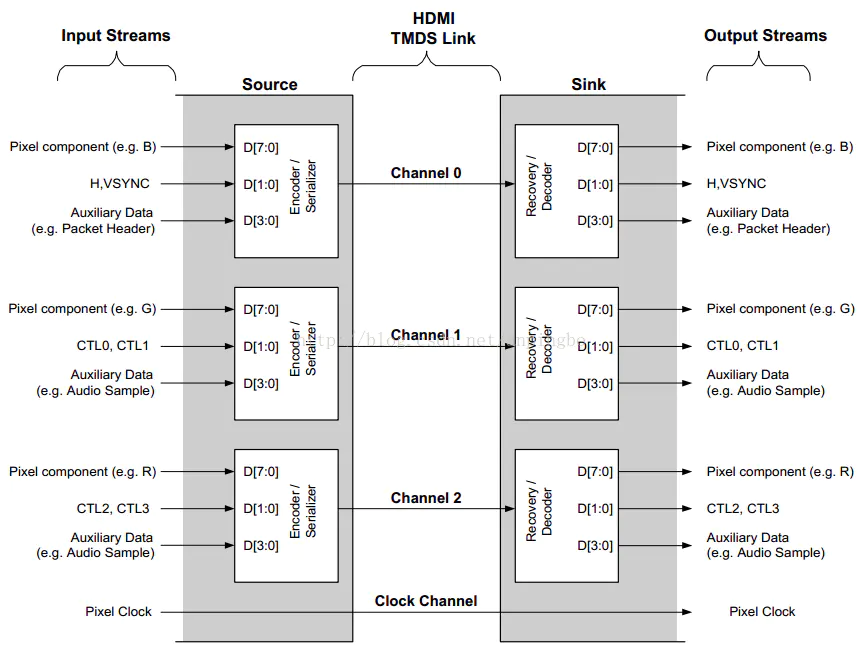

数据传输
^^^^^^^^^^

HDMI传输如下四种数据类型:

1) preamble控制信息,图中的CTLx,可用来表示后面传输的data island还是video data, 通过channel1和channel2的D[1:0]传输,占用4bit

2) Data Island, 即数据包,如Audio数据包,通过3个channel的[3:0]传输,占用12bit

3) Video Data, 视频数据,R G B通过3个channel的D[7:0]传输,占用24bit

4) HSYNC, VSYNC, 使用channel0的[1:0]传输,占用2bit

8bit的数据经过TMDS encoder后得到10bit的数据,经过serializer串行输出, 另外HDMI是stream式的传输,不涉及packet式的传输

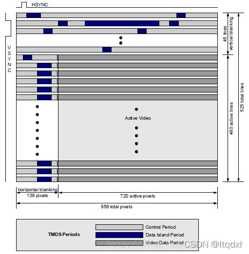

上图展示的是720x480p video的hdmi timing.

data island和control period都是在消隐区进行

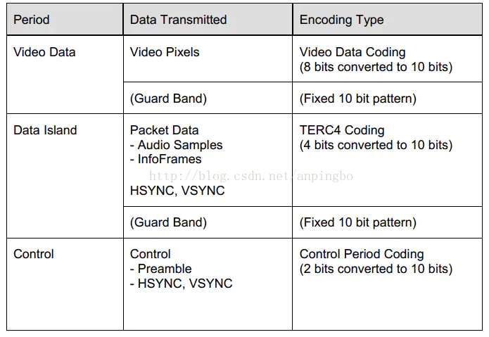

**control period**

=========   ========    ========    ========    =======================================
 CTL0        CTL1        CTL2        CTL3               data period type
---------   --------    --------    --------    ---------------------------------------
    1           0           0           0           video Data Period
    1           0           1           0           Data island period
=========   ========    ========    ========    =======================================

控制preamble信号和HSYNC, VSYNC信号传输.preamble信号出现在每个video data和data island信号之前,用于确定是哪种信号类型

**vide data period**

video data period以2个bit的leading guard band开始,在链路层对这部分数据没有要求,但是物理层其根据TMDS通道产生, guard band如下

ch0: q_out[9:0] = 0b1011001100

ch1: q_out[9:0] = 0b0100110011

ch2: q_out[9:0] = 0b1011001100

**data island period**

data island period传输audio数据和辅助数据,辅助数据包括infoframe和其他用于音视频信息描述的数据,data island period以2个字符长度的leading guard band开始,并以2个bit的trailing guard band
结束.

ch0: q_out[9:0] = n.a

ch1: q_out[9:0] = 0b0100110011

ch2: q_out[9:0] = 0b0100110011

data island period, 分别占用3个channel的D[3:0],channel0的D[1:0]传输HSYNC和VSYNC, chanel0的D[3:2]传输packet headr, channel 1,2的D[3:0]传输packet.并且两端以guard band隔离

packet包含4个子packet,每个子packet包含64bit数据,前56bit为有效数据,后8bit为ECC校验.

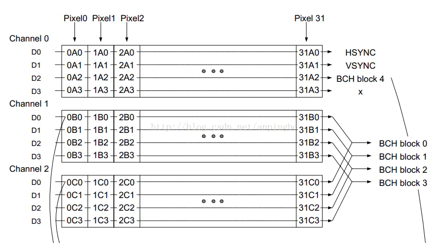

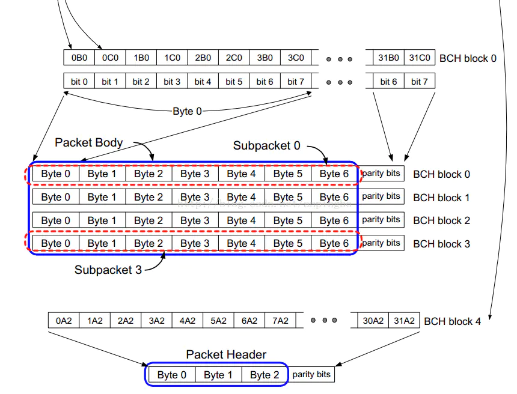

data island数据包头为32位,前1个字节为数据包类型,中间2个字节包含一些特别信息,最后一个字节为ECC校验

- data island 包类型

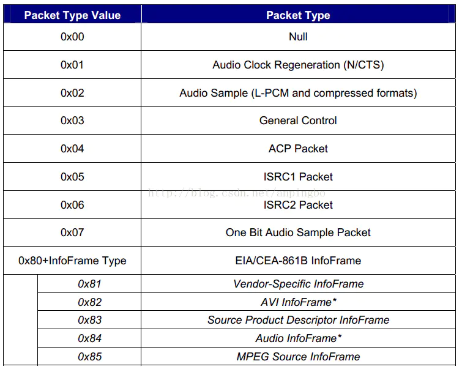

三个传输阶段的过度过程如下图所示

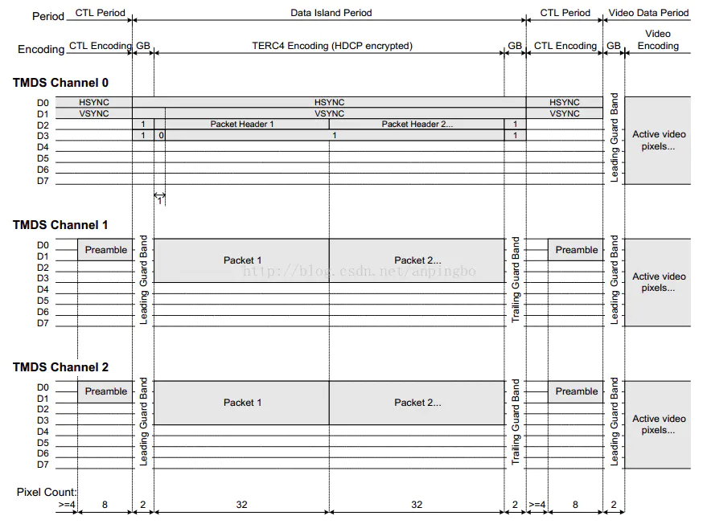

依次解析如下

1) control period, 分别占用3个channel的D[1:0],channel0传输HSYNC和VSYNC, channel1 2传输preamble

2) data island period, 分别占用3个channel的D[3:0],channel0的D[1:0]传输HSYNC和VSYNC, chanel0的D[3:2]传输packet headr, channel 1,2的D[3:0]传输packet.并且两端以guard band隔离

3) control period

4) video period,占用三个通道,并且以guard band隔离

video中像素编码方式
^^^^^^^^^^^^^^^^^^^^^^

**RGB格式**

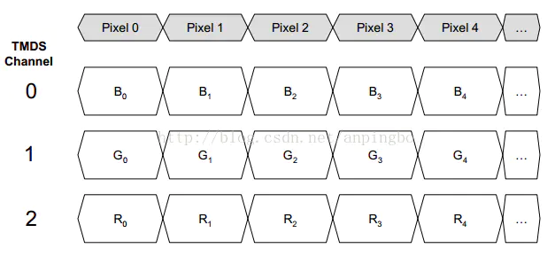

**YUV422格式**

YUV422格式中Y占12bit, U占12bit

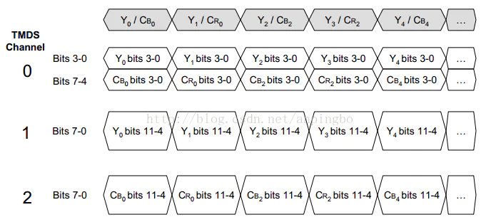

**YUV444格式**

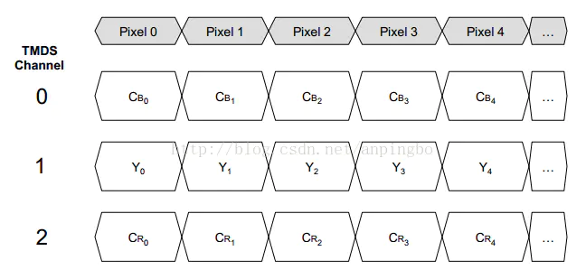

Audio
^^^^^^

Audio数据以Audio Sample Packet或High Bitrate Audio Stream Packet的形式传输,但是HDMI没有传输audio clock,因此sink设备需要进行audio clock regeneration.

Control
^^^^^^^^

Infoframe以Infoframe packet的形式传输，它的大小不超过30字节加上一个checksum字节。具体infoframe的格式及内容需要查看spec。

AVI(Auxiliary Video Information) Infoframe

Audio Infoframe

HDMI Vendor Specific Infoframe, 传输4kx2k或3D格式时需要发送此packet

- EDID & DDC

sink设备在ROM中存放EDID信息，source在收到HPD后会通过DDC通道读取EDID得到显示设备的属性。EDID包含两部分，前128字节符合EDID1.3数据结构，128字节的扩展EDID，符合CEA extension verison3

DSI
-------

