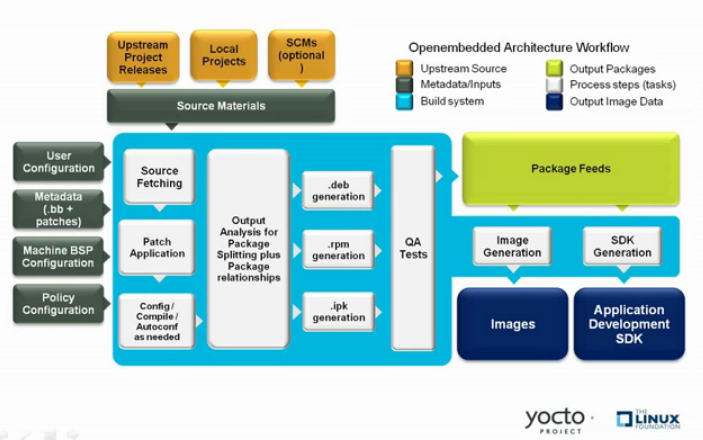

yocto project concepts
=======================

yocto 官方参考文档: https://docs.yoctoproject.org/index.html

bitbake 参考文档: https://docs.yoctoproject.org/bitbake/index.html

yocto project compoment
------------------------

bitbake
^^^^^^^^^

bitbake是openembedded build system的核心工具，负责解析元数据，从中生成任务列表，然后执行这些任务

yocto使用bitbake作为解释器来解析各种配置文件，配置文件包含以下三种类型

1. recipes: 提供特定软件的详细信息 (.bb)
2. class data: 抽象常见的构建信息(比如如何构建linux内核)   (.bbclass)
3. configuration data: 定义特定的machine设置，决策等 (.conf)

要查看bitbake支持的选项列表，可以使用以下命令

::

    bitbake -h
    bitbake --help

bitbake最常见的用法是，bitbake target, 如下所示

::

    bitbake core-image-minimal

recipes
^^^^^^^^

recipes指后缀为.bb的文件。通常，recipes包含单个软件的信息，包含该软件源，补丁文件，以及如何编译打包的配置。

class
^^^^^^

类文件(.bbclass)包含在recipes之间共享的信息. meta/classes/base.bbclass被所有的recipe喝class文件自动包含，它包含了标准任务的基本定义，例如获取、解压、配置、编译、安装、打包，
有些定义只是框架，内容是空的

configurations
^^^^^^^^^^^^^^^

配置文件(.conf)定义了管理Openenbedded构建过程中的各种配置变量，这些文件分为几个区域，这些区域定义了机器配置选项，编译器配置选项，
一般通用配置选项和用户配置选项。 conf/local.conf

主configuration文件是bitbake.conf，位于meta/conf/bitbake.conf

layers
---------

layer是包含相关元数据的集合，这些元数据告诉openembedded构建系统如何构建目标。layer被用来分类不同的任务单元，某些任务单元有共同的特性，可以放在一个layer下，方便模块化组织数据。
例如要制定一套支持特定硬件的系统，可以把与底层相关的单元放在一个layer中，这个layer可以叫做Board support package layer

openembedded
--------------

下图展示了openembedded的工作流

    
构建的工作流程由几个功能区组成：

1) 用户配置：可用于构建过程中的元数据
2) 元数据层：提供软件的元数据
3) 源文件：上游版本，本地项目和SCM
4) 构建系统：该模块包含Bitbake如何获取源，应用补丁，完成编译，打包生成image
5) package feeds: 包含输出包(rpm, deb, ipk)的目录
6) image: 生成的最终文件
7) app dev sdk: 交叉开发工具

用户配置
^^^^^^^^

用户配置用于定义构建，通过用户配置bitbake可以得到构建镜像文件的目标架构，下载源的存储位置以及其他属性

.. image::
    res/user-configuration.png

.. note::
    scripts/oe-setup-builddir脚本使用$TEMPLATECONF变量来确定要定位的配置文件

local.conf文件定义了许多构建环境的基本变量

1) 目标机器选择：由MACHINE变量控制
2) 下载目录: 由DL_DIR变量控制
3) 共享状态目录: 由SSTATE_DIR变量控制
4) 构建输出：由TMPDIR变量控制
5) 分发策略: 由DISTRO变量控制
6) 打包格式: 由PACKAGE_CLASSED变量控制
7) SDK目标架构: 由SDKMACHINE变量控制

bblayer.conf文件定义bitbake在构建过程中需要对哪些layer进行解析

元数据层
^^^^^^^^^^^

一般来说，由三种类型的层输入。

1) 元数据(.bb+补丁): 包含用户提供的配方文件、补丁和附加文件的软件层
2) bsp: 板级支持包
3) 分发层: 为特定分发构建的镜像提供顶级或通用策略

bitbake tool
^^^^^^^^^^^^^^

**源码获取**

构建recipe的第一步是获取和解压源代码

.. image::
    res/source-fetching.png

该do_fetch和do_unpack任务获取源文件并将其解压到build目录

.. note::
    对于本地文件(file://)，bitbake将获取文件的校验和，并将校验和插入到do_fetch任务的签名中去。如果有本地文件修改则重新执行do_fetch和所有依赖它的任务

一些相关的特殊变量

1) TMPDIR: bitbake在构建期间执行所有工作的基本目录，默认是tmp
2) PACKAGE_ARCH: 构建包的架构:
3) TARGET_OS: 目标运行的操作系统
4) PN: recipe的名称
5) PV: recipe的版本
6) PR: recipe的修订版本
7) S: recipe解压路径

**打补丁**

do_patch任务使用recipt的SRC_URI和FILESPATH变量来定位适用的补丁文件, \*.patch或\*.diff文件为默认的补丁文件。

.. image::
    res/patching.png

**配置、编译、打包**

.. image::
    res/configuration-compile-autoreconf.png

构建过程中这一步包括以下任务:

1) do_prepare_recipe_sysroot: 此任务在${WORKDIR}中设置两个sysroot(recipe-sysroot和recipe-sysroot-native),以便在打包阶段任务所依赖do_populate_sysroot任务的内容
2) do_configure: 此任务用于源代码编译前的配置
3) do_compile: 编译源代码，编译发生在B变量指向的目录中，默认情况下B目录与S目录相同
4) do_install: 安装任务，复制B目录文件到D目录

**package splitting**

**image 生成**

image生成过程由几个阶段组成，取决于几个任务和变量。do_rootfs任务用于创建image根文件系统，此任务包含以下几个关键变量

1) IMAGE_INSTALL: 列出要用package feeds区域安装的基本软件合集
2) PACKAGE_EXCLUDE: 执行不安装到image中的文件
3) IMAGE_FEATURES: 指定image feature， 大多数会映射到安装包
4) PACKAGE_CLASSES: 指定要使用的包后缀(rpm deb ipk)
5) IMAE_LINGUAS: 确定安装到附加语言支持包的语言
6) PACKAGE_INSTALL: 传递给包管理器以安装到image中的最终列表
7) IMAGE_ROOTFS: image路径

do_rootfs之后会执行IMAGE_PREPROCESS_COMMAND变量中定义的命令

构建根文件系统后，do_image_*根据IMAGE_FSTYPES变量中的指定的iamge类型执行任务。

最后一个任务是do_image_complete，此任务会执行IMAGE_POSTPROCESS_COMMAND中定义的函数列表

构建过程完成之后会将image写入tmp/deploy/images/machine/文件夹

1) kernel-image: 内核二机制文件， KERNEL_IMAGETYPE变量定义了该文件名称
2) root-filesystem-image: 目标设备的跟文件系统(*.ext4或*.bz2), IMAGE_FSTYPE定义了image类型
3) 内核模块:
4) bootloader: 
5) 符号链接: 指向最近的构建文件

**sdk生成**

.. image::
    res/sdk-generation.png

该部分的任务主要由do_populate_sdk和do_populate_sdk_ext完成.最终生成交叉开发工具链安装脚本(.sh)文件
