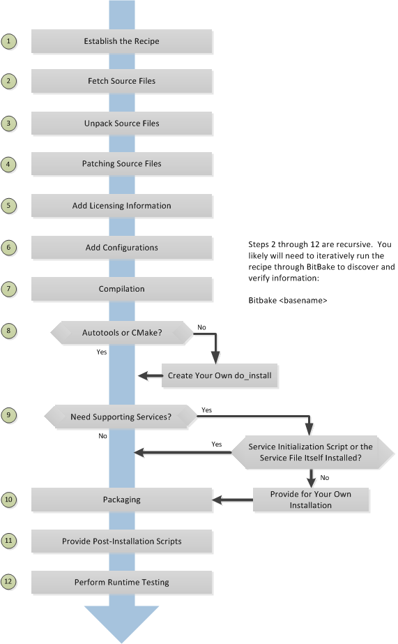

常见任务
===========

创建layer
----------

创建layer
^^^^^^^^^^

可以使用以下命令来创建layer

::

    bitbake-layers create-layer your_layer_name
    bitbake-layers create-layer --help #获取命令的更详细用法

创建layer后，对应的目录中会存在conf/layer.conf文件

::

    # We have a conf and classes directory, add to BBPATH
    BBPATH .= ":${LAYERDIR}"

    # We have recipes-* directories, add to BBFILES
    BBFILES += "${LAYERDIR}/recipes-*/*/*.bb \
                ${LAYERDIR}/recipes-*/*/*.bbappend"

    BBFILE_COLLECTIONS += "meta-vir"
    BBFILE_PATTERN_meta-vir = "^${LAYERDIR}/"
    BBFILE_PRIORITY_meta-vir = "6"

    LAYERDEPENDS_meta-vir = "core"
    LAYERSERIES_COMPAT_meta-vir = "honister"

1) BBPATH: 将层的根目录添加到bitbake的搜索路径，bitbake可以定位class文件(.bbclass)、配置文件以及包含在include和require语句中的文件
2) BBFILES: 定义layer中所有recipes的位置
3) BBFILE_COLLECTIONS: 通过在整个openembedded构建系统中用于引用层的唯一标识来建立当前层
4) BBFILE_PRIORITY: 当openembedded构建在不同layer中找到同名的recipes时，为layer中的recipes建立优先级
5) LAYERDEPENDS: 列出该layer所依赖的layer
6) LAYERSRIES_COMPAT: 列出当前版本兼容的yocto项目版本

启用layer
^^^^^^^^^^^

要启动layer只需要将layer的路径添加到conf/bblayers.conf中的BBLAYERS变量中

::

    # POKY_BBLAYERS_CONF_VERSION is increased each time build/conf/bblayers.conf
    # changes incompatibly
    POKY_BBLAYERS_CONF_VERSION = "2"

    BBPATH = "${TOPDIR}"
    BBFILES ?= ""

    BBLAYERS ?= " \
    /home/yinwg/ywg_workspace/yocto/yocto/meta \
    /home/yinwg/ywg_workspace/yocto/yocto/meta-poky \
    /home/yinwg/ywg_workspace/yocto/yocto/meta-yocto-bsp \
    /home/yinwg/ywg_workspace/yocto/yocto/meta-vir \
    "

**在新建的layer中附加其他layer的元数据**

将元数据附加到另一个recipes称为bitbake附加文件，bitbake附加文件使用.bbappend后缀。可以使用.bbappend对其他layer中的的recipes内容进行增加或者修改，而无需将所有
内容复制到本layer中. 但必须使用相同的根名称

管理layer
^^^^^^^^^^

::

	bitbake-layers --help
	NOTE: Starting bitbake server...
	usage: bitbake-layers [-d] [-q] [-F] [--color COLOR] [-h] <subcommand> ...

	BitBake layers utility

	optional arguments:
	  -d, --debug           Enable debug output
	  -q, --quiet           Print only errors
	  -F, --force           Force add without recipe parse verification
	  --color COLOR         Colorize output (where COLOR is auto, always, never)
	  -h, --help            show this help message and exit

	subcommands:
	  <subcommand>
		add-layer           Add one or more layers to bblayers.conf.
		remove-layer        Remove one or more layers from bblayers.conf.
		flatten             flatten layer configuration into a separate output
							directory.
		layerindex-fetch    Fetches a layer from a layer index along with its
							dependent layers, and adds them to conf/bblayers.conf.
		layerindex-show-depends
							Find layer dependencies from layer index.
		show-layers         show current configured layers.
		show-overlayed      list overlayed recipes (where the same recipe exists
							in another layer)
		show-recipes        list available recipes, showing the layer they are
							provided by
		show-appends        list bbappend files and recipe files they apply to
		show-cross-depends  Show dependencies between recipes that cross layer
							boundaries.
		create-layer        Create a basic layer

自定义image
--------------

IMAGE_INSTALL
^^^^^^^^^^^^^^^

自定义image最简单的方法就是通过local.conf配置文件添加包，但是这种修改对所有的构建都有效，会影响所有的image。使用这种方式的操作如下

:: 

    IMAGE_INSTALL:append = " strace"    #注:需要添加空格

IMAGE_INSTALL:append会影响所有image，可以扩展语法，以便变量仅适用于特定的image, 下面是一个例子

::

    IMAGE_INSTALL:append:pn-core-image-minimal = " strace"   #添加strace到core-image-minimal中

IMAGE_FEATURE
^^^^^^^^^^^^^^^^^

另一种方法是使用IMAGE_FETURES或者EXTRA_IMAGE_FEATURES变量启用或者禁用image高级功能。要了解这些功能的工作原理，最好的参考是meta/classes/image.bbclass

为了说明如何使用这些变量来修改图像，请考虑一个选择 SSH 服务器的示例。Yocto 项目附带了两个可用于图像的 SSH 服务器：Dropbear 和 OpenSSH。Dropbear 是适用于资源受限环境的最小 SSH 服务器，
而 OpenSSH 是众所周知的标准 SSH 服务器实现。默认情况下，core-image-sato映像配置为使用 Dropbear。在core-image-full-cmdline和core-image-lsb 图像都包括OpenSSH的。
该core-image-minimal映像不包含 SSH 服务器。可以通过修改IMAG_FEATURES变量

使用自定义的.bb文件
^^^^^^^^^^^^^^^^^^^^

示例如下

::

    IMAGE_INSTALL = "packagegroup-core-x11-base package1 package2"
    inherit core-image

或者可以拷贝一个已经存在的，如复制meta/recipes-sato/images/core-image-sato.bb到一个新的.bb，然后在末尾添加需要增加的内容

::

    IMAGE_INSTALL += "strace"

使用自定义包组
^^^^^^^^^^^^^^^

对于复杂的自定义image，最佳方法时创建用于构建一个或多个image的自定义包组recipes. 包组recipes一个很好的例子是meta/recipes-core/packagegroups/packagegroup-base.bb

PACKAGES列出了需要添加的包，RDEPENDS和RRECOMMENDS来提供父任务应包含的包列表

下面是一个例子

::

	DESCRIPTION = "My Custom Package Groups"

	inherit packagegroup

	PACKAGES = "\
		${PN}-apps \
		${PN}-tools \
		"

	RDEPENDS:${PN}-apps = "\
		dropbear \
		portmap \
		psplash"

	RDEPENDS:${PN}-tools = "\
		oprofile \
		oprofileui-server \
		lttng-tools"

	RRECOMMENDS:${PN}-tools = "\
		kernel-module-oprofile"

编写新的recipes
-----------------

recipes(.bb)是yocto项目中的基本组件，每个软件都需要一个recipes来定义组件

下面是创建新recipes的基本过程

可以通过以下三种方式创建一个新的recipes

1) devtool add: 借助devtool命令
2) recipetool create: yocto提供的命令，可根据源文件自动创建基本配方
3) 现有recipet: 在功能与需要创建的recipet类似的上修改

::

    recipetool create -o OUTFILE source  #基于源生成recipes

可以使用以下结构来填充新recipet的基本区域

::

    DESCRIPTION = ""
    HOMEPAGE = ""
    LICENSE = ""
    SECTION = ""
    DEPENDS = ""
    LIC_FILES_CHKSUM = ""

    SRC_URI = ""

openembedded构建系统通过layer的conf/layer.conf文件和BBFILES变量来定位recipets. 当命名一个新的recipet时，一般遵循以下方式

::

    basename_version.bb

通过以下方式可以编译一个新的recipet

::

    bitbake basename

在构建过程中openembedded会为每个recipet创建一个临时工作目录，其中保存提取的源文件，日志文件，中间编译和打包文件等。每个recipet临时工作路径取决于
构建它的上下文，找到此路径的最快方法就是运行以下命令

::

    bitbake -e basename | grep ^WORKDIR=

**do_fetch**

下面是tarball和git源的例子

::

    #git的方式获取源文件
    SRCREV = "d6918c8832793b4205ed3bfede78c2f915c23385"

    PR = "r6"
    PV = "1.0.5+git${SRCPV}"

    SRC_URI = "git://git.kernel.dk/blktrace.git \
               file://ldflags.patch"

    #tarball的方式获取源文件
    SRC_URI = "${KERNELORG_MIRROR}/software/scm/git/git-${PV}.tar.gz;name=tarball \
               ${KERNELORG_MIRROR}/software/scm/git/git-manpages-${PV}.tar.gz;name=manpages"

    SRC_URI[tarball.md5sum] = "166bde96adbbc11c8843d4f8f4f9811b"
    SRC_URI[tarball.sha256sum] = "ad5334956301c86841eb1e5b1bb20884a6bad89a10a6762c958220c7cf64da02"
    SRC_URI[manpages.md5sum] = "31c2272a8979022497ba3d4202df145d"
    SRC_URI[manpages.sha256sum] = "9a7ae3a093bea39770eb96ca3e5b40bff7af0b9f6123f089d7821d0e5b8e1230"

为了确保URL下载的文件没有被篡改，需要使用两个校验和 SRC_URI[md5sum]和SRC_URI[sha256sum]

当使用file://协议来指定本地文件时，构建系统从本地获取文件，该路径相对于FILESPATH变量并安特定顺序搜索特定目录，${BP}, ${BPN}, 和files

**do_unpack**

构建过程中,do_unpack任务使用${S}指向解包位置来解压源代码。如果源是tarball并且按照${BPN}-${PV}的方式命名，则不需要设置${S}，如果是git方式获取则
需要设置${S}

::

    SRC_URI = "file://init \
    file://rc.local.sample \
    " 

    S = "${WORKDIR}"

**LICENSE**

recipet中需要同时包含LICENSE和LIC_FILES_CHKSUM变量

1) LICENSE: 此变量指向软件的许可证
2) LIC_FILES_CHKSUM: 为软件指定使用的许可文件

::

    LICENSE = "GPLv2"
    LIC_FILES_CHKSUM = "file://COPYING:md5=25cf44512b7bc8966a48b6b1a9b7605f"

**依赖**

大多数的软件包都会依赖其他的软件包，这种依赖一般分为两类，第一类是构建时依赖，另一类是运行时依赖. 构建时依赖可以通过DEPENDS变量来定义，
而运行时依赖则在打包时自动设置

**do_configure**

1) Autotools: 如果源文件包含configure.ac文件，那么软件就是使用Autotool构建的，这种方式下，recipet需要继承autotools类，且recipet中不需要包含do_configure任务。如果需要调整，则可以设置EXTRA_OECONF或PACKAGECONFIG_CONFARGS以传递配置选项
2) CMake: 如果源文件包含CMakeList.txt文件，那么软件就是使用CMake构建的，recipet需要继承cmake类，且不需要包含do_configure任务，如果需要调整则设置EXTRA_OECMAKE来传递参数
3) 其他: 不是以上两种方式，则需要在recipet中提供一个do_configure任务，如果没有任何配置也可以不提供

**do_install**

do_install期间，安装过程将文件从${S}、${B}和${WORKDIR}目录复制到${D}目录

**开启系统服务**

如果recipet中存在do_install函数，则在函数结束位置添加对应的操作，如果不存在则可以使用do_install:append在recipet中完成这项操作

openembedded支持以下两种方式启动服务

1) SysVinit: SysVinit 是一个系统和服务管理器，用于管理用于控制系统最基本功能的 init 系统。init 程序是 Linux 内核在系统启动时启动的第一个程序。Init 然后控制所有其他程序的启动、运行和关闭。要使用
   SysVinit启用服务，recipet中需要继承update-rc.d类，需要在recipet中设置INITSCRIPT_PACKGES、INITSCRIPT_NAME和INITSCRIPT_PARAMS变量
2) systemd: 系统管理守护进程 (systemd) 旨在取代 SysVinit 并提供增强的服务管理。启用systemd需要recipet继承systemd类

示例
---------

**本地c文件包**

从本地存储的文件构建应用程序，需要手动编写do_compile和do_install任务

::

    SUMMARY = "Simple helloworld application"
    SECTION = "examples"
    LICENSE = "MIT"
    LIC_FILES_CHKSUM = "file://${COMMON_LICENSE_DIR}/MIT;md5=0835ade698e0bcf8506ecda2f7b4f302"

    SRC_URI = "file://helloworld.c"

    S = "${WORKDIR}"

    do_compile() {
        ${CC} ${LDFLAGS} helloworld.c -o helloworld
        
    }

    do_install() {
        install -d ${D}${bindir}
        install -m 0755 helloworld ${D}${bindir}
    }

**autotools**

使用autotools的应用程序，其recipet中需要继承autotools类，该类包含构建基于autotool的应用程序所需的所有步骤定义,构建结果会自动打包

::

    SUMMARY = "GNU Helloworld application"
    SECTION = "examples"
    LICENSE = "GPLv2+"
    LIC_FILES_CHKSUM = "file://COPYING;md5=751419260aa954499f7abaabaa882bbe"

    SRC_URI = "${GNU_MIRROR}/hello/hello-${PV}.tar.gz"

    inherit autotools gettext

**Makefile**

基于Makefile的应用程序，recipet中不需要自己添加do_compile步骤，默认情况下bitbake会启动make编译应用。如果需要其他make选项，则应该设置EXTRA_OEMAKE或PACKAGECONFIG_CONFARGS变量. 但
do_install仍然需要一个任务。

::

    SUMMARY = "Tools for managing memory technology devices"
    SECTION = "base"
    DEPENDS = "zlib lzo e2fsprogs util-linux"
    HOMEPAGE = "http://www.linux-mtd.infradead.org/"
    LICENSE = "GPLv2+"
    LIC_FILES_CHKSUM = "file://COPYING;md5=0636e73ff0215e8d672dc4c32c317bb3 \
        file://include/common.h;beginline=1;endline=17;md5=ba05b07912a44ea2bf81ce409380049c"

    # Use the latest version at 26 Oct, 2013
    SRCREV = "9f107132a6a073cce37434ca9cda6917dd8d866b"
    SRC_URI = "git://git.infradead.org/mtd-utils.git \
               file://add-exclusion-to-mkfs-jffs2-git-2.patch \
               "

    PV = "1.5.1+git${SRCPV}"
    S = "${WORKDIR}/git"

    EXTRA_OEMAKE = "'CC=${CC}' 'RANLIB=${RANLIB}' 'AR=${AR}' 'CFLAGS=${CFLAGS} -I${S}/include -DWITHOUT_XATTR' 'BUILDDIR=${S}'"

    do_install () {
             oe_runmake install DESTDIR=${D} SBINDIR=${sbindir} MANDIR=${mandir} INCLUDEDIR=${includedir}
    }

    PACKAGES =+ "mtd-utils-jffs2 mtd-utils-ubifs mtd-utils-misc"

    FILES:mtd-utils-jffs2 = "${sbindir}/mkfs.jffs2 ${sbindir}/jffs2dump ${sbindir}/jffs2reader ${sbindir}/sumtool"
    FILES:mtd-utils-ubifs = "${sbindir}/mkfs.ubifs ${sbindir}/ubi*"
    FILES:mtd-utils-misc = "${sbindir}/nftl* ${sbindir}/ftl* ${sbindir}/rfd* ${sbindir}/doc* ${sbindir}/serve_image ${sbindir}/recv_image"

    PARALLEL_MAKE = ""

    BBCLASSEXTEND = "native"

**将一个应用拆分成多个包**

可以使用变量PACKAGES和FILES将应用程序拆分为多个包。以下是libxpm recipet的示例，默认情况下，这个recipet生成一个包含库和一些二进制文件的包。可以通过修改recipet将二机制文件拆分成单独的包

::

    require xorg-lib-common.inc

    SUMMARY = "Xpm: X Pixmap extension library"
    LICENSE = "MIT"
    LIC_FILES_CHKSUM = "file://COPYING;md5=51f4270b012ecd4ab1a164f5f4ed6cf7"
    DEPENDS += "libxext libsm libxt"
    PE = "1"

    XORG_PN = "libXpm"

    PACKAGES =+ "sxpm cxpm"
    FILES:cxpm = "${bindir}/cxpm"
    FILES:sxpm = "${bindir}/sxpm"

以上操作将会把sxpm和cxpm可执行文件放到单独的包中

**打包外部生成的可执行文件**

::

    do_configure[noexec] = "1"
    do_compile[noexec] = "1"

    do_install () {
        install -m 0755 ${target} ${D}${bindir}
    }

