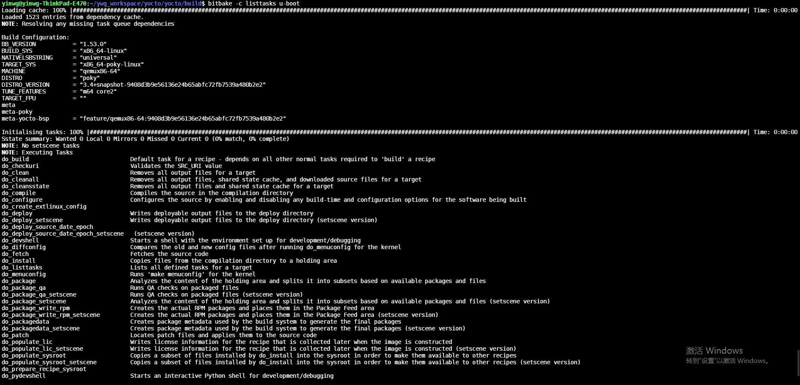

任务以及变量汇总
==================

自动构建的任务
--------------

============================ ==================================================================================================================================================================
  任务列表                                  说明
---------------------------- ------------------------------------------------------------------------------------------------------------------------------------------------------------------
 do_build                       所有recipes的默认任务,此任务依赖其他任务
 do_compile                     编译源代码，此任务运行在$B路径下
 do_compile_ptest_base          编译运行时的测试程序
 do_configure                   如果没有找到Makefile或者CLEANBROKEN被设置为1，此任务什么都不做。
 do_deploy                      此任务输出目标文件到${DEPLOYDIR},工作路径为${B}。do_deploy默认不添加为任务，需要手动添加，如addtask deploy after do_compile
 do_fetch                       获取源代码，此任务使用SRC_URI变量和参数来确定代码源
 do_image                       image生成任务
 do_image_complete              在do_image完成之后运行，相当于do_image的post process
 do_install                     复制文件到${D}路径
 do_package                     打包文件，此任务使用PACKAGES和FILES变量
 do_package_write_deb           创建deb包，并将其放到${DEPLOY_DIR_DEB}路径
 do_package_write_tar           创建tar包，并将其放到${DEPLOY_DIR_TAR}路径
 do_patch                       定位补丁文件并将其应用到源代码,可以在SRC_URI语句中使用“apply=yes”或者"apply=no"来配置是否使用补丁文件
 do_populate_lic                写入license信息
 do_populate_sdk                为可安装的SDK创建文件和目录
 do_populate_sysroot            将do_install任务a安装的文件子集复制到sysroot中
 do_rm_work                     删除工作目录
 do_unpack                      将源代码解压到${WORKDIR}路径
============================ ==================================================================================================================================================================

手动执行的任务
---------------

以下任务通常手动执行的，可以通过以下方式执行

::

    $ bitbake -c 任务 recips
    bitbake -c listtasks u-boot

============================ ==================================================================================================================================================================
 任务列表                           说明
---------------------------- ------------------------------------------------------------------------------------------------------------------------------------------------------------------
 do_checkuri                    验证SRC_URI
 do_clean                       删除所有输出文件
 do_cleanall                    删除所有输出文件，共享状态缓存和下载的源文件
 do_cleansstate                 删除输出文件和共享缓存
 do_listtasks                   列出目标已定义的任务
============================ ==================================================================================================================================================================

image相关任务
---------------

============================ ==================================================================================================================================================================
    任务列表                    说明
---------------------------- ------------------------------------------------------------------------------------------------------------------------------------------------------------------
    do_bootimg                  创建可以启动的镜像文件
    do_bundle_initramfs         创建initramfs和镜像打包在一起的image
    do_rootfs                   创建根文件系统
    do_testimage_auto           创建可自动运行测试程序的image
============================ ==================================================================================================================================================================

内核相关任务
------------

============================ ==================================================================================================================================================================
    任务列表                    说明
---------------------------- ------------------------------------------------------------------------------------------------------------------------------------------------------------------
 do_compile_kernelmodules       编译内核模块
 do_diffconfig                  创建do_kernel_configme任务生成的与之前的配置文件的差别， 可运行bitbake linux-yocto -c diffconfig 来运行此任务
 do_kernel_checkout             检出分支
 do_kernel_configcheck          验证由do_kernel_menuconfig任务生成的配置
 do_kernel_configme             将所有的内核配置片段合并到一起然后配置内核
 do_kernel_menuconfig           启动内核配置工具, bitbake linux-yocto -c menuconfig
 do_kernel_metadata             收集编译内核的配置信息
 do_sizecheck                   此任务会根据KERNEL_IMAGE_MAXSIZE检查image大小是否超限
 do_strip                       对vmlinux进行strip操作
============================ ==================================================================================================================================================================
